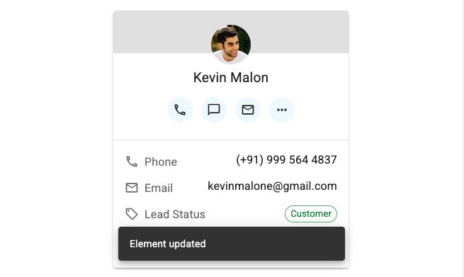

# `<InPlaceEditor>`

`<InPlaceEditor>` renders a field from the current record. On click, it switches to an editable state, allowing the user to change the value directly.

<video controls autoplay playsinline muted loop>
  <source src="./img/InPlaceEditor.mp4" type="video/mp4"/>
  Your browser does not support the video tag.
</video>

Use this component to let users edit parts of a record directly in the list or detail view. It is useful for quick edits without navigating to a separate edit page.

The field changes color on hover, to indicate that it is editable. The user can cancel the edit by pressing Escape. The field is saved automatically when the user clicks outside of it or presses Enter. While it is being saved, the field is disabled and a loading spinner is shown. If the save fails, an error message is displayed and the original value is restored.

## Usage

Use `<InPlaceEditor>` inside a `RecordContext` (e.g., under `<List>` or `<Show>`) and pass it a `source` prop to specify which field to edit. The component will render the field with a `<TextField>` and let the user edit it with a `<TextInput>`


```tsx
import { Show, InPlaceEditor } from 'react-admin';
import { Stack, Box, Typography } from '@mui/material';

const CustomerShow = () => (
    <Show>
        <Stack direction="row" spacing={2}>
            <AvatarField />
            <CustomerActions />
            <Box sx={{ display: 'flex', justifyContent: 'center' }}>
                <Typography>Phone</Typography>
                <InPlaceEditor source="phone" />
            </Box>
            <Box sx={{ display: 'flex', justifyContent: 'center' }}>
                <Typography>Email</Typography>
                <InPlaceEditor source="email" />
            </Box>
            ...
        </Stack>
    </Show>
);
```


**Note**: `<InPlaceEditor>` creates a `<Form>`, so it cannot be used inside an existing form (e.g., inside a `<SimpleForm>` or `<TabbedForm>`). 

Instead of using the `source` prop, you can also specify the component to render in read mode with the `children` prop, and the component to render in edit mode with the `editor` prop. In general, you will need to tweak the styles of both components to make them look good together.

<video controls autoplay playsinline muted loop>
  <source src="./img/InPlaceEditorField.mp4" type="video/mp4"/>
  Your browser does not support the video tag.
</video>



```tsx
const choices = [
    { id: 'everyone', name: 'Everyone' },
    { id: 'just_me', name: 'Just me' },
    { id: 'sales', name: 'Sales' },
];

// ...
<InPlaceEditor
    source="access"
    editor={
        <SelectInput
            source="access"
            choices={choices}
            variant="standard"
            size="small"
            margin="none"
            label={false}
            helperText={false}
            autoFocus
            SelectProps={{ defaultOpen: true }}
            sx={{
                '& .MuiInput-root': { marginTop: 0 },
                '& .MuiSelect-select': { textAlign: 'right' },
            }}
        />
    }
>
    <SelectField
        source="access"
        variant="body1"
        choices={choices}
        sx={{ display: 'block', marginBottom: '5px' }}
    />
</InPlaceEditor>
```


## Props

| Prop         | Required | Type      | Default | Description                                                          |
| ------------ | -------- | --------- | ------- | -------------------------------------------------------------------- |
| `cancelOnBlur` | Optional | `boolean` | `false`  | Whether to cancel the edit when the field loses focus.              |
| `children`   | Optional | `ReactNode` |         | The component to render in read mode.                                |
| `editor`     | Optional | `ReactNode` |         | The component to render in edit mode.                                |
| `mutationMode` | Optional | `string`  | `pessimistic` | The mutation mode to use when saving the record.                     |
| `notifyOnSuccess` | Optional | `boolean` | `false`  | Whether to show a notification on successful save.                  |
| `resource`   | Optional | `string`  |         | The name of the resource.                                            |
| `showButtons` | Optional | `boolean` | `false` | Whether to show the save and cancel buttons.                         |
| `source`     | Optional | `string`  |         | The name of the field to edit.                                      |
| `sx`         | Optional | `SxProps` |         | The styles to apply to the component.                                |

## `cancelOnBlur`

By default, when the user clicks outside of the field in edit mode, it saves the current value. If `cancelOnBlur` is set to true, the edit will be canceled instead and the initial value will be restored.

```tsx
<InPlaceEditor source="phone" cancelOnBlur />
```

## `children`

The component to render in read mode. By default, it's a `<TextField>` using the `source` prop.

You can use any [field component](./Fields.md) instead, as it renders in a `RecordContext`.


For example, to render a `<SelectField>` in read mode, you can use the following code:


```tsx
<InPlaceEditor source="leadStatus">
    <SelectField
        source="leadStatus"
        choices={[
            { id: 'customer', name: 'Customer' },
            { id: 'prospect', name: 'Prospect' },
        ]}
        optionText={
            <ChipField
                size="small"
                variant="outlined"
                source="name"
                color="success"
            />
        }
        sx={{
            display: 'block',
            marginBottom: '3px',
            marginTop: '2px',
        }}
    />
</InPlaceEditor>
```


## `editor`

The component to render in edit mode. By default, it's a `<TextInput>` using the `source` prop.

You can use any [input component](./Input.md) instead, as it renders in a `<Form>`. You will probably need to tweak the input variant, margin and style so that it matches the style of the read mode component.

<video controls autoplay playsinline muted loop>
  <source src="./img/InPlaceEditorField.mp4" type="video/mp4"/>
  Your browser does not support the video tag.
</video>

For example, to use a `<SelectInput>` in edit mode, you can use the following code:


```tsx
<InPlaceEditor
    source="access"
    editor={
        <SelectInput
            source="access"
            choices={choices}
            variant="standard"
            size="small"
            margin="none"
            label={false}
            helperText={false}
            autoFocus
            SelectProps={{ defaultOpen: true }}
            sx={{
                '& .MuiInput-root': { marginTop: 0 },
                '& .MuiSelect-select': { textAlign: 'right' },
            }}
        />
    }
>
    // ...
</InPlaceEditor>
```


## `mutationMode`

The mutation mode to use when saving the record. By default, it is set to `pessimistic`, which means that the record is saved immediately when the user clicks outside of the field or presses Enter. 

You can use any of the following values:

- `pessimistic`: On save, the field is dimmed to show the saving state. If the server returns an error, the UI is reverted to the previous state.
- `optimistic`: The UI is updated immediately with the new value, without waiting for the server response. If the server returns an error, the UI is reverted to the previous state.
- `undoable`: The record is saved immediately, but the user can undo the operation by clicking on the undo button in the notification. This must be used in conjunction with the `notifyOnSuccess` prop.

```tsx
<InPlaceEditor source="phone" mutationMode="optimistic" />
```

## `notifyOnSuccess`

By default, the component does not show a notification when the record is saved. If you want to show a notification on successful save, set this prop to `true`.



```tsx
<InPlaceEditor source="phone" notifyOnSuccess />
```

## `resource`

The name of the resource. By default, it is set to the current resource in the `ResourceContext`. You can use this prop to override the resource name.

```tsx
<InPlaceEditor source="phone" resource="customers" />
```

## `showButtons`

By default, the component does not show the save and cancel buttons. If you want to show them, set this prop to `true`.


```tsx
<InPlaceEditor source="phone" showButtons />
```

## `source`

The name of the field to edit. You must set this prop, unless you define the `children` and `editor` props.

```tsx
<InPlaceEditor source="phone" />
```

## `sx`

The styles to apply to the component. Use it to alter the default styles of the reading, editing, and saving modes. 


```tsx
<InPlaceEditor
    source="phone"
    sx={{
        marginTop: '1rem',
        marginLeft: '1rem',
        '& .RaInPlaceEditor-reading div': {
            fontSize: '1.5rem',
            fontWeight: 'bold',
            color: 'primary.main',
        },
        '& .RaInPlaceEditor-editing input': {
            fontSize: '1.5rem',
            fontWeight: 'bold',
            color: 'primary.main',
        },
        '& .RaInPlaceEditor-saving div': {
            fontSize: '1.5rem',
            fontWeight: 'bold',
            color: 'text.disabled',
        },
    }}
/>
```


You can use the `sx` prop to apply styles to the read mode, edit mode and saving mode. The following classes are available:

- `& .RaInPlaceEditor-reading`: The read mode.
- `& .RaInPlaceEditor-editing`: The editing mode.
- `& .RaInPlaceEditor-saving`: The saving mode.