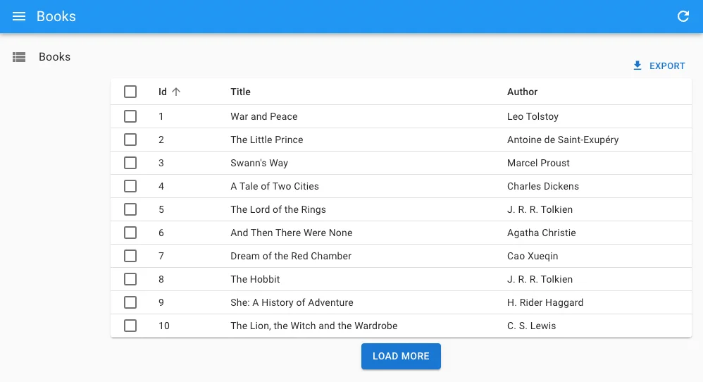
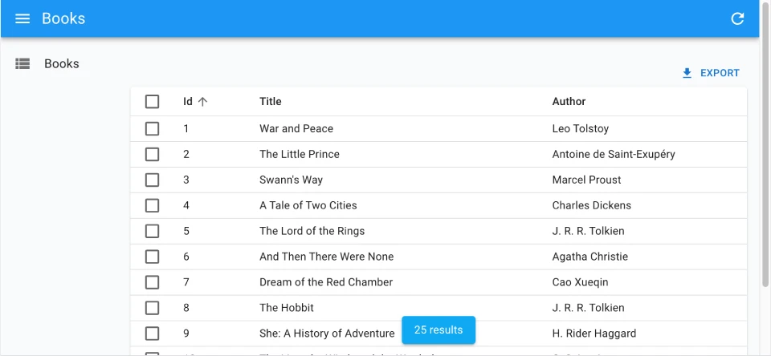

# `<InfiniteList>`

The `<InfiniteList>` component is an alternative to [the `<List>` component](./List.md) that allows user to load more records when they scroll to the bottom of the list. It's useful when you have a large number of records, or when users are using a mobile device.

<video controls autoplay playsinline muted loop width="100%">
  <source src="./img/infinite-book-list.webm" poster="./img/infinite-book-list.webp" type="video/webm">
  Your browser does not support the video tag.
</video>

`<InfiniteList>` fetches the list of records from the data provider, and renders the default list layout (title, buttons, filters). It delegates the rendering of the list of records to its child component. Usually, it's a [`<Datagrid>`](./Datagrid.md) or a [`<SimpleList>`](./SimpleList.md), responsible for displaying a table with one row for each record.

## Usage

Here is the minimal code necessary to display a list of books with infinite scroll:

```jsx
// in src/books.js
import { InfiniteList, Datagrid, TextField, DateField } from 'react-admin';

export const BookList = () => (
    <InfiniteList>
        <Datagrid>
            <TextField source="id" />
            <TextField source="title" />
            <DateField source="author" />
        </Datagrid>
    </InfiniteList>
);

// in src/App.js
import { Admin, Resource } from 'react-admin';
import jsonServerProvider from 'ra-data-json-server';

import { BookList } from './books';

const App = () => (
    <Admin dataProvider={jsonServerProvider('https://jsonplaceholder.typicode.com')}>
        <Resource name="books" list={BookList} />
    </Admin>
);

export default App;
```

That's enough to display a basic post list, that users can sort and filter, and load additional records when they reach the bottom of the list.

**Tip**: `<Datagrid>` has a sticky header by default, so the user can always see the column names when they scroll down.

## Props

The props are the same as [the `<List>` component](./List.md):

| Prop                       | Required | Type           | Default                 | Description                                                                                  |
|----------------------------|----------|----------------|-------------------------|----------------------------------------------------------------------------------------------|
| `children`                 | Required | `ReactNode`    | -                       | The component to use to render the list of records.                                          |
| `actions`                  | Optional | `ReactElement` | -                       | The actions to display in the toolbar.                                                       |
| `aside`                    | Optional | `ReactElement` | -                       | The component to display on the side of the list.                                            |
| `component`                | Optional | `Component`    | `Card`                  | The component to render as the root element.                                                 |
| `debounce`                 | Optional | `number`       | `500`                   | The debounce delay in milliseconds to apply when users change the sort or filter parameters. |
| `disable Authentication`   | Optional | `boolean`      | `false`                 | Set to `true` to disable the authentication check.                                           |
| `disable SyncWithLocation` | Optional | `boolean`      | `false`                 | Set to `true` to disable the synchronization of the list parameters with the URL.            |
| `empty`                    | Optional | `ReactElement` | -                       | The component to display when the list is empty.                                             |
| `empty WhileLoading`       | Optional | `boolean`      | `false`                 | Set to `true` to return `null` while the list is loading.                                    |
| `exporter`                 | Optional | `function`     | -                       | The function to call to export the list.                                                     |
| `filters`                  | Optional | `ReactElement` | -                       | The filters to display in the toolbar.                                                       |
| `filter`                   | Optional | `object`       | -                       | The permanent filter values.                                                                 |
| `filter DefaultValues`     | Optional | `object`       | -                       | The default filter values.                                                                   |
| `hasCreate`                | Optional | `boolean`      | `false`                 | Set to `true` to show the create button.                                                     |
| `pagination`               | Optional | `ReactElement` | `<Infinite Pagination>` | The pagination component to use.                                                             |
| `perPage`                  | Optional | `number`       | `10`                    | The number of records to fetch per page.                                                     |
| `queryOptions`             | Optional | `object`       | -                       | The options to pass to the `useQuery` hook.                                                  |
| `resource`                 | Optional | `string`       | -                       | The resource name, e.g. `posts`.                                                             |
| `sort`                     | Optional | `object`       | -                       | The initial sort parameters.                                                                 |
| `storeKey`                 | Optional | `string`       | -                       | The key to use to store the current filter & sort.                                           |
| `title`                    | Optional | `string`       | -                       | The title to display in the App Bar.                                                         |
| `sx`                       | Optional | `object`       | -                       | The CSS styles to apply to the component.                                                    |

Check the [`<List>` component](./List.md) for details about each prop.

Additional props are passed down to the root component (a MUI `<Card>` by default).

## `pagination`

You can replace the default "load on scroll" pagination (triggered by a component named `<InfinitePagination>`) by a custom pagination component. To get the pagination state and callbacks, you'll need to read the `InfinitePaginationContext`. 



For example, here is a custom infinite pagination component displaying a "Load More" button at the bottom of the list:

```jsx
import { InfiniteList, useInfinitePaginationContext, Datagrid, TextField } from 'react-admin';
import { Box, Button } from '@mui/material';

const LoadMore = () => {
    const {
        hasNextPage,
        fetchNextPage,
        isFetchingNextPage,
    } = useInfinitePaginationContext();
    return hasNextPage ? (
        <Box mt={1} textAlign="center">
            <Button
                disabled={isFetchingNextPage}
                onClick={() => fetchNextPage()}
            >
                Load more
            </Button>
        </Box>
    ) : null;
};

export const BookList = () => (
    <InfiniteList pagination={<LoadMore />}>
        <Datagrid>
            <TextField source="id" />
            <TextField source="title" />
            <TextField source="author" />
        </Datagrid>
    </InfiniteList>
);
```

## Showing The Record Count

One drawback of the `<InfiniteList>` component is that it doesn't show the number of results. To fix this, you can use `useListContext` to access the `total` property of the list, and render the total number of results in a sticky footer:




```jsx
import { useListContext, InfinitePagination, InfiniteList } from 'react-admin';
import { Box, Card, Typography } from '@mui/material';

const CustomPagination = () => {
    const { total } = useListContext();
    return (
        <>
            <InfinitePagination />
            {total > 0 && (
                <Box position="sticky" bottom={0} textAlign="center">
                    <Card
                        elevation={2}
                        sx={{ px: 2, py: 1, mb: 1, display: 'inline-block' }}
                    >
                        <Typography variant="body2">{total} results</Typography>
                    </Card>
                </Box>
            )}
        </>
    );
};

export const BookList = () => (
    <InfiniteList pagination={<CustomPagination />}>
        // ...
    </InfiniteList>
);
```


## Controlled Mode

`<InfiniteList>` deduces the resource and the list parameters from the URL. This is fine for a page showing a single list of records, but if you need to display more than one list in a page, you probably want to define the list parameters yourself. 

In that case, use the [`resource`](#resource), [`sort`](#sort), and [`filter`](#filter-permanent-filter) props to set the list parameters.


```jsx
import { InfiniteList, InfinitePagination, SimpleList } from 'react-admin';
import { Container, Typography } from '@mui/material';

const Dashboard = () => (
    <Container>
        <Typography>Latest posts</Typography>
        <InfiniteList 
            resource="posts"
            sort={{ field: 'published_at', order: 'DESC' }}
            filter={{ is_published: true }}
            disableSyncWithLocation
        >
            <SimpleList
                primaryText={record => record.title}
                secondaryText={record => `${record.views} views`}
            />
            <InfinitePagination />
        </InfiniteList>
        <Typography>Latest comments</Typography>
        <InfiniteList
            resource="comments"
            sort={{ field: 'published_at', order: 'DESC' }}
            perPage={10}
            disableSyncWithLocation
        >
            <SimpleList
                primaryText={record => record.author.name}
                secondaryText={record => record.body}
                tertiaryText={record => new Date(record.published_at).toLocaleDateString()}
            />
            <InfinitePagination />
        </InfiniteList>
    </Container>
)
```


## Headless Version

Besides fetching a list of records from the data provider, `<InfiniteList>` renders the default list page layout (title, buttons, filters, a Material-UI `<Card>`, infinite pagination) and its children. If you need a custom list layout, you may prefer the `<InfiniteListBase>` component, which only renders its children in a [`ListContext`](./useListContext.md).

```jsx
import { InfiniteListBase, InfinitePagination, WithListContext } from 'react-admin';
import { Card, CardContent, Container, Stack, Typography } from '@mui/material';

const ProductList = () => (
    <InfiniteListBase>
        <Container>
            <Typography variant="h4">All products</Typography>
            <WithListContext render={({ isLoading, data }) => (
                    !isLoading && (
                        <Stack spacing={1}>
                            {data.map(product => (
                                <Card key={product.id}>
                                    <CardContent>
                                        <Typography>{product.name}</Typography>
                                    </CardContent>
                                </Card>
                            ))}
                        </Stack>
                    )
                )} />
            <InfinitePagination />
        </Container>
    </InfiniteListBase>
);
```

The previous example leverages [`<WithListContext>`](./WithListContext.md) to grab the data that `<ListBase>` stores in the `ListContext`.

If you don't need the `ListContext`, you can use the `useInfiniteListController` hook, which does the same data fetching as `<InfiniteListBase>` but lets you render the content.

```jsx
import { useInfiniteListController } from 'react-admin';
import { Card, CardContent, Container, Stack, Typography } from '@mui/material';

const ProductList = () => {
    const { isLoading, data } = useInfiniteListController();
    return (
        <Container>
            <Typography variant="h4">All products</Typography>
                {!isLoading && (
                    <Stack spacing={1}>
                        {data.map(product => (
                            <Card key={product.id}>
                                <CardContent>
                                    <Typography>{product.name}</Typography>
                                </CardContent>
                            </Card>
                        ))}
                    </Stack>
                )}
        </Container>
    );
};
```

`useInfiniteListController` returns callbacks to sort, filter, and paginate the list, so you can build a complete List page.