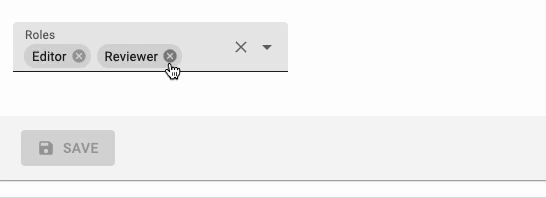
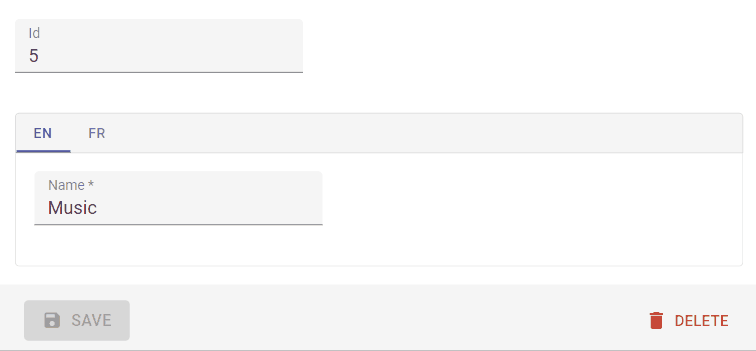

# Input Components

An `Input` component displays an input, or a dropdown list, a list of radio buttons, etc. Such components allow to edit a record property, and are common in the `<Edit>` and `<Create>` components, and in the List Filters.

```jsx
// in src/posts.js
import * as React from "react";
import { Edit, SimpleForm, ReferenceInput, SelectInput, TextInput, required } from 'react-admin';

export const PostEdit = () => (
    <Edit title={<PostTitle />}>
        <SimpleForm>
            <TextInput disabled source="id" />
            <ReferenceInput label="User" source="userId" reference="users" validate={[required()]}>
                <SelectInput optionText="name" />
            </ReferenceInput>
            <TextInput source="title" label="Post title" validate={[required()]} />
            <TextInput multiline source="body" initialValue="Lorem Ipsum" />
        </SimpleForm>
    </Edit>
);
```

## Common Input Props

All input components accept the following props:

| Prop            | Required | Type                      | Default | Description                                                                                                                  |
| --------------- | -------- | ------------------------- | ------- | ---------------------------------------------------------------------------------------------------------------------------- |
| `source`        | Required | `string`                  | -       | Name of the entity property to use for the input value                                                                       |
| `label`         | Optional | `string`                  | -       | Input label. In i18n apps, the label is passed to the `translate` function. Defaults to the humanized `source` when omitted. Set `label={false}` to hide the label. |
| `validate`      | Optional | `Function` &#124; `array` | -       | Validation rules for the current property. See the [Validation Documentation](./CreateEdit.md#validation) for details.       |
| `helperText`    | Optional | `string`                  | -       | Text to be displayed under the input                                                                                         |
| `fullWidth`     | Optional | `boolean`                 | `false` | If `true`, the input will expand to fill the form width                                                                      |
| `className`     | Optional | `string`                  | -       | Class name (usually generated by JSS) to customize the look and feel of the field element itself                             |
| `formClassName` | Optional | `string`                  | -       | Class name to be applied to the container of the input (e.g. the `<div>` forming each row in `<SimpleForm>`)                 |

```jsx
<TextInput source="zb_title" label="Title" initialValue="Foo" />
```

React-admin uses [react-final-form](https://final-form.org/docs/react-final-form/getting-started) to control form inputs. Each input component also accepts all react-final-form [FieldProps](https://final-form.org/docs/react-final-form/types/FieldProps), including:

| Prop           | Required | Type       | Default | Description                                                                                                                                                                                                     |
| -------------- | -------- | ---------- | ------- | --------------------------------------------------------------------------------------------------------------------------------------------------------------------------------------------------------------- |
| `initialValue` | Optional | `mixed`    | -       | Value to be set when the property is `null` or `undefined`                                                                                                                                                      |
| `format`       | Optional | `Function` | -       | Callback taking the value from the form state and the name of the field, and returns the input value. See the [Transforming Input Value](./Inputs.md#transforming-input-value-tofrom-record) section.           |
| `parse`        | Optional | `Function` | -       | Callback taking the input value and name of the field, and returns the value you want stored in the form state. See the [Transforming Input Value](./Inputs.md#transforming-input-value-tofrom-record) section. |

Additional props are passed down to the underlying component (usually a material-ui component). For instance, when setting the `className` prop on a `TextInput` component, the underlying material-ui `<TextField>` receives it, and renders with custom styles. You can also set the underlying component `variant` and `margin` that way.

**Tip**: If you edit a record with a complex structure, you can use a path as the `source` parameter. For instance, if the API returns the following 'book' record:

```json
{
    "id": 1234,
    "title": "War and Peace",
    "author": {
        "firstName": "Leo",
        "lastName": "Tolstoi"
    }
}
```

Then you can display a text input to edit the author first name as follows:

```jsx
<TextInput source="author.firstName" />
```

**Tip**: If your interface has to support multiple languages, don't use the `label` prop, and put the localized labels in a dictionary instead. See the [Translation documentation](./Translation.md#translating-resource-and-field-names) for details.

**Tip**: For compatibility reasons, input components also accept the `defaultValue` prop - which is simply copied as the `initialValue` prop.

## Basic Inputs

### `<BooleanInput>`
### `<NullableBooleanInput>`
### `<DateInput>`
### `<DateTimeInput>`
### `<ImageInput>`
### `<FileInput>`
### `<MarkdownInput>`
### `<NumberInput>`
### `<PasswordInput>`
### `<RichTextInput>`
### `<TextInput>`

## Choice Inputs

### `<AutocompleteInput>`
### `<RadioButtonGroupInput>`
### `<SelectInput>`

## Array Inputs

### `<ArrayInput>`

To edit arrays of data embedded inside a record, `<ArrayInput>` creates a list of sub-forms.


```jsx
import { ArrayInput, SimpleFormIterator, DateInput, TextInput } from 'react-admin';

<ArrayInput source="authors">
    <SimpleFormIterator>
        <DateInput source="user" />
        <TextInput source="role" />
    </SimpleFormIterator>
</ArrayInput>
```

`<ArrayInput>` allows editing of embedded arrays, like the `authors` field in the following `post` record:

```json
{
  "id": 123,
  "authors": [
        {
            "user_id": 123,
            "role": "head_writer",
        },
        {
            "user_id": 456,
            "url": "co_writer",
        }
   ]
}
```

## Usage

`<ArrayInput>` expects a single child, which must be a *form iterator* component. A form iterator is a component accepting a `fields` object as passed by [react-final-form-array](https://github.com/final-form/react-final-form-arrays#fieldarrayrenderprops), and defining a layout for an array of fields. For instance, the `<SimpleFormIterator>` component displays an array of react-admin Inputs in an unordered list (`<ul>`), one sub-form by list item (`<li>`). It also provides controls for adding and removing a sub-record (a backlink in this example).

You can pass `disableAdd` and `disableRemove` as props of `SimpleFormIterator`, to disable `ADD` and `REMOVE` button respectively. Default value of both is `false`.

```jsx
import { ArrayInput, SimpleFormIterator, DateInput, TextInput } from 'react-admin';

<ArrayInput source="backlinks">
    <SimpleFormIterator disableRemove >
        <DateInput source="date" />
        <TextInput source="url" />
    </SimpleFormIterator>
</ArrayInput>
```

You can also use `addButton` and `removeButton` props to pass your custom add and remove buttons to `SimpleFormIterator`.

```jsx
import { ArrayInput, SimpleFormIterator, DateInput, TextInput } from 'react-admin';

<ArrayInput source="backlinks">
    <SimpleFormIterator addButton={<CustomAddButton />} removeButton={<CustomRemoveButton />}>
        <DateInput source="date" />
        <TextInput source="url" />
    </SimpleFormIterator>
</ArrayInput>
```

Furthermore, if you want to customize the label displayed for each item, you can pass a function to `<SimpleFormIterator>` via the `getItemLabel` prop.

```jsx
import { ArrayInput, SimpleFormIterator, DateInput, TextInput } from 'react-admin';

<ArrayInput source="backlinks">
    <SimpleFormIterator getItemLabel={(index) => `${index + 1}. link`}>
        <DateInput source="date" />
        <TextInput source="url" />
    </SimpleFormIterator>
</ArrayInput>
```

**Note**: `<SimpleFormIterator>` only accepts `Input` components as children. If you want to use some `Fields` instead, you have to use a `<FormDataConsumer>` to get the correct source, as follows:

```jsx
import { ArrayInput, SimpleFormIterator, DateInput, TextInput, FormDataConsumer } from 'react-admin';

<ArrayInput source="backlinks">
    <SimpleFormIterator disableRemove >
        <DateInput source="date" />
        <FormDataConsumer>
            {({ getSource, scopedFormData }) => {
                return (
                    <TextField
                        source={getSource('url')}
                        record={scopedFormData}
                    />
                );
            }}
        </FormDataConsumer>
    </SimpleFormIterator>
</ArrayInput>
```

`<ArrayInput>` also accepts the [common input props](./Inputs.md#common-input-props) (except `format` and `parse`). 

**Important**: Note that asynchronous validators are not supported on the `<ArrayInput>` component due to a limitation of [react-final-form-arrays](https://github.com/final-form/react-final-form-arrays).

### `<AutocompleteArrayInput>`

To let users choose multiple values in a list using a dropdown with autocompletion, use `<AutocompleteArrayInput>`.
It renders using Material UI [Autocomplete](https://mui.com/components/autocomplete/).



Set the `choices` attribute to determine the options list (with `id`, `name` tuples).

```jsx
import { AutocompleteArrayInput } from 'react-admin';

<AutocompleteArrayInput source="tags" choices={[
    { id: 'programming', name: 'Programming' },
    { id: 'lifestyle', name: 'Lifestyle' },
    { id: 'photography', name: 'Photography' },
]} />
```

## Properties

| Prop                      | Required | Type                       | Default      | Description                                                                                                                                                                                                                                                                                          |
| ------------------------- | -------- | -------------------------- | ------------ | ---------------------------------------------------------------------------------------------------------------------------------------------------------------------------------------------------------------------------------------------------------------------------------------------------- |
| `allowEmpty`              | Optional | `boolean`                  | `false`      | If `true`, the first option is an empty one                                                                                                                                                                                                                                                          |
| `create`                 | Optional | `Element`     | `-`          | A React Element to render when users want to create a new choice |
| `createLabel`                 | Optional | `string`     | `ra.action.create`          | The label for the menu item allowing users to create a new choice. Used when the filter is empty |
| `createItemLabel`                 | Optional | `string`     | `ra.action.create_item`          | The label for the menu item allowing users to create a new choice. Used when the filter is not empty |
| `debounce`         | Optional | `number`                  | `250`      | The delay to wait before calling the setFilter function injected when used in a ReferenceInput.                                                                                                                                                                                                                                                 |
| `choices`                 | Required | `Object[]`                 | -            | List of items to autosuggest                                                                                                                                                                                                                                                                         |
| `inputText`               | Optional | `Function`     | `-`          | Required if `optionText` is a custom Component, this function must return the text displayed for the current selection. |
| `matchSuggestion`         | Optional | `Function`                 | -            | Required if `optionText` is a React element. Function returning a boolean indicating whether a choice matches the filter. `(filter, choice) => boolean`                                                                                                                                              |
| `onCreate`              | Optional | `Function`     | `-`       | A function called with the current filter value when users choose to create a new choice. |
| `optionValue`             | Optional | `string`                   | `id`         | Field name of record containing the value to use as input value                                                                                                                                                                                                                                       |
| `optionText`              | Optional | `string` &#124; `Function` | `name`       | Field name of record to display in the suggestion item or function which accepts the current record as argument (`record => {string}`)                                                                                                                                                               |
| `setFilter`               | Optional | `Function`                 | `null`       | A callback to inform the `searchText` has changed and new `choices` can be retrieved based on this `searchText`. Signature `searchText => void`. This function is automatically setup when using `ReferenceInput`.                                                                                   |
| `shouldRenderSuggestions` | Optional | `Function`                 | `() => true` | A function that returns a `boolean` to determine whether or not suggestions are rendered. Use this when working with large collections of data to improve performance and user experience. This function is passed into the underlying react-autosuggest component. Ex.`(value) => value.trim().length > 2` |
| `source`                  | Required | `string`                   | -            | Name of field to edit, its type should match the type retrieved from `optionValue`                                                                                                                                                                                                                   |
| `suggestionLimit`         | Optional | `number`                   | `null`       | Limits the numbers of suggestions that are shown in the dropdown list                                                                                                                                                                                                                                |

`<AutocompleteArrayInput>` also accepts the [common input props](./Inputs.md#common-input-props).

## Usage

`<AutocompleteArrayInput>` is designed to for fields containing an array of scalar values, e.g.:

```json
{
  "id": 123,
  "tags": ["lifestyle", "photography"]
}
```

When working with a field that contains an array of *objects*, use `parse` and `format` to turn the value into an array of scalar values. 

So for instance, for editing the `tags` field of records looking like the following:

```json
{
  "id": 123,
  "tags": [
      { "id": "lifestyle" },
      { "id": "photography" }
   ] 
}
```

You should use the following syntax:

```jsx
import { AutocompleteArrayInput } from 'react-admin';

<AutocompleteArrayInput 
    source="tags"
    parse={value =>
        value && value.map(v => ({ id: v }))
    }
    format={value => value && value.map(v => v.id)}
    choices={[
        { id: 'programming', name: 'Programming' },
        { id: 'lifestyle', name: 'Lifestyle' },
        { id: 'photography', name: 'Photography' },
    ]}
/>
```

You can customize the properties to use for the option name and value, thanks to the `optionText` and `optionValue` attributes:

```jsx
const choices = [
    { _id: 123, full_name: 'Leo Tolstoi', sex: 'M' },
    { _id: 456, full_name: 'Jane Austen', sex: 'F' },
];
<AutocompleteArrayInput source="author_id" choices={choices} optionText="full_name" optionValue="_id" />
```

`optionText` also accepts a function, so you can shape the option text at will:

```jsx
const choices = [
   { id: 123, first_name: 'Leo', last_name: 'Tolstoi' },
   { id: 456, first_name: 'Jane', last_name: 'Austen' },
];
const optionRenderer = choice => `${choice.first_name} ${choice.last_name}`;
<AutocompleteArrayInput source="author_id" choices={choices} optionText={optionRenderer} />
```

The choices are translated by default, so you can use translation identifiers as choices:

```jsx
const choices = [
   { id: 'M', name: 'myroot.gender.male' },
   { id: 'F', name: 'myroot.gender.female' },
];
```

However, in some cases (e.g. inside a `<ReferenceInput>`), you may not want the choice to be translated. In that case, set the `translateChoice` prop to `false`.

```jsx
<AutocompleteArrayInput source="gender" choices={choices} translateChoice={false}/>
```

When dealing with a large amount of `choices` you may need to limit the number of suggestions that are rendered in order to maintain usable performance. The `shouldRenderSuggestions` is an optional prop that allows you to set conditions on when to render suggestions. An easy way to improve performance would be to skip rendering until the user has entered 2 or 3 characters in the search box. This lowers the result set significantly, and might be all you need (depending on your data set).
Ex. `<AutocompleteArrayInput shouldRenderSuggestions={(val) => { return val.trim().length > 2 }} />` would not render any suggestions until the 3rd character has been entered. This prop is passed to the underlying `react-autosuggest` component and is documented [here](https://github.com/moroshko/react-autosuggest#should-render-suggestions-prop).

Lastly, `<AutocompleteArrayInput>` renders a [material-ui `<Autocomplete>` component](https://mui.com/components/autocomplete/) and accepts the `<Autocomplete>` props:


```jsx
<AutocompleteArrayInput source="category" limitTags={2} />
```


**Tip**: Like many other inputs, `<AutocompleteArrayInput>` accept a `fullWidth` prop.

**Tip**: If you want to populate the `choices` attribute with a list of related records, you should decorate `<AutocompleteArrayInput>` with [`<ReferenceArrayInput>`](#referenceinput), and leave the `choices` empty:

```jsx
import { AutocompleteArrayInput, ReferenceArrayInput } from 'react-admin';

<ReferenceArrayInput label="Tags" reference="tags" source="tags">
    <AutocompleteArrayInput />
</ReferenceArrayInput>
```

**Tip**: `<ReferenceArrayInput>` is a stateless component, so it only allows to *filter* the list of choices, not to *extend* it. If you need to populate the list of choices based on the result from a `fetch` call (and if [`<ReferenceArrayInput>`](#referencearrayinput) doesn't cover your need), you'll have to [write your own Input component](#writing-your-own-input-component) based on [material-ui-chip-input](https://github.com/TeamWertarbyte/material-ui-chip-input).

**Tip**: React-admin's `<AutocompleteInput>` has only a capital A, while material-ui's `<AutoComplete>` has a capital A and a capital C. Don't mix up the components!

#### Creating New Choices

The `<AutocompleteArrayInput>` can allow users to create a new choice if either the `create` or `onCreate` prop is provided.

Use the `onCreate` prop when you only require users to provide a simple string and a `prompt` is enough. You can return either the new choice directly or a Promise resolving to the new choice.


```js
import { AutocompleteArrayInput, Create, SimpleForm, TextInput } from 'react-admin';

const PostCreate = () => {
    const tags = [
        { name: 'Tech', id: 'tech' },
        { name: 'Lifestyle', id: 'lifestyle' },
    ];
    return (
        <Create>
            <SimpleForm>
                <TextInput source="title" />
                <AutocompleteArrayInput
                    onCreate={() => {
                        const newTagName = prompt('Enter a new tag');
                        const newTag = { id: newTagName.toLowerCase(), name: newTagName };
                        categories.push(newTag);
                        return newTag;
                    }}
                    source="tags"
                    choices={tags}
                />
            </SimpleForm>
        </Create>
    );
}
```


Use the `create` prop when you want a more polished or complex UI. For example a Material UI `<Dialog>` asking for multiple fields because the choices are from a referenced resource.


```js
import {
    AutocompleteArrayInput,
    Create,
    ReferenceArrayInput,
    SimpleForm,
    TextInput,
    useCreateSuggestionContext
} from 'react-admin';

import {
    Box,
    BoxProps,
    Button,
    Dialog,
    DialogActions,
    DialogContent,
    TextField,
} from '@material-ui/core';

const PostCreate = () => {
    return (
        <Create>
            <SimpleForm>
                <TextInput source="title" />
                <ReferenceArrayInput source="tags" reference="tags">
                    <AutocompleteArrayInput create={<CreateTag />} />
                </ReferenceArrayInput>
            </SimpleForm>
        </Create>
    );
}

const CreateTag = () => {
    const { filter, onCancel, onCreate } = useCreateSuggestionContext();
    const [value, setValue] = React.useState(filter || '');
    const [create] = useCreate('tags');

    const handleSubmit = (event) => {
        event.preventDefault();
        create(
            {
                payload: {
                    data: {
                        title: value,
                    },
                },
            },
            {
                onSuccess: ({ data }) => {
                    setValue('');
                    onCreate(data);
                },
            }
        );
    };

    return (
        <Dialog open onClose={onCancel}>
            <form onSubmit={handleSubmit}>
                <DialogContent>
                    <TextField
                        label="New tag"
                        value={value}
                        onChange={event => setValue(event.target.value)}
                        autoFocus
                    />
                </DialogContent>
                <DialogActions>
                    <Button type="submit">Save</Button>
                    <Button onClick={onCancel}>Cancel</Button>
                </DialogActions>
            </form>
        </Dialog>
    );
};
```


## CSS API

This component doesn't apply any custom styles on top of [material-ui `<Autocomplete>` component](https://mui.com/components/autocomplete/). Refer to their documentation to know its CSS API.

### `<CheckboxGroupInput>`

If you want to let the user choose multiple values among a list of possible values by showing them all, `<CheckboxGroupInput>` is the right component. 


Set the `choices` attribute to determine the options (with `id`, `name` tuples):

```jsx
import { CheckboxGroupInput } from 'react-admin';

<CheckboxGroupInput source="category" choices={[
    { id: 'programming', name: 'Programming' },
    { id: 'lifestyle', name: 'Lifestyle' },
    { id: 'photography', name: 'Photography' },
]} />
```

## Properties

| Prop          | Required | Type                       | Default | Description                                                                                                                            |
| ------------- | -------- | -------------------------- | ------- | -------------------------------------------------------------------------------------------------------------------------------------  |
| `choices`     | Required | `Object[]`                 | -       | List of choices                                                                                                                        |
| `optionText`  | Optional | `string` &#124; `Function` | `name`  | Field name of record to display in the suggestion item or function which accepts the correct record as argument (`record => {string}`) |
| `optionValue` | Optional | `string`                   | `id`    | Field name of record containing the value to use as input value                                                                        |
| `row`         | Optional | `boolean`                  | `true`  | Display group of elements in a compact row.                                                                                            |

Refer to [Material UI Checkbox documentation](https://material-ui.com/api/checkbox/) for more details.

`<CheckboxGroupInput>` also accepts the [common input props](./Inputs.md#common-input-props).

## Usage

You can customize the properties to use for the option name and value, thanks to the `optionText` and `optionValue` attributes:

```jsx
const choices = [
    { _id: 123, full_name: 'Leo Tolstoi', sex: 'M' },
    { _id: 456, full_name: 'Jane Austen', sex: 'F' },
];
<CheckboxGroupInput source="author_id" choices={choices} optionText="full_name" optionValue="_id" />
```

`optionText` also accepts a function, so you can shape the option text at will:

```jsx
const choices = [
   { id: 123, first_name: 'Leo', last_name: 'Tolstoi' },
   { id: 456, first_name: 'Jane', last_name: 'Austen' },
];
const optionRenderer = choice => `${choice.first_name} ${choice.last_name}`;
<CheckboxGroupInput source="author_id" choices={choices} optionText={optionRenderer} />
```

`optionText` also accepts a React Element, that will be cloned and receive the related choice as the `record` prop. You can use Field components there.

```jsx
const choices = [
   { id: 123, first_name: 'Leo', last_name: 'Tolstoi' },
   { id: 456, first_name: 'Jane', last_name: 'Austen' },
];
const FullNameField = ({ record }) => <span>{record.first_name} {record.last_name}</span>;
<CheckboxGroupInput source="gender" choices={choices} optionText={<FullNameField />}/>
```

The choices are translated by default, so you can use translation identifiers as choices:

```jsx
const choices = [
    { id: 'programming', name: 'myroot.category.programming' },
    { id: 'lifestyle', name: 'myroot.category.lifestyle' },
    { id: 'photography', name: 'myroot.category.photography' },
];
```

However, in some cases (e.g. inside a `<ReferenceInput>`), you may not want the choice to be translated. In that case, set the `translateChoice` prop to `false`.

```jsx
<CheckboxGroupInput source="gender" choices={choices} translateChoice={false}/>
```

Lastly, use the `options` attribute if you want to override any of Material UI's `<Checkbox>` attributes:


```jsx
import { FavoriteBorder, Favorite } from '@material-ui/icons';

<CheckboxGroupInput source="category" options={{
    icon: <FavoriteBorder />,
    checkedIcon: <Favorite />
}} />
```


## CSS API

| Rule name  | Description                                                   |
| ---------- | ------------------------------------------------------------- |
| `root`     | Applied to the root element                                   |
| `label`    | Applied to the underlying Material UI's `FormLabel` component |

To override the style of all instances of `<CheckboxGroupInput>` using the [material-ui style overrides](https://material-ui.com/customization/globals/#css), use the `RaCheckboxGroupInput` key.

### `<DualListInput>`

This [Enterprise Edition](https://marmelab.com/ra-enterprise) component allows to edit array values, one-to-many or many-to-many relationships by moving items from one list to another. It's a good alternative to `<SelectInput>` for a small number of choices.


```jsx
import { ReferenceInput } from 'react-admin';
import { DualListInput } from '@react-admin/ra-relationships';

<ReferenceInput label="Author" source="author_id" reference="authors">
    <DualListInput optionText="last_name" />
</ReferenceInput>
```

Check [the `ra-relationships` documentation](https://marmelab.com/ra-enterprise/modules/ra-relationships) for more details.

### `<SelectArrayInput>`

To let users choose several values in a list using a dropdown, use `<SelectArrayInput>`. It renders using [Material ui's `<Select>`](https://material-ui.com/api/select). 


## Properties

| Prop              | Required | Type                       | Default | Description                                                                                                                            |
| ----------------- | -------- | -------------------------- | ------- | -------------------------------------------------------------------------------------------------------------------------------------- |
| `allowEmpty`      | Optional | `boolean`                  | `false` | If true, the first option is an empty one                                                                                              |
| `choices`         | Required | `Object[]`                 | -       | List of items to show as options                                                                                                       |
| `create`                 | Optional | `Element`     | `-`          | A React Element to render when users want to create a new choice |
| `createLabel`                 | Optional | `string`     | `ra.action.create`          | The label for the menu item allowing users to create a new choice. Used when the filter is empty |
| `emptyText`       | Optional | `string`                   | ''      | The text to display for the empty option                                                                                               |
| `onCreate`              | Optional | `Function`     | `-`       | A function called with the current filter value when users choose to create a new choice. |
| `options`         | Optional | `Object`                   | -       | Props to pass to the underlying `<SelectInput>` element                                                                                |
| `optionText`      | Optional | `string` &#124; `Function` | `name`  | Field name of record to display in the suggestion item or function which accepts the current record as argument (`record => {string}`) |
| `optionValue`     | Optional | `string`                   | `id`    | Field name of record containing the value to use as input value                                                                        |
| `resettable`      | Optional | `boolean`                  | `false` | If `true`, display a button to reset the changes in this input value                                                                   |
| `translateChoice` | Optional | `boolean`                  | `true`  | Whether the choices should be translated                                                                                               |

`<SelectArrayInput>` also accepts the [common input props](./Inputs.md#common-input-props).

## Usage

Set the `choices` attribute to determine the options (with `id`, `name` tuples):

```jsx
import { SelectArrayInput } from 'react-admin';

<SelectArrayInput label="Tags" source="categories" choices={[
    { id: 'music', name: 'Music' },
    { id: 'photography', name: 'Photo' },
    { id: 'programming', name: 'Code' },
    { id: 'tech', name: 'Technology' },
    { id: 'sport', name: 'Sport' },
]} />
```

You can also customize the properties to use for the option name and value,
thanks to the `optionText` and `optionValue` attributes.

```jsx
const choices = [
   { _id: '1', name: 'Book', plural_name: 'Books' },
   { _id: '2', name: 'Video', plural_name: 'Videos' },
   { _id: '3', name: 'Audio', plural_name: 'Audios' },
];
<SelectArrayInput source="categories" choices={choices} optionText="plural_name" optionValue="_id" />
```

`optionText` also accepts a function, so you can shape the option text at will:

```jsx
const choices = [
   { id: '1', name: 'Book', quantity: 23 },
   { id: '2', name: 'Video', quantity: 56 },
   { id: '3', name: 'Audio', quantity: 12 },
];
const optionRenderer = choice => `${choice.name} (${choice.quantity})`;
<SelectArrayInput source="categories" choices={choices} optionText={optionRenderer} />
```

The choices are translated by default, so you can use translation identifiers as choices:

```js
const choices = [
   { id: 'books', name: 'myroot.category.books' },
   { id: 'sport', name: 'myroot.category.sport' },
];
```

You can render any item as disabled by setting its `disabled` property to `true`: 

```jsx
const choices = [
    { _id: 123, full_name: 'Leo Tolstoi', sex: 'M' },
    { _id: 456, full_name: 'Jane Austen', sex: 'F' },
    { _id: 1, full_name: 'System Administrator', sex: 'F', disabled: true },
];
<SelectArrayInput source="author_id" choices={choices} optionText="full_name" optionValue="_id" />
```

You can use a custom field name by setting the `disableValue` prop: 

```jsx
const choices = [
    { _id: 123, full_name: 'Leo Tolstoi', sex: 'M' },
    { _id: 456, full_name: 'Jane Austen', sex: 'F' },
    { _id: 987, full_name: 'Jack Harden', sex: 'M', not_available: true },
];
<SelectArrayInput source="contact_id" choices={choices} optionText="full_name" optionValue="_id" disableValue="not_available" />
```

Lastly, use the `options` attribute if you want to override any of the `<Select>` attributes:


```jsx
<SelectArrayInput source="category" options={{ autoWidth: true }} />
```


Refer to [the Select documentation](https://material-ui.com/api/select) for more details.

The `SelectArrayInput` component **cannot** be used inside a `ReferenceInput` but can be used inside a `ReferenceArrayInput`.

```jsx
import * as React from "react";
import {
    ChipField,
    Create,
    DateInput,
    ReferenceArrayInput,
    SelectArrayInput,
    TextInput,
} from 'react-admin';

export const PostCreate = () => (
    <Create>
        <SimpleForm>
            <TextInput source="title" />
            <TextInput multiline source="body" />
            <DateInput source="published_at" />

            <ReferenceArrayInput reference="tags" source="tags">
                <SelectArrayInput>
                    <ChipField source="name" />
                </SelectArrayInput>
            </ReferenceArrayInput>
        </SimpleForm>
    </Create>
);
```

**Tip**: As it does not provide autocompletion, the `SelectArrayInput` might not be suited when the referenced resource has a lot of items.

`<SelectArrayInput>` also accepts the [common input props](./Inputs.md#common-input-props).

#### Creating New Choices

The `<SelectArrayInput>` can allow users to create a new choice if either the `create` or `onCreate` prop is provided.

Use the `onCreate` prop when you only require users to provide a simple string and a `prompt` is enough. You can return either the new choice directly or a Promise resolving to the new choice.


```js
import { SelectArrayInput, Create, SimpleForm, TextInput } from 'react-admin';

const PostCreate = () => {
    const tags = [
        { name: 'Tech', id: 'tech' },
        { name: 'Lifestyle', id: 'lifestyle' },
    ];
    return (
        <Create>
            <SimpleForm>
                <TextInput source="title" />
                <SelectArrayInput
                    onCreate={() => {
                        const newTagName = prompt('Enter a new tag');
                        const newTag = { id: newTagName.toLowerCase(), name: newTagName };
                        categories.push(newTag);
                        return newTag;
                    }}
                    source="tags"
                    choices={tags}
                />
            </SimpleForm>
        </Create>
    );
}
```


Use the `create` prop when you want a more polished or complex UI. For example a Material UI `<Dialog>` asking for multiple fields because the choices are from a referenced resource.


```js
import {
    SelectArrayInput,
    Create,
    ReferenceArrayInput,
    SimpleForm,
    TextInput,
    useCreateSuggestionContext
} from 'react-admin';

import {
    Box,
    BoxProps,
    Button,
    Dialog,
    DialogActions,
    DialogContent,
    TextField,
} from '@material-ui/core';

const PostCreate = () => {
    return (
        <Create>
            <SimpleForm>
                <TextInput source="title" />
                <ReferenceArrayInput source="tags" reference="tags">
                    <SelectArrayInput create={<CreateTag />} />
                </ReferenceArrayInput>
            </SimpleForm>
        </Create>
    );
}

const CreateTag = () => {
    const { filter, onCancel, onCreate } = useCreateSuggestionContext();
    const [value, setValue] = React.useState(filter || '');
    const [create] = useCreate('tags');

    const handleSubmit = (event) => {
        event.preventDefault();
        create(
            {
                payload: {
                    data: {
                        title: value,
                    },
                },
            },
            {
                onSuccess: ({ data }) => {
                    setValue('');
                    onCreate(data);
                },
            }
        );
    };

    return (
        <Dialog open onClose={onCancel}>
            <form onSubmit={handleSubmit}>
                <DialogContent>
                    <TextField
                        label="New tag"
                        value={value}
                        onChange={event => setValue(event.target.value)}
                        autoFocus
                    />
                </DialogContent>
                <DialogActions>
                    <Button type="submit">Save</Button>
                    <Button onClick={onCancel}>Cancel</Button>
                </DialogActions>
            </form>
        </Dialog>
    );
};
```


## CSS API

| Rule name  | Description                                                                        |
| ---------- | ---------------------------------------------------------------------------------- |
| `root`     | Applied to the root element                                                        |
| `chip`     | Applied to each Material UI's `Chip` component used as selected item               |
| `chips`    | Applied to the container of Material UI's `Chip` components used as selected items |

To override the style of all instances of `<SelectArrayInput>` using the [material-ui style overrides](https://material-ui.com/customization/globals/#css), use the `RaSelectArrayInput` key.


## Reference Inputs 

### `<ReferenceArrayInput>`

Use `<ReferenceArrayInput>` to edit an array of reference values, i.e. to let users choose a list of values (usually foreign keys) from another REST endpoint.

`<ReferenceArrayInput>` fetches the related resources (using `dataProvider.getMany()`) as well as possible resources (using `dataProvider.getList()`) in the reference endpoint.

For instance, if the post object has many tags, a post resource may look like:

```json
{
    "id": 1234,
    "tag_ids": [1, 23, 4]
}
```

Then `<ReferenceArrayInput>` would fetch a list of tag resources from these two calls:

```
http://myapi.com/tags?id=[1,23,4]
http://myapi.com/tags?page=1&perPage=25
```

Once it receives the deduplicated reference resources, this component delegates rendering to a subcomponent, by providing the possible choices through the `ReferenceArrayInputContext`. This context value can be accessed with the [`useReferenceArrayInputContext`](#usereferencearrayinputcontext) hook.

This means you can use `<ReferenceArrayInput>` with [`<SelectArrayInput>`](#selectarrayinput), or with the component of your choice, provided it supports the `choices` attribute.

The component expects a `source` and a `reference` attributes. For instance, to make the `tag_ids` for a `post` editable:

```jsx
import { ReferenceArrayInput, SelectArrayInput } from 'react-admin';

<ReferenceArrayInput source="tag_ids" reference="tags">
    <SelectArrayInput optionText="name" />
</ReferenceArrayInput>
```


**Note**: You **must** add a `<Resource>` for the reference resource - react-admin needs it to fetch the reference data. You can omit the list prop in this reference if you want to hide it in the sidebar menu.

```jsx
<Admin dataProvider={myDataProvider}>
    <Resource name="posts" list={PostList} edit={PostEdit} />
    <Resource name="tags" />
</Admin>
```

Set the `allowEmpty` prop when you want to add an empty choice with a value of `null` in the choices list.
Disabling `allowEmpty` does not mean that the input will be required. If you want to make the input required, you must add a validator as indicated in [Validation Documentation](./CreateEdit.md#validation). Enabling the `allowEmpty` props just adds an empty choice (with `null` value) on top of the options, and makes the value nullable.

```jsx
import { ReferenceArrayInput, SelectArrayInput } from 'react-admin';

<ReferenceArrayInput source="tag_ids" reference="tags" allowEmpty>
    <SelectArrayInput optionText="name" />
</ReferenceArrayInput>
```

**Tip**: `allowEmpty` is set by default for all Input components passed as `<List filters>`.

You can tweak how this component fetches the possible values using the `perPage`, `sort`, and `filter` props.


```jsx
// by default, fetches only the first 25 values. You can extend this limit
// by setting the `perPage` prop.
<ReferenceArrayInput
    source="tag_ids"
    reference="tags"
    perPage={100}
>
    <SelectArrayInput optionText="name" />
</ReferenceArrayInput>

// by default, orders the possible values by id desc. You can change this order
// by setting the `sort` prop (an object with `field` and `order` properties).
<ReferenceArrayInput
    source="tag_ids"
    reference="tags"
    sort={{ field: 'title', order: 'ASC' }}
>
    <SelectArrayInput optionText="name" />
</ReferenceArrayInput>

// you can filter the query used to populate the possible values. Use the
// `filter` prop for that.
<ReferenceArrayInput
    source="tag_ids"
    reference="tags"
    filter={{ is_published: true }}
>
    <SelectArrayInput optionText="name" />
</ReferenceArrayInput>
```


**Tip**: `<ReferenceArrayInput>` can also be used with an `<AutocompleteArrayInput>` to allow filtering the choices. By default, it will fetch the choices on mount, but you can prevent this by using the `enableGetChoices`. This prop should be a function that receives the `filterValues` as parameter and return a boolean. In order to also hide the choices when `enableGetChoices` returns `false`, you should use `shouldRenderSuggestions` on the `<AutocompleteArrayInput>`:

```jsx
<ReferenceArrayInput
    label="Tags"
    reference="tags"
    source="tags"
    enableGetChoices={({ q }) => (q ? q.length >= 2 : false)}
>
    <AutocompleteArrayInput
        shouldRenderSuggestions={value => value.length >= 2}
    />
</ReferenceArrayInput>
```

In addition to the `ReferenceArrayInputContext`, `<ReferenceArrayInput>` also sets up a `ListContext` providing access to the records from the reference resource in a similar fashion to that of the `<List>` component. This `ListContext` value is accessible with the [`useListContext`](./useListContext.md) hook.

`<ReferenceArrayInput>` also accepts the [common input props](./Inputs.md#common-input-props).

### `useReferenceArrayInputContext`

The [`<ReferenceArrayInput>`](#referencearrayinput) component takes care of fetching the data, and putting that data in a context called `ReferenceArrayInputContext` so that it’s available for its descendants. This context also stores filters, pagination, sort state, and provides callbacks to update them.

Any component descendant of `<ReferenceArrayInput>` can grab information from the `ReferenceArrayInputContext` using the `useReferenceArrayInputContext` hook. Here is what it returns:

```js
const {
    choices, // An array of records matching both the current input value and the filters
    error, // A potential error that may have occured while fetching the data
    warning, // A potential warning regarding missing references 
    loaded, // boolean that is false until the data is available
    loading, // boolean that is true on mount, and false once the data was fetched
    setFilter, // a callback to update the filters, e.g. setFilters({ q: 'query' })
    setPagination, // a callback to change the pagination, e.g. setPagination({ page: 2, perPage: 50 })
    setSort, // a callback to change the sort, e.g. setSort({ field: 'name', order: 'DESC' })
} = useReferenceArrayInputContext();
```

### `<ReferenceInput>`

Use `<ReferenceInput>` for foreign-key values, for instance, to edit the `post_id` of a `comment` resource. This component fetches the related record (using `dataProvider.getMany()`) as well as possible choices (using `dataProvider.getList()` in the reference resource), then delegates rendering to a subcomponent, to which it passes the possible choices as the `choices` attribute.

This means you can use `<ReferenceInput>` with any of [`<SelectInput>`](#selectinput), [`<AutocompleteInput>`](#autocompleteinput), or [`<RadioButtonGroupInput>`](#radiobuttongroupinput), or even with the component of your choice, provided it supports the `choices` attribute.

The component expects a `source` and a `reference` attributes. For instance, to make the `post_id` for a `comment` editable:

```jsx
import { ReferenceInput, SelectInput } from 'react-admin';

<ReferenceInput label="Post" source="post_id" reference="posts">
    <SelectInput optionText="title" />
</ReferenceInput>
```


**Note**: You **must** add a `<Resource>` for the reference resource - react-admin needs it to fetch the reference data. You *can* omit the `list` prop in this reference if you want to hide it in the sidebar menu.

```jsx
<Admin dataProvider={myDataProvider}>
    <Resource name="comments" list={CommentList} />
    <Resource name="posts" />
</Admin>
```

## Properties

| Prop            | Required | Type                                        | Default                               | Description                                                                                                           |
| --------------- | -------- | ------------------------------------------- | ------------------------------------- | --------------------------------------------------------------------------------------------------------------------- |
| `allowEmpty`    | Optional | `boolean`                                   | `false`                               | If true, add an empty item to the list of choices to allow for empty value                                            |
| `filter`        | Optional | `Object`                                    | `{}`                                  | Permanent filters to use for getting the suggestion list                                                              |
| `filterToQuery` | Optional | `string` => `Object`                        | `searchText => ({ q: [searchText] })` | How to transform the searchText (passed e.g. by an `<AutocompleteArrayInput>`) into a parameter for the data provider |
| `perPage`       | Optional | `number`                                    | 25                                    | Number of suggestions to show                                                                                         |
| `reference`     | Required | `string`                                    | ''                                    | Name of the reference resource, e.g. 'posts'.                                                                         |
| `sort`          | Optional | `{ field: String, order: 'ASC' or 'DESC' }` | `{ field: 'id', order: 'DESC' }`      | How to order the list of suggestions                                                                                  |
| `enableGetChoices`     | Optional | `({q: string}) => boolean`                  | `() => true`                          | Function taking the `filterValues` and returning a boolean to enable the `getList` call.                              |


`<ReferenceInput>` also accepts the [common input props](./Inputs.md#common-input-props).

## Usage

Set the `allowEmpty` prop when you want to add an empty choice with a value of `null` in the choices list.
Disabling `allowEmpty` does not mean that the input will be required. If you want to make the input required, you must add a validator as indicated in [Validation Documentation](./CreateEdit.md#validation). Enabling the `allowEmpty` props just adds an empty choice (with `null` value) on top of the options, and makes the value nullable.

```jsx
import { ReferenceInput, SelectInput } from 'react-admin';

<ReferenceInput label="Post" source="post_id" reference="posts" allowEmpty>
    <SelectInput optionText="title" />
</ReferenceInput>
```

**Tip**: `allowEmpty` is set by default for all Input components passed as `<List filters>`:

```jsx
const commentFilters = [
    <ReferenceInput label="Post" source="post_id" reference="posts"> // no need for allowEmpty
        <SelectInput optionText="title" />
    </ReferenceInput>
];
```

You can tweak how this component fetches the possible values using the `perPage`, `sort`, and `filter` props.


```jsx
// by default, fetches only the first 25 values. You can extend this limit
// by setting the `perPage` prop.
<ReferenceInput
    source="post_id"
    reference="posts"
    perPage={100}
>
    <SelectInput optionText="title" />
</ReferenceInput>

// by default, orders the possible values by id desc. You can change this order
// by setting the `sort` prop (an object with `field` and `order` properties).
<ReferenceInput
    source="post_id"
    reference="posts"
    sort={{ field: 'title', order: 'ASC' }}
>
    <SelectInput optionText="title" />
</ReferenceInput>

// you can filter the query used to populate the possible values. Use the
// `filter` prop for that.
<ReferenceInput
    source="post_id"
    reference="posts"
    filter={{ is_published: true }}
>
    <SelectInput optionText="title" />
</ReferenceInput>
```


The child component may further filter results (that's the case, for instance, for `<AutocompleteInput>`). ReferenceInput passes a `setFilter` function as prop to its child component. It uses the value to create a filter for the query - by default `{ q: [searchText] }`. You can customize the mapping
`searchText => searchQuery` by setting a custom `filterToQuery` function prop:

```jsx
<ReferenceInput
    source="post_id"
    reference="posts"
    filterToQuery={searchText => ({ title: searchText })}
>
    <AutocompleteInput optionText="title" />
</ReferenceInput>
```

The child component receives the following props from `<ReferenceInput>`:

- `loading`: whether the request for possible values is loading or not
- `filter`: the current filter of the request for possible values. Defaults to `{}`.
- `pagination`: the current pagination of the request for possible values. Defaults to `{ page: 1, perPage: 25 }`.
- `sort`: the current sorting of the request for possible values. Defaults to `{ field: 'id', order: 'DESC' }`.
- `error`: the error message if the form validation failed for that input
- `warning`: the warning message if the form validation failed for that input
- `onChange`: function to call when the value changes
- `setFilter`: function to call to update the filter of the request for possible values
- `setPagination`: : function to call to update the pagination of the request for possible values
- `setSort`: function to call to update the sorting of the request for possible values

**Tip** You can make the `getList()` call lazy by using the `enableGetChoices` prop. This prop should be a function that receives the `filterValues` as parameter and return a boolean. This can be useful when using an `AutocompleteInput` on a resource with a lot of data. The following example only starts fetching the options when the query has at least 2 characters:
```jsx
<ReferenceInput
     source="post_id"
     reference="posts"
     enableGetChoices={({ q }) => q.length >= 2}>
    <AutocompleteInput optionText="title" />
</ReferenceInput>
```

**Tip**: Why does `<ReferenceInput>` use the `dataProvider.getMany()` method with a single value `[id]` instead of `dataProvider.getOne()` to fetch the record for the current value? Because when there are many `<ReferenceInput>` for the same resource in a form (for instance when inside an `<ArrayInput>`), react-admin *aggregates* the calls to `dataProvider.getMany()` into a single one with `[id1, id2, ...]`. This speeds up the UI and avoids hitting the API too much.

### `<ReferenceManyToManyInput>`

This [Enterprise Edition](https://marmelab.com/ra-enterprise) component allows to create, edit or remove relationships between two resources sharing an associative table. The changes in the associative table are sent to the dataProvider when the user submits the form, so that they can cancel the changes before submission.

In this example, `artists.id` matches `performances.artist_id`, and `performances.event_id` matches `events.id`:

```
┌────────────┐       ┌──────────────┐      ┌────────┐
│ artists    │       │ performances │      │ events │
│------------│       │--------------│      │--------│
│ id         │───┐   │ id           │      │ id     │
│ first_name │   └──╼│ artist_id    │   ┌──│ name   │
│ last_name  │       │ event_id     │╾──┘  │        │
└────────────┘       └──────────────┘      └────────┘
```

The form displays the events name in a `<SelectArrayInput>`:

```jsx
import * as React from 'react';
import { Edit, SelectArrayInput, SimpleForm, TextInput } from 'react-admin';
import { ReferenceManyToManyInput, useReferenceManyToManyUpdate } from '@react-admin/ra-many-to-many';

/**
 * Decorate <SimpleForm> to override the default save function.
 * This is necessary to save changes in the associative table
 * only on submission.
 */
const ArtistEditForm = props => {
    const save = useReferenceManyToManyUpdate({
        basePath: props.basePath,
        record: props.record,
        redirect: props.redirect || 'list',
        reference: 'events',
        resource: props.resource,
        source: 'id',
        through: 'performances',
        undoable: props.undoable,
        using: 'artist_id,event_id',
    });

    return <SimpleForm {...props} save={save} />;
};

const ArtistEdit = () => (
    <Edit>
        <ArtistEditForm>
            <TextInput disabled source="id" />
            <TextInput source="first_name" />
            <TextInput source="last_name" />
            <ReferenceManyToManyInput
                source="id"
                reference="events"
                through="performances"
                using="artist_id,event_id"
                fullWidth
                label="Performances"
            >
                <SelectArrayInput optionText="name" />
            </ReferenceManyToManyInput>
        </ArtistEditForm>
    </Edit>
);

export default ArtistEdit;
```

Check [the `ra-relationships` documentation](https://marmelab.com/ra-enterprise/modules/ra-relationships#referencemanytomanyinput) for more details.

## Translatable Inputs

You may have inputs which are translated in multiple languages and want users to edit translations for each language separately. To display them, you can use the `<TranslatableInputs>` component.



It expects the translatable values to have the following structure:

```js
{
    name: {
        en: 'The english value',
        fr: 'The french value',
        tlh: 'The klingon value',
    },
    description: {
        en: 'The english value',
        fr: 'The french value',
        tlh: 'The klingon value',
    }
}
```

This is how to use it:

```jsx
<TranslatableInputs locales={['en', 'fr']}>
    <TextInput source="name" />
    <RichTextInput source="description" />
</TranslatableInputs>
```

React-admin uses the user locale as the default locale in this field. You can override this setting using the `defaultLocale` prop.

```jsx
<TranslatableInputs locales={['en', 'fr']} defaultLocale="fr">
    <TextInput source="name" />
    <RichTextInput source="description" />
</TranslatableInputs>
```

By default, `<TranslatableInputs>` will allow users to select the displayed locale using Material-ui tabs with the locale code as their labels.

You may override the tabs labels using translation keys following this format: `ra.locales.[locale_code]`. For instance, `ra.locales.en` or `ra.locales.fr`.

You may override the language selector using the `selector` prop, which accepts a React element:

```jsx
const Selector = () => {
    const {
        locales,
        selectLocale,
        selectedLocale,
    } = useTranslatableContext();

    const handleChange = event => {
        selectLocale(event.target.value);
    };

    return (
        <select
            aria-label="Select the locale"
            onChange={handleChange}
            value={selectedLocale}
        >
            {locales.map(locale => (
                <option
                    key={locale}
                    value={locale}
                    // This allows to correctly link the containers for each locale to their labels
                    id={`translatable-header-${locale}`}
                >
                    {locale}
                </option>
            ))}
        </select>
    );
};

<TranslatableInputs
    record={record}
    resource="products"
    basePath="/products"
    locales={['en', 'fr']}
    selector={<Selector />}
>
    <TextInput source="name" />
    <RichTextInput source="description" />
</TranslatableInputs>
```

If you have multiple `TranslatableInputs` on the same page, you should specify a `groupKey` so that react-admin can create unique identifiers for accessibility.

```jsx
<TranslatableInputs locales={['en', 'fr']} groupKey="essential-fields">
    <TextInput source="name" />
    <RichTextInput source="description" />
</TranslatableInputs>
```

You can add validators to any of the inputs inside a `TranslatableInputs`. If an input has some validation error, the label of its parent tab will be highlighted as invalid:

```jsx
<TranslatableInputs locales={['en', 'fr']}>
    <TextInput source="name" validate={[required()]} />
    <RichTextInput source="description" validate={[maxLength(100)]} />
</TranslatableInputs>
```

## Recipes 

### Transforming Input Value to/from Record

The data format returned by the input component may not be what your API desires. Since React-admin uses react-final-form, we can use its [parse](https://final-form.org/docs/react-final-form/types/FieldProps#parse) and [format](https://final-form.org/docs/react-final-form/types/FieldProps#format) functions to transform the input value when saving to and loading from the record.

Mnemonic for the two functions:

- `parse()`: input -> record
- `format()`: record -> input

Say the user would like to input values of 0-100 to a percentage field but your API (hence record) expects 0-1.0. You can use simple `parse()` and `format()` functions to archive the transform:

```jsx
<NumberInput source="percent" format={v => v * 100} parse={v => parseFloat(v) / 100} label="Formatted number" />
```

`<DateInput>` stores and returns a string. If you would like to store a JavaScript Date object in your record instead:

```jsx
const dateFormatter = v => {
  // v is a `Date` object
  if (!(v instanceof Date) || isNaN(v)) return;
  const pad = '00';
  const yy = v.getFullYear().toString();
  const mm = (v.getMonth() + 1).toString();
  const dd = v.getDate().toString();
  return `${yy}-${(pad + mm).slice(-2)}-${(pad + dd).slice(-2)}`;
};

const dateParser = v => {
  // v is a string of "YYYY-MM-DD" format
  const match = /(\d{4})-(\d{2})-(\d{2})/.exec(v);
  if (match === null) return;
  const d = new Date(match[1], parseInt(match[2], 10) - 1, match[3]);
  if (isNaN(d)) return;
  return d;
};

<DateInput source="isodate" format={dateFormatter} parse={dateParser} />
```

### Linking Two Inputs

Edition forms often contain linked inputs, e.g. country and city (the choices of the latter depending on the value of the former).

React-admin relies on [react-final-form](https://final-form.org/docs/react-final-form/getting-started) for form handling. You can grab the current form values using react-final-form [useFormState](https://final-form.org/docs/react-final-form/api/useFormState) hook. 

```jsx
import * as React from 'react';
import { Edit, SimpleForm, SelectInput } from 'react-admin';
import { useFormState } from 'react-final-form';

const countries = ['USA', 'UK', 'France'];
const cities = {
    USA: ['New York', 'Los Angeles', 'Chicago', 'Houston', 'Phoenix'],
    UK: ['London', 'Birmingham', 'Glasgow', 'Liverpool', 'Bristol'],
    France: ['Paris', 'Marseille', 'Lyon', 'Toulouse', 'Nice'],
};
const toChoices = items => items.map(item => ({ id: item, name: item }));

const CityInput = props => {
    const { values } = useFormState();
    return (
        <SelectInput
            choices={values.country ? toChoices(cities[values.country]) : []}
            {...props}
        />
    );
};

const OrderEdit = () => (
    <Edit>
        <SimpleForm>
            <SelectInput source="country" choices={toChoices(countries)} />
            <CityInput source="cities" />
        </SimpleForm>
    </Edit>
);

export default OrderEdit;
```

Alternatively, you can use the react-admin `<FormDataConsumer>` component, which grabs the form values, and passes them to a child function. As `<FormDataConsumer>` uses the render props pattern, you can avoid creating an intermediate component like the `<CityInput>` component above:

```jsx
import * as React from 'react';
import { Edit, SimpleForm, SelectInput, FormDataConsumer } from 'react-admin';

const OrderEdit = () => (
    <Edit>
        <SimpleForm>
            <SelectInput source="country" choices={toChoices(countries)} />
            <FormDataConsumer>
                {({ formData, ...rest }) => (
                    <SelectInput
                        source="cities"
                        choices={
                            formData.country
                                ? toChoices(cities[formData.country])
                                : []
                        }
                        {...rest}
                    />
                )}
            </FormDataConsumer>
        </SimpleForm>
    </Edit>
);
```

**Tip**: When using a `FormDataConsumer` inside an `ArrayInput`, the `FormDataConsumer` will provide three additional properties to its children function:

- `scopedFormData`: an object containing the current values of the currently rendered item from the `ArrayInput`
- `getSource`: a function which will translate the source into a valid one for the `ArrayInput`

And here is an example usage for `getSource` inside `<ArrayInput>`:

```jsx
import { FormDataConsumer } from 'react-admin';

const PostEdit = () => (
    <Edit>
        <SimpleForm>
            <ArrayInput source="authors">
                <SimpleFormIterator>
                    <TextInput source="name" />
                    <FormDataConsumer>
                        {({
                            formData, // The whole form data
                            scopedFormData, // The data for this item of the ArrayInput
                            getSource, // A function to get the valid source inside an ArrayInput
                            ...rest
                        }) =>
                            scopedFormData && scopedFormData.name ? (
                                <SelectInput
                                    source={getSource('role')} // Will translate to "authors[0].role"
                                    choices={[{id:1, name:'Head Writer'}, {id:2, name:'Co-Writer'}]
                                    {...rest}
                                />
                            ) : null
                        }
                    </FormDataConsumer>
                </SimpleFormIterator>
            </ArrayInput>
        </SimpleForm>
    </Edit>
);
```

### Hiding Inputs Based On Other Inputs

You may want to display or hide inputs base on the value of another input - for instance, show an `email` input only if the `hasEmail` boolean input has been ticked to `true`.

For such cases, you can use the approach described above, using the `<FormDataConsumer>` component.

```jsx
import { FormDataConsumer } from 'react-admin';

 const PostEdit = () => (
     <Edit>
         <SimpleForm>
             <BooleanInput source="hasEmail" />
             <FormDataConsumer>
                 {({ formData, ...rest }) => formData.hasEmail &&
                      <TextInput source="email" {...rest} />
                 }
             </FormDataConsumer>
         </SimpleForm>
     </Edit>
 );
```

**Tip**: When using a `FormDataConsumer` you can define [subscription](https://final-form.org/docs/react-final-form/types/FormProps#subscription) prop to pass to the `react-final-form`


```jsx
import { FormDataConsumer } from 'react-admin';

 const PostEdit = () => (
     <Edit>
         <SimpleForm>
             <BooleanInput source="hasEmail" />
             <FormDataConsumer subscription={{ values: true }}>
                 {({ formData, ...rest }) => formData.hasEmail &&
                      <TextInput source="email" {...rest} />
                 }
             </FormDataConsumer>
         </SimpleForm>
     </Edit>
 );
```


## Writing Your Own Input Component

If you need a more specific input type, you can write it directly in React. You'll have to rely on react-final-form's [Field](https://final-form.org/docs/react-final-form/api/Field) component, or its [useField](https://final-form.org/docs/react-final-form/api/useField) hook, to handle the value update cycle.

### Using `<Field>`

For instance, let's write a component to edit the latitude and longitude of the current record:

```jsx
// in LatLongInput.js
import { Field } from 'react-final-form';
const LatLngInput = () => (
    <span>
        <Field name="lat" component="input" type="number" placeholder="latitude" />
        &nbsp;
        <Field name="lng" component="input" type="number" placeholder="longitude" />
    </span>
);
export default LatLngInput;

// in ItemEdit.js
const ItemEdit = () => (
    <Edit>
        <SimpleForm>
            <LatLngInput />
        </SimpleForm>
    </Edit>
);
```

`LatLngInput` takes no props, because the `<Field>` component can access the current record via the form context. The `name` prop serves as a selector for the record property to edit. All the props passed to `Field` except `name` and `component` are passed to the child component (an `<input>` in that example). Executing this component will render roughly the following code:

```html
<span>
    <input type="number" placeholder="latitude" value={record.lat} />
    <input type="number" placeholder="longitude" value={record.lng} />
</span>
```

**Tip**: React-final-form's `<Field>` component supports dot notation in the `name` prop, to allow binding to nested values:

```jsx
const LatLongInput = () => (
    <span>
        <Field name="position.lat" component="input" type="number" placeholder="latitude" />
        &nbsp;
        <Field name="position.lng" component="input" type="number" placeholder="longitude" />
    </span>
);
```

### Using `<Labeled>`

This component lacks a label. React-admin provides the `<Labeled>` component for that:

```jsx
// in LatLongInput.js
import { Field } from 'react-final-form';
import { Labeled } from 'react-admin';

const LatLngInput = () => (
    <Labeled label="position">
        <span>
            <Field name="lat" component="input" type="number" placeholder="latitude" />
            &nbsp;
            <Field name="lng" component="input" type="number" placeholder="longitude" />
        </span>
    </Labeled>
);
export default LatLngInput;
```

Now the component will render with a label:

```html
<label>Position</label>
<span>
    <input type="number" placeholder="longitude" value={record.lat} />
    <input type="number" placeholder="longitude" value={record.lng} />
</span>
```

### Using Material-ui Field Components

Instead of HTML `input` elements, you can use a material-ui component like `TextField`. To bind material-ui components to the form values, use the `useField()` hook:

```jsx
// in LatLongInput.js
import TextField from '@material-ui/core/TextField';
import { useField } from 'react-final-form';

const BoundedTextField = ({ name, label }) => {
    const {
        input: { onChange },
        meta: { touched, error }
    } = useField(name);
    return (
        <TextField
            name={name}
            label={label}
            onChange={onChange}
            error={!!(touched && error)}
            helperText={touched && error}
        />
    );
};
const LatLngInput = () => (
    <span>
        <BoundedTextField name="lat" label="latitude" />
        &nbsp;
        <BoundedTextField name="lng" label="longitude" />
    </span>
);
```

**Tip**: Material-ui's `<TextField>` component already includes a label, so you don't need to use `<Labeled>` in this case.

`useField()` returns two values: `input` and `meta`. To learn more about these props, please refer to the [useField](https://final-form.org/docs/react-final-form/api/useField) hook documentation in the react-final-form website.

Instead of HTML `input` elements or material-ui components, you can use react-admin input components, like `<NumberInput>` for instance. React-admin components already use `useField()`, and already include a label, so you don't need either `useField()` or `<Labeled>` when using them:

```jsx
// in LatLongInput.js
import { NumberInput } from 'react-admin';
const LatLngInput = () => (
    <span>
        <NumberInput source="lat" label="latitude" />
        &nbsp;
        <NumberInput source="lng" label="longitude" />
    </span>
);
export default LatLngInput;
```

### The `useInput()` Hook

React-admin adds functionality to react-final-form:

- handling of custom event emitters like `onChange`,
- support for an array of validators,
- detection of required fields to add an asterisk to the field label.

So internally, react-admin components use another hook, which wraps react-final-form's `useField()` hook. It's called `useInput()` ; use it instead of `useField()` to create form inputs that have the exact same API as react-admin Input components:

```jsx
// in LatLongInput.js
import TextField from '@material-ui/core/TextField';
import { useInput, required } from 'react-admin';

const BoundedTextField = props => {
    const {
        input: { name, onChange, ...rest },
        meta: { touched, error },
        isRequired
    } = useInput(props);

    return (
        <TextField
            name={name}
            label={props.label}
            onChange={onChange}
            error={!!(touched && error)}
            helperText={touched && error}
            required={isRequired}
            {...rest}
        />
    );
};
const LatLngInput = props => {
    const {source, ...rest} = props;

    return (
        <span>
            <BoundedTextField source="lat" label="Latitude" validate={required()} {...rest} />
            &nbsp;
            <BoundedTextField source="lng" label="Longitude" validate={required()} {...rest} />
        </span>
    );
};
```

Here is another example, this time using a material-ui `Select` component:

```jsx
// in SexInput.js
import Select from '@material-ui/core/Select';
import MenuItem from '@material-ui/core/MenuItem';
import { useInput } from 'react-admin';

const SexInput = props => {
    const {
        input,
        meta: { touched, error }
    } = useInput(props);

    return (
        <Select
            label="Sex"
            {...input}
        >
            <MenuItem value="M">Male</MenuItem>
            <MenuItem value="F">Female</MenuItem>
        </Select>
    );
};
export default SexInput;
```

**Tip**: `useInput` accepts all arguments that you can pass to `useField`. That means that components using `useInput` accept props like [format](https://final-form.org/docs/react-final-form/types/FieldProps#format) and [parse](https://final-form.org/docs/react-final-form/types/FieldProps#parse), to convert values from the form to the input, and vice-versa:

```jsx
const parse = value => {/* ... */};
const format = value => {/* ... */};

const PersonEdit = () => (
    <Edit>
        <SimpleForm>
            <SexInput
                source="sex"
                format={formValue => formValue === 0 ? 'M' : 'F'}
                parse={inputValue => inputValue === 'M' ? 0 : 1}
            />
        </SimpleForm>
    </Edit>
);
```

## Third-Party Components

You can find components for react-admin in third-party repositories.

- [marmelab/ra-richtext-tiptap](https://github.com/marmelab/ra-richtext-tiptap): a rich text input based on [Tiptap](https://www.tiptap.dev/)
- [vascofg/react-admin-color-input](https://github.com/vascofg/react-admin-color-input): a color input using [React Color](https://casesandberg.github.io/react-color/), a collection of color pickers.
- [vascofg/react-admin-date-inputs](https://github.com/vascofg/react-admin-date-inputs): a collection of Date Inputs, based on [material-ui-pickers](https://material-ui-pickers.firebaseapp.com/)
- [MrHertal/react-admin-json-view](https://github.com/MrHertal/react-admin-json-view): JSON field and input for react-admin.
- [@bb-tech/ra-components](https://github.com/bigbasket/ra-components): `JsonInput` which allows only valid JSON as input, `JsonField` to view JSON properly on show card and `TrimField` to trim the fields while showing in `Datagrid` in `List` component.
- [@react-page/react-admin](https://react-page.github.io/docs/#/integration-react-admin): ReactPage is a rich content editor and comes with a ready-to-use React-admin input component. [check out the demo](https://react-page.github.io/examples/reactadmin)

- **DEPRECATED V3** [LoicMahieu/aor-tinymce-input](https://github.com/LoicMahieu/aor-tinymce-input): a TinyMCE component, useful for editing HTML
