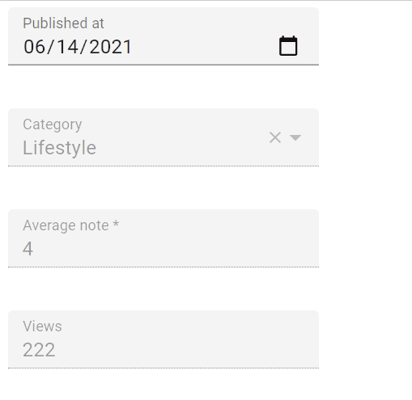
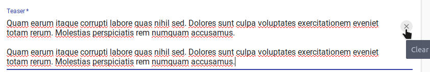
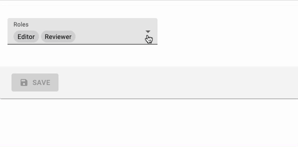

# Input Components

An `Input` component displays an input, or a dropdown list, a list of radio buttons, etc. Such components allow to edit a record property, and are common in the `<Edit>`, `<Create>`, and `<Filter>` views.

```jsx
// in src/posts.js
import React from 'react';
import { Edit, DisabledInput, LongTextInput, ReferenceInput, SelectInput, SimpleForm, TextInput } from 'react-admin';

export const PostEdit = (props) => (
    <Edit title={<PostTitle />} {...props}>
        <SimpleForm>
            <DisabledInput source="id" />
            <ReferenceInput label="User" source="userId" reference="users">
                <SelectInput optionText="name" />
            </ReferenceInput>
            <TextInput source="title" />
            <LongTextInput source="body" />
        </SimpleForm>
    </Edit>
);
```

All input components accept the following attributes:

* `source`: Property name of your entity to view/edit. This attribute is required.
* `defaultValue`: Value to be set when the property is `null` or `undefined`.
* `validate`: Validation rules for the current property (see the [Validation Documentation](./CreateEdit.md#validation))
* `label`: Used as a table header of an input label. Defaults to the `source` when omitted.
* `style`: A style object to customize the look and feel of the field container (e.g. the `<div>` in a form).
* `elStyle`: A style object to customize the look and feel of the field element itself

```jsx
<TextInput source="zb_title" label="Title" />
```

Additional props are passed down to the underlying component (usually a material-ui component). For instance, when setting the `fullWidth` prop on a `TextInput` component, the underlying material-ui `<TextField>` receives it, and goes full width.

**Tip**: If you edit a record with a complex structure, you can use a path as the `source` parameter. For instance, if the API returns the following 'book' record:

```jsx
{
    id: 1234,
    title: 'War and Peace',
    author: {
        firstName: 'Leo',
        lastName: 'Tolstoi'
    }
}
```

Then you can display a text input to edit the author first name as follows:

```jsx
<TextInput source="author.firstName" />
```

**Tip**: If your interface has to support multiple languages, don't use the `label` prop, and put the localized labels in a dictionary instead. See the [Translation documentation](./Translation.md#translating-resource-and-field-names) for details.

## `<ArrayInput>`

To edit arrays of data embedded inside a record, `<ArrayInput>` creates a list of sub-forms. 

```jsx
import { ArrayInput, SimpleFormIterator, DateInput, TextInput } from 'react-admin';

<ArrayInput source="backlinks">
    <SimpleFormIterator>
        <DateInput source="date" />
        <TextInput source="url" />
    </SimpleFormIterator>
</ArrayInput>
```


 `<ArrayInput>` allows editing of embedded arrays, like the `backlinks` field in the following `post` record:

```js
{
  id: 123
  backlinks: [
        {
            date: '2012-08-10T00:00:00.000Z',
            url: 'http://example.com/foo/bar.html',
        },
        {
            date: '2012-08-14T00:00:00.000Z',
            url: 'https://blog.johndoe.com/2012/08/12/foobar.html',
        }
   ]
}
```

`<ArrayInput>` expects a single child, which must be a *form iterator* component. A form iterator is a component accepting a `fields` object as passed by [redux-form's `<FieldArray>` component](https://redux-form.com/7.3.0/examples/fieldarrays/), and defining a layout for an array of fields. For instance, the `<SimpleFormIterator>` component displays an array of fields in an unordered list (`<ul>`), one sub-form by list item (`<li>`). It also provides controls for adding and removing a sub-record (a backlink in this example).

You can pass `disableAdd` and `disableRemove` as props of `SimpleFormIterator`, to disable `ADD` and `REMOVE` button respectively. Default value of both is `false`.

```jsx
import { ArrayInput, SimpleFormIterator, DateInput, TextInput } from 'react-admin';

<ArrayInput source="backlinks">
    <SimpleFormIterator disableRemove >
        <DateInput source="date" />
        <TextInput source="url" />
    </SimpleFormIterator>
</ArrayInput>
```

## `<AutocompleteInput>`

To let users choose a value in a list using a dropdown with autocompletion, use `<AutocompleteInput>`. It renders using [react-autosuggest](http://react-autosuggest.js.org/) and a `fuzzySearch` filter. Set the `choices` attribute to determine the options list (with `id`, `name` tuples).

```jsx
import { AutocompleteInput } from 'react-admin';

<AutocompleteInput source="category" choices={[
    { id: 'programming', name: 'Programming' },
    { id: 'lifestyle', name: 'Lifestyle' },
    { id: 'photography', name: 'Photography' },
]} />
```

You can also customize the properties to use for the option name and value, thanks to the `optionText` and `optionValue` attributes:

```jsx
const choices = [
    { _id: 123, full_name: 'Leo Tolstoi', sex: 'M' },
    { _id: 456, full_name: 'Jane Austen', sex: 'F' },
];
<AutocompleteInput source="author_id" choices={choices} optionText="full_name" optionValue="_id" />
```

`optionText` also accepts a function, so you can shape the option text at will:

```jsx
const choices = [
   { id: 123, first_name: 'Leo', last_name: 'Tolstoi' },
   { id: 456, first_name: 'Jane', last_name: 'Austen' },
];
const optionRenderer = choice => `${choice.first_name} ${choice.last_name}`;
<AutocompleteInput source="author_id" choices={choices} optionText={optionRenderer} />
```

The choices are translated by default, so you can use translation identifiers as choices:

```jsx
const choices = [
   { id: 'M', name: 'myroot.gender.male' },
   { id: 'F', name: 'myroot.gender.female' },
];
```

However, in some cases (e.g. inside a `<ReferenceInput>`), you may not want the choice to be translated. In that case, set the `translateChoice` prop to false.

```jsx
<AutocompleteInput source="gender" choices={choices} translateChoice={false}/>
```

By default the component matches choices with the current input searchText: if it finds a match, this choice will be selected. For example, given the choices `[{ id: 'M', name: 'Male', id: 'F', name: 'Female' }]`, when the user enters the text `male`, then the component will set the input value to `M`. If you need to change how choices are matched, pass a custom function as `inputValueMatcher` prop. For example, given the choices: `[{id:1,iso2:'NL',name:'Dutch'},{id:2,iso2:'EN',name:'English'},{id:3,iso2:'FR',name:'French'}]`, if you want to match choices on the iso2 code, you can create the following `inputValueMatcher` function: 

```javascript
<AutocompleteInput inputValueMatcher={
    (input, suggestion, getOptionText) => 
        input.toUpperCase().trim() === suggestion.iso2 || 
        input.toLowerCase().trim() === getOptionText(suggestion).toLowerCase().trim()
}/>
```

If you want to limit the initial choices shown to the current value only, you can set the `limitChoicesToValue` prop.  

Lastly, `<AutocompleteInput>` renders a meterial-ui `<TextField>` component. Use the `options` attribute to override any of the `<TextField>` attributes:


```jsx
<AutocompleteInput source="category" options={{
    fullWidth: true,
}} />
```


**Tip**: If you want to populate the `choices` attribute with a list of related records, you should decorate `<AutocompleteInput>` with [`<ReferenceInput>`](#referenceinput), and leave the `choices` empty:

```jsx
import { AutocompleteInput, ReferenceInput } from 'react-admin'

<ReferenceInput label="Post" source="post_id" reference="posts">
    <AutocompleteInput optionText="title" />
</ReferenceInput>
```

**Tip**: `<AutocompleteInput>` is a stateless component, so it only allows to *filter* the list of choices, not to *extend* it. If you need to populate the list of choices based on the result from a `fetch` call (and if [`<ReferenceInput>`](#referenceinput) doesn't cover your need), you'll have to [write your own Input component](#writing-your-own-input-component) based on material-ui `<AutoComplete>` component.

**Tip**: React-admin's `<AutocompleteInput>` has only a capital A, while material-ui's `<AutoComplete>` has a capital A and a capital C. Don't mix up the components!

### Properties

| Prop | Required | Type | Default | Description |
| ---|---|---|---|--- |
| `choices` | Required | `Object[]` | - | List of items to autosuggest |
| `resource` | Required | `string` | - | The resource working on. This field is passed down by wrapped components like `Create` and `Edit`.   |
| `source` | Required |  `string` | - | Name of field to edit, its type should match the type retrieved from `optionValue`  |
| `allowEmpty` | Optional | `boolean` | `false` | If `false` and the searchText typed did not match any suggestion, the searchText will revert to the current value when the field is blurred. If `true` and the `searchText` is set to `''` then the field will set the input value to `null`. |
| `inputValueMatcher` | Optional | `Function` | `(input, suggestion, getOptionText) => input.toLowerCase().trim() === getOptionText(suggestion).toLowerCase().trim()` | Allows to define how choices are matched with the searchText while typing.    |
| `optionValue` | Optional | `string` | `id` | Fieldname of record containing the value to use as input value  |
| `optionText` | Optional | <code>string &#124; Function</code> | `name` | Fieldname of record to display in the suggestion item or function which accepts the currect record as argument (`(record)=> {string}`) |
| `setFilter` | Optional | `Function` | null | A callback to inform the `searchText` has changed and new `choices` can be retrieved based on this `searchText`. Signature `searchText => void`. This function is automatically setup when using `ReferenceInput`.  |
| `suggestionComponent` | Optional | Function | `({ suggestion, query, isHighlighted, props }) => <div {...props} />` | Allows to override how the item is rendered.  |

## `<BooleanInput>` and `<NullableBooleanInput>`

`<BooleanInput />` is a toggle button allowing you to attribute a `true` or `false` value to a record field.

```jsx
import { BooleanInput } from 'react-admin';

<BooleanInput label="Commentable" source="commentable" />
```


This input does not handle `null` values. You would need the `<NullableBooleanInput />` component if you have to handle non-set booleans.

You can use the `options` prop to pass any option supported by the Material UI `Switch` components. For example, here's how to set a custom checked icon:


```jsx
import { BooleanInput } from 'react-admin';
import FavoriteIcon from '@material-ui/icons/Favorite';

<BooleanInput
    source="favorite"
    options={{
        checkedIcon: <FavoriteIcon />,
    }}
/>
```



Refer to [Material UI Switch documentation](http://www.material-ui.com/#/components/switch) for more details.

`<NullableBooleanInput />` renders as a dropdown list, allowing to choose between true, false, and null values.

```jsx
import { NullableBooleanInput } from 'react-admin';

<NullableBooleanInput label="Commentable" source="commentable" />
```


## `<CheckboxGroupInput>`

If you want to let the user choose multiple values among a list of possible values by showing them all, `<CheckboxGroupInput>` is the right component. Set the `choices` attribute to determine the options (with `id`, `name` tuples):

```jsx
import { CheckboxGroupInput } from 'react-admin';

<CheckboxGroupInput source="category" choices={[
    { id: 'programming', name: 'Programming' },
    { id: 'lifestyle', name: 'Lifestyle' },
    { id: 'photography', name: 'Photography' },
]} />
```


You can also customize the properties to use for the option name and value, thanks to the `optionText` and `optionValue` attributes:

```jsx
const choices = [
    { _id: 123, full_name: 'Leo Tolstoi', sex: 'M' },
    { _id: 456, full_name: 'Jane Austen', sex: 'F' },
];
<CheckboxGroupInput source="author_id" choices={choices} optionText="full_name" optionValue="_id" />
```

`optionText` also accepts a function, so you can shape the option text at will:

```jsx
const choices = [
   { id: 123, first_name: 'Leo', last_name: 'Tolstoi' },
   { id: 456, first_name: 'Jane', last_name: 'Austen' },
];
const optionRenderer = choice => `${choice.first_name} ${choice.last_name}`;
<CheckboxGroupInput source="author_id" choices={choices} optionText={optionRenderer} />
```

`optionText` also accepts a React Element, that will be cloned and receive the related choice as the `record` prop. You can use Field components there.

```jsx
const choices = [
   { id: 123, first_name: 'Leo', last_name: 'Tolstoi' },
   { id: 456, first_name: 'Jane', last_name: 'Austen' },
];
const FullNameField = ({ record }) => <span>{record.first_name} {record.last_name}</span>;
<CheckboxGroupInput source="gender" choices={choices} optionText={<FullNameField />}/>
```

The choices are translated by default, so you can use translation identifiers as choices:

```jsx
const choices = [
    { id: 'programming', name: 'myroot.category.programming' },
    { id: 'lifestyle', name: 'myroot.category.lifestyle' },
    { id: 'photography', name: 'myroot.category.photography' },
];
```

However, in some cases (e.g. inside a `<ReferenceInput>`), you may not want the choice to be translated. In that case, set the `translateChoice` prop to false.

```jsx
<CheckboxGroupInput source="gender" choices={choices} translateChoice={false}/>
```

Lastly, use the `options` attribute if you want to override any of Material UI's `<Checkbox>` attributes:


```jsx
<CheckboxGroupInput source="category" options={{
    labelPosition: 'right'
}} />
```


Refer to [Material UI Checkbox documentation](http://www.material-ui.com/#/components/checkbox) for more details.

## `<DateInput>`

Ideal for editing dates, `<DateInput>` renders a standard browser [Date Picker](http://www.material-ui.com/#/components/date-picker).

```jsx
import { DateInput } from 'react-admin';

<DateInput source="published_at" />
```



## `<DisabledInput>`

When you want to display a record property in an `<Edit>` form without letting users update it (such as for auto-incremented primary keys), use the `<DisabledInput>`:

```jsx
import { DisabledInput } from 'react-admin';

<DisabledInput source="id" />
```


**Tip**: To add non-editable fields to the `<Edit>` view, you can also use one of react-admin `Field` components:

```jsx
// in src/posts.js
import { Edit, LongTextInput, SimpleForm, TextField } from 'react-admin';

export const PostEdit = (props) => (
    <Edit {...props}>
        <SimpleForm>
            <TextField source="title" /> {/* NOT EDITABLE */}
            <LongTextInput source="body" />
        </SimpleForm>
    </Edit>
);
```

**Tip**: You can even use a component of your own, provided it accepts a `record` prop:

```jsx
// in src/posts.js
import { Edit, Labeled, LongTextInput, SimpleForm } from 'react-admin';

const titleStyle = { textOverflow: 'ellipsis', overflow: 'hidden', maxWidth: '20em' };
const Title = ({ record, label }) => (
    <Labeled label={label}>
        <span style={titleStyle}>{record.title}</span>
    </Labeled>
);

export const PostEdit = (props) => (
    <Edit {...props}>
        <SimpleForm>
            <Title label="Title" />
            <LongTextInput source="body" />
        </SimpleForm>
    </Edit>
);
```

## `<ImageInput>`

`<ImageInput>` allows to upload some pictures using [react-dropzone](https://github.com/okonet/react-dropzone).


Previews are enabled using `<ImageInput>` children, as following:

```jsx
<ImageInput source="pictures" label="Related pictures" accept="image/*">
    <ImageField source="src" title="title" />
</ImageInput>
```

Writing a custom field component for displaying the current value(s) is easy:  it's a standard [field](./Fields.md#writing_your_own_field_component).

When receiving **new** files, `ImageInput` will add a `rawFile` property to the object passed as the `record` prop of children. This `rawFile` is the [File](https://developer.mozilla.org/en-US/docs/Web/API/File) instance of the newly added file. This can be useful to display informations about size or mimetype inside a custom field.

The `ImageInput` component accepts an `options` prop into which you can pass all the [react-dropzone properties](https://react-dropzone.netlify.com/#proptypes). However, some of the most useful props should be passed **directly** on the `ImageInput`: `maxSize`, `minSize`, `multiple`.

If the default Dropzone label doesn't fit with your need, you can pass a `placeholder` attribute to overwrite it. The attribute can be anything React can render (`PropTypes.node`):

```jsx
<ImageInput source="pictures" label="Related pictures" accept="image/*" placeholder={<p>Drop your file here</p>}>
    <ImageField source="src" title="title" />
</ImageInput>
```

Note that the image upload returns a [File](https://developer.mozilla.org/en/docs/Web/API/File) object. It is your responsibility to handle it depending on your API behavior. You can for instance encode it in base64, or send it as a multi-part form data. Check [this example](./DataProviders.md#decorating-your-rest-client-example-of-file-upload) for base64 encoding data by extending the REST Client.

## `<FileInput>`

`<FileInput>` allows to upload some files using [react-dropzone](https://github.com/okonet/react-dropzone).


Previews (actually a simple list of files names) are enabled using `<FileInput>` children, as following:

```jsx
<FileInput source="files" label="Related files" accept="application/pdf">
    <FileField source="src" title="title" />
</FileInput>
```

Writing a custom field component for displaying the current value(s) is easy:  it's a standard [field](./Fields.md#writing_your_own_field_component).

When receiving **new** files, `FileInput` will add a `rawFile` property to the object passed as the `record` prop of children. This `rawFile` is the [File](https://developer.mozilla.org/en-US/docs/Web/API/File) instance of the newly added file. This can be useful to display informations about size or mimetype inside a custom field.

The `FileInput` component accepts an `options` prop into which you can pass all the [react-dropzone properties](https://react-dropzone.netlify.com/#proptypes). However, some of the most useful props should be passed **directly** on the `FileInput`: `maxSize`, `minSize`, `multiple`.

If the default Dropzone label doesn't fit with your need, you can pass a `placeholder` attribute to overwrite it. The attribute can be anything React can render (`PropTypes.node`):

```jsx
<FileInput source="files" label="Related files" accept="application/pdf" placeholder={<p>Drop your file here</p>}>
    <ImageField source="src" title="title" />
</FileInput>
```

Note that the file upload returns a [File](https://developer.mozilla.org/en/docs/Web/API/File) object. It is your responsibility to handle it depending on your API behavior. You can for instance encode it in base64, or send it as a multi-part form data. Check [this example](./DataProviders.md#decorating-your-rest-client-example-of-file-upload) for base64 encoding data by extending the REST Client.

## `<LongTextInput>`

`<LongTextInput>` is the best choice for multiline text values. It renders as an auto expandable textarea.

```jsx
import { LongTextInput } from 'react-admin';

<LongTextInput source="teaser" />
```


You can make the `LongTextInput` component resettable using the `resettable` prop. This will add a reset button which will be displayed only when the field has a value and is focused.

```jsx
import { LongTextInput } from 'react-admin';

<LongTextInput source="title" resettable />
```




## `<NumberInput>`

`<NumberInput>` translates to a HTML `<input type="number">`. It is necessary for numeric values because of a [known React bug](https://github.com/facebook/react/issues/1425), which prevents using the more generic [`<TextInput>`](#textinput) in that case.

```jsx
import { NumberInput } from 'react-admin';

<NumberInput source="nb_views" />
```

You can customize the `step` props (which defaults to "any"):

```jsx
<NumberInput source="nb_views" step={1} />
```

## `<RadioButtonGroupInput>`

If you want to let the user choose a value among a list of possible values by showing them all (instead of hiding them behind a dropdown list, as in [`<SelectInput>`](#selectinput)), `<RadioButtonGroupInput>` is the right component. Set the `choices` attribute to determine the options (with `id`, `name` tuples):

```jsx
import { RadioButtonGroupInput } from 'react-admin';

<RadioButtonGroupInput source="category" choices={[
    { id: 'programming', name: 'Programming' },
    { id: 'lifestyle', name: 'Lifestyle' },
    { id: 'photography', name: 'Photography' },
]} />
```


You can also customize the properties to use for the option name and value, thanks to the `optionText` and `optionValue` attributes:

```jsx
const choices = [
    { _id: 123, full_name: 'Leo Tolstoi', sex: 'M' },
    { _id: 456, full_name: 'Jane Austen', sex: 'F' },
];
<RadioButtonGroupInput source="author_id" choices={choices} optionText="full_name" optionValue="_id" />
```

`optionText` also accepts a function, so you can shape the option text at will:

```jsx
const choices = [
   { id: 123, first_name: 'Leo', last_name: 'Tolstoi' },
   { id: 456, first_name: 'Jane', last_name: 'Austen' },
];
const optionRenderer = choice => `${choice.first_name} ${choice.last_name}`;
<RadioButtonGroupInput source="author_id" choices={choices} optionText={optionRenderer} />
```

`optionText` also accepts a React Element, that will be cloned and receive the related choice as the `record` prop. You can use Field components there.

```jsx
const choices = [
   { id: 123, first_name: 'Leo', last_name: 'Tolstoi' },
   { id: 456, first_name: 'Jane', last_name: 'Austen' },
];
const FullNameField = ({ record }) => <span>{record.first_name} {record.last_name}</span>;
<RadioButtonGroupInput source="gender" choices={choices} optionText={<FullNameField />}/>
```

The choices are translated by default, so you can use translation identifiers as choices:

```jsx
const choices = [
   { id: 'M', name: 'myroot.gender.male' },
   { id: 'F', name: 'myroot.gender.female' },
];
```

However, in some cases (e.g. inside a `<ReferenceInput>`), you may not want the choice to be translated. In that case, set the `translateChoice` prop to false.

```jsx
<RadioButtonGroupInput source="gender" choices={choices} translateChoice={false}/>
```

Lastly, use the `options` attribute if you want to override any of Material UI's `<RadioButtonGroup>` attributes:


```jsx
<RadioButtonGroupInput source="category" options={{
    labelPosition: 'right'
}} />
```


Refer to [Material UI RadioGroup documentation](http://www.material-ui.com/#/components/radio-button) for more details.

**Tip**: If you want to populate the `choices` attribute with a list of related records, you should decorate `<RadioButtonGroupInput>` with [`<ReferenceInput>`](#referenceinput), and leave the `choices` empty:

```jsx
import { RadioButtonGroupInput, ReferenceInput } from 'react-admin'

<ReferenceInput label="Author" source="author_id" reference="authors">
    <RadioButtonGroupInput optionText="last_name" />
</ReferenceInput>
```

## `<ReferenceArrayInput>`

Use `<ReferenceArrayInput>` to edit an array of reference values, i.e. to let users choose a list of values (usually foreign keys) from another REST endpoint.

`<ReferenceArrayInput>` fetches the related resources (using the `CRUD_GET_MANY` REST method) as well as possible resources (using the 
`CRUD_GET_MATCHING` REST method) in the reference endpoint.

For instance, if the post object has many tags, a post resource may look like:

```js
{
    id: 1234,
    tag_ids: [1, 23, 4]
}
```

Then `<ReferenceArrayInput>` would fetch a list of tag resources from these two calls:

```
http://myapi.com/tags?id=[1,23,4]
http://myapi.com/tags?page=1&perPage=25
```

Once it receives the deduplicated reference resources, this component delegates rendering to a subcomponent, to which it passes the possible choices as the `choices` attribute.

This means you can use `<ReferenceArrayInput>` with [`<SelectArrayInput>`](#selectarrayinput), or with the component of your choice, provided it supports the `choices` attribute.

The component expects a `source` and a `reference` attributes. For instance, to make the `tag_ids` for a `post` editable:

```js
import { ReferenceArrayInput, SelectArrayInput } from 'react-admin'

<ReferenceArrayInput source="tag_ids" reference="tags">
    <SelectArrayInput optionText="name" />
</ReferenceArrayInput>
```



**Note**: You **must** add a `<Resource>` for the reference resource - react-admin needs it to fetch the reference data. You can omit the list prop in this reference if you want to hide it in the sidebar menu.

```js
<Admin dataProvider={myDataProvider}>
    <Resource name="posts" list={PostList} edit={PostEdit} />
    <Resource name="tags" />
</Admin>
```

Set the `allowEmpty` prop when you want to add an empty choice with a value of null in the choices list.
Disabling `allowEmpty` does not mean that the input will be required. If you want to make the input required, you must add a validator as indicated in [Validation Documentation](./CreateEdit.md#validation). Enabling the `allowEmpty` props just adds an empty choice (with `null` value) on top of the options, and makes the value nullable.

```js
import { ReferenceArrayInput, SelectArrayInput } from 'react-admin'

<ReferenceArrayInput source="tag_ids" reference="tags" allowEmpty>
    <SelectArrayInput optionText="name" />
</ReferenceArrayInput>
```

**Tip**: `allowEmpty` is set by default for all Input components children of the `<Filter>` component

You can tweak how this component fetches the possible values using the `perPage`, `sort`, and `filter` props.


```js
// by default, fetches only the first 25 values. You can extend this limit
// by setting the `perPage` prop.
<ReferenceArrayInput
     source="tag_ids"
     reference="tags"
     perPage={100}>
    <SelectArrayInput optionText="name" />
</ReferenceArrayInput>

// by default, orders the possible values by id desc. You can change this order
// by setting the `sort` prop (an object with `field` and `order` properties).
<ReferenceArrayInput
     source="tag_ids"
     reference="tags"
     sort={{ field: 'title', order: 'ASC' }}>
    <SelectArrayInput optionText="name" />
</ReferenceArrayInput>

// you can filter the query used to populate the possible values. Use the
// `filter` prop for that.
<ReferenceArrayInput
     source="tag_ids"
     reference="tags"
     filter={{ is_published: true }}>
    <SelectArrayInput optionText="name" />
</ReferenceArrayInput>
```


## `<ReferenceInput>`

Use `<ReferenceInput>` for foreign-key values, for instance, to edit the `post_id` of a `comment` resource. This component fetches the possible values in the reference resource (using the `GET_LIST` REST method) and the referenced record (using the `GET_ONE` REST method), then delegates rendering to a subcomponent, to which it passes the possible choices as the `choices` attribute.

This means you can use `<ReferenceInput>` with any of [`<SelectInput>`](#selectinput), [`<AutocompleteInput>`](#autocompleteinput), or [`<RadioButtonGroupInput>`](#radiobuttongroupinput), or even with the component of your choice, provided it supports the `choices` attribute.

The component expects a `source` and a `reference` attributes. For instance, to make the `post_id` for a `comment` editable:

```jsx
import { ReferenceInput, SelectInput } from 'react-admin'

<ReferenceInput label="Post" source="post_id" reference="posts">
    <SelectInput optionText="title" />
</ReferenceInput>
```


**Note**: You **must** add a `<Resource>` for the reference resource - react-admin needs it to fetch the reference data. You *can* omit the `list` prop in this reference if you want to hide it in the sidebar menu.

```jsx
<Admin dataProvider={myDataProvider}>
    <Resource name="comments" list={CommentList} />
    <Resource name="posts" />
</Admin>
```

Set the `allowEmpty` prop when you want to add an empty choice with a value of null in the choices list.
Disabling `allowEmpty` does not mean that the input will be required. If you want to make the input required, you must add a validator as indicated in [Validation Documentation](./CreateEdit.md#validation). Enabling the `allowEmpty` props just adds an empty choice (with `null` value) on top of the options, and makes the value nullable.

```jsx
import { ReferenceInput, SelectInput } from 'react-admin'

<ReferenceInput label="Post" source="post_id" reference="posts" allowEmpty>
    <SelectInput optionText="title" />
</ReferenceInput>
```

**Tip**: `allowEmpty` is set by default for all Input components children of the `<Filter>` component:

```jsx
const CommentFilter = (props) => (
    <Filter {...props}>
        <ReferenceInput label="Post" source="post_id" reference="posts"> // no need for allowEmpty
            <SelectInput optionText="title" />
        </ReferenceInput>
    </Filter>
);
```

You can tweak how this component fetches the possible values using the `perPage`, `sort`, and `filter` props.


```jsx
// by default, fetches only the first 25 values. You can extend this limit
// by setting the `perPage` prop.
<ReferenceInput
     source="post_id"
     reference="posts"
     perPage={100}>
    <SelectInput optionText="title" />
</ReferenceInput>

// by default, orders the possible values by id desc. You can change this order
// by setting the `sort` prop (an object with `field` and `order` properties).
<ReferenceInput
     source="post_id"
     reference="posts"
     sort={{ field: 'title', order: 'ASC' }}>
    <SelectInput optionText="title" />
</ReferenceInput>

// you can filter the query used to populate the possible values. Use the
// `filter` prop for that.
<ReferenceInput
     source="post_id"
     reference="posts"
     filter={{ is_published: true }}>
    <SelectInput optionText="title" />
</ReferenceInput>
```


The child component may further filter results (that's the case, for instance, for `<AutocompleteInput>`). ReferenceInput passes a `setFilter` function as prop to its child component. It uses the value to create a filter for the query - by default `{ q: [searchText] }`. You can customize the mapping
`searchText => searchQuery` by setting a custom `filterToQuery` function prop:

```jsx
<ReferenceInput
     source="post_id"
     reference="posts"
     filterToQuery={searchText => ({ title: searchText })}>
    <SelectInput optionText="title" />
</ReferenceInput>
```

The child component receives the following props from `<ReferenceInput>`:

- `isLoading`: whether the request for possible values is loading or not
- `filter`: the current filter of the request for possible values. Defaults to `{}`.
- `pagination`: the current pagination of the request for possible values. Defaults to `{ page: 1, perPage: 25 }`.
- `sort`: the current sorting of the request for possible values. Defaults to `{ field: 'id', order: 'DESC' }`.
- `error`: the error message if the form validation failed for that input
- `warning`: the warning message if the form validation failed for that input
- `onChange`: function to call when the value changes
- `setFilter`: function to call to update the filter of the request for possible values
- `setPagination`: : function to call to update the pagination of the request for possible values
- `setSort`: function to call to update the sorting of the request for possible values

## `<RichTextInput>`

`<RichTextInput>` is the ideal component if you want to allow your users to edit some HTML contents. It
is powered by [Quill](https://quilljs.com/).

**Note**: Due to its size, `<RichTextInput>` is not bundled by default with react-admin. You must install it first, using npm:

```sh
npm install ra-input-rich-text
```

Then use it as a normal input component:

```jsx
import RichTextInput from 'ra-input-rich-text';

<RichTextInput source="body" />
```


You can customize the rich text editor toolbar using the `toolbar` attribute, as described on the [Quill official toolbar documentation](https://quilljs.com/docs/modules/toolbar/).

```jsx
<RichTextInput source="body" toolbar={[ ['bold', 'italic', 'underline', 'link'] ]} />
```

## `<SelectInput>`

To let users choose a value in a list using a dropdown, use `<SelectInput>`. It renders using [Material ui's `<SelectField>`](http://www.material-ui.com/#/components/select-field). Set the `choices` attribute to determine the options (with `id`, `name` tuples):

```jsx
import { SelectInput } from 'react-admin';

<SelectInput source="category" choices={[
    { id: 'programming', name: 'Programming' },
    { id: 'lifestyle', name: 'Lifestyle' },
    { id: 'photography', name: 'Photography' },
]} />
```


You can also customize the properties to use for the option name and value, thanks to the `optionText` and `optionValue` attributes:

```jsx
const choices = [
    { _id: 123, full_name: 'Leo Tolstoi', sex: 'M' },
    { _id: 456, full_name: 'Jane Austen', sex: 'F' },
];
<SelectInput source="author_id" choices={choices} optionText="full_name" optionValue="_id" />
```

`optionText` also accepts a function, so you can shape the option text at will:

```jsx
const choices = [
   { id: 123, first_name: 'Leo', last_name: 'Tolstoi' },
   { id: 456, first_name: 'Jane', last_name: 'Austen' },
];
const optionRenderer = choice => `${choice.first_name} ${choice.last_name}`;
<SelectInput source="author_id" choices={choices} optionText={optionRenderer} />
```

`optionText` also accepts a React Element, that will be cloned and receive the related choice as the `record` prop. You can use Field components there.

```jsx
const choices = [
   { id: 123, first_name: 'Leo', last_name: 'Tolstoi' },
   { id: 456, first_name: 'Jane', last_name: 'Austen' },
];
const FullNameField = ({ record }) => <span>{record.first_name} {record.last_name}</span>;
<SelectInput source="gender" choices={choices} optionText={<FullNameField />}/>
```

Enabling the `allowEmpty` props adds an empty choice (with `null` value) on top of the options, and makes the value nullable:

```jsx
<SelectInput source="category" allowEmpty choices={[
    { id: 'programming', name: 'Programming' },
    { id: 'lifestyle', name: 'Lifestyle' },
    { id: 'photography', name: 'Photography' },
]} />
```

The choices are translated by default, so you can use translation identifiers as choices:

```jsx
const choices = [
   { id: 'M', name: 'myroot.gender.male' },
   { id: 'F', name: 'myroot.gender.female' },
];
```

However, in some cases, you may not want the choice to be translated. In that case, set the `translateChoice` prop to false.

```jsx
<SelectInput source="gender" choices={choices} translateChoice={false}/>
```

Note that `translateChoice` is set to false when `<SelectInput>` is a child of `<ReferenceInput>`.

Lastly, use the `options` attribute if you want to override any of Material UI's `<SelectField>` attributes:


```jsx
<SelectInput source="category" options={{
    maxHeight: 200
}} />
```


Refer to [Material UI SelectField documentation](http://www.material-ui.com/#/components/select-field) for more details.

**Tip**: If you want to populate the `choices` attribute with a list of related records, you should decorate `<SelectInput>` with [`<ReferenceInput>`](#referenceinput), and leave the `choices` empty:

```jsx
import { SelectInput, ReferenceInput } from 'react-admin'

<ReferenceInput label="Author" source="author_id" reference="authors">
    <SelectInput optionText="last_name" />
</ReferenceInput>
```

If, instead of showing choices as a dropdown list, you prefer to display them as a list of radio buttons, try the [`<RadioButtonGroupInput>`](#radiobuttongroupinput). And if the list is too big, prefer the [`<AutocompleteInput>`](#autocompleteinput).

You can make the `SelectInput` component resettable using the `resettable` prop. This will add a reset button which will be displayed only when the field has a value.


## `<SelectArrayInput>`

To let users choose several values in a list using a dropdown, use `<SelectArrayInput>`. It renders using [Material ui's `<Select>`](http://www.material-ui.com/#/components/select). Set the `choices` attribute to determine the options (with `id`, `name` tuples):

```js
import { SelectArrayInput } from 'react-admin';

<SelectArrayInput label="Tags" source="categories" choices={[
    { id: 'music', name: 'Music' },
    { id: 'photography', name: 'Photo' },
    { id: 'programming', name: 'Code' },
    { id: 'tech', name: 'Technology' },
    { id: 'sport', name: 'Sport' },
]} />
```


You can also customize the properties to use for the option name and value,
thanks to the `optionText` and `optionValue` attributes.

```js
const choices = [
   { _id: '1', name: 'Book', plural_name: 'Books' },
   { _id: '2', name: 'Video', plural_name: 'Videos' },
   { _id: '3', name: 'Audio', plural_name: 'Audios' },
];
<SelectArrayInput source="categories" choices={choices} optionText="plural_name" optionValue="_id" />
```

`optionText` also accepts a function, so you can shape the option text at will:

```js
const choices = [
   { id: '1', name: 'Book', quantity: 23 },
   { id: '2', name: 'Video', quantity: 56 },
   { id: '3', name: 'Audio', quantity: 12 },
];
const optionRenderer = choice => `${choice.name} (${choice.quantity})`;
<SelectArrayInput source="categories" choices={choices} optionText={optionRenderer} />
```

The choices are translated by default, so you can use translation identifiers as choices:

```js
const choices = [
   { id: 'books', name: 'myroot.category.books' },
   { id: 'sport', name: 'myroot.category.sport' },
];
```

Lastly, use the `options` attribute if you want to override any of the `<Select>` attributes:


```js
<SelectArrayInput source="category" options={{ fullWidth: true }} />
```


Refer to [the Select documentation](http://www.material-ui.com/#/components/select) for more details.

The `SelectArrayInput` component **cannot** be used inside a `ReferenceInput` but can be used inside a `ReferenceArrayInput`.

```jsx
import React from 'react';
import {
    ChipField,
    Create,
    DateInput,
    LongTextInput,
    ReferenceArrayInput,
    SelectArrayInput,
    TextInput,
} from 'react-admin';

export const PostCreate = props => (
    <Create {...props}>
        <SimpleForm>
            <TextInput source="title" />
            <LongTextInput source="body" />
            <DateInput source="published_at" />

            <ReferenceArrayInput reference="tags" source="tags">
                <SelectArrayInput>
                    <ChipField source="name" />
                </SelectArrayInput>
            </ReferenceArrayInput>
        </SimpleForm>
    </Create>
);
```

**Tip**: As it does not provide autocompletion, the `SelectArrayInput` might not be suited when the referenced resource has a lot of items.

## `<TextInput>`

`<TextInput>` is the most common input. It is used for texts, emails, URL or passwords. In translates to an HTML `<input>` tag.

```jsx
import { TextInput } from 'react-admin';

<TextInput source="title" />
```


You can choose a specific input type using the `type` attribute, for instance `text` (the default), `email`, `url`, or `password`:

```jsx
<TextInput label="Email Address" source="email" type="email" />
```

You can make the `TextInput` component resettable using the `resettable` prop. This will add a reset button which will be displayed only when the field has a value and is focused.

```jsx
import { TextInput } from 'react-admin';

<TextInput source="title" resettable />
```


**Warning**: Do not use `type="number"`, or you'll receive a string as value (this is a [known React bug](https://github.com/facebook/react/issues/1425)). Instead, use [`<NumberInput>`](#numberinput).

## Transforming Input Value to/from Record

The data format returned by the input component may not be what your API desires. Since React-admin uses Redux Form, we can use its `parse()` and `format()` functions to transform the input value when saving to and loading from the record. It's better to understand the [input value's lifecycle](http://redux-form.com/6.5.0/docs/ValueLifecycle.md/) before you start.

Mnemonic for the two functions:
- `parse()`: input -> record
- `format()`: record -> input

Say the user would like to input values of 0-100 to a percentage field but your API (hence record) expects 0-1.0. You can use simple `parse()` and `format()` functions to archive the transform:

```jsx
<NumberInput source="percent" format={v => v*100} parse={v => v/100} label="Formatted number" />
```

`<DateInput>` stores and returns a string. If you would like to store a JavaScript Date object in your record instead:

```jsx
const dateFormatter = v => {
  // v is a `Date` object
  if (!(v instanceof Date) || isNaN(v)) return;
  const pad = '00';
  const yy = v.getFullYear().toString();
  const mm = (v.getMonth() + 1).toString();
  const dd = v.getDate().toString();
  return `${yy}-${(pad + mm).slice(-2)}-${(pad + dd).slice(-2)}`;
};

const dateParser = v => {
  // v is a string of "YYYY-MM-DD" format
  const match = /(\d{4})-(\d{2})-(\d{2})/.exec(v);
  if (match === null) return;
  const d = new Date(match[1], parseInt(match[2], 10) - 1, match[3]);
  if (isNaN(d)) return;
  return d;
};

<DateInput source="isodate" format={dateFormatter} parse={dateParser} />
```

## Third-Party Components

You can find components for react-admin in third-party repositories.

* [vascofg/react-admin-color-input](https://github.com/vascofg/react-admin-color-input): a color input using [React Color](http://casesandberg.github.io/react-color/), a collection of color pickers.
* [LoicMahieu/aor-tinymce-input](https://github.com/LoicMahieu/aor-tinymce-input): a TinyMCE component, useful for editing HTML
* [vascofg/react-admin-date-inputs](https://github.com/vascofg/react-admin-date-inputs): a collection of Date Inputs, based on [material-ui-pickers](https://material-ui-pickers.firebaseapp.com/)

## Writing Your Own Input Component

If you need a more specific input type, you can also write it yourself. You'll have to rely on redux-form's [`<Field>`](http://redux-form.com/6.5.0/docs/api/Field.md/) component, so as to handle the value update cycle.

For instance, let's write a component to edit the latitude and longitude of the current record:

```jsx
// in LatLongInput.js
import { Field } from 'redux-form';
const LatLngInput = () => (
    <span>
        <Field name="lat" component="input" type="number" placeholder="latitude" />
        &nbsp;
        <Field name="lng" component="input" type="number" placeholder="longitude" />
    </span>
);
export default LatLngInput;

// in ItemEdit.js
const ItemEdit = (props) => (
    <Edit {...props}>
        <SimpleForm>
            <LatLngInput />
        </SimpleForm>
    </Edit>
);
```

`LatLngInput` takes no props, because the `<Field>` component can access the current record via its context. The `name` prop serves as a selector for the record property to edit. All `Field` props except `name` and `component` are passed to the child component/element (an `<input>` in that example). Executing this component will render roughly the following code:

```html
<span>
    <input type="number" placeholder="longitude" value={record.lat} />
    <input type="number" placeholder="longitude" value={record.lng} />
</span>
```

**Tip**: The `<Field>` component supports dot notation in the `name` prop, to edit nested props:

```jsx
const LatLongInput = () => (
    <span>
        <Field name="position.lat" component="input" type="number" placeholder="latitude" />
        &nbsp;
        <Field name="position.lng" component="input" type="number" placeholder="longitude" />
    </span>
);
```

This component lacks a label. React-admin provides the `<Labeled>` component for that:

```jsx
// in LatLongInput.js
import { Field } from 'redux-form';
import { Labeled } from 'react-admin';

const LatLngInput = () => (
    <Labeled label="position">
        <span>
            <Field name="lat" component="input" type="number" placeholder="latitude" />
            &nbsp;
            <Field name="lng" component="input" type="number" placeholder="longitude" />
        </span>
    </Labeled>
);
export default LatLngInput;
```

Now the component will render with a label:

```html
<label>Position</label>
<span>
    <input type="number" placeholder="longitude" value={record.lat} />
    <input type="number" placeholder="longitude" value={record.lng} />
</span>
```

Instead of HTML `input` elements, you can use a material-ui component. To compose material-ui and `Field`, use a [field renderer function](http://redux-form.com/6.5.0/examples/material-ui/) to map the props:

```jsx
// in LatLongInput.js
import TextField from '@material-ui/core/TextField';
import { Field } from 'redux-form';
const renderTextField = ({ input, label, meta: { touched, error }, ...custom }) => (
    <TextField
        hintText={label}
        floatingLabelText={label}
        errorText={touched && error}
        {...input}
        {...custom}
    />
);
const LatLngInput = () => (
    <span>
        <Field name="lat" component={renderTextField} label="latitude" />
        &nbsp;
        <Field name="lng" component={renderTextField} label="longitude" />
    </span>
);
```

Material-ui's `<TextField>` component already includes a label, so you don't need to use `<Labeled>` in this case. `<Field>` injects two props to its child component: `input` and `meta`. To learn more about these props, please refer to [the `<Field>` component documentation](http://redux-form.com/6.5.0/docs/api/Field.md/#props) in the redux-form website.

**Tip**: If you only need one `<Field>` component in a custom input, you can let react-admin do the `<Field>` decoration for you by using the `addField` Higher-order component:

```jsx
// in SexInput.js
import SelectField from '@material-ui/core/SelectField';
import MenuItem from '@material-ui/core/MenuItem';
import { addField } from 'react-admin';

const SexInput = ({ input, meta: { touched, error } }) => (
    <SelectField
        floatingLabelText="Sex"
        errorText={touched && error}
        {...input}
    >
        <MenuItem value="M" primaryText="Male" />
        <MenuItem value="F" primaryText="Female" />
    </SelectField>
);
export default addField(SexInput); // decorate with redux-form's <Field>

// equivalent of
import SelectField from '@material-ui/core/SelectField';
import MenuItem from '@material-ui/core/MenuItem';
import { Field } from 'redux-form';

const renderSexInput = ({ input, meta: { touched, error } }) => (
    <SelectField
        floatingLabelText="Sex"
        errorText={touched && error}
        {...input}
    >
        <MenuItem value="M" primaryText="Male" />
        <MenuItem value="F" primaryText="Female" />
    </SelectField>
);
const SexInput = ({ source }) => <Field name={source} component={renderSexInput} />
export default SexInput;
```

For more details on how to use redux-form's `<Field>` component, please refer to [the redux-form doc](http://redux-form.com/6.5.0/docs/api/Field.md/).

Instead of HTML `input` elements or material-ui components, you can use react-admin input components, like `<NumberInput>` for instance. React-admin components are already decorated by `<Field>`, and already include a label, so you don't need either `<Field>` or `<Labeled>` when using them:

```jsx
// in LatLongInput.js
import { NumberInput } from 'react-admin';
const LatLngInput = () => (
    <span>
        <NumberInput source="lat" label="latitude" />
        &nbsp;
        <NumberInput source="lng" label="longitude" />
    </span>
);
export default LatLngInput;

// in ItemEdit.js
const ItemEdit = (props) => (
    <Edit {...props}>
        <SimpleForm>
            <DisabledInput source="id" />
            <LatLngInput />
        </SimpleForm>
    </Edit>
);
```

## Linking Two Inputs

Edition forms often contain linked inputs, e.g. country and city (the choices of the latter depending on the value of the former).

React-admin relies on redux-form, so you can grab the current form values using redux-form [formValueSelector()](https://redux-form.com/7.3.0/docs/api/formvalueselector.md/). Alternatively, you can use the react-admin `<FormDataConsumer>` component, which grabs the form values, and passes them to a child function.

This facilitates the implementation of linked inputs:

```jsx
import { FormDataConsumer } from 'react-admin';

const OrderEdit = (props) => (
    <Edit {...props}>
        <SimpleForm>
            <SelectInput source="country" choices={countries} />
            <FormDataConsumer>
                {({ formData, ...rest }) =>
                     <SelectInput 
                         source="city"
                         choices={getCitiesFor(formData.country)}
                         {...rest}
                     />
                }
            </FormDataConsumer>
        </SimpleForm>
    </Edit>
); 
```

**Tip**: When using a `FormDataConsumer` inside an `ArrayInput`, the `FormDataConsumer` will provide two additional properties to its children function:

- `scopedFormData`: an object containing the current values of the currently rendered item from the `ArrayInput`
- `getSource`: a function which will translate the source into a valid one for the `ArrayInput`

```jsx
import { FormDataConsumer } from 'react-admin';

const PostEdit = (props) => (
    <Edit {...props}>
        <SimpleForm>
            <ArrayInput source="authors">
                <SimpleFormIterator>
                    <TextInput source="name" />

                    <FormDataConsumer>
                        {({
                            formData, // The whole form data
                            scopedFormData, // The data for this item of the ArrayInput
                            getSource, // A function to get the valid source inside an ArrayInput
                            ...rest,
                        }) =>
                            scopedFormData.name ? (
                                <SelectInput
                                    source={getSource('role')} // Will translate to "authors[0].role"
                                    choices={['main', 'coauthor']}
                                    {...rest}
                                />
                            ) : null
                        }
                    </FormDataConsumer>
                </SimpleFormIterator>
            </ArrayInput>
        </SimpleForm>
    </Edit>
);
```

## Hiding Inputs Based On Other Inputs

You may want to display or hide inputs base on the value of another input - for instance, show an `email` input only if the `hasEmail` boolean input is ticked to `true`.

For such cases, you can use the approach described above, using the `<FormDataConsumer>` component.

```jsx
import { FormDataConsumer } from 'react-admin';

 const PostEdit = (props) => (
     <Edit {...props}>
         <SimpleForm>
             <BooleanInput source="hasEmail" />
             <FormDataConsumer>
                 {({ formData, ...rest }) => formData.hasEmail &&
                      <TextInput source="email" {...rest} />
                 }
             </FormDataConsumer>
         </SimpleForm>
     </Edit>
 ); 
```
