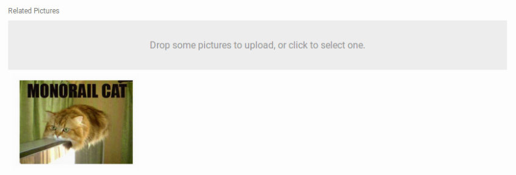
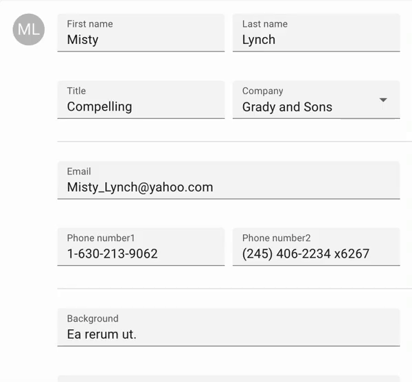

# Input Components

An `Input` component displays an input, or a dropdown list, a list of radio buttons, etc. Such components allow to edit a record property, and are common in the `<Edit>`, `<Create>`, and `<Filter>` views.

```js
// in src/posts.js
import React from 'react';
import { Edit, DisabledInput, LongTextInput, ReferenceInput, SelectInput, SimpleForm, TextInput } from 'admin-on-rest';

export const PostEdit = (props) => (
    <Edit title={PostTitle} {...props}>
        <SimpleForm>
            <DisabledInput source="id" />
            <ReferenceInput label="User" source="userId" reference="users">
                <SelectInput optionText="name" />
            </ReferenceInput>
            <TextInput source="title" />
            <LongTextInput source="body" />
        </SimpleForm>
    </Edit>
);
```

All input components accept the following attributes:

* `source`: Property name of your entity to view/edit. This attribute is required.
* `defaultValue`: Value to be set when the property is `null` or `undefined`.
* `validation`: Validation rules for the current property (see the [Validation Documentation](./CreateEdit.html#validation))
* `label`: Used as a table header of an input label. Defaults to the `source` when omitted.
* `style`: A style object to customize the look and feel of the field container (e.g. the `<div>` in a form).
* `elStyle`: A style object to customize the look and feel of the field element itself

Some other props are progressively implemented. The `<TextInput />` and `<NumberInput />` inputs also accept following props:

* `onBlur`: a function to call when the form field loses focus. It expects to either receive the [React SyntheticEvent](https://facebook.github.io/react/docs/events.html), or the current value of the field.
* `onChange`: a function to call when the form field is changed. It expects to either receive the [React SyntheticEvent](https://facebook.github.io/react/docs/events.html), or the new value of the field.
* `onFocus`: a function to call when the field receives focus. It takes the `event` as argument.

```js
<TextInput source="zb_title" label="Title" />
```

**Tip**: If you edit a record with a complex structure, you can use a path as the `source` parameter. For instance, if the API returns the following 'book' record:

```js
{
    id: 1234,
    title: 'War and Peace',
    author: {
        firstName: 'Leo',
        lastName: 'Tolstoi'
    }
}
```

Then you can display a text input to edit the author first name as follows:

```js
<TextInput source="author.firstName" />
```

**Tip**: If your interface has to support multiple languages, don't use the `label` prop, and put the localized labels in a dictionary instead. See the [Translation documentation](./Translation.html#translating-resource-and-field-names) for details.

## `<AutocompleteInput>`

To let users choose a value in a list using a dropdown with autocompletion, use `<AutocompleteInput>`. It renders using [Material ui's `<AutoComplete>` component](http://www.material-ui.com/#/components/auto-complete) and a `fuzzySearch` filter. Set the `choices` attribute to determine the options list (with `id`, `name` tuples).

```js
import { AutocompleteInput } from 'admin-on-rest';

<AutocompleteInput source="category" choices={[
    { id: 'programming', name: 'Programming' },
    { id: 'lifestyle', name: 'Lifestyle' },
    { id: 'photography', name: 'Photography' },
]} />
```

You can also customize the properties to use for the option name and value, thanks to the `optionText` and `optionValue` attributes:

```js
const choices = [
    { _id: 123, full_name: 'Leo Tolstoi', sex: 'M' },
    { _id: 456, full_name: 'Jane Austen', sex: 'F' },
];
<AutocompleteInput source="author_id" choices={choices} optionText="full_name" optionValue="_id" />
```

`optionText` also accepts a function, so you can shape the option text at will:

```js
const choices = [
   { id: 123, first_name: 'Leo', last_name: 'Tolstoi' },
   { id: 456, first_name: 'Jane', last_name: 'Austen' },
];
const optionRenderer = choice => `${choice.first_name} ${choice.last_name}`;
<AutocompleteInput source="author_id" choices={choices} optionText={optionRenderer} />
```

You can customize the `filter` function used to filter the results. By default, it's `AutoComplete.fuzzyFilter`, but you can use any of [the functions provided by `AutoComplete`](http://www.material-ui.com/#/components/auto-complete), or a function of your own (`(searchText: string, key: string) => boolean`):

```js
import { AutocompleteInput } from 'admin-on-rest';
import AutoComplete from 'material-ui/AutoComplete';

<AutocompleteInput source="category" filter={AutoComplete.caseInsensitiveFilter} choices={choices} />
```

Lastly, use the `options` attribute if you want to override any of Material UI's `<AutoComplete>` attributes:


```js
<AutocompleteInput source="category" options={{
    fullWidth: true,
    filter: AutoComplete.fuzzyFilter,
}} />
```


Refer to [Material UI Autocomplete documentation](http://www.material-ui.com/#/components/auto-complete) for more details.

**Tip**: If you want to populate the `choices` attribute with a list of related records, you should decorate `<AutocompleteInput>` with [`<ReferenceInput>`](#referenceinput), and leave the `choices` empty:

```js
import { AutocompleteInput, ReferenceInput } from 'admin-on-rest'

<ReferenceInput label="Post" source="post_id" reference="posts">
    <AutocompleteInput optionText="title" />
</ReferenceInput>
```

**Tip**: `<AutocompleteInput>` is a stateless component, so it only allows to *filter* the list of choices, not to *extend* it. If you need to populate the list of choices based on the result from a `fetch` call (and if [`<ReferenceInput>`](#referenceinput) doesn't cover your need), you'll have to [write your own Input component](#writing-your-own-input-component) based on material-ui `<AutoComplete>` component.

**Tip**: Admin-on-rest's `<AutocompleteInput>` has only a capital A, while material-ui's `<AutoComplete>` has a capital A and a capital C. Don't mix up the components!

## `<BooleanInput>` and `<NullableBooleanInput>`

`<BooleanInput />` is a toggle button allowing you to attribute a `true` or `false` value to a record field.

``` js
import { BooleanInput } from 'admin-on-rest';

<BooleanInput label="Allow comments?" source="commentable" />
```


This input does not handle `null` values. You would need the `<NullableBooleanInput />` component if you have to handle non-set booleans.

`<NullableBooleanInput />` renders as a dropdown list, allowing to choose between true, false, and null values.

``` js
import { NullableBooleanInput } from 'admin-on-rest';

<NullableBooleanInput label="Allow comments?" source="commentable" />
```


## `<CheckboxGroupInput>`

If you want to let the user choose multiple values among a list of possible values by showing them all, `<CheckboxGroupInput>` is the right component. Set the `choices` attribute to determine the options (with `id`, `name` tuples):

```js
import { CheckboxGroupInput } from 'admin-on-rest';

<CheckboxGroupInput source="category" choices={[
    { id: 'programming', name: 'Programming' },
    { id: 'lifestyle', name: 'Lifestyle' },
    { id: 'photography', name: 'Photography' },
]} />
```


You can also customize the properties to use for the option name and value, thanks to the `optionText` and `optionValue` attributes:

```js
const choices = [
    { _id: 123, full_name: 'Leo Tolstoi', sex: 'M' },
    { _id: 456, full_name: 'Jane Austen', sex: 'F' },
];
<CheckboxGroupInput source="author_id" choices={choices} optionText="full_name" optionValue="_id" />
```

`optionText` also accepts a function, so you can shape the option text at will:

```js
const choices = [
   { id: 123, first_name: 'Leo', last_name: 'Tolstoi' },
   { id: 456, first_name: 'Jane', last_name: 'Austen' },
];
const optionRenderer = choice => `${choice.first_name} ${choice.last_name}`;
<CheckboxGroupInput source="author_id" choices={choices} optionText={optionRenderer} />
```

`optionText` also accepts a React Element, that will be cloned and receive the related choice as the `record` prop. You can use Field components there.

```js
const choices = [
   { id: 123, first_name: 'Leo', last_name: 'Tolstoi' },
   { id: 456, first_name: 'Jane', last_name: 'Austen' },
];
const FullNameField = ({ record }) => <span>{record.first_name} {record.last_name}</span>;
<CheckboxGroupInput source="gender" choices={choices} optionText={<FullNameField />}/>
```

Lastly, use the `options` attribute if you want to override any of Material UI's `<Checkbox>` attributes:


```js
<CheckboxGroupInput source="category" options={{
    labelPosition: 'right'
}} />
```


Refer to [Material UI Checkbox documentation](http://www.material-ui.com/#/components/checkbox) for more details.

## `<DateInput>`

Ideal for editing dates, `<DateInput>` renders a beautiful [Date Picker](http://www.material-ui.com/#/components/date-picker) with full localization support.

``` js
import { DateInput } from 'admin-on-rest';

<DateInput source="published_at" />
```


You can override any of Material UI's `<DatePicker>` attributes by setting the `options` attribute:


``` js
<DateInput source="published_at" options={{
    mode: 'landscape',
    minDate: new Date(),
    hintText: 'Choisissez une date',
    DateTimeFormat,
    okLabel: 'OK',
    cancelLabel: 'Annuler'
    locale: 'fr'
}} />
```


Refer to [Material UI Datepicker documentation](http://www.material-ui.com/#/components/date-picker) for more details.

## `<DisabledInput>`

When you want to display a record property in an `<Edit>` form without letting users update it (such as for auto-incremented primary keys), use the `<DisabledInput>`:

``` js
import { DisabledInput } from 'admin-on-rest';

<DisabledInput source="id" />
```


**Tip**: To add non-editable fields to the `<Edit>` view, you can also use one of admin-on-rest `Field` components:

```js
// in src/posts.js
import { Edit, LongTextInput, SimpleForm, TextField } from 'admin-on-rest';

export const PostEdit = (props) => (
    <Edit {...props}>
        <SimpleForm>
            <TextField source="title" /> {/* NOT EDITABLE */}
            <LongTextInput source="body" />
        </SimpleForm>
    </Edit>
);
```

**Tip**: You can even use a component of your own, provided it accepts a `record` prop:

```js
// in src/posts.js
import { Edit, LongTextInput, SimpleForm } from 'admin-on-rest';
const titleStyle = { textOverflow: 'ellipsis', overflow: 'hidden', maxWidth: '20em' };
const Title = ({ record }) => <span style={titleStyle}>{record.title}</span>;
Title.defaultProps = {
    addLabel: true,
};

export const PostEdit = (props) => (
    <Edit {...props}>
        <SimpleForm>
            <Title label="Title" />
            <LongTextInput source="body" />
        </SimpleForm>
    </Edit>
);
```

## `<ImageInput>`

`<ImageInput>` allows to upload some pictures using [react-dropzone](https://github.com/okonet/react-dropzone).



Previews are enabled using `<ImageInput>` children, as following:

``` js
<ImageInput source="pictures" label="Related pictures" accept="image/*">
    <ImageField source="src" title="title" />
</ImageInput>
```

This component accepts all [react-dropzone properties](https://github.com/okonet/react-dropzone#features), in addition to those of admin-on-rest. For instance, if you need to upload several images at once, just add the `multiple` DropZone attribute to your `<ImageInput />` field.

If the default Dropzone label don't fit with your need, you can pass a `placeholder` attribute to overwrite it. The attribute can be anything React can render (`React.PropTypes.node`):

``` js
<ImageInput source="pictures" label="Related pictures" accept="image/*" placeholder={<p>Drop your file here</p>}>
    <ImageField source="src" title="title" />
</ImageInput>
```

Note that the image upload returns a [File](https://developer.mozilla.org/en/docs/Web/API/File) object. It is your responsibility to handle it depending on your API behavior. You can for instance encode it in base64, or send it as a multi-part form data.

## `<LongTextInput>`

`<LongTextInput>` is the best choice for multiline text values. It renders as an auto expandable textarea.

``` js
import { LongTextInput } from 'admin-on-rest';

<LongTextInput source="teaser" />
```


## `<NumberInput>`

`<NumberInput>` translates to a HTMl `<input type="number">`. It is necessary for numeric values because of a [known React bug](https://github.com/facebook/react/issues/1425), which prevents using the more generic [`<TextInput>`](#textinput) in that case.

``` js
import { NumberInput } from 'admin-on-rest';

<NumberInput source="nb_views" />
```

You can customize the `step` props (which defaults to "any"):

``` js
<NumberInput source="nb_views" step={1} />
```

## `<RadioButtonGroupInput>`

If you want to let the user choose a value among a list of possible values by showing them all (instead of hiding them behind a dropdown list, as in [`<SelectInput>`](#selectinput)), `<RadioButtonGroupInput>` is the right component. Set the `choices` attribute to determine the options (with `id`, `name` tuples):

```js
import { RadioButtonGroupInput } from 'admin-on-rest';

<RadioButtonGroupInput source="category" choices={[
    { id: 'programming', name: 'Programming' },
    { id: 'lifestyle', name: 'Lifestyle' },
    { id: 'photography', name: 'Photography' },
]} />
```


You can also customize the properties to use for the option name and value, thanks to the `optionText` and `optionValue` attributes:

```js
const choices = [
    { _id: 123, full_name: 'Leo Tolstoi', sex: 'M' },
    { _id: 456, full_name: 'Jane Austen', sex: 'F' },
];
<RadioButtonGroupInput source="author_id" choices={choices} optionText="full_name" optionValue="_id" />
```

`optionText` also accepts a function, so you can shape the option text at will:

```js
const choices = [
   { id: 123, first_name: 'Leo', last_name: 'Tolstoi' },
   { id: 456, first_name: 'Jane', last_name: 'Austen' },
];
const optionRenderer = choice => `${choice.first_name} ${choice.last_name}`;
<RadioButtonGroupInput source="author_id" choices={choices} optionText={optionRenderer} />
```

`optionText` also accepts a React Element, that will be cloned and receive the related choice as the `record` prop. You can use Field components there.

```js
const choices = [
   { id: 123, first_name: 'Leo', last_name: 'Tolstoi' },
   { id: 456, first_name: 'Jane', last_name: 'Austen' },
];
const FullNameField = ({ record }) => <span>{record.first_name} {record.last_name}</span>;
<RadioButtonGroupInput source="gender" choices={choices} optionText={<FullNameField />}/>
```

Lastly, use the `options` attribute if you want to override any of Material UI's `<RadioButtonGroup>` attributes:


```js
<RadioButtonGroupInput source="category" options={{
    labelPosition: 'right'
}} />
```


Refer to [Material UI SelectField documentation](http://www.material-ui.com/#/components/radio-button) for more details.

**Tip**: If you want to populate the `choices` attribute with a list of related records, you should decorate `<RadioButtonGroupInput>` with [`<ReferenceInput>`](#referenceinput), and leave the `choices` empty:

```js
import { RadioButtonGroupInput, ReferenceInput } from 'admin-on-rest'

<ReferenceInput label="Author" source="author_id" reference="authors">
    <RadioButtonGroupInput optionText="last_name" />
</ReferenceInput>
```

## `<ReferenceInput>`

Use `<ReferenceInput>` for foreign-key values, i.e. to let users choose a value from another REST endpoint. This component fetches the possible values in the reference resource (using the `GET_LIST` REST method), then delegates rendering to a subcomponent, to which it passes the possible choices as the `choices` attribute.

This means you can use `<ReferenceInput>` with any of [`<SelectInput>`](#selectinput), [`<AutocompleteInput>`](#autocompleteinput), or [`<RadioButtonGroupInput>`](#radiobuttongroupinput), or even with the component of your choice, provided it supports the `choices` attribute.

The component expects a `source` and a `reference` attributes. For instance, to make the `post_id` for a `comment` editable:

```js
import { ReferenceInput, SelectInput } from 'admin-on-rest'

<ReferenceInput label="Post" source="post_id" reference="posts">
    <SelectInput optionText="title" />
</ReferenceInput>
```



Set the `allowEmpty` prop when the empty value is allowed.

```js
import { ReferenceInput, SelectInput } from 'admin-on-rest'

<ReferenceInput label="Post" source="post_id" reference="posts" allowEmpty>
    <SelectInput optionText="title" />
</ReferenceInput>
```

**Tip**: `allowEmpty` is set by default for all Input components children of the `<Filter>` component:

```js
const CommentFilter = (props) => (
    <Filter {...props}>
        <ReferenceInput label="Post" source="post_id" reference="posts"> // no need for allowEmpty
            <SelectInput optionText="title" />
        </ReferenceInput>
    </Filter>
);
```

You can tweak how this component fetches the possible values using the `perPage`, `sort`, and `filter` props.


```js
// by default, fetches only the first 25 values. You can extend this limit
// by setting the `perPage` prop.
<ReferenceInput
     source="post_id"
     reference="posts"
     perPage={100}>
    <SelectInput optionText="title" />
</ReferenceInput>

// by default, orders the possible values by id desc. You can change this order
// by setting the `sort` prop (an object with `field` and `order` properties).
<ReferenceInput
     source="post_id"
     reference="posts"
     sort={{ field: 'title', order: 'ASC' }}>
    <SelectInput optionText="title" />
</ReferenceInput>

// you can filter the query used to populate the possible values. Use the
// `filter` prop for that.
<ReferenceInput
     source="post_id"
     reference="posts"
     filter={{ is_published: true }}>
    <SelectInput optionText="title" />
</ReferenceInput>
```


The enclosed component may further filter results (that's the case, for instance, for `<AutocompleteInput>`). ReferenceInput passes a `setFilter` function as prop to its child component. It uses the value to create a filter for the query - by default `{ q: [searchText] }`. You can customize the mapping
`searchText => searchQuery` by setting a custom `filterToQuery` function prop:

```js
<ReferenceInput
     source="post_id"
     reference="posts"
     filterToQuery={searchText => ({ title: searchText })}>
    <SelectInput optionText="title" />
</ReferenceInput>
```

## `<RichTextInput>`

`<RichTextInput>` is the ideal component if you want to allow your users to edit some HTML contents. It
is powered by [Quill](https://quilljs.com/).

**Note**: Due to its size, `<RichTextInput>` is not bundled by default with admin-on-rest. You must install it first, using npm:

```sh
npm install aor-rich-text-input --save
```

Then use it as a normal input component:

``` js
import RichTextInput from 'aor-rich-text-input';

<RichTextInput source="body" />
```


You can customize the rich text editor toolbar using the `toolbar` attribute, as described on the [Quill official toolbar documentation](https://quilljs.com/docs/modules/toolbar/).

```js
<RichTextInput source="body" toolbar={[ ['bold', 'italic', 'underline', 'link'] ]} />
```

## `<SelectInput>`

To let users choose a value in a list using a dropdown, use `<SelectInput>`. It renders using [Material ui's `<SelectField>`](http://www.material-ui.com/#/components/select-field). Set the `choices` attribute to determine the options (with `id`, `name` tuples):

```js
import { SelectInput } from 'admin-on-rest';

<SelectInput source="category" choices={[
    { id: 'programming', name: 'Programming' },
    { id: 'lifestyle', name: 'Lifestyle' },
    { id: 'photography', name: 'Photography' },
]} />
```


You can also customize the properties to use for the option name and value, thanks to the `optionText` and `optionValue` attributes:

```js
const choices = [
    { _id: 123, full_name: 'Leo Tolstoi', sex: 'M' },
    { _id: 456, full_name: 'Jane Austen', sex: 'F' },
];
<SelectInput source="author_id" choices={choices} optionText="full_name" optionValue="_id" />
```

`optionText` also accepts a function, so you can shape the option text at will:

```js
const choices = [
   { id: 123, first_name: 'Leo', last_name: 'Tolstoi' },
   { id: 456, first_name: 'Jane', last_name: 'Austen' },
];
const optionRenderer = choice => `${choice.first_name} ${choice.last_name}`;
<SelectInput source="author_id" choices={choices} optionText={optionRenderer} />
```

`optionText` also accepts a React Element, that will be cloned and receive the related choice as the `record` prop. You can use Field components there.

```js
const choices = [
   { id: 123, first_name: 'Leo', last_name: 'Tolstoi' },
   { id: 456, first_name: 'Jane', last_name: 'Austen' },
];
const FullNameField = ({ record }) => <span>{record.first_name} {record.last_name}</span>;
<SelectInput source="gender" choices={choices} optionText={<FullNameField />}/>
```

Enabling the `allowEmpty` props adds an empty choice (with `null` value) on top of the options, and makes the value nullable:

```js
<SelectInput source="category" allowEmpty choices={[
    { id: 'programming', name: 'Programming' },
    { id: 'lifestyle', name: 'Lifestyle' },
    { id: 'photography', name: 'Photography' },
]} />
```

The choices are translated by default, so you can use translation identifiers as choices:

```js
const choices = [
   { id: 'M', name: 'myroot.gender.male' },
   { id: 'F', name: 'myroot.gender.female' },
];
```

However, in some cases (e.g. inside a `<ReferenceInput>`), you may not want the choice to be translated. In that case, set the `translateChoice` prop to false.

```js
<SelectInput source="gender" choices={choices} translateChoice={false}/>
```

Lastly, use the `options` attribute if you want to override any of Material UI's `<SelectField>` attributes:


```js
<SelectInput source="category" options={{
    maxHeight: 200
}} />
```


Refer to [Material UI SelectField documentation](http://www.material-ui.com/#/components/select-field) for more details.

**Tip**: If you want to populate the `choices` attribute with a list of related records, you should decorate `<SelectInput>` with [`<ReferenceInput>`](#referenceinput), and leave the `choices` empty:

```js
import { SelectInput, ReferenceInput } from 'admin-on-rest'

<ReferenceInput label="Author" source="author_id" reference="authors">
    <SelectInput optionText="last_name" />
</ReferenceInput>
```

If, instead of showing choices as a dropdown list, you prefer to display them as a list of radio buttons, try the [`<RadioButtonGroupInput>`](#radiobuttongroupinput). And if the list is too big, prefer the [`<AutocompleteInput>`](#autocompleteinput).

## `<TextInput>`

`<TextInput>` is the most common input. It is used for texts, emails, URL or passwords. In translates to an HTML `<input>` tag.

``` js
import { TextInput } from 'admin-on-rest';

<TextInput source="title" />
```


You can choose a specific input type using the `type` attribute, for instance `text` (the default), `email`, `url`, or `password`:

``` js
<TextInput label="Email Address" source="email" type="email" />
```

**Warning**: Do not use `type="number"`, or you'll receive a string as value (this is a [known React bug](https://github.com/facebook/react/issues/1425)). Instead, use [`<NumberInput>`](#numberinput).

## Third-Party Components

You can find components for admin-on-rest in third-party repositories.

* [dreinke/aor-color-input](https://github.com/dreinke/aor-color-input): a color input using [React Color](http://casesandberg.github.io/react-color/), a collection of color pickers.

## Writing Your Own Input Component

If you need a more specific input type, you can also write it yourself. You'll have to rely on redux-form's [`<Field>`](http://redux-form.com/6.4.3/docs/api/Field.md/) component, so as to handle the value update cycle.

For instance, let's write a component to edit the latitude and longitude of the current record:

```js
// in LatLongInput.js
import { Field } from 'redux-form';
const LatLngInput = () => (
    <span>
        <Field name="lat" component="input" type="number" placeholder="latitude" />
        &nbsp;
        <Field name="lng" component="input" type="number" placeholder="longitude" />
    </span>
);
export default LatLngInput;

// in ItemEdit.js
const ItemEdit = (props) => (
    <Edit {...props}>
        <SimpleForm>
            <LatLngInput />
        </SimpleForm>
    </Edit>
);
```

`LatLngInput` takes no props, because the `<Field>` component can access the current record via its context. The `name` prop serves as a selector for the record property to edit. All `Field` props except `name` and `component` are passed to the child component/element (an `<input>` in that example). Executing this component will render roughly the following code:

```html
<span>
    <input type="number" placeholder="longitude" value={record.lat} />
    <input type="number" placeholder="longitude" value={record.lng} />
</span>
```

This component lacks a label. Admin-on-rest provides the `<Labeled>` component for that:

```js
// in LatLongInput.js
import { Field } from 'redux-form';
import { Labeled } from 'admin-on-rest';
const LatLngInput = () => (
    <Labeled label="position">
        <span>
            <Field name="lat" component="input" type="number" placeholder="latitude" />
            &nbsp;
            <Field name="lng" component="input" type="number" placeholder="longitude" />
        </span>
    </Labelled>
);
export default LatLngInput;
```

Now the component will render with a label:

```html
<label>Position</label>
<span>
    <input type="number" placeholder="longitude" value={record.lat} />
    <input type="number" placeholder="longitude" value={record.lng} />
</span>
```

Adding a label to an input component is such a common operation that admin-on-rest has the ability to do it automatically: just set the `addLabel` prop, and specify the label in the `label` prop:

```js
// in LatLongInput.js
import { Field } from 'redux-form';
const LatLngInput = () => (
    <span>
        <Field name="lat" component="input" type="number" placeholder="latitude" />
        &nbsp;
        <Field name="lng" component="input" type="number" placeholder="longitude" />
    </span>
);
export default LatLngInput;
// in ItemEdit.js
const ItemEdit = (props) => (
    <Edit {...props}>
        <SimpleForm>
            <LatLngInput addLabel label="Position" />
        </SimpleForm>
    </Edit>
);
```

**Tip**: To avoid repeating them each time you use the component, you should define `label` and `addLabel` as `defaultProps`:

```js
// in LatLongInput.js
import { Field } from 'redux-form';
const LatLngInput = () => (
    <span>
        <Field name="lat" component="input" type="number" placeholder="latitude" />
        &nbsp;
        <Field name="lng" component="input" type="number" placeholder="longitude" />
    </span>
);
LatLngInput.defaultProps = {
    addLabel: true,
    label: 'Position',
}
export default LatLngInput;
// in ItemEdit.js
const ItemEdit = (props) => (
    <Edit {...props}>
        <SimpleForm>
            <LatLngInput />
        </SimpleForm>
    </Edit>
);
```

**Tip**: The `<Field>` component supports dot notation in the `name` prop, to edit nested props:

```js
const LatLongInput = () => (
    <span>
        <Field name="position.lat" component="input" type="number" placeholder="latitude" />
        &nbsp;
        <Field name="position.lng" component="input" type="number" placeholder="longitude" />
    </span>
);
```

Instead of HTML `input` elements, you can use admin-on-rest components in `<Field>`. For instance, `<NumberInput>`:

```js
// in LatLongInput.js
import { Field } from 'redux-form';
import { NumberInput } from 'admin-on-rest';
const LatLngInput = () => (
    <span>
        <Field name="lat" component={NumberInput} label="latitude" />
        &nbsp;
        <Field name="lng" component={NumberInput} label="longitude" />
    </span>
);
export default LatLngInput;

// in ItemEdit.js
const ItemEdit = (props) => (
    <Edit {...props}>
        <SimpleForm>
            <DisabledInput source="id" />
            <LatLngInput />
        </SimpleForm>
    </Edit>
);
```

`<NumberInput>` receives the props passed to the `<Field>` component - `label` in the example. `<NumberInput>` is already labelled, so there is no need to also label the `<LanLngInput>` component - that's why `addLabel` isn't set as default prop this time.

**Tip**: If you need to pass a material ui component to `Field`, use a [field renderer function](http://redux-form.com/6.4.3/examples/material-ui/) to map the props:

```js
import TextField from 'material-ui/TextField';
const renderTextField = ({ input, label, meta: { touched, error }, ...custom }) => (
    <TextField
        hintText={label}
        floatingLabelText={label}
        errorText={touched && error}
        {...input}
        {...custom}
    />
);
const LatLngInput = () => (
    <span>
        <Field name="lat" component={renderTextField} label="latitude" />
        &nbsp;
        <Field name="lng" component={renderTextField} label="longitude" />
    </span>
);
```

For more details on how to use redux-form's `<Field>` component, please refer to [the redux-form doc](http://redux-form.com/6.4.3/docs/api/Field.md/).

**Tip**: If you only need one `<Field>` component in a custom input, you can let admin-on-rest do the `<Field>` decoration for you by setting the `addField` default prop to `true`:

```js
// in PersonEdit.js
import SexInput from './SexInput.js';
const PersonEdit = (props) => (
    <Edit {...props}>
        <SimpleForm>
            <SexInput source="sex" />
        </SimpleForm>
    </Edit>
);

// in SexInput.js
import SelectField from 'material-ui/SelectField';
import MenuItem from 'material-ui/MenuItem';
const SexInput = ({ input, meta: { touched, error } }) => (
    <SelectField
        floatingLabelText="Sex"
        errorText={touched && error}
        {...input}
    >
        <MenuItem value="M" primaryText="Male" />
        <MenuItem value="F" primaryText="Female" />
    </SelectField>
);
SexInput.defaultProps = {
    addField: true, // require a <Field> decoration
}
export default SexInput;

// equivalent of

import SelectField from 'material-ui/SelectField';
import MenuItem from 'material-ui/MenuItem';
import { Field } from 'redux-form';
const renderSexInput = ({ input, meta: { touched, error } }) => (
    <SelectField
        floatingLabelText="Sex"
        errorText={touched && error}
        {...input}
    >
        <MenuItem value="M" primaryText="Male" />
        <MenuItem value="F" primaryText="Female" />
    </SelectField>
);
const SexInput = ({ source }) => <Field name={source} component={renderSexInput} />
export default SexInput;
```

Most admin-on-rest input components use `addField: true` in default props.

**Tip**: `<Field>` injects two props to its child component: `input` and `meta`. To learn more about these props, please refer to [the `<Field>` component documentation](http://redux-form.com/6.4.3/docs/api/Field.md/#props) in the redux-form website.
