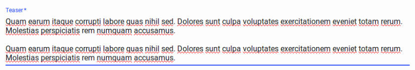

# Input Components

An `Input` component displays an input, or a dropdown list, a list of radio buttons, etc. Such components allow to edit a record property, and are common in the `<Edit>`, `<Create>`, and `<Filter>` views.

```js
// in src/posts.js
import React from 'react';
import { Edit, DisabledInput, LongTextInput, ReferenceInput, SelectInput, TextInput } from 'admin-on-rest/lib/mui';

export const PostEdit = (props) => (
    <Edit title={PostTitle} {...props}>
        <DisabledInput source="id" />
        <ReferenceInput label="User" source="userId" reference="users">
            <SelectInput optionText="name" />
        </ReferenceInput>
        <TextInput source="title" />
        <LongTextInput source="body" />
    </Edit>
);
```

All input components accept the following attributes:

* `source`: Property name of your entity to view/edit. This attribute is required.
* `label`: Used as a table header of an input label. Defaults to the `source` when omitted.

```js
<TextInput source="zb_title" label="Title" />
```

If you edit a record with a complex structure, you can use a path as the `source` parameter. For instance, if the API returns the following 'book' record:

```js
{
    id: 1234,
    title: 'War and Peace',
    author: {
        firstName: 'Leo',
        lastName: 'Tolstoi'
    }
}
```

Then you can display a text input to edit the author first name as follows:

```js
<TextInput source="author.firstName" />
```

## `<DateInput>`

Ideal for editing dates, `<DateInput>` renders a beautiful [Date Picker](http://www.material-ui.com/#/components/date-picker) with full localization support.

``` js
import { DateInput } from 'admin-on-rest/mui';

<DateInput source="published_at" />
```


You can override any of Material UI's `<DatePicker>` attributes by setting the `options` attribute:

``` js
<DateInput source="published_at" options={{
    mode: 'landscape',
    minDate: new Date(),
    hintText: 'Choisissez une date',
    DateTimeFormat,
    okLabel: 'OK',
    cancelLabel: 'Annuler'
    locale: 'fr'
}} />
```

Refer to [Material UI Datapicker documentation]([Date Picker](http://www.material-ui.com/#/components/date-picker) for more details.

## `<LongTextInput>`

`<LongTextInput>` is the best choice for multiline text values. It renders as an auto expandable textarea.

``` js
import { LongTextInput } from 'admin-on-rest/mui';

<LongTextInput source="teaser" />
```



## `<RichTextInput>`

`<RichTextInput>` is the ideal component if you want to allow your users to edit some HTML contents. It
is powered by [Quill](https://quilljs.com/).

``` js
import { RichTextInput } from 'admin-on-rest/mui';

<RichTextInput source="body" />
```


*Tip*: `quill` is only specified as a peer dependency in the `package.json`. If you want to use the `<RichTextInput>` component in your app, you'll have to add `quill` to your app:

```sh
npm install --save-dev quill
```

You can customize the rich text editor toolbar using the `toolbar` attribute, as described on the [Quill official toolbar documentation](https://quilljs.com/docs/modules/toolbar/).

```js
<RichTextInput source="body" toolbar={[ ['bold', 'italic', 'underline', 'link'] ]} />
```

## `<TextInput>`

`<TextInput>` is the most common input. It is used for texts, emails, URL or passwords. In translates to an HTML `<input>` tag.

``` js
import { TextInput } from 'admin-on-rest/mui';

<TextInput source="title" />
```


You can choose a specific input type using the `type` attribute, among `text` (the default), `email`, `url`, or `password`:

``` js
<TextInput label="Email Address" source="email" type="email" />
```

## Writing Your Own Input Component

If you need a more specific input type, you can also write it yourself. In addition to `source` and `label` attributes, it must accept an `input` attribute to integrate with admin-on-rest forms (powered by redux-form). Admin-on-rest will inject the `input` attribute at runtime, and it will contain a `value` (computed from the current record and source), and an `onChange` function (to manage the input).

For instance, here is an simplified version of admin-on-rest's `<TextInput>` component:

```js
import React, { PropTypes } from 'react';

const TextInput = ({ source, label, input }) => (
    <span>
        <label for={source}>{label}</label>
        <input name={source} value={input.value} onChange={input.onChange} type="text" />
    </span>
);

TextInput.propTypes = {
    includesLabel: PropTypes.bool.isRequired,
    input: PropTypes.object,
    label: PropTypes.string,
    onChange: PropTypes.func,
    source: PropTypes.string.isRequired,
};

TextInput.defaultProps = {
    includesLabel: true,
};

export default TextInput;
```

**Tip**: Admin-on-rest inspects the `includesLabel` attribute to determine whether to render an additional label on top of the input component or not. If `includesLabel` is false, admin-on-rest considers the components doesn't have its own label, and adds another one.
