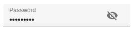

# Input Components

An `Input` component displays an input, or a dropdown list, a list of radio buttons, etc. Such components allow to edit a record property, and are common in the `<Edit>`, `<Create>`, and `<Filter>` views.

```jsx
// in src/posts.js
import React from 'react';
import { Edit, SimpleForm, ReferenceInput, SelectInput, TextInput, required } from 'react-admin';

export const PostEdit = (props) => (
    <Edit title={<PostTitle />} {...props}>
        <SimpleForm>
            <TextInput disabled source="id" />
            <ReferenceInput label="User" source="userId" reference="users" validate={[required()]}>
                <SelectInput optionText="name" />
            </ReferenceInput>
            <TextInput source="title" label="Post title" validate={[required()]} />
            <TextInput multiline source="body" initialValue="Lorem Ipsum" />
        </SimpleForm>
    </Edit>
);
```

## Common Input Props

All input components accept the following props:

* `source`: Property name of your entity to view/edit. This attribute is required.
* `label`: Used as input label. Defaults to the humanized `source` when omitted.
* `validate`: Validation rules for the current property. See the [Validation Documentation](./CreateEdit.md#validation) for details.
* `helperText`: Text to be displayed under the input.
* `className`: A class name (usually generated by JSS) to customize the look and feel of the input element itself
* `formClassName`: Class name to be applied to the container of the input (e.g. the `<div>` forming each row in `<SimpleForm>`)
* `fullWidth`: If `true`, the input will expand to fill the form width. Defaults to `false`.

```jsx
<TextInput source="zb_title" label="Title" initialValue="Foo" />
```

React-admin uses [react-final-form](https://final-form.org/docs/react-final-form/getting-started) to control form inputs. Each input component also accepts all react-final-form [`FieldProps`](https://final-form.org/docs/react-final-form/types/FieldProps), including:

* `initialValue`: Value to be set when the property is `null` or `undefined`.
* `format`: A function that takes the value from the form values and the name of the field and formats the value to give to the input. See the [Transforming Input Value](./Inputs.md#transforming-input-value-tofrom-record) section.
* [`parse`](https://final-form.org/docs/react-final-form/types/FieldProps#parse): A function that takes the value from the input and name of the field and converts the value into the value you want stored as this field's value in the form. See the [Transforming Input Value](./Inputs.md#transforming-input-value-tofrom-record) section.

Additional props are passed down to the underlying component (usually a material-ui component). For instance, when setting the `className` prop on a `TextInput` component, the underlying material-ui `<TextField>` receives it, and renders with custom styles. You can also set the underlying component `variant` and `margin` that way.

**Tip**: If you edit a record with a complex structure, you can use a path as the `source` parameter. For instance, if the API returns the following 'book' record:

```jsx
{
    id: 1234,
    title: 'War and Peace',
    author: {
        firstName: 'Leo',
        lastName: 'Tolstoi'
    }
}
```

Then you can display a text input to edit the author first name as follows:

```jsx
<TextInput source="author.firstName" />
```

**Tip**: If your interface has to support multiple languages, don't use the `label` prop, and put the localized labels in a dictionary instead. See the [Translation documentation](./Translation.md#translating-resource-and-field-names) for details.

**Tip**: For compatibility reasons, input components also accept the `defaultValue` prop - which is simply copied as the `initialValue` prop.

## `<ArrayInput>`

To edit arrays of data embedded inside a record, `<ArrayInput>` creates a list of sub-forms.

```jsx
import { ArrayInput, SimpleFormIterator, DateInput, TextInput } from 'react-admin';

<ArrayInput source="backlinks">
    <SimpleFormIterator>
        <DateInput source="date" />
        <TextInput source="url" />
    </SimpleFormIterator>
</ArrayInput>
```


 `<ArrayInput>` allows editing of embedded arrays, like the `backlinks` field in the following `post` record:

```js
{
  id: 123,
  backlinks: [
        {
            date: '2012-08-10T00:00:00.000Z',
            url: 'http://example.com/foo/bar.html',
        },
        {
            date: '2012-08-14T00:00:00.000Z',
            url: 'https://blog.johndoe.com/2012/08/12/foobar.html',
        }
   ]
}
```

`<ArrayInput>` expects a single child, which must be a *form iterator* component. A form iterator is a component accepting a `fields` object as passed by [react-final-form-array](https://github.com/final-form/react-final-form-arrays#fieldarrayrenderprops), and defining a layout for an array of fields. For instance, the `<SimpleFormIterator>` component displays an array of fields in an unordered list (`<ul>`), one sub-form by list item (`<li>`). It also provides controls for adding and removing a sub-record (a backlink in this example).

You can pass `disableAdd` and `disableRemove` as props of `SimpleFormIterator`, to disable `ADD` and `REMOVE` button respectively. Default value of both is `false`.

```jsx
import { ArrayInput, SimpleFormIterator, DateInput, TextInput } from 'react-admin';

<ArrayInput source="backlinks">
    <SimpleFormIterator disableRemove >
        <DateInput source="date" />
        <TextInput source="url" />
    </SimpleFormIterator>
</ArrayInput>
```

`<ArrayInput>` also accepts the [common input props](./Inputs.md#common-input-props).

## `<AutocompleteInput>`

To let users choose a value in a list using a dropdown with autocompletion, use `<AutocompleteInput>`.
It renders using [downshift](https://github.com/downshift-js/downshift) and a `fuzzySearch` filter.
Set the `choices` attribute to determine the options list (with `id`, `name` tuples).

```jsx
import { AutocompleteInput } from 'react-admin';

<AutocompleteInput source="category" choices={[
    { id: 'programming', name: 'Programming' },
    { id: 'lifestyle', name: 'Lifestyle' },
    { id: 'photography', name: 'Photography' },
]} />
```

You can also customize the properties to use for the option name and value, thanks to the `optionText` and `optionValue` attributes:

```jsx
const choices = [
    { _id: 123, full_name: 'Leo Tolstoi', sex: 'M' },
    { _id: 456, full_name: 'Jane Austen', sex: 'F' },
];
<AutocompleteInput source="author_id" choices={choices} optionText="full_name" optionValue="_id" />
```

`optionText` also accepts a function, so you can shape the option text at will:

```jsx
const choices = [
   { id: 123, first_name: 'Leo', last_name: 'Tolstoi' },
   { id: 456, first_name: 'Jane', last_name: 'Austen' },
];
const optionRenderer = choice => `${choice.first_name} ${choice.last_name}`;
<AutocompleteInput source="author_id" choices={choices} optionText={optionRenderer} />
```

`optionText` also accepts a custom Component. However, as the underlying Autocomplete component requires that the current selection is a string, if you opt for a Component, you must pass a function as the `inputText` prop. This function should return text representation of the current selection:

```jsx
const choices = [
   { id: 123, first_name: 'Leo', last_name: 'Tolstoi' avatar='/pengouin' },
   { id: 456, first_name: 'Jane', last_name: 'Austen' avatar='/panda' },
];
const OptionRenderer = choice => (
    <span>
        
        {choice.first_name} {choice.last_name}
    </span>
);
const inputText = choice => `${choice.first_name} ${choice.last_name}`;
<AutocompleteInput
    source="author_id"
    choices={choices}
    optionText={<OptionRenderer />}
    inputText={inputText}
/>
```

The choices are translated by default, so you can use translation identifiers as choices:

```jsx
const choices = [
   { id: 'M', name: 'myroot.gender.male' },
   { id: 'F', name: 'myroot.gender.female' },
];
```

However, in some cases (e.g. inside a `<ReferenceInput>`), you may not want the choice to be translated.
In that case, set the `translateChoice` prop to `false`.

```jsx
<AutocompleteInput source="gender" choices={choices} translateChoice={false}/>
```

If you want to limit the initial choices shown to the current value only, you can set the `limitChoicesToValue` prop.

When dealing with a large amount of `choices` you may need to limit the number of suggestions that are rendered in order to maintain usable performance. The `shouldRenderSuggestions` is an optional prop that allows you to set conditions on when to render suggestions. An easy way to improve performance would be to skip rendering until the user has entered 2 or 3 characters in the search box. This lowers the result set significantly, and might be all you need (depending on your data set).
Ex. `<AutocompleteInput shouldRenderSuggestions={(val) => { return val.trim().length > 2 }} />` would not render any suggestions until the 3rd character was entered. This prop is passed to the underlying `react-autosuggest` component and is documented [here](https://github.com/moroshko/react-autosuggest#should-render-suggestions-prop).

`<AutocompleteInput>` renders a [material-ui `<TextField>` component](https://material-ui.com/api/text-field/). Use the `options` attribute to override any of the `<TextField>` attributes:


```jsx
<AutocompleteInput source="category" options={{
    color: 'secondary',
}} />
```


**Tip**: If you want to populate the `choices` attribute with a list of related records, you should decorate `<AutocompleteInput>` with [`<ReferenceInput>`](#referenceinput), and leave the `choices` empty:

```jsx
import { AutocompleteInput, ReferenceInput } from 'react-admin';

<ReferenceInput label="Post" source="post_id" reference="posts">
    <AutocompleteInput optionText="title" />
</ReferenceInput>
```

Lastly, would you need to override the props of the suggestions container (a `Popper` element), you can specify them using the `options.suggestionsContainerProps`. For example:


```jsx
<AutocompleteInput source="category" options={{
    suggestionsContainerProps: {
        disablePortal: true,
}}} />
```


**Tip**: `<AutocompleteInput>` is a stateless component, so it only allows to *filter* the list of choices, not to *extend* it. If you need to populate the list of choices based on the result from a `fetch` call (and if [`<ReferenceInput>`](#referenceinput) doesn't cover your need), you'll have to [write your own Input component](#writing-your-own-input-component) based on material-ui `<AutoComplete>` component.

### Properties

| Prop | Required | Type | Default | Description |
| ---|---|---|---|--- |
| `allowEmpty` | Optional | `boolean` | `false` | If `false` and the searchText typed did not match any suggestion, the searchText will revert to the current value when the field is blurred. If `true` and the `searchText` is set to `''` then the field will set the input value to `null`. |
| `choices` | Required | `Object[]` | - | List of items to autosuggest |
| `emptyValue` | Optional | anything | `''` | The value to use for the empty element |
| `emptyText` | Optional | `string` | `''` | The text to use for the empty element |
| `matchSuggestion` | Optional | `Function` | - | Required if `optionText` is a React element. Function returning a boolean indicating whether a choice matches the filter. `(filter, choice) => boolean`
| `optionText` | Optional | <code>string &#124; Function &#124; Component</code> | `name` | Fieldname of record to display in the suggestion item or function which accepts the correct record as argument (`(record)=> {string}`) |
| `optionValue` | Optional | `string` | `id` | Fieldname of record containing the value to use as input value  |
| `inputText` | Optional | <code>Function</code> | `-` | If `optionText` is a custom Component, this function is needed to determine the text displayed for the current selection. |
| `setFilter` | Optional | `Function` | `null` | A callback to inform the `searchText` has changed and new `choices` can be retrieved based on this `searchText`. Signature `searchText => void`. This function is automatically setup when using `ReferenceInput`.  |
| `shouldRenderSuggestions` | Optional | Function | `() => true` | A function that returns a `boolean` to determine whether or not suggestions are rendered. Use this when working with large collections of data to improve performance and user experience. This function is passed into the underlying react-autosuggest component. Ex.`(value) => value.trim() > 2` |

`<AutocompleteInput>` also accepts the [common input props](./Inputs.md#common-input-props).

## `<AutocompleteArrayInput>`

To let users choose multiple values in a list using a dropdown with autocompletion, use `<AutocompleteArrayInput>`.
It renders using [downshift](https://github.com/downshift-js/downshift) and a `fuzzySearch` filter.
Set the `choices` attribute to determine the options list (with `id`, `name` tuples).

```jsx
import { AutocompleteArrayInput } from 'react-admin';

<AutocompleteArrayInput source="category" choices={[
    { id: 'programming', name: 'Programming' },
    { id: 'lifestyle', name: 'Lifestyle' },
    { id: 'photography', name: 'Photography' },
]} />
```

You can also customize the properties to use for the option name and value, thanks to the `optionText` and `optionValue` attributes:

```jsx
const choices = [
    { _id: 123, full_name: 'Leo Tolstoi', sex: 'M' },
    { _id: 456, full_name: 'Jane Austen', sex: 'F' },
];
<AutocompleteArrayInput source="author_id" choices={choices} optionText="full_name" optionValue="_id" />
```

`optionText` also accepts a function, so you can shape the option text at will:

```jsx
const choices = [
   { id: 123, first_name: 'Leo', last_name: 'Tolstoi' },
   { id: 456, first_name: 'Jane', last_name: 'Austen' },
];
const optionRenderer = choice => `${choice.first_name} ${choice.last_name}`;
<AutocompleteArrayInput source="author_id" choices={choices} optionText={optionRenderer} />
```

The choices are translated by default, so you can use translation identifiers as choices:

```jsx
const choices = [
   { id: 'M', name: 'myroot.gender.male' },
   { id: 'F', name: 'myroot.gender.female' },
];
```

However, in some cases (e.g. inside a `<ReferenceInput>`), you may not want the choice to be translated. In that case, set the `translateChoice` prop to `false`.

```jsx
<AutocompleteArrayInput source="gender" choices={choices} translateChoice={false}/>
```

When dealing with a large amount of `choices` you may need to limit the number of suggestions that are rendered in order to maintain usable performance. The `shouldRenderSuggestions` is an optional prop that allows you to set conditions on when to render suggestions. An easy way to improve performance would be to skip rendering until the user has entered 2 or 3 characters in the search box. This lowers the result set significantly, and might be all you need (depending on your data set).
Ex. `<AutocompleteArrayInput shouldRenderSuggestions={(val) => { return val.trim().length > 2 }} />` would not render any suggestions until the 3rd character was entered. This prop is passed to the underlying `react-autosuggest` component and is documented [here](https://github.com/moroshko/react-autosuggest#should-render-suggestions-prop).

Lastly, `<AutocompleteArrayInput>` renders a [material-ui `<TextField>` component](https://material-ui.com/api/text-field/). Use the `options` attribute to override any of the `<TextField>` attributes:


```jsx
<AutocompleteArrayInput source="category" options={{
    color: 'secondary',
}} />
```


**Tip**: Like many other inputs, `<AutocompleteArrayInput>` accept a `fullWidth` prop.
**Tip**: If you want to populate the `choices` attribute with a list of related records, you should decorate `<AutocompleteArrayInput>` with [`<ReferenceArrayInput>`](#referenceinput), and leave the `choices` empty:

```jsx
import { AutocompleteArrayInput, ReferenceArrayInput } from 'react-admin';

<ReferenceArrayInput label="Tags" reference="tags" source="tags">
    <AutocompleteArrayInput />
</ReferenceArrayInput>
```

If you need to override the props of the suggestions container (a `Popper` element), you can specify them using the `options.suggestionsContainerProps`. For example:


```jsx
<AutocompleteArrayInput source="category" options={{
    suggestionsContainerProps: {
        disablePortal: true,
}}} />
```


**Tip**: `<ReferenceArrayInput>` is a stateless component, so it only allows to *filter* the list of choices, not to *extend* it. If you need to populate the list of choices based on the result from a `fetch` call (and if [`<ReferenceArrayInput>`](#referencearrayinput) doesn't cover your need), you'll have to [write your own Input component](#writing-your-own-input-component) based on [material-ui-chip-input](https://github.com/TeamWertarbyte/material-ui-chip-input).

**Tip**: React-admin's `<AutocompleteInput>` has only a capital A, while material-ui's `<AutoComplete>` has a capital A and a capital C. Don't mix up the components!

### Properties

| Prop | Required | Type | Default | Description |
| ---|---|---|---|--- |
| `allowEmpty` | Optional | `boolean` | `false` | If `true`, the first option is an empty one |
| `allowDuplicates` | Optional | `boolean` | `false` | If `true`, the options can be selected several times |
| `choices` | Required | `Object[]` | - | List of items to autosuggest |
| `matchSuggestion` | Optional | `Function` | - | Required if `optionText` is a React element. Function returning a boolean indicating whether a choice matches the filter. `(filter, choice) => boolean` |
| `optionValue` | Optional | `string` | `id` | Fieldname of record containing the value to use as input value  |
| `optionText` | Optional | <code>string &#124; Function</code> | `name` | Fieldname of record to display in the suggestion item or function which accepts the current record as argument (`(record)=> {string}`) |
| `setFilter` | Optional | `Function` | `null` | A callback to inform the `searchText` has changed and new `choices` can be retrieved based on this `searchText`. Signature `searchText => void`. This function is automatically setup when using `ReferenceInput`.  |
| `shouldRenderSuggestions` | Optional | `Function` | `() => true` | A function that returns a `boolean` to determine whether or not suggestions are rendered. Use this when working with large collections of data to improve performance and user experience. This function is passed into the underlying react-autosuggest component. Ex.`(value) => value.trim() > 2` |
| `source` | Required |  `string` | - | Name of field to edit, its type should match the type retrieved from `optionValue`  |
| `suggestionLimit` | Optional | `Number` | `null` | Limits the numbers of suggestions that are shown in the dropdown list |

`<AutocompleteArrayInput>` also accepts the [common input props](./Inputs.md#common-input-props).

## `<BooleanInput>` and `<NullableBooleanInput>`

`<BooleanInput />` is a toggle button allowing you to attribute a `true` or `false` value to a record field.

```jsx
import { BooleanInput } from 'react-admin';

<BooleanInput label="Commentable" source="commentable" />
```


This input does not handle `null` values. You would need the `<NullableBooleanInput />` component if you have to handle non-set booleans.

You can use the `options` prop to pass any option supported by the Material UI `Switch` components. For example, here's how to set a custom checked icon:


```jsx
import { BooleanInput } from 'react-admin';
import FavoriteIcon from '@material-ui/icons/Favorite';

<BooleanInput
    source="favorite"
    options={{
        checkedIcon: <FavoriteIcon />,
    }}
/>
```



Refer to [Material UI Switch documentation](https://material-ui.com/api/switch) for more details.

`<NullableBooleanInput />` renders as a dropdown list, allowing to choose between `true`, `false`, and `null` values.

```jsx
import { NullableBooleanInput } from 'react-admin';

<NullableBooleanInput label="Commentable" source="commentable" />
```


`<NullableBooleanInput />` doesn't display the empty option by default. If you want to customize its label and display it, you can use the `displayNull` prop.

```jsx
import { NullableBooleanInput } from 'react-admin';

<NullableBooleanInput 
    label="Commentable"
    source="commentable"
    displayNull
/>
```

```jsx
import englishMessages from 'ra-language-english';

englishMessages.ra.boolean.null = 'Null label';
```


`<BooleanInput>` and `<NullableBooleanInput>` also accepts the [common input props](./Inputs.md#common-input-props).

## `<CheckboxGroupInput>`

If you want to let the user choose multiple values among a list of possible values by showing them all, `<CheckboxGroupInput>` is the right component. Set the `choices` attribute to determine the options (with `id`, `name` tuples):

```jsx
import { CheckboxGroupInput } from 'react-admin';

<CheckboxGroupInput source="category" choices={[
    { id: 'programming', name: 'Programming' },
    { id: 'lifestyle', name: 'Lifestyle' },
    { id: 'photography', name: 'Photography' },
]} />
```


You can also customize the properties to use for the option name and value, thanks to the `optionText` and `optionValue` attributes:

```jsx
const choices = [
    { _id: 123, full_name: 'Leo Tolstoi', sex: 'M' },
    { _id: 456, full_name: 'Jane Austen', sex: 'F' },
];
<CheckboxGroupInput source="author_id" choices={choices} optionText="full_name" optionValue="_id" />
```

`optionText` also accepts a function, so you can shape the option text at will:

```jsx
const choices = [
   { id: 123, first_name: 'Leo', last_name: 'Tolstoi' },
   { id: 456, first_name: 'Jane', last_name: 'Austen' },
];
const optionRenderer = choice => `${choice.first_name} ${choice.last_name}`;
<CheckboxGroupInput source="author_id" choices={choices} optionText={optionRenderer} />
```

`optionText` also accepts a React Element, that will be cloned and receive the related choice as the `record` prop. You can use Field components there.

```jsx
const choices = [
   { id: 123, first_name: 'Leo', last_name: 'Tolstoi' },
   { id: 456, first_name: 'Jane', last_name: 'Austen' },
];
const FullNameField = ({ record }) => <span>{record.first_name} {record.last_name}</span>;
<CheckboxGroupInput source="gender" choices={choices} optionText={<FullNameField />}/>
```

The choices are translated by default, so you can use translation identifiers as choices:

```jsx
const choices = [
    { id: 'programming', name: 'myroot.category.programming' },
    { id: 'lifestyle', name: 'myroot.category.lifestyle' },
    { id: 'photography', name: 'myroot.category.photography' },
];
```

However, in some cases (e.g. inside a `<ReferenceInput>`), you may not want the choice to be translated. In that case, set the `translateChoice` prop to `false`.

```jsx
<CheckboxGroupInput source="gender" choices={choices} translateChoice={false}/>
```

Lastly, use the `options` attribute if you want to override any of Material UI's `<Checkbox>` attributes:


```jsx
import { FavoriteBorder, Favorite } from '@material-ui/icons';

<CheckboxGroupInput source="category" options={{
    icon: <FavoriteBorder />,
    checkedIcon: <Favorite />
}} />
```


### Properties

| Prop | Type | Default | Description |
| ---|---|---|--- |
| `choices` | Required | `Object[]` | - | List of choices |
| `optionText` | Optional | <code>string &#124; Function</code> | `name` | Fieldname of record to display in the suggestion item or function which accepts the correct record as argument (`(record)=> {string}`) |
| `optionValue` | Optional | `string` | `id` | Fieldname of record containing the value to use as input value |
| `row` | `boolean` | `true` | Display group of elements in a compact row. |

Refer to [Material UI Checkbox documentation](https://material-ui.com/api/checkbox/) for more details.

`<CheckboxGroupInput>` also accepts the [common input props](./Inputs.md#common-input-props).

## `<DateInput>`

Ideal for editing dates, `<DateInput>` renders an HTML `<input type="date">` element, that most browsers display as a standard [Date Picker](https://material-ui.com/components/pickers/#date-pickers). That means the appearance of `<DateInput>` depends on the browser, and falls back to a text input on Safari. The date formatting in this input depends on the user's locale.

```jsx
import { DateInput } from 'react-admin';

<DateInput source="published_at" />
```


`<DateInput>` also accepts the [common input props](./Inputs.md#common-input-props).

**Tip**: For a material-ui styled `<DateInput>` component, check out [vascofg/react-admin-date-inputs](https://github.com/vascofg/react-admin-date-inputs).

## `<DateTimeInput>`

An input for editing dates with time. `<DateTimeInput>` renders a standard browser [Date and Time Picker](https://material-ui.com/components/pickers/#date-amp-time-pickers), so the appearance depends on the browser (and falls back to a text input on safari).

```jsx
import { DateTimeInput } from 'react-admin';

<DateTimeInput source="published_at" />
```

`<DateTimeInput>` also accepts the [common input props](./Inputs.md#common-input-props).

**Tip**: For a material-ui styled `<DateTimeInput>` component, check out [vascofg/react-admin-date-inputs](https://github.com/vascofg/react-admin-date-inputs).

## `<ImageInput>`

`<ImageInput>` allows to upload some pictures using [react-dropzone](https://github.com/okonet/react-dropzone).


Files are accepted or rejected based on the `accept`, `multiple`, `minSize` and `maxSize` props. `accept` must be a valid [MIME type](http://www.iana.org/assignments/media-types/media-types.xhtml) according to [input element specification](https://www.w3.org/wiki/HTML/Elements/input/file) or a valid file extension. If `multiple` is set to false and additional files are droppped, all files besides the first will be rejected. Any file which does not have a size in the [`minSize`, `maxSize`] range, will be rejected as well.

`ImageInput` delegates the preview of currently selected images to its child. `ImageInput` clones its child as many times as there are selected images, passing the image as the `record` prop. To preview a simple list of image thubnails, you can use `<ImageField>` as child, as follows:

```jsx
<ImageInput source="pictures" label="Related pictures" accept="image/*">
    <ImageField source="src" title="title" />
</ImageInput>
```

Writing a custom preview component is quite straightforward: it's a standard [field](./Fields.md#writing-your-own-field-component).

When receiving **new** images, `ImageInput` will add a `rawFile` property to the object passed as the `record` prop of children. This `rawFile` is the [File](https://developer.mozilla.org/en-US/docs/Web/API/File) instance of the newly added file. This can be useful to display information about size or mimetype inside a custom field.

The `ImageInput` component accepts an `options` prop, allowing to set the [react-dropzone properties](https://react-dropzone.netlify.com/#proptypes).

If the default Dropzone label doesn't fit with your need, you can pass a `placeholder` prop to overwrite it. The value can be anything React can render (`PropTypes.node`):

```jsx
<ImageInput source="pictures" label="Related pictures" accept="image/*" placeholder={<p>Drop your file here</p>}>
    <ImageField source="src" title="title" />
</ImageInput>
```

Note that the image upload returns a [File](https://developer.mozilla.org/en/docs/Web/API/File) object. It is your responsibility to handle it depending on your API behavior. You can for instance encode it in base64, or send it as a multi-part form data. Check [this example](./DataProviders.md#extending-a-data-provider-example-of-file-upload) for base64 encoding data by extending the REST Client.

### Properties

| Prop | Type | Default | Description |
| ---|---|---|--- |
| `accept` | Optional | `string | string[]` | - | Accepted file type(s), e. g. 'image/*,.pdf'. If left empty, all file types are accepted. Equivalent of the `accept` attribute of an `<input type="file">`. See https://developer.mozilla.org/en-US/docs/Web/HTML/Element/input/file#accept for syntax and examples. |
| `children` | Optional | `ReactNode` | - | Element used to display the preview of an image (cloned several times if the select accepts multiple files). |
| `minSize` | Optional | `number` | 0 | Minimum image size (in bytes), e.g. 5000 form 5KB |
| `maxSize` | Optional | `number` | Infinity | Maximum image size (in bytes), e.g. 5000000 for 5MB |
| `multiple` | Optional | `boolean` | false | Set to true if the input should accept a list of images, false if it should only accept one image |
| `labelSingle` | Optional | `string` | 'ra.input.image. upload_single' | Invite displayed in the drop zone if the input accepts one image |
| `labelMultiple` | Optional | `string` | 'ra.input.file. upload_multiple' | Invite displayed in the drop zone if the input accepts several images |
| `placeholder` | Optional | `string | ReactNode` | - | Invite displayed in the drop zone, overrides `labelSingle` and `labelMultiple` |
| `options` | Optional | `object` | `{}` | Additional options passed to react-dropzone's `useDropzone()` hook. See [the react-dropzone source](https://github.com/react-dropzone/react-dropzone/blob/master/src/index.js)  for details . |

`<ImageInput>` also accepts the [common input props](./Inputs.md#common-input-props).

## `<FileInput>`

`<FileInput>` allows to upload files using [react-dropzone](https://github.com/okonet/react-dropzone).


Files are accepted or rejected based on the `accept`, `multiple`, `minSize` and `maxSize` props. `accept` must be a valid [MIME type](http://www.iana.org/assignments/media-types/media-types.xhtml) according to [input element specification](https://www.w3.org/wiki/HTML/Elements/input/file) or a valid file extension. If `multiple` is set to false and additional files are droppped, all files besides the first will be rejected. Any file which does not have a size in the [`minSize`, `maxSize`] range, will be rejected as well.

`FileInput` delegates the preview of currently selected files to its child. `FileInput` clones its child as many times as there are selected files, passing the file as the `record` prop. To preview a simple list of files names, you can use `<FileField>` as child, as follows:

```jsx
<FileInput source="files" label="Related files" accept="application/pdf">
    <FileField source="src" title="title" />
</FileInput>
```

Writing a custom preview component is quite straightforward: it's a standard [field](./Fields.md#writing-your-own-field-component).

When receiving **new** files, `FileInput` will add a `rawFile` property to the object passed as the `record` prop of children. This `rawFile` is the [File](https://developer.mozilla.org/en-US/docs/Web/API/File) instance of the newly added file. This can be useful to display information about size or mimetype inside a custom field.

The `FileInput` component accepts an `options` prop into which you can pass all the [react-dropzone properties](https://react-dropzone.netlify.com/#proptypes). 

If the default Dropzone label doesn't fit with your need, you can pass a `placeholder` prop to overwrite it. The value can be anything React can render (`PropTypes.node`):

```jsx
<FileInput source="files" label="Related files" accept="application/pdf" placeholder={<p>Drop your file here</p>}>
    <ImageField source="src" title="title" />
</FileInput>
```

Note that the file upload returns a [File](https://developer.mozilla.org/en/docs/Web/API/File) object. It is your responsibility to handle it depending on your API behavior. You can for instance encode it in base64, or send it as a multi-part form data. Check [this example](./DataProviders.md#extending-a-data-provider-example-of-file-upload) for base64 encoding data by extending the REST Client.

### Properties

| Prop | Type | Default | Description |
| ---|---|---|--- |
| `accept` | Optional | `string | string[]` | - | Accepted file type(s), e. g. 'application/json,video/*' or 'application/vnd.openxmlformats-officedocument.spreadsheetml.sheet'. If left empty, all file types are accepted. Equivalent of the `accept` attribute of an `<input type="file">`. See https://developer.mozilla.org/en-US/docs/Web/HTML/Element/input/file#accept for syntax and examples. |
| `children` | Optional | `ReactNode` | - | Element used to display the preview of a file (cloned several times if the select accepts multiple files). |
| `minSize` | Optional | `number` | 0 | Minimum file size (in bytes), e.g. 5000 form 5KB |
| `maxSize` | Optional | `number` | Infinity | Maximum file size (in bytes), e.g. 5000000 for 5MB |
| `multiple` | Optional | `boolean` | false | Set to true if the input should accept a list of files, false if it should only accept one file |
| `labelSingle` | Optional | `string` | 'ra.input.file. upload_single' | Invite displayed in the drop zone if the input accepts one file |
| `labelMultiple` | Optional | `string` | 'ra.input.file. upload_several' | Invite displayed in the drop zone if the input accepts several files |
| `placeholder` | Optional | `string | ReactNode` | - | Invite displayed in the drop zone, overrides `labelSingle` and `labelMultiple` |
| `options` | Optional | `object` | `{}` | Additional options passed to react-dropzone's `useDropzone()` hook. See [the react-dropzone source](https://github.com/react-dropzone/react-dropzone/blob/master/src/index.js)  for details . |

`<FileInput>` also accepts the [common input props](./Inputs.md#common-input-props).

## `<NumberInput>`

`<NumberInput>` translates to a HTML `<input type="number">`. It is necessary for numeric values because of a [known React bug](https://github.com/facebook/react/issues/1425), which prevents using the more generic [`<TextInput>`](#textinput) in that case.

```jsx
import { NumberInput } from 'react-admin';

<NumberInput source="nb_views" />
```

You can customize the `step` props (which defaults to "any"):

```jsx
<NumberInput source="nb_views" step={1} />
```

`<NumberInput>` also accepts the [common input props](./Inputs.md#common-input-props).

## `<PasswordInput>`

`<PasswordInput>` works like the [`<TextInput>`](#textinput) but overwrites its `type` prop to `password` or `text` in accordance with a visibility button, hidden by default.

```jsx
import { PasswordInput } from 'react-admin';
<PasswordInput source="password" />
```



It is possible to change the default behavior and display the value by default via the `initiallyVisible` prop:

```jsx
import { PasswordInput } from 'react-admin';
<PasswordInput source="password" initiallyVisible />
```


**Tip**: It is possible to set the [`autocomplete` attribute](https://developer.mozilla.org/fr/docs/Web/HTML/Attributs/autocomplete) by injecting an input props:


```jsx
<PasswordInput source="password" inputProps={{ autocomplete: 'current-password' }} />
```


## `<RadioButtonGroupInput>`

If you want to let the user choose a value among a list of possible values that are always shown (instead of hiding them behind a dropdown list, as in [`<SelectInput>`](#selectinput)), `<RadioButtonGroupInput>` is the right component. Set the `choices` attribute to determine the options (with `id`, `name` tuples):

```jsx
import { RadioButtonGroupInput } from 'react-admin';

<RadioButtonGroupInput source="category" choices={[
    { id: 'programming', name: 'Programming' },
    { id: 'lifestyle', name: 'Lifestyle' },
    { id: 'photography', name: 'Photography' },
]} />
```


You can also customize the properties to use for the option name and value, thanks to the `optionText` and `optionValue` attributes:

```jsx
const choices = [
    { _id: 123, full_name: 'Leo Tolstoi', sex: 'M' },
    { _id: 456, full_name: 'Jane Austen', sex: 'F' },
];
<RadioButtonGroupInput source="author_id" choices={choices} optionText="full_name" optionValue="_id" />
```

`optionText` also accepts a function, so you can shape the option text at will:

```jsx
const choices = [
   { id: 123, first_name: 'Leo', last_name: 'Tolstoi' },
   { id: 456, first_name: 'Jane', last_name: 'Austen' },
];
const optionRenderer = choice => `${choice.first_name} ${choice.last_name}`;
<RadioButtonGroupInput source="author_id" choices={choices} optionText={optionRenderer} />
```

`optionText` also accepts a React Element, that will be cloned and receive the related choice as the `record` prop. You can use Field components there.

```jsx
const choices = [
   { id: 123, first_name: 'Leo', last_name: 'Tolstoi' },
   { id: 456, first_name: 'Jane', last_name: 'Austen' },
];
const FullNameField = ({ record }) => <span>{record.first_name} {record.last_name}</span>;
<RadioButtonGroupInput source="gender" choices={choices} optionText={<FullNameField />}/>
```

The choices are translated by default, so you can use translation identifiers as choices:

```jsx
const choices = [
   { id: 'M', name: 'myroot.gender.male' },
   { id: 'F', name: 'myroot.gender.female' },
];
```

However, in some cases (e.g. inside a `<ReferenceInput>`), you may not want the choice to be translated. In that case, set the `translateChoice` prop to `false`.

```jsx
<RadioButtonGroupInput source="gender" choices={choices} translateChoice={false}/>
```

Lastly, use the `options` attribute if you want to override any of Material UI's `<RadioButtonGroup>` attributes:


```jsx
<RadioButtonGroupInput source="category" options={{
    labelPosition: 'right'
}} />
```


Refer to [Material UI RadioGroup documentation](https://material-ui.com/api/radio-group) for more details.

**Tip**: If you want to populate the `choices` attribute with a list of related records, you should decorate `<RadioButtonGroupInput>` with [`<ReferenceInput>`](#referenceinput), and leave the `choices` empty:

```jsx
import { RadioButtonGroupInput, ReferenceInput } from 'react-admin';

<ReferenceInput label="Author" source="author_id" reference="authors">
    <RadioButtonGroupInput optionText="last_name" />
</ReferenceInput>
```

### Properties

| Prop | Required | Type | Default | Description |
| ---|---|---|---|--- |
| `choices` | Required | `Object[]` | - | List of items to show as options |
| `options` | Optional | Object | Props to pass to the underlying `<RadioButtonGroup>` element
| `optionText` | Optional | <code>string &#124; Function</code> | `name` | Fieldname of record to display in the suggestion item or function which accepts the current record as argument (`(record)=> {string}`) |
| `optionValue` | Optional | `string` | `id` | Fieldname of record containing the value to use as input value  |
| `row` | `boolean` | true | Display options in a compact row. |
| `translateChoice` | Optional | Boolean | `true` | Whether the choices should be translated |

`<RadioButtonGroupInput>` also accepts the [common input props](./Inputs.md#common-input-props).

## `<ReferenceArrayInput>`

Use `<ReferenceArrayInput>` to edit an array of reference values, i.e. to let users choose a list of values (usually foreign keys) from another REST endpoint.

`<ReferenceArrayInput>` fetches the related resources (using `dataProvider.getMany()`) as well as possible resources (using `dataProvider.getList()`) in the reference endpoint.

For instance, if the post object has many tags, a post resource may look like:

```js
{
    id: 1234,
    tag_ids: [1, 23, 4]
}
```

Then `<ReferenceArrayInput>` would fetch a list of tag resources from these two calls:

```
http://myapi.com/tags?id=[1,23,4]
http://myapi.com/tags?page=1&perPage=25
```

Once it receives the deduplicated reference resources, this component delegates rendering to a subcomponent, to which it passes the possible choices as the `choices` attribute.

This means you can use `<ReferenceArrayInput>` with [`<SelectArrayInput>`](#selectarrayinput), or with the component of your choice, provided it supports the `choices` attribute.

The component expects a `source` and a `reference` attributes. For instance, to make the `tag_ids` for a `post` editable:

```jsx
import { ReferenceArrayInput, SelectArrayInput } from 'react-admin';

<ReferenceArrayInput source="tag_ids" reference="tags">
    <SelectArrayInput optionText="name" />
</ReferenceArrayInput>
```


**Note**: You **must** add a `<Resource>` for the reference resource - react-admin needs it to fetch the reference data. You can omit the list prop in this reference if you want to hide it in the sidebar menu.

```jsx
<Admin dataProvider={myDataProvider}>
    <Resource name="posts" list={PostList} edit={PostEdit} />
    <Resource name="tags" />
</Admin>
```

Set the `allowEmpty` prop when you want to add an empty choice with a value of `null` in the choices list.
Disabling `allowEmpty` does not mean that the input will be required. If you want to make the input required, you must add a validator as indicated in [Validation Documentation](./CreateEdit.md#validation). Enabling the `allowEmpty` props just adds an empty choice (with `null` value) on top of the options, and makes the value nullable.

```jsx
import { ReferenceArrayInput, SelectArrayInput } from 'react-admin';

<ReferenceArrayInput source="tag_ids" reference="tags" allowEmpty>
    <SelectArrayInput optionText="name" />
</ReferenceArrayInput>
```

**Tip**: `allowEmpty` is set by default for all Input components children of the `<Filter>` component

You can tweak how this component fetches the possible values using the `perPage`, `sort`, and `filter` props.


```jsx
// by default, fetches only the first 25 values. You can extend this limit
// by setting the `perPage` prop.
<ReferenceArrayInput
     source="tag_ids"
     reference="tags"
     perPage={100}>
    <SelectArrayInput optionText="name" />
</ReferenceArrayInput>

// by default, orders the possible values by id desc. You can change this order
// by setting the `sort` prop (an object with `field` and `order` properties).
<ReferenceArrayInput
     source="tag_ids"
     reference="tags"
     sort={{ field: 'title', order: 'ASC' }}>
    <SelectArrayInput optionText="name" />
</ReferenceArrayInput>

// you can filter the query used to populate the possible values. Use the
// `filter` prop for that.
<ReferenceArrayInput
     source="tag_ids"
     reference="tags"
     filter={{ is_published: true }}>
    <SelectArrayInput optionText="name" />
</ReferenceArrayInput>
```


`<ReferenceArrayInput>` also accepts the [common input props](./Inputs.md#common-input-props).

## `<ReferenceInput>`

Use `<ReferenceInput>` for foreign-key values, for instance, to edit the `post_id` of a `comment` resource. This component fetches the related record (using `dataProvider.getMany()`) as well as possible choices (using `dataProvider.getList()` in the reference resource), then delegates rendering to a subcomponent, to which it passes the possible choices as the `choices` attribute.

This means you can use `<ReferenceInput>` with any of [`<SelectInput>`](#selectinput), [`<AutocompleteInput>`](#autocompleteinput), or [`<RadioButtonGroupInput>`](#radiobuttongroupinput), or even with the component of your choice, provided it supports the `choices` attribute.

The component expects a `source` and a `reference` attributes. For instance, to make the `post_id` for a `comment` editable:

```jsx
import { ReferenceInput, SelectInput } from 'react-admin';

<ReferenceInput label="Post" source="post_id" reference="posts">
    <SelectInput optionText="title" />
</ReferenceInput>
```


**Note**: You **must** add a `<Resource>` for the reference resource - react-admin needs it to fetch the reference data. You *can* omit the `list` prop in this reference if you want to hide it in the sidebar menu.

```jsx
<Admin dataProvider={myDataProvider}>
    <Resource name="comments" list={CommentList} />
    <Resource name="posts" />
</Admin>
```

**Tip**: Why does `<ReferenceInput>` use the `GET_MANY` verb with a single value `[id]` instead of `GET_ONE` to fetch the record for the current value? Because when there are many `<ReferenceInput>` for the same resource in a form (for instance when inside an `<ArrayInput>`), react-admin *aggregates* the calls to `GET_MANY` into a single one with `[id1, id2, ...)]`. This speeds up the UI and avoids hitting the API too much.

Set the `allowEmpty` prop when you want to add an empty choice with a value of `null` in the choices list.
Disabling `allowEmpty` does not mean that the input will be required. If you want to make the input required, you must add a validator as indicated in [Validation Documentation](./CreateEdit.md#validation). Enabling the `allowEmpty` props just adds an empty choice (with `null` value) on top of the options, and makes the value nullable.

```jsx
import { ReferenceInput, SelectInput } from 'react-admin';

<ReferenceInput label="Post" source="post_id" reference="posts" allowEmpty>
    <SelectInput optionText="title" />
</ReferenceInput>
```

**Tip**: `allowEmpty` is set by default for all Input components children of the `<Filter>` component:

```jsx
const CommentFilter = (props) => (
    <Filter {...props}>
        <ReferenceInput label="Post" source="post_id" reference="posts"> // no need for allowEmpty
            <SelectInput optionText="title" />
        </ReferenceInput>
    </Filter>
);
```

You can tweak how this component fetches the possible values using the `perPage`, `sort`, and `filter` props.


```jsx
// by default, fetches only the first 25 values. You can extend this limit
// by setting the `perPage` prop.
<ReferenceInput
     source="post_id"
     reference="posts"
     perPage={100}>
    <SelectInput optionText="title" />
</ReferenceInput>

// by default, orders the possible values by id desc. You can change this order
// by setting the `sort` prop (an object with `field` and `order` properties).
<ReferenceInput
     source="post_id"
     reference="posts"
     sort={{ field: 'title', order: 'ASC' }}>
    <SelectInput optionText="title" />
</ReferenceInput>

// you can filter the query used to populate the possible values. Use the
// `filter` prop for that.
<ReferenceInput
     source="post_id"
     reference="posts"
     filter={{ is_published: true }}>
    <SelectInput optionText="title" />
</ReferenceInput>
```


The child component may further filter results (that's the case, for instance, for `<AutocompleteInput>`). ReferenceInput passes a `setFilter` function as prop to its child component. It uses the value to create a filter for the query - by default `{ q: [searchText] }`. You can customize the mapping
`searchText => searchQuery` by setting a custom `filterToQuery` function prop:

```jsx
<ReferenceInput
     source="post_id"
     reference="posts"
     filterToQuery={searchText => ({ title: searchText })}>
    <SelectInput optionText="title" />
</ReferenceInput>
```

The child component receives the following props from `<ReferenceInput>`:

- `loading`: whether the request for possible values is loading or not
- `filter`: the current filter of the request for possible values. Defaults to `{}`.
- `pagination`: the current pagination of the request for possible values. Defaults to `{ page: 1, perPage: 25 }`.
- `sort`: the current sorting of the request for possible values. Defaults to `{ field: 'id', order: 'DESC' }`.
- `error`: the error message if the form validation failed for that input
- `warning`: the warning message if the form validation failed for that input
- `onChange`: function to call when the value changes
- `setFilter`: function to call to update the filter of the request for possible values
- `setPagination`: : function to call to update the pagination of the request for possible values
- `setSort`: function to call to update the sorting of the request for possible values

### Properties

| Prop | Required | Type | Default | Description |
| ---|---|---|---|--- |
| `allowEmpty` | Optional | Boolean | false | If true, add an empty item to the list of choices to allow for empty value |
| `filter` | Optional | Object | `{}` | Permanent filters to use for getting the suggestion list |
| `filterToQuery` | Optional | Function `string => Object` | `searchText => ({ q: [searchText] })` | How to transform the searchText (passed e.g. by an `<AutocompleteArrayInput>`) into a parameter for the data provider |
| `perPage` | Optional | number | 25 | Number of suggestions to show  |
| `reference` | Required | String | '' | Name of the reference resource, e.g. 'posts'. |
| `sort` | Optional | `{ field: String, order: 'ASC' or 'DESC' }` | `{ field: 'id', order: 'DESC' }` | How to order the list of suggestions |

`<ReferenceInput>` also accepts the [common input props](./Inputs.md#common-input-props).

## `<RichTextInput>`

`<RichTextInput>` is the ideal component if you want to allow your users to edit some HTML contents. It
is powered by [Quill](https://quilljs.com/).

**Note**: Due to its size, `<RichTextInput>` is not bundled by default with react-admin. You must install it first, using npm:

```sh
npm install ra-input-rich-text
```

Then use it as a normal input component:

```jsx
import RichTextInput from 'ra-input-rich-text';

<RichTextInput source="body" />
```


You can customize the rich text editor toolbar using the `toolbar` attribute, as described on the [Quill official toolbar documentation](https://quilljs.com/docs/modules/toolbar/).

```jsx
<RichTextInput source="body" toolbar={[ ['bold', 'italic', 'underline', 'link'] ]} />
```

If you need more customization, you can access the quill object through the `configureQuill` callback that will be called just after its initialization.

```jsx
const configureQuill = quill => quill.getModule('toolbar').addHandler('bold', function (value) {
    this.quill.format('bold', value)
});

// ...

<RichTextInput source="text" configureQuill={configureQuill}/>
```

`<RichTextInput>` also accepts the [common input props](./Inputs.md#common-input-props).

## `<SelectInput>`

To let users choose a value in a list using a dropdown, use `<SelectInput>`. It renders using [Material ui's `<Select>`](https://material-ui.com/api/select). Set the `choices` attribute to determine the options (with `id`, `name` tuples):

```jsx
import { SelectInput } from 'react-admin';

<SelectInput source="category" choices={[
    { id: 'programming', name: 'Programming' },
    { id: 'lifestyle', name: 'Lifestyle' },
    { id: 'photography', name: 'Photography' },
]} />
```


You can also customize the properties to use for the option name and value, thanks to the `optionText` and `optionValue` attributes:

```jsx
const choices = [
    { _id: 123, full_name: 'Leo Tolstoi', sex: 'M' },
    { _id: 456, full_name: 'Jane Austen', sex: 'F' },
];
<SelectInput source="author_id" choices={choices} optionText="full_name" optionValue="_id" />
```

`optionText` also accepts a function, so you can shape the option text at will:

```jsx
const choices = [
   { id: 123, first_name: 'Leo', last_name: 'Tolstoi' },
   { id: 456, first_name: 'Jane', last_name: 'Austen' },
];
const optionRenderer = choice => `${choice.first_name} ${choice.last_name}`;
<SelectInput source="author_id" choices={choices} optionText={optionRenderer} />
```

`optionText` also accepts a React Element, that will be cloned and receive the related choice as the `record` prop. You can use Field components there.

```jsx
const choices = [
   { id: 123, first_name: 'Leo', last_name: 'Tolstoi' },
   { id: 456, first_name: 'Jane', last_name: 'Austen' },
];
const FullNameField = ({ record }) => <span>{record.first_name} {record.last_name}</span>;
<SelectInput source="gender" choices={choices} optionText={<FullNameField />}/>
```

Enabling the `allowEmpty` props adds an empty choice (with a default `''` value, which you can overwrite with the `emptyValue` prop) on top of the options. You can furthermore customize the `MenuItem` for the empty choice by using the `emptyText` prop, which can receive either a string or a React Element, which doesn't receive any props.

```jsx
<SelectInput source="category" allowEmpty emptyValue={null} choices={[
    { id: 'programming', name: 'Programming' },
    { id: 'lifestyle', name: 'Lifestyle' },
    { id: 'photography', name: 'Photography' },
]} />
```

The choices are translated by default, so you can use translation identifiers as choices:

```jsx
const choices = [
   { id: 'M', name: 'myroot.gender.male' },
   { id: 'F', name: 'myroot.gender.female' },
];
```

However, in some cases, you may not want the choice to be translated. In that case, set the `translateChoice` prop to `false`.

```jsx
<SelectInput source="gender" choices={choices} translateChoice={false}/>
```

Note that `translateChoice` is set to `false` when `<SelectInput>` is a child of `<ReferenceInput>`.

Lastly, use the `options` attribute if you want to override any of Material UI's `<SelectField>` attributes:


```jsx
<SelectInput source="category" options={{
    maxHeight: 200
}} />
```


Refer to [Material UI Select documentation](https://material-ui.com/api/select) for more details.

**Tip**: If you want to populate the `choices` attribute with a list of related records, you should decorate `<SelectInput>` with [`<ReferenceInput>`](#referenceinput), and leave the `choices` empty:

```jsx
import { SelectInput, ReferenceInput } from 'react-admin';

<ReferenceInput label="Author" source="author_id" reference="authors">
    <SelectInput optionText="last_name" />
</ReferenceInput>
```

If, instead of showing choices as a dropdown list, you prefer to display them as a list of radio buttons, try the [`<RadioButtonGroupInput>`](#radiobuttongroupinput). And if the list is too big, prefer the [`<AutocompleteInput>`](#autocompleteinput).

You can make the `SelectInput` component resettable using the `resettable` prop. This will add a reset button which will be displayed only when the field has a value.


You can set disabled values by setting the `disabled` property of one item:

```jsx
const choices = [
    { _id: 123, full_name: 'Leo Tolstoi', sex: 'M' },
    { _id: 456, full_name: 'Jane Austen', sex: 'F' },
    { _id: 1, full_name: 'System Administrator', sex: 'F', disabled: true },
];
<SelectInput source="author_id" choices={choices} optionText="full_name" optionValue="_id" />
```

You can use a custom field name by setting `disableValue` prop:

```jsx
const choices = [
    { _id: 123, full_name: 'Leo Tolstoi', sex: 'M' },
    { _id: 456, full_name: 'Jane Austen', sex: 'F' },
    { _id: 987, full_name: 'Jack Harden', sex: 'M', not_available: true },
];
<SelectInput source="contact_id" choices={choices} optionText="full_name" optionValue="_id" disableValue="not_available" />
```

### Properties

| Prop | Required | Type | Default | Description |
| ---|---|---|---|--- |
| `allowEmpty` | Optional | Boolean | `false` | If true, the first option is an empty one |
| `choices` | Required | `Object[]` | - | List of items to show as options |
| `emptyText` | Optional | string | '' | The text to display for the empty option |
| `options` | Optional | Object | Props to pass to the underlying `<SelectInput>` element
| `optionText` | Optional | <code>string &#124; Function</code> | `name` | Fieldname of record to display in the suggestion item or function which accepts the current record as argument (`(record)=> {string}`) |
| `optionValue` | Optional | `string` | `id` | Fieldname of record containing the value to use as input value  |
| `resettable` | Optional | Boolean | `false` | If `true`, display a button to reset the changes in this input value |
| `translateChoice` | Optional | Boolean | `true` | Whether the choices should be translated |

`<SelectInput>` also accepts the [common input props](./Inputs.md#common-input-props).

## `<SelectArrayInput>`

To let users choose several values in a list using a dropdown, use `<SelectArrayInput>`. It renders using [Material ui's `<Select>`](https://material-ui.com/api/select). Set the `choices` attribute to determine the options (with `id`, `name` tuples):

```jsx
import { SelectArrayInput } from 'react-admin';

<SelectArrayInput label="Tags" source="categories" choices={[
    { id: 'music', name: 'Music' },
    { id: 'photography', name: 'Photo' },
    { id: 'programming', name: 'Code' },
    { id: 'tech', name: 'Technology' },
    { id: 'sport', name: 'Sport' },
]} />
```


You can also customize the properties to use for the option name and value,
thanks to the `optionText` and `optionValue` attributes.

```js
const choices = [
   { _id: '1', name: 'Book', plural_name: 'Books' },
   { _id: '2', name: 'Video', plural_name: 'Videos' },
   { _id: '3', name: 'Audio', plural_name: 'Audios' },
];
<SelectArrayInput source="categories" choices={choices} optionText="plural_name" optionValue="_id" />
```

`optionText` also accepts a function, so you can shape the option text at will:

```js
const choices = [
   { id: '1', name: 'Book', quantity: 23 },
   { id: '2', name: 'Video', quantity: 56 },
   { id: '3', name: 'Audio', quantity: 12 },
];
const optionRenderer = choice => `${choice.name} (${choice.quantity})`;
<SelectArrayInput source="categories" choices={choices} optionText={optionRenderer} />
```

The choices are translated by default, so you can use translation identifiers as choices:

```js
const choices = [
   { id: 'books', name: 'myroot.category.books' },
   { id: 'sport', name: 'myroot.category.sport' },
];
```

Lastly, use the `options` attribute if you want to override any of the `<Select>` attributes:


```jsx
<SelectArrayInput source="category" options={{ fullWidth: true }} />
```


Refer to [the Select documentation](https://material-ui.com/api/select) for more details.

The `SelectArrayInput` component **cannot** be used inside a `ReferenceInput` but can be used inside a `ReferenceArrayInput`.

```jsx
import React from 'react';
import {
    ChipField,
    Create,
    DateInput,
    ReferenceArrayInput,
    SelectArrayInput,
    TextInput,
} from 'react-admin';

export const PostCreate = props => (
    <Create {...props}>
        <SimpleForm>
            <TextInput source="title" />
            <TextInput multiline source="body" />
            <DateInput source="published_at" />

            <ReferenceArrayInput reference="tags" source="tags">
                <SelectArrayInput>
                    <ChipField source="name" />
                </SelectArrayInput>
            </ReferenceArrayInput>
        </SimpleForm>
    </Create>
);
```

**Tip**: As it does not provide autocompletion, the `SelectArrayInput` might not be suited when the referenced resource has a lot of items.

`<SelectArrayInput>` also accepts the [common input props](./Inputs.md#common-input-props).

## `<TextInput>`

`<TextInput>` is the most common input. It is used for texts, emails, URL or passwords. In translates to an HTML `<input>` tag.

```jsx
import { TextInput } from 'react-admin';

<TextInput source="title" />
```


You can choose a specific input type using the `type` attribute, for instance `text` (the default), `email`, `url`, or `password`:

```jsx
<TextInput label="Email Address" source="email" type="email" />
```

You can make the `TextInput` expandable using the `multiline` prop for multiline text values. It renders as an auto expandable textarea.

```jsx
<TextInput multiline source="body" />
```

You can make the `TextInput` component resettable using the `resettable` prop. This will add a reset button which will be displayed only when the field has a value and is focused.

```jsx
import { TextInput } from 'react-admin';

<TextInput source="title" resettable />
```


**Warning**: Do not use `type="number"`, or you'll receive a string as value (this is a [known React bug](https://github.com/facebook/react/issues/1425)). Instead, use [`<NumberInput>`](#numberinput).

### Properties

| Prop | Required | Type | Default | Description |
| ---|---|---|---|--- |
| `resettable` | Optional | Boolean | `false` | If `true`, display a button to reset the changes in this input value |
| `type` | Optional | string | `text` | Type attribute passed to the `<input>` element |

`<TextInput>` also accepts the [common input props](./Inputs.md#common-input-props).

## Transforming Input Value to/from Record

The data format returned by the input component may not be what your API desires. Since React-admin uses react-final-form, we can use its [`parse()`](https://github.com/final-form/react-final-form#parse-value-any-name-string--any) and [`format()`](https://github.com/final-form/react-final-form#format-value-any-name-string--any) functions to transform the input value when saving to and loading from the record.

Mnemonic for the two functions:

- `parse()`: input -> record
- `format()`: record -> input

Say the user would like to input values of 0-100 to a percentage field but your API (hence record) expects 0-1.0. You can use simple `parse()` and `format()` functions to archive the transform:

```jsx
<NumberInput source="percent" format={v => v*100} parse={v => v/100} label="Formatted number" />
```

`<DateInput>` stores and returns a string. If you would like to store a JavaScript Date object in your record instead:

```jsx
const dateFormatter = v => {
  // v is a `Date` object
  if (!(v instanceof Date) || isNaN(v)) return;
  const pad = '00';
  const yy = v.getFullYear().toString();
  const mm = (v.getMonth() + 1).toString();
  const dd = v.getDate().toString();
  return `${yy}-${(pad + mm).slice(-2)}-${(pad + dd).slice(-2)}`;
};

const dateParser = v => {
  // v is a string of "YYYY-MM-DD" format
  const match = /(\d{4})-(\d{2})-(\d{2})/.exec(v);
  if (match === null) return;
  const d = new Date(match[1], parseInt(match[2], 10) - 1, match[3]);
  if (isNaN(d)) return;
  return d;
};

<DateInput source="isodate" format={dateFormatter} parse={dateParser} />
```

## Third-Party Components

You can find components for react-admin in third-party repositories.

- [vascofg/react-admin-color-input](https://github.com/vascofg/react-admin-color-input): a color input using [React Color](http://casesandberg.github.io/react-color/), a collection of color pickers.
- [vascofg/react-admin-date-inputs](https://github.com/vascofg/react-admin-date-inputs): a collection of Date Inputs, based on [material-ui-pickers](https://material-ui-pickers.firebaseapp.com/)
- [maluramichael/ra-input-markdown](https://github.com/maluramichael/ra-input-markdown): a markdown editor, based on [react-mde](https://github.com/andrerpena/react-mde) and [showdown](https://github.com/showdownjs/showdown)

- **DEPRECATED V3** [LoicMahieu/aor-tinymce-input](https://github.com/LoicMahieu/aor-tinymce-input): a TinyMCE component, useful for editing HTML

## Writing Your Own Input Component

If you need a more specific input type, you can write it directly in React. You'll have to rely on react-final-form's [`<Field>`](https://final-form.org/docs/react-final-form/api/Field) component, or its [`useField`](https://final-form.org/docs/react-final-form/api/useField) hook, so as to handle the value update cycle.

For instance, let's write a component to edit the latitude and longitude of the current record:

```jsx
// in LatLongInput.js
import { Field } from 'react-final-form';
const LatLngInput = () => (
    <span>
        <Field name="lat" component="input" type="number" placeholder="latitude" />
        &nbsp;
        <Field name="lng" component="input" type="number" placeholder="longitude" />
    </span>
);
export default LatLngInput;

// in ItemEdit.js
const ItemEdit = (props) => (
    <Edit {...props}>
        <SimpleForm>
            <LatLngInput />
        </SimpleForm>
    </Edit>
);
```

`LatLngInput` takes no props, because the `<Field>` component can access the current record via the form context. The `name` prop serves as a selector for the record property to edit. All the props passed to `Field` except `name` and `component` are passed to the child component (an `<input>` in that example). Executing this component will render roughly the following code:

```html
<span>
    <input type="number" placeholder="latitude" value={record.lat} />
    <input type="number" placeholder="longitude" value={record.lng} />
</span>
```

**Tip**: React-final-form's `<Field>` component supports dot notation in the `name` prop, to allow binding to nested values:

```jsx
const LatLongInput = () => (
    <span>
        <Field name="position.lat" component="input" type="number" placeholder="latitude" />
        &nbsp;
        <Field name="position.lng" component="input" type="number" placeholder="longitude" />
    </span>
);
```

This component lacks a label. React-admin provides the `<Labeled>` component for that:

```jsx
// in LatLongInput.js
import { Field } from 'react-final-form';
import { Labeled } from 'react-admin';

const LatLngInput = () => (
    <Labeled label="position">
        <span>
            <Field name="lat" component="input" type="number" placeholder="latitude" />
            &nbsp;
            <Field name="lng" component="input" type="number" placeholder="longitude" />
        </span>
    </Labeled>
);
export default LatLngInput;
```

Now the component will render with a label:

```html
<label>Position</label>
<span>
    <input type="number" placeholder="longitude" value={record.lat} />
    <input type="number" placeholder="longitude" value={record.lng} />
</span>
```

Instead of HTML `input` elements, you can use a material-ui component like `TextField`. To bind material-ui components to the form values, use the `useField()` hook:

```jsx
// in LatLongInput.js
import TextField from '@material-ui/core/TextField';
import { useField } from 'react-final-form';

const BoundedTextField = ({ name, label }) => {
    const {
        input: { onChange },
        meta: { touched, error }
    } = useField(name);
    return (
        <TextField
            name={name}
            label={label}
            onChange={onChange}
            error={!!(touched && error)}
            helperText={touched && error}
        />
    );
};
const LatLngInput = () => (
    <span>
        <BoundedTextField name="lat" label="latitude" />
        &nbsp;
        <BoundedTextField name="lng" label="longitude" />
    </span>
);
```

**Tip**: Material-ui's `<TextField>` component already includes a label, so you don't need to use `<Labeled>` in this case.

`useField()` returns two values: `input` and `meta`. To learn more about these props, please refer to [the `useField()` hook documentation](https://final-form.org/docs/react-final-form/api/useField) in the react-final-form website.

Instead of HTML `input` elements or material-ui components, you can use react-admin input components, like `<NumberInput>` for instance. React-admin components already use `useField()`, and already include a label, so you don't need either `useField()` or `<Labeled>` when using them:

```jsx
// in LatLongInput.js
import { NumberInput } from 'react-admin';
const LatLngInput = () => (
    <span>
        <NumberInput source="lat" label="latitude" />
        &nbsp;
        <NumberInput source="lng" label="longitude" />
    </span>
);
export default LatLngInput;
```

## `useInput()` Hook

React-admin adds functionality to react-final-form:

- handling of custom event emitters like `onChange`,
- support for an array of validators,
- detection of required fields to add an asterisk to the field label.

So internally, react-admin components use another hook, which wraps react-final-form's `useField()` hook. It's called `useInput()` ; use it instead of `useField()` to create form inputs that have the exact same API as react-admin Input components:

```jsx
// in LatLongInput.js
import TextField from '@material-ui/core/TextField';
import { useInput, required } from 'react-admin';

const BoundedTextField = props => {
    const {
        input: { name, onChange },
        meta: { touched, error },
        isRequired
    } = useInput(props);
    return (
        <TextField
            name={name}
            label={props.label}
            onChange={onChange}
            error={!!(touched && error)}
            helperText={touched && error}
            required={isRequired}
        />
    );
};
const LatLngInput = () => (
    <span>
        <BoundedTextField source="lat" label="latitude" validate={[required()]} />
        &nbsp;
        <BoundedTextField source="lng" label="longitude" validate={[required()]} />
    </span>
);
```

Here is another example, this time using a material-ui `SelectField` component:

```jsx
// in SexInput.js
import SelectField from '@material-ui/core/SelectField';
import MenuItem from '@material-ui/core/MenuItem';
import { useInput } from 'react-admin';

const SexInput = props => {
    const { input, meta: { touched, error } } = useInput(props);
    return (
        <SelectField
            floatingLabelText="Sex"
            errorText={touched && error}
            {...input}
        >
            <MenuItem value="M" primaryText="Male" />
            <MenuItem value="F" primaryText="Female" />
        </SelectField>
    );
};
export default SexInput;
```

**Tip**: `useInput` accepts all arguments that you can pass to `useField`. That means that components using `useInput` accept props like [`format`](https://final-form.org/docs/react-final-form/types/FieldProps#format) and [`parse`](https://final-form.org/docs/react-final-form/types/FieldProps#parse), to convert values from the form to the input, and vice-versa:

```jsx
const parse = value => // ...
const format = value => // ...

const PersonEdit = props => (
    <Edit {...props}>
        <SimpleForm>
            <SexInput source="sex"
                format={formValue => formValue === 0 ? 'M' : 'F'}
                parse={inputValue => inputValue === 'M' ? 0 : 1}
            />
        </SimpleForm>
    </Edit>
)
```

## Linking Two Inputs

Edition forms often contain linked inputs, e.g. country and city (the choices of the latter depending on the value of the former).

React-admin relies on react-final-form, so you can grab the current form values using react-final-form [useFormState](https://github.com/final-form/react-final-form#useformstate) hook. Alternatively, you can use the react-admin `<FormDataConsumer>` component, which grabs the form values, and passes them to a child function.

This facilitates the implementation of linked inputs:

```jsx
import { FormDataConsumer } from 'react-admin';

const OrderEdit = (props) => (
    <Edit {...props}>
        <SimpleForm>
            <SelectInput source="country" choices={countries} />
            <FormDataConsumer>
                {({ formData, ...rest }) =>
                     <SelectInput
                         source="city"
                         choices={getCitiesFor(formData.country)}
                         {...rest}
                     />
                }
            </FormDataConsumer>
        </SimpleForm>
    </Edit>
);
```

**Tip**: When using a `FormDataConsumer` inside an `ArrayInput`, the `FormDataConsumer` will provide three additional properties to its children function:

- `scopedFormData`: an object containing the current values of the currently rendered item from the `ArrayInput`
- `getSource`: a function which will translate the source into a valid one for the `ArrayInput`

Would you need to update an input when another one changes, use the `useForm` hook from `react-final-form`. For example, a country input that resets a city input on change.

```jsx
import React, { Fragment } from 'react';
import { useForm } from 'react-final-form';

const OrderOrigin = ({ formData, ...rest }) => {
    const form = useForm();

    return (
        <Fragment>
            <SelectInput
                source="country"
                choices={countries}
                onChange={value => form.change('city', null)}
                {...rest}
            />
            <SelectInput
                source="city"
                choices={getCitiesFor(formData.country)}
                {...rest}
            />
        </Fragment>
    );
};

const OrderEdit = (props) => (
    <Edit {...props}>
        <SimpleForm>
            <FormDataConsumer>
                {formDataProps => (
                    <OrderOrigin {...formDataProps} />
                )}
            </FormDataConsumer>
        </SimpleForm>
    </Edit>
);
```

And here is an example usage for `getSource` inside `<ArrayInput>`:

```jsx
import { FormDataConsumer } from 'react-admin';

const PostEdit = (props) => (
    <Edit {...props}>
        <SimpleForm>
            <ArrayInput source="authors">
                <SimpleFormIterator>
                    <TextInput source="name" />

                    <FormDataConsumer>
                        {({
                            formData, // The whole form data
                            scopedFormData, // The data for this item of the ArrayInput
                            getSource, // A function to get the valid source inside an ArrayInput
                            ...rest,
                        }) =>
                            scopedFormData.name ? (
                                <SelectInput
                                    source={getSource('role')} // Will translate to "authors[0].role"
                                    choices={['main', 'coauthor']}
                                    {...rest}
                                />
                            ) : null
                        }
                    </FormDataConsumer>
                </SimpleFormIterator>
            </ArrayInput>
        </SimpleForm>
    </Edit>
);
```

## Hiding Inputs Based On Other Inputs

You may want to display or hide inputs base on the value of another input - for instance, show an `email` input only if the `hasEmail` boolean input is ticked to `true`.

For such cases, you can use the approach described above, using the `<FormDataConsumer>` component.

```jsx
import { FormDataConsumer } from 'react-admin';

 const PostEdit = (props) => (
     <Edit {...props}>
         <SimpleForm>
             <BooleanInput source="hasEmail" />
             <FormDataConsumer>
                 {({ formData, ...rest }) => formData.hasEmail &&
                      <TextInput source="email" {...rest} />
                 }
             </FormDataConsumer>
         </SimpleForm>
     </Edit>
 );
```

**Tip**: When using a `FormDataConsumer` you can define `subscription` prop to pass to the `react-final-form`


```jsx
import { FormDataConsumer } from 'react-admin';

 const PostEdit = (props) => (
     <Edit {...props}>
         <SimpleForm>
             <BooleanInput source="hasEmail" />
             <FormDataConsumer subscription={{ values: true }}>
                 {({ formData, ...rest }) => formData.hasEmail &&
                      <TextInput source="email" {...rest} />
                 }
             </FormDataConsumer>
         </SimpleForm>
     </Edit>
 );
```

