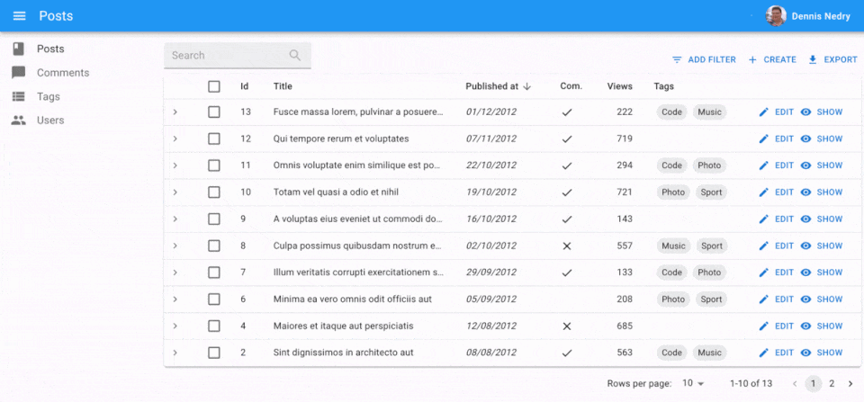
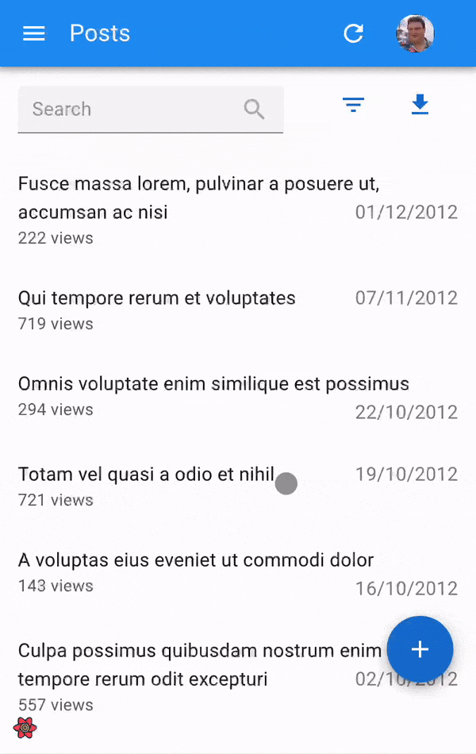

# `<Layout>`

The default react-admin layout renders a horizontal app bar at the top, a navigation menu on the side, and the main content in the center.



In addition, the layout renders the menu as a dropdown on mobile.



React-admin lets you override the app layout using [the `<Admin layout>` prop](./Admin.md#layout). You can use any component you want as layout ; but if you just need to tweak the default layout, you can use the `<Layout>` component.

## Usage

Create a custom layout overriding some of the components of the default layout:

```jsx
// in src/MyLayout.js
import { Layout } from 'react-admin';

import { MyAppBar } from './MyAppBar';

export const MyLayout = props => <Layout {...props} appBar={MyAppBar} />;
```

Then pass this custom layout to the `<Admin>` component:

Instead of the default layout, you can use your own component as the admin layout. Just use the layout prop of the <Admin> component:

```jsx
// in src/App.js
import { MyLayout } from './MyLayout';

const App = () => (
    <Admin layout={MyLayout} dataProvider={...}>
        // ...
    </Admin>
);
```

## Props

| Prop        | Required | Type        | Default  | Description                                                           |
| ----------- | -------- | ----------- | -------- | --------------------------------------------------------------------- |
| `appBar`    | Optional | `Component` | -        | A React component rendered at the top of the layout                   |
| `className` | Optional | `string`    | -        | Passed to the root `<div>` component                                  |
| `error`     | Optional | `Component` | -        | A React component rendered in the content area in case of error       |
| `menu`      | Optional | `Component` | -        | A React component rendered at the side of the screen                  |
| `sx`        | Optional | `SxProps`   | -        | Style overrides, powered by MUI System                                |

React-admin injects more props at runtime based on the `<Admin>` props:

* `dashboard`: The dashboard component. Used to enable the dahboard link in the menu
* `title`: The default page tile, enreder in the AppBar
* `children`: The main content of the page

Any value set for these props in a custom layout will be ignored. That's why you're supposed to pass down the props when creating a layout based on `<Layout>`:

```jsx
// in src/MyLayout.js
import { Layout } from 'react-admin';

import { MyAppBar } from './MyAppBar';

export const MyLayout = props => <Layout {...props} appBar={MyAppBar} />;
```

## `appBar`

Lets you override the top App Bar.

```jsx
// in src/MyLayout.js
import * as React from 'react';
import { Layout } from 'react-admin';

import { MyAppBar } from './MyAppBar';

export const MyLayout = (props) => <Layout {...props} appBar={MyAppBar} />;
```

You can use react-admin's `<AppBar>` as a base for your custom app bar, or the component of your choice. 

By default, react-admin's `<AppBar>` displays the page title. You can override this default by passing children to `<AppBar>` - they will replace the default title. And if you still want to include the page title, make sure you include an element with id `react-admin-title` in the top bar (this uses [React Portals](https://reactjs.org/docs/portals.html)).

Here is a custom app bar component extending `<AppBar>` to include a company logo in the center of the page header:


```jsx
// in src/MyAppBar.js
import * as React from 'react';
import { AppBar } from 'react-admin';
import Typography from '@mui/material/Typography';

import Logo from './Logo';

export const MyAppBar = (props) => (
    <AppBar
        sx={{
            "& .RaAppBar-title": {
                flex: 1,
                textOverflow: "ellipsis",
                whiteSpace: "nowrap",
                overflow: "hidden",
            },
        }}
        {...props}
    >
        <Typography
            variant="h6"
            color="inherit"
            className={classes.title}
            id="react-admin-title"
        />
        <Logo />
        <span className={classes.spacer} />
    </AppBar>
);
```



**Tip**: You can change the color of the `<AppBar>` by setting the `color` prop to `default`, `inherit`, `primary`, `secondary` or `transparent`. The default value is `secondary`.

When react-admin renders the App BAr, it passes two props:

* `open`: a boolean indicating if the sidebar is open or not
* `title`: the page title (if set by the `<Admin>` component)

Your custom AppBar component is free to use these props. 

## `className`

`className` is passed to the root `<div>` component. It lets you style the layout with CSS - but the `sx` prop is preferred.

## `error`

Whenever a client-side error happens in react-admin, the user sees an error page. React-admin uses [React's Error Boundaries](https://reactjs.org/docs/error-boundaries.html) to render this page when any component in the page throws an unrecoverable error. 


If you want to customize this page, or log the error to a third-party service, create your own `<Error>` component, and pass it to a custom Layout, as follows:

```jsx
// in src/MyLayout.js
import { Layout } from 'react-admin';

import { MyError } from './MyError';

export const MyLayout = (props) => <Layout {...props} error={MyError} />;
```

The following snippet is a simplified version of the react-admin `Error` component, that you can use as a base for your own:

```jsx
// in src/MyError.js
import * as React from 'react';
import Button from '@mui/material/Button';
import ErrorIcon from '@mui/icons-material/Report';
import History from '@mui/icons-material/History';
import { Title, useTranslate } from 'react-admin';
import { useLocation } from 'react-router';

export const MyError = ({
    error,
    resetErrorBoundary,
    ...rest
}) => {
    const { pathname } = useLocation();
    const originalPathname = useRef(pathname);

    // Effect that resets the error state whenever the location changes
    useEffect(() => {
        if (pathname !== originalPathname.current) {
            resetErrorBoundary();
        }
    }, [pathname, resetErrorBoundary]);

    const translate = useTranslate();
    return (
        <div>
            <Title title="Error" />
            <h1><ErrorIcon /> Something Went Wrong </h1>
            <div>A client error occurred and your request couldn't be completed.</div>
            {process.env.NODE_ENV !== 'production' && (
                <details>
                    <h2>{translate(error.toString())}</h2>
                    {errorInfo.componentStack}
                </details>
            )}
            <div>
                <Button
                    variant="contained"
                    startIcon={<History />}
                    onClick={() => history.go(-1)}
                >
                    Back
                </Button>
            </div>
        </div>
    );
};
```

## `menu`

Lets you override the menu.

```jsx
// in src/Layout.js
import { Layout } from 'react-admin';

import { MyMenu } from './MyMenu';

export const Layout = (props) => <Layout {...props} menu={MyMenu} />;
```

You can create a custom menu component using react-admin's `<Menu>` and `<MenuItemLink>` components:

```jsx
// in src/MyMenu.js
import * as React from 'react';
import { DashboardMenuItem, Menu, MenuItemLink } from 'react-admin';
import BookIcon from '@mui/icons-material/Book';
import ChatBubbleIcon from '@mui/icons-material/ChatBubble';
import PeopleIcon from '@mui/icons-material/People';
import LabelIcon from '@mui/icons-material/Label';

export const MyMenu = () => (
    <Menu>
        <DashboardMenuItem />
        <MenuItemLink to="/posts" primaryText="Posts" leftIcon={<BookIcon />}/>
        <MenuItemLink to="/comments" primaryText="Comments" leftIcon={<ChatBubbleIcon />}/>
        <MenuItemLink to="/users" primaryText="Users" leftIcon={<PeopleIcon />}/>
        <MenuItemLink to="/custom-route" primaryText="Miscellaneous" leftIcon={<LabelIcon />}/>
    </Menu>
);
```

But you don't have to use react-admin-s `<Menu>` component. In fact, the `<Layout menu>` component can render anything you like, e.g. using [MUI's `<Menu>` component](https://mui.com/material-ui/react-menu/).

**Tip**: If you need a multi-level menu, or a Mega Menu opening panels with custom content, check out [the `ra-navigation` module](https://marmelab.com/ra-enterprise/modules/ra-navigation) (part of the [Enterprise Edition](https://marmelab.com/ra-enterprise))


