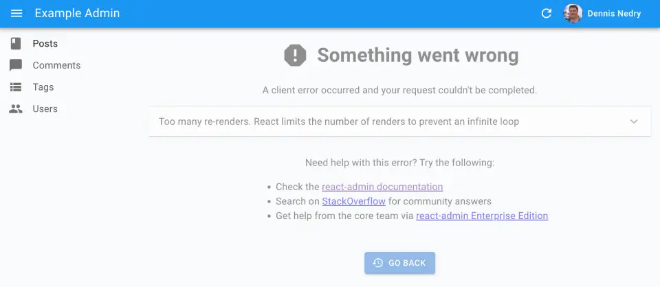

# `<Layout>`

The default react-admin layout renders a horizontal app bar at the top, a navigation menu on the side, and the main content in the center.

<video controls autoplay playsinline muted loop>
  <source src="./img/layout-component.webm" type="video/webm"/>
  <source src="./img/layout-component.mp4" type="video/mp4"/>
  Your browser does not support the video tag.
</video>


In addition, the layout renders the menu as a dropdown on mobile.

<video controls autoplay playsinline muted loop>
  <source src="./img/layout-responsive.webm" type="video/webm"/>
  <source src="./img/layout-responsive.mp4" type="video/mp4"/>
  Your browser does not support the video tag.
</video>


React-admin lets you override the app layout using [the `<Admin layout>` prop](./Admin.md#layout). You can use any component you want as layout ; but if you just need to tweak the default layout, you can use the `<Layout>` component.

## Usage

Create a custom layout overriding some of the components of the default layout:

```jsx
// in src/MyLayout.js
import { Layout } from 'react-admin';

import { MyAppBar } from './MyAppBar';

export const MyLayout = props => <Layout {...props} appBar={MyAppBar} />;
```

Then pass this custom layout to the `<Admin>` component:

Instead of the default layout, you can use your own component as the admin layout. Just use the layout prop of the `<Admin>` component:

```jsx
// in src/App.js
import { MyLayout } from './MyLayout';

const App = () => (
    <Admin layout={MyLayout} dataProvider={...}>
        // ...
    </Admin>
);
```

## Props

| Prop             | Required | Type        | Default  | Description                                                             |
| ---------------- | -------- | ----------- | -------- | ----------------------------------------------------------------------- |
| `appBar`         | Optional | `Component` | -        | A React component rendered at the top of the layout                     |
| `appBarAlwaysOn` | Optional | `boolean`   | -        | When true, the app bar is always visible                                |
| `className`      | Optional | `string`    | -        | Passed to the root `<div>` component                                    |
| `error`          | Optional | `Component` | -        | A React component rendered in the content area in case of error         |
| `menu`           | Optional | `Component` | -        | A React component rendered at the side of the screen                    |
| `sidebar`        | Optional | `Component` | -        | A React component responsible for rendering the menu (e.g. in a drawer) |
| `sx`             | Optional | `SxProps`   | -        | Style overrides, powered by MUI System                                  |

React-admin injects more props at runtime based on the `<Admin>` props:

* `dashboard`: The dashboard component. Used to enable the dahboard link in the menu
* `title`: The default page tile, rendered in the AppBar for error pages
* `children`: The main content of the page

Any value set for these props in a custom layout will be ignored. That's why you're supposed to pass down the props when creating a layout based on `<Layout>`:

```jsx
// in src/MyLayout.js
import { Layout } from 'react-admin';

import { MyAppBar } from './MyAppBar';

export const MyLayout = props => <Layout {...props} appBar={MyAppBar} />;
```

## `appBar`

Lets you override the top App Bar.

```jsx
// in src/MyLayout.js
import * as React from 'react';
import { Layout } from 'react-admin';

import { MyAppBar } from './MyAppBar';

export const MyLayout = (props) => <Layout {...props} appBar={MyAppBar} />;
```

You can use [react-admin's `<AppBar>` component](./AppBar.md) as a base for your custom app bar, or the component of your choice. 

By default, react-admin's `<AppBar>` displays the page title. You can override this default by passing children to `<AppBar>` - they will replace the default title. And if you still want to include the page title defined by each page, make sure you include the `<TitlePortal>` element (which uses [React Portals](https://react.dev/reference/react-dom/createPortal)).

Here is a custom app bar component extending `<AppBar>` to include a company logo in the center of the page header:


```jsx
// in src/MyAppBar.js
import * as React from 'react';
import { AppBar, TitlePortal } from 'react-admin';
import Box from '@mui/material/Box';

import Logo from './Logo';

export const MyAppBar = () => (
    <AppBar color="primary">
        <TitlePortal />
        <Box flex="1" />
        <Logo />
        <Box flex="1" />
    </AppBar>
);
```



Check out the [`<AppBar>` documentation](./AppBar.md) for more information, and for instructions on building your own AppBar.

## `appBarAlwaysOn`

By default, the app bar is hidden when the user scrolls down the page. This is useful to save space on small screens. But if you want to keep the app bar always visible, you can set the `appBarAlwaysOn` prop to `true`.

```jsx
// in src/MyLayout.js
import * as React from 'react';
import { Layout } from 'react-admin';

export const MyLayout = (props) => <Layout {...props} appBarAlwaysOn />;
```

## `className`

`className` is passed to the root `<div>` component. It lets you style the layout with CSS - but the `sx` prop is preferred.

## `error`

Whenever a client-side error happens in react-admin, the user sees an error page. React-admin uses [React's Error Boundaries](https://react.dev/reference/react/Component#catching-rendering-errors-with-an-error-boundary) to render this page when any component in the page throws an unrecoverable error. 



If you want to customize this page, or log the error to a third-party service, create your own `<Error>` component, and pass it to a custom Layout, as follows:

```jsx
// in src/MyLayout.js
import { Layout } from 'react-admin';

import { MyError } from './MyError';

export const MyLayout = (props) => <Layout {...props} error={MyError} />;
```

The following snippet is a simplified version of the react-admin `Error` component, that you can use as a base for your own:

```jsx
// in src/MyError.js
import * as React from 'react';
import Button from '@mui/material/Button';
import ErrorIcon from '@mui/icons-material/Report';
import History from '@mui/icons-material/History';
import { Title, useTranslate } from 'react-admin';
import { useLocation } from 'react-router-dom';

export const MyError = ({
    error,
    resetErrorBoundary,
    ...rest
}) => {
    const { pathname } = useLocation();
    const originalPathname = useRef(pathname);

    // Effect that resets the error state whenever the location changes
    useEffect(() => {
        if (pathname !== originalPathname.current) {
            resetErrorBoundary();
        }
    }, [pathname, resetErrorBoundary]);

    const translate = useTranslate();
    return (
        <div>
            <Title title="Error" />
            <h1><ErrorIcon /> Something Went Wrong </h1>
            <div>A client error occurred and your request couldn't be completed.</div>
            {process.env.NODE_ENV !== 'production' && (
                <details>
                    <h2>{translate(error.toString())}</h2>
                    {errorInfo.componentStack}
                </details>
            )}
            <div>
                <Button
                    variant="contained"
                    startIcon={<History />}
                    onClick={() => history.go(-1)}
                >
                    Back
                </Button>
            </div>
        </div>
    );
};
```

## `menu`

Lets you override the menu.

```jsx
// in src/Layout.js
import { Layout } from 'react-admin';

import { MyMenu } from './MyMenu';

export const Layout = (props) => <Layout {...props} menu={MyMenu} />;
```

You can create a custom menu component using [react-admin's `<Menu>` component](./Menu.md):

```jsx
// in src/MyMenu.js
import * as React from 'react';
import { Menu } from 'react-admin';
import BookIcon from '@mui/icons-material/Book';
import ChatBubbleIcon from '@mui/icons-material/ChatBubble';
import PeopleIcon from '@mui/icons-material/People';
import LabelIcon from '@mui/icons-material/Label';

export const MyMenu = () => (
    <Menu>
        <Menu.DashboardItem />
        <Menu.Item to="/posts" primaryText="Posts" leftIcon={<BookIcon />}/>
        <Menu.Item to="/comments" primaryText="Comments" leftIcon={<ChatBubbleIcon />}/>
        <Menu.Item to="/users" primaryText="Users" leftIcon={<PeopleIcon />}/>
        <Menu.Item to="/custom-route" primaryText="Miscellaneous" leftIcon={<LabelIcon />}/>
    </Menu>
);
```

The `<Layout menu>` component can render any component you like - not just a component based on `<Menu>`.

React-admin provides alternative menu layouts that you can use as a base for your own menu:

- [`<MultiLevelMenu>`](./MultiLevelMenu.md) to render nested menus
- [`<IconMenu>`](./IconMenu.md) for a narrow icon bar with dropdown menus

<video controls autoplay playsinline muted loop>
  <source src="https://marmelab.com/ra-enterprise/modules/assets/ra-multilevelmenu-categories.webm" type="video/webm" />
  <source src="https://marmelab.com/ra-enterprise/modules/assets/ra-multilevelmenu-categories.mp4" type="video/mp4" />
  Your browser does not support the video tag.
</video>

And you can build a totally custom menu using [Material UI's `<Menu>` component](https://mui.com/material-ui/react-menu/).

## `sidebar`

You can override the default sidebar using this prop. The default sidebar will display a permanent drawer when the window size is above Material UI theme's `sm` breakpoint, and a temporary drawer when the window size is less than that.

If you wish to always display a temporary drawer, you can customize using the following sample code:

```jsx
// in src/Layout.js
import * as React from 'react';
import { Layout } from 'react-admin';

import { MySidebar } from './MySidebar';

export const Layout = (props) => <Layout {...props} sidebar={MySidebar} />;


// in src/MySidebar.js
import * as React from 'react';
import { Drawer } from '@mui/material';
import { SidebarClasses, useLocale, useSidebarState } from 'react-admin';

export const MySidebar = ({ children }) => {
    const [open, setOpen] = useSidebarState();
    useLocale(); // force redraw on locale change

    const toggleSidebar = () => setOpen(!open);

    return (
        <Drawer
            variant="temporary"
            open={open}
            onClose={toggleSidebar}
            classes={SidebarClasses}
        >
            {children}
        </Drawer>
    );
};
```

## `sx`: CSS API

Pass an `sx` prop to customize the style of the main component and the underlying elements.


```jsx
export const MyLayout = (props) => (
    <Layout sx={{ '& .RaLayout-appFrame': { marginTop: 55 } }} {...props} />
);
```


This property accepts the following subclasses:

| Rule name                        | Description                                                                               |
|----------------------------------|------------------------------------------------------------------------------------------ |
| `& .RaLayout-appFrame`           | Applied to the application frame containing the appBar, the sidebar, and the main content |
| `& .RaLayout-contentWithSidebar` | Applied to the main part containing the sidebar and the content                           |
| `& .RaLayout-content`            | Applied to the content area                                                               |

To override the style of `<Layout>` using the [Material UI style overrides](https://mui.com/material-ui/customization/theme-components/#theme-style-overrides), use the `RaLayout` key.

**Tip**: If you need to override global styles (like the default font size or family), you should [write a custom theme](./Theming.md#theming) rather than override the `<Layout sx>` prop. And if you need to tweak the default layout to add a right column or move the menu to the top, you're probably better off [writing your own layout component](./Theming.md#layout-from-scratch). 

## Adding A Custom Context

A custom Layout is the ideal place to add an application-wide context. 

For instance, in a multi-tenant application, you may want to add a `tenant` context to your layout.

```jsx
// in src/MyLayout.js
import { Layout } from 'react-admin';

import { TenantContext } from './TenantContext';

const getCookie = (name) => document.cookie
  .split('; ')
  .find(row => row.startsWith(`${name}=`))
  ?.split('=')[1];

export const MyLayout = (props) => (
    <TenantContext.Provider value={getCookie('tenant')}>
        <Layout {...props} />
    </TenantContext.Provider>
);
```

## Adding Developer Tools

A custom layout is also the ideal place to add debug tools, e.g. [react-query devtools](https://react-query-v3.tanstack.com/devtools):

```jsx
// in src/MyLayout.js
import { Layout } from 'react-admin';
import { ReactQueryDevtools } from 'react-query/devtools'

export const MyLayout = (props) => (
    <>
        <Layout {...props} />
        <ReactQueryDevtools />
    </>
);
```


## Alternative Layouts

If you can't configure `<Layout>` to render the layout you want, you can use an alternative layout component, such as [`<ContainerLayout>`](./ContainerLayout.md): A centered layout with horizontal navigation.


You can also write your own layout component from scratch. Check [the Theming documentation](./Theming.md#using-a-custom-layout) for examples
