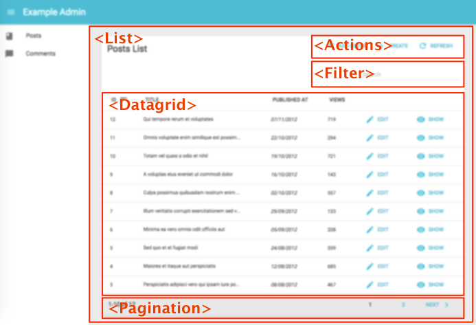
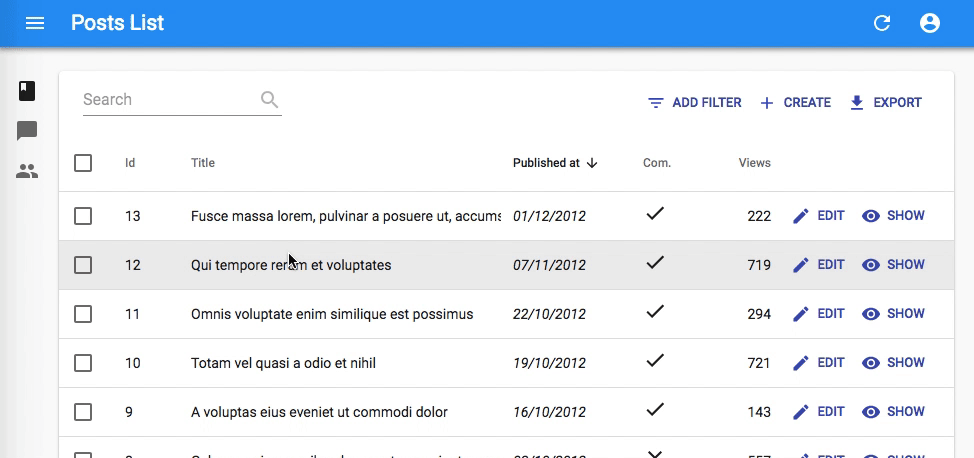
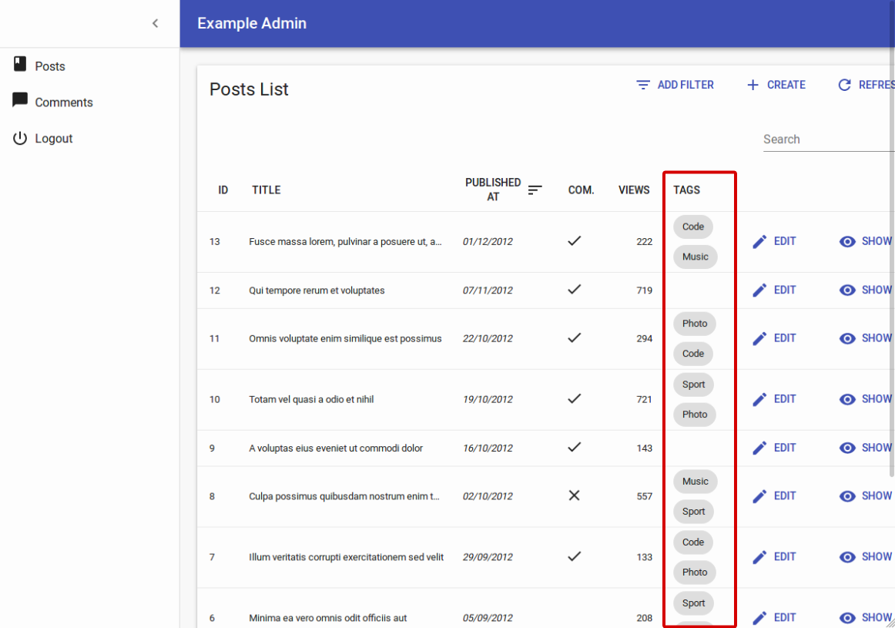
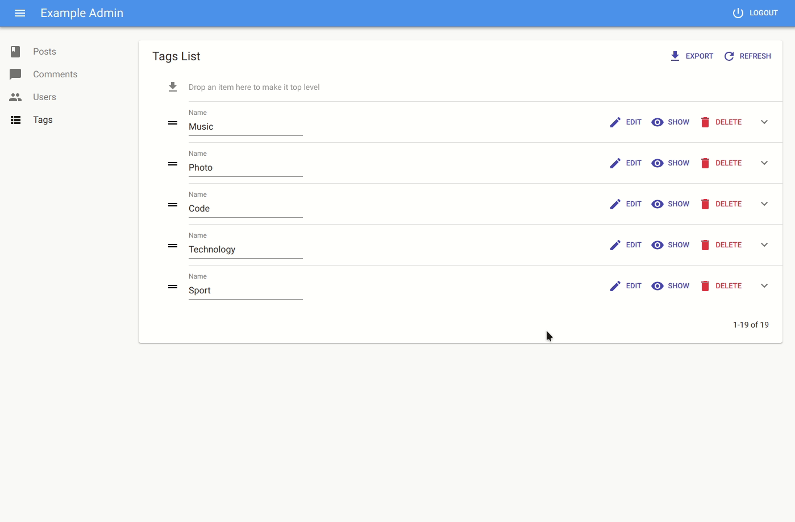
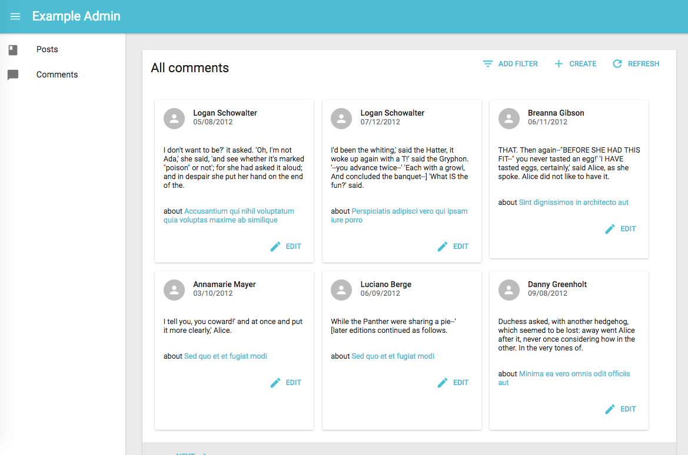

# The List View

The List view displays a list of records fetched from the REST API. The entry point for this view is the `<List>` component, which takes care of fetching the data. Then, it passes the data to an iterator view - usually `<Datagrid>`, which then delegates the rendering of each record property to [`<Field>`](./Fields.md) components.



## The `<List>` Component

The `<List>` component renders the list layout (title, buttons, filters, pagination), and fetches the list of records from the REST API. It then delegates the rendering of the list of records to its child component. Usually, it's a `<Datagrid>`, responsible for displaying a table with one row for each post.

**Tip**: In Redux terms, `<List>` is a connected component, and `<Datagrid>` is a dumb component.

Here are all the props accepted by the `<List>` component:

* [`title`](#page-title)
* [`actions`](#actions)
* [`exporter`](#exporter)
* [`bulkActionButtons`](#bulk-action-buttons)
* [`filters`](#filters) (a React element used to display the filter form)
* [`perPage`](#records-per-page)
* [`sort`](#default-sort-field)
* [`filter`](#permanent-filter) (the permanent filter used in the REST request)
* [`filterDefaultValues`](#filter-default-values) (the default values for `alwaysOn` filters)
* [`pagination`](#pagination)
* [`aside`](#aside-component)

Here is the minimal code necessary to display a list of posts:

```jsx
// in src/App.js
import React from 'react';
import { Admin, Resource } from 'react-admin';
import jsonServerProvider from 'ra-data-json-server';

import { PostList } from './posts';

const App = () => (
    <Admin dataProvider={jsonServerProvider('http://jsonplaceholder.typicode.com')}>
        <Resource name="posts" list={PostList} />
    </Admin>
);

export default App;

// in src/posts.js
import React from 'react';
import { List, Datagrid, TextField } from 'react-admin';

export const PostList = (props) => (
    <List {...props}>
        <Datagrid>
            <TextField source="id" />
            <TextField source="title" />
            <TextField source="body" />
        </Datagrid>
    </List>
);
```

That's enough to display the post list:


### Page Title

The default title for a list view is "[resource] list" (e.g. "Posts list"). Use the `title` prop to customize the List view title:

```jsx
// in src/posts.js
export const PostList = (props) => (
    <List {...props} title="List of posts">
        ...
    </List>
);
```

The title can be either a string, or an element of your own.

### Actions

You can replace the list of default actions by your own element using the `actions` prop:

```jsx
import Button from '@material-ui/core/Button';
import { CardActions, CreateButton, ExportButton, RefreshButton } from 'react-admin';

const PostActions = ({
    bulkActions,
    basePath,
    currentSort,
    displayedFilters,
    exporter,
    filters,
    filterValues,
    onUnselectItems,
    resource,
    selectedIds,
    showFilter
}) => (
    <CardActions>
        {bulkActions && React.cloneElement(bulkActions, {
            basePath,
            filterValues,
            resource,
            selectedIds,
            onUnselectItems,
        })}
        {filters && React.cloneElement(filters, {
            resource,
            showFilter,
            displayedFilters,
            filterValues,
            context: 'button',
        }) }
        <CreateButton basePath={basePath} />
        <ExportButton
            resource={resource}
            sort={currentSort}
            filter={filterValues}
            exporter={exporter}
        />
        <RefreshButton />
        {/* Add your custom actions */}
        <Button primary onClick={customAction}>Custom Action</Button>
    </CardActions>
);

export const PostList = (props) => (
    <List {...props} actions={<PostActions />}>
        ...
    </List>
);
```

You can also use such a custom `ListActions` prop to omit or reorder buttons based on permissions. Just pass the `permissions` down from the `List` component:

```jsx
export const PostList = ({ permissions, ...props }) => (
    <List {...props} actions={<PostActions permissions={permissions} />}>
        ...
    </List>
);
```

### Exporter

Among the default list actions, react-admin includes an `<ExportButton>`. By default, clicking this button will:

1. Call the `dataProvider` with the current sort and filter (but without pagination),
2. Transform the result into a CSV string,
3. Download the CSV file.

The columns of the CSV file match all the fields of the records in the `dataProvider` response. That means that the export doesn't take into account the selection and ordering of fields in your `<List>` via `Field` components. If you want to customize the result, pass a custom `exporter` function to the `<List>`. This function will receive the data from the `dataProvider` (after step 1), and replace steps 2-3 (i.e. it's in charge of transforming, converting, and downloading the file).

**Tip**: For CSV conversion, you can import [Papaparse](https://www.papaparse.com/), a CSV parser and stringifier which is already a react-admin dependency. And for CSV download, take advantage of react-admin's `downloadCSV` function.

Here is an example for a Posts exporter, omitting, adding, and reordering fields:

```jsx
// in PostList.js
import { List, downloadCSV } from 'react-admin';
import { unparse as convertToCSV } from 'papaparse/papaparse.min';

const exporter = posts => {
    const postsForExport = posts.map(post => {
        const { postForExport, backlinks, author } = post; // omit backlinks and author
        postForExport.author_name = post.author.name; // add a field
        return postForExport;
    });
    const csv = convertToCSV({
        data: postsForExport,
        fields: ['id', 'title', 'author_name', 'body'] // order fields in the export
    });
    downloadCSV(csv, 'posts'); // download as 'posts.csv` file
})

const PostList = props => (
    <List {...props} exporter={exporter}>
        ...
    </List>
)
```

In many cases, you'll need more than simple object manipulation. You'll need to *augment* your objects based on relationships. For instance, the export for comments should include the title of the related post - but the export only exposes a `post_id` by default. For that purpose, the exporter receives a `fetchRelatedRecords` function as second parameter. It fetches related records using your `dataProvider` and Redux, and returns a promise.

Here is an example for a Comments exporter, fetching related Posts:

```jsx
// in CommentList.js
import { List, downloadCSV } from 'react-admin';
import { unparse as convertToCSV } from 'papaparse/papaparse.min';

const exporter = (records, fetchRelatedRecords) => {
    fetchRelatedRecords(records, 'post_id', 'posts').then(posts => {
        const data = posts.map(record => ({
                ...record,
                post_title: posts[record.post_id].title,
        }));
        const csv = convertToCSV({
            data,
            fields: ['id', 'post_id', 'post_title', 'body'],
        });
        downloadCSV(csv, 'comments');
    });
};

const CommentList = props => (
    <List {...props} exporter={exporter}>
        ...
    </List>
)
```

Under the hood, `fetchRelatedRecords()` uses react-admin's sagas, which trigger the loading spinner while loading. As a bonus, all the records fetched during an export are kepts in the main Redux store, so further browsing the admin will be accelerated.

**Tip**: If you need to call another `dataProvider` verb in the exporter, take advantage of the third parameter passed to the function: `dispatch()`. It allows you to call any Redux action. Combine it with [the `callback` side effect](./Actions.md#custom-sagas) to grab the result in a callback.

**Tip**: The `<ExportButton>` limits the main request to the `dataProvider` to 1,000 records. If you want to increase or decrease this limit, pass a `maxResults` prop to the `<ExportButton>` in a custom `<ListActions>` component, as explained in the previous section.

**Tip**: For complex (or large) exports, fetching all the related records and assembling them client-side can be slow. In that case, create the CSV on the server side, and replace the `<ExportButton>` component by a custom one, fetching the CSV route.

### Bulk Action Buttons

Bulk action buttons are buttons that affect several records at once, like mass deletion for instance. In the `<Datagrid>` component, the bulk actions toolbar appears when a user ticks the checkboxes in the first column of the table. The user can then choose a button from the bulk actions toolbar. By default, all list views have a single bulk action button, the bulk delete button. You can add other bulk action buttons by passing a custom element as the `bulkActionButtons` prop of the `<List>` component:

```jsx
import React, { Fragment } from 'react';
import Button from '@material-ui/core/Button';
import { BulkDeleteButton } from 'react-admin';
import ResetViewsButton from './ResetViewsButton';

const PostBulkActionButtons = props => (
    <Fragment>
        <ResetViewsButton label="Reset Views" {...props} />
        {/* Add the default bulk delete action */}
        <BulkDeleteButton {...props} />
    </Fragment>
);

export const PostList = (props) => (
    <List {...props} bulkActionButtons={<PostBulkActionButtons />}>
        ...
    </List>
);
```



**Tip**: You can also disable bulk actions altogether by passing `false` to the `bulkActionButtons` prop. When using a `Datagrid` inside a `List` with disabled bulk actions, the checkboxes column won't be added.

Bulk action button components receive several props allowing them to perform their job:

* `resource`: the currently displayed resource (eg `posts`, `comments`, etc.)
* `basePath`: the current router base path for the resource (eg `/posts`, `/comments`, etc.)
* `filterValues`: the filter values. This can be useful if you want to apply your action on all items matching the filter.
* `selectedIds`: the identifiers of the currently selected items.

Here is an example leveraging the `UPDATE_MANY` crud action, which will set the `views` property of all posts to `0`:

```jsx
// in ./ResetViewsButton.js
import React, { Component } from 'react';
import { connect } from 'react-redux';
import { Button, crudUpdateMany } from 'react-admin';

class ResetViewsButton extends Component {
    handleClick = () => {
        const { basePath, crudUpdateMany, resource, selectedIds } = this.props;
        crudUpdateMany(resource, selectedIds, { views: 0 }, basePath);
    };

    render() {
        return (
            <Button label="Reset Views" onClick={this.handleClick} />
        );
    }
}

export default connect(undefined, { crudUpdateMany })(ResetViewsButton);
```

But most of the time, bulk actions are mini-applications with a standalone user interface (in a Dialog). Here is the same `ResetViewsAction` implemented behind a confirmation dialog:

```jsx
// in ./ResetViewsButton.js
import React, { Fragment, Component } from 'react';
import { connect } from 'react-redux';
import { Button, Confirm, crudUpdateMany } from 'react-admin';

class ResetViewsButton extends Component {
    state = {
        isOpen: false,
    }

    handleClick = () => {
        this.setState({ isOpen: true });
    }

    handleDialogClose = () => {
        this.setState({ isOpen: false });
    };

    handleConfirm = () => {
        const { basePath, crudUpdateMany, resource, selectedIds } = this.props;
        crudUpdateMany(resource, selectedIds, { views: 0 }, basePath);
        this.setState({ isOpen: true });
    };

    render() {
        return (
            <Fragment>
                <Button label="Reset Views" onClick={this.handleClick} />
                <Confirm
                    isOpen={this.state.isOpen}
                    title="Update View Count"
                    content="Are you sure you want to reset the views for these items?"
                    onConfirm={this.handleConfirm}
                    onClose={this.handleDialogClose}
                />
            </Fragment>
        );
    }
}

export default connect(undefined, { crudUpdateMany })(ResetViewsButton);
```

**Tip**: `<Confirm>` leverages material-ui's `<Dialog>` component to implement a confirmation popup. Feel free to use it in your admins!

**Tip**: React-admin doesn't use the `<Confirm>` component internally, because deletes and updates are applied locally immediately, then dispatched to the server after a few seconds, unless the user chooses to undo the modification. That's what we call optimistic rendering. You can do the same for the `ResetViewsButton` by wrapping the `crudUpdateMany()` action creator inside a `startUndoable()` action creator, as follows:

```jsx
// in ./ResetViewsButton.js
import React, { Component } from 'react';
import { connect } from 'react-redux';
import { Button, crudUpdateMany, startUndoable } from 'react-admin';

class ResetViewsButton extends Component {
    handleClick = () => {
        const {  basePath, resource, selectedIds, startUndoable } = this.props;
        startUndoable(
            crudUpdateMany(resource, selectedIds, { views: 0 }, basePath)
        );
    };

    render() {
        return (
            <Button label="Reset Views" onClick={this.handleClick} />
        );
    }
}

export default connect(undefined, { startUndoable })(ResetViewsButton);
```

Note that the `crudUpdateMany` action creator is *not* present in the `mapDispatchToProps` argument of `connect()` in that case. Only `startUndoable` needs to be dispatched in this case, using the result of the `crudUpdateMany()` call as parameter.

### Filters

You can add a filter element to the list using the `filters` prop:

```jsx
const PostFilter = (props) => (
    <Filter {...props}>
        <TextInput label="Search" source="q" alwaysOn />
        <TextInput label="Title" source="title" defaultValue="Hello, World!" />
    </Filter>
);

export const PostList = (props) => (
    <List {...props} filters={<PostFilter />}>
        ...
    </List>
);
```

The filter component must be a `<Filter>` with `<Input>` children.

**Tip**: `<Filter>` is a special component, which renders in two ways:

- as a filter button (to add new filters)
- as a filter form (to enter filter values)

It does so by inspecting its `context` prop.

**Tip**: Don't mix up this `filters` prop, expecting a React element, with the `filter` props, which expects an object to define permanent filters (see below).

The `Filter` component accepts the usual `className` prop but you can override many class names injected to the inner components by React-admin thanks to the `classes` property (as most Material UI components, see their [documentation about it](https://material-ui.com/customization/overrides/#overriding-with-classes)). This property accepts the following keys:

* `form`: applied to the root element when rendering as a form.
* `button`: applied to the root element when rendering as a button.

Children of the `<Filter>` form are regular inputs. `<Filter>` hides them all by default, except those that have the `alwaysOn` prop.

**Tip**: For technical reasons, react-admin does not accept children of `<Filter>` having both a `defaultValue` and `alwaysOn`. To set default values for always on filters, use the `filterDefaultValues` prop of the `<List>` component instead (see below).

### Records Per Page

By default, the list paginates results by groups of 10. You can override this setting by specifying the `perPage` prop:

```jsx
// in src/posts.js
export const PostList = (props) => (
    <List {...props} perPage={25}>
        ...
    </List>
);
```

### Default Sort Field

Pass an object literal as the `sort` prop to determine the default `field` and `order` used for sorting:


```jsx
// in src/posts.js
export const PostList = (props) => (
    <List {...props} sort={{ field: 'published_at', order: 'DESC' }}>
        ...
    </List>
);
```


`sort` defines the *default* sort order ; the list remains sortable by clicking on column headers.

### Disabling Sorting

It is possible to disable sorting for a specific field by passing a `sortable` property set to `false`:


```jsx
// in src/posts.js
import React from 'react';
import { List, Datagrid, TextField } from 'react-admin';

export const PostList = (props) => (
    <List {...props}>
        <Datagrid>
            <TextField source="id" sortable={false} />
            <TextField source="title" />
            <TextField source="body" />
        </Datagrid>
    </List>
);
```


### Specify Sort Field

By default, a column is sorted by the `source` property. To define another attribute to sort by, set it via the `sortBy` property:


```jsx
// in src/posts.js
import React from 'react';
import { List, Datagrid, TextField } from 'react-admin';

export const PostList = (props) => (
    <List {...props}>
        <Datagrid>
            <ReferenceField label="Post" source="id" reference="posts" sortBy="title">
                <TextField source="title" />
            </ReferenceField>
            <FunctionField
                label="Author"
                sortBy="last_name"
                render={record => `${record.author.first_name} ${record.author.last_name}`}
            />
            <TextField source="body" />
        </Datagrid>
    </List>
);
```


### Permanent Filter

You can choose to always filter the list, without letting the user disable this filter - for instance to display only published posts. Write the filter to be passed to the REST client in the `filter` props:


```jsx
// in src/posts.js
export const PostList = (props) => (
    <List {...props} filter={{ is_published: true }}>
        ...
    </List>
);
```


The actual filter parameter sent to the REST client is the result of the combination of the *user* filters (the ones set through the `filters` component form), and the *permanent* filter. The user cannot override the permanent filters set by way of `filter`.

### Filter Default Values

To set default values to filters, you can either pass an object literal as the `filterDefaultValues` prop of the `<List>` element, or use the `defaultValue` prop of any input component.

There is one exception: inputs with `alwaysOn` don't accept `defaultValue`. You have to use the `filterDefaultValues` for those.


```jsx
// in src/posts.js
const PostFilter = (props) => (
    <Filter {...props}>
        <TextInput label="Search" source="q" alwaysOn />
        <BooleanInput source="is_published" alwaysOn />
        <TextInput source="title" defaultValue="Hello, World!" />
    </Filter>
);

export const PostList = (props) => (
    <List {...props} filters={<PostFilter />} filterDefaultValues={{ is_published: true }}>
        ...
    </List>
);
```


**Tip**: The `filter` and `filterDefaultValues` props have one key difference: the `filterDefaultValues` can be overridden by the user, while the `filter` values are always sent to the data provider. Or, to put it otherwise:

```js
const filterSentToDataProvider = { ...filterDefaultValues, ...filterChosenByUser, ...filters };
```

### Pagination

You can replace the default pagination element by your own, using the `pagination` prop. The pagination element receives the current page, the number of records per page, the total number of records, as well as a `setPage()` function that changes the page.

For instance, you can modify the default pagination by adjusting the "rows per page" selector.

```jsx
// in src/MyPagination.js
import { Pagination } from 'react-admin';

const PostPagination = props => <Pagination rowsPerPageOptions={[10, 25, 50, 100]} {...props} />

export const PostList = (props) => (
    <List {...props} pagination={<PostPagination />}>
        ...
    </List>
);
```

**Tip**: Pass an empty array to `rowsPerPageOptions` to disable the rows per page selection.

Alternately, if you want to replace the default pagination by a "<previous - next>" pagination, create a pagination component like the following:

```jsx
import Button from '@material-ui/core/Button';
import ChevronLeft from '@material-ui/icons/ChevronLeft';
import ChevronRight from '@material-ui/icons/ChevronRight';
import Toolbar from '@material-ui/core/Toolbar';

const PostPagination = ({ page, perPage, total, setPage }) => {
    const nbPages = Math.ceil(total / perPage) || 1;
    return (
        nbPages > 1 &&
            <Toolbar>
                {page > 1 &&
                    <Button primary key="prev" icon={<ChevronLeft />} onClick={() => setPage(page - 1)}>
                        Prev
                    </Button>
                }
                {page !== nbPages &&
                    <Button primary key="next" icon={<ChevronRight />} onClick={() => setPage(page + 1)} labelPosition="before">
                        Next
                    </Button>
                }
            </Toolbar>
    );
}

export const PostList = (props) => (
    <List {...props} pagination={<PostPagination />}>
        ...
    </List>
);
```

### Aside component

You may want to display additional information on the side of the list. Use the `aside` prop for that, passing the component of your choice:

```jsx
const Aside = () => (
    <div style={{ width: 200, margin: '1em' }}>
        <Typography variant="title">Post details</Typography>
        <Typography variant="body1">
            Posts will only be published one an editor approves them
        </Typography>
    </div>
);

const PostList = props => (
    <List aside={<Aside />} {...props}>
        ...
    </List>
```

The `aside` component receives the same props as the `List` child component, including the following:

* `basePath`,
* `currentSort`,
* `data`,
* `defaultTitle`,
* `filterValues`,
* `ids`,
* `page`,
* `perPage`,
* `resource`,
* `selectedIds`,
* `total`,
* `version`,

That means you can display additional details of the current list in the aside component:

```jsx
const Aside = ({ data, ids }) => (
    <div style={{ width: 200, margin: '1em' }}>
        <Typography variant="title">Posts stats</Typography>
        <Typography variant="body1">
            Total views: {ids.map(id => data[id]).reduce((sum, post) => sum + post.views)}
        </Typography>
    </div>
);
```

### CSS API

The `List` component accepts the usual `className` prop but you can override many class names injected to the inner components by React-admin thanks to the `classes` property (as most Material UI components, see their [documentation about it](https://material-ui.com/customization/overrides/#overriding-with-classes)). This property accepts the following keys:

* `root`: alternative to using `className`. Applied to the root element.
* `header`: applied to the page header
* `actions`: applied to the actions container
* `noResults`: applied to the component shown when there is no result

Here is an example of how you can override some of these classes:

You can customize the list styles by passing a `classes` object as prop, through `withStyles()`. Here is an example:


```jsx
const styles = {
    header: {
        backgroundColor: '#ccc',
    },
};

const PostList = ({ classes, ...props) => (
    <List {...props} classes={{ header: classes.header }}>
        <Datagrid>
            ...
        </Datagrid>
    </List>
);

export withStyles(styles)(PostList);
```


## The `<Datagrid>` component

The datagrid component renders a list of records as a table. It is usually used as a child of the [`<List>`](#the-list-component) and [`<ReferenceManyField>`](./Fields.md#referencemanyfield) components.

Here are all the props accepted by the component:

* [`rowStyle`](#row-style-function)

It renders as many columns as it receives `<Field>` children.

```jsx
// in src/posts.js
import React from 'react';
import { List, Datagrid, TextField, EditButton } from 'react-admin';

export const PostList = (props) => (
    <List {...props}>
        <Datagrid>
            <TextField source="id" />
            <TextField source="title" />
            <TextField source="body" />
            <EditButton />
        </Datagrid>
    </List>
);
```

The datagrid is an *iterator* component: it receives an array of ids, and a data store, and is supposed to iterate over the ids to display each record. Another example of iterator component is [`<SingleFieldList>`](#the-singlefieldlist-component).

### Row Style Function

You can customize the datagrid row style (applied to the `<tr>` element) based on the record, thanks to the `rowStyle` prop, which expects a function.

For instance, this allows to apply a custom background to the entire row if one value of the record - like its number of views - passes a certain threshold.

```jsx
const postRowStyle = (record, index) => ({
    backgroundColor: record.nb_views >= 500 ? '#efe' : 'white',
});
export const PostList = (props) => (
    <List {...props}>
        <Datagrid rowStyle={postRowStyle}>
            ...
        </Datagrid>
    </List>
);
```

### CSS API

The `Datagrid` component accepts the usual `className` prop but you can override many class names injected to the inner components by React-admin thanks to the `classes` property (as most Material UI components, see their [documentation about it](https://material-ui.com/customization/overrides/#overriding-with-classes)). This property accepts the following keys:

* `table`: alternative to using `className`. Applied to the root element.
* `tbody`: applied to the tbody
* `headerCell`: applied to each header cell
* `row`: applied to each row
* `rowEven`: applied to each even row
* `rowOdd`: applied to each odd row
* `rowCell`: applied to each row cell

Here is an example of how you can override some of these classes:

You can customize the datagrid styles by passing a `classes` object as prop, through `withStyles()`. Here is an example:


```jsx
const styles = {
    row: {
        backgroundColor: '#ccc',
    },
};

const PostList = ({ classes, ...props) => (
    <List {...props}>
        <Datagrid classes={{ row: classes.row }}>
            ...
        </Datagrid>
    </List>
);

export withStyles(styles)(PostList);
```


**Tip**: If you want to override the `header` and `cell` styles independently for each column, use the `headerClassName` and `cellClassName` props in `<Field>` components. For instance, to hide a certain column on small screens:

```jsx
import { withStyles } from '@material-ui/core/styles';

const styles = theme => ({
    hiddenOnSmallScreens: {
        [theme.breakpoints.down('md')]: {
            display: 'none',
        },
    },
});

const PostList = ({ classes, ...props }) => (
    <List {...props}>
        <Datagrid>
            <TextField source="id" />
            <TextField source="title" />
            <TextField
                source="views"
                headerClassName={classes.hiddenOnSmallScreens}
                cellClassName={classes.hiddenOnSmallScreens}
            />
        </Datagrid>
    </List>
);

export default withStyles(styles)(PostList);
```

## The `<SimpleList>` component

For mobile devices, a `<Datagrid>` is often unusable - there is simply not enough space to display several columns. The convention in that case is to use a simple list, with only one column per row. The `<SimpleList>` component serves that purpose, leveraging [material-ui's `<List>` and `<ListItem>` components](http://www.material-ui.com/#/components/list). You can use it as `<List>` or `<ReferenceManyField>` child:

```jsx
// in src/posts.js
import React from 'react';
import { List, SimpleList } from 'react-admin';

export const PostList = (props) => (
    <List {...props}>
        <SimpleList
            primaryText={record => record.title}
            secondaryText={record => `${record.views} views`}
            tertiaryText={record => new Date(record.published_at).toLocaleDateString()}
        />
    </List>
);
```

`<SimpleList>` iterates over the list data. For each record, it executes the `primaryText`, `secondaryText`, `leftAvatar`, `leftIcon`, `rightAvatar`, and `rightIcon` props function, and passes the result as the corresponding `<ListItem>` prop.

**Tip**: To use a `<SimpleList>` on small screens and a `<Datagrid>` on larger screens, use the `<Responsive>` component:

```jsx
// in src/posts.js
import React from 'react';
import { List, Responsive, SimpleList, Datagrid, TextField, ReferenceField, EditButton } from 'react-admin';

export const PostList = (props) => (
    <List {...props}>
        <Responsive
            small={
                <SimpleList
                    primaryText={record => record.title}
                    secondaryText={record => `${record.views} views`}
                    tertiaryText={record => new Date(record.published_at).toLocaleDateString()}
                />
            }
            medium={
                <Datagrid>
                    ...
                </Datagrid>
            }
        />
    </List>
);
```

**Tip**: The `<SimpleList>` items link to the edition page by default. You can set the `linkType` prop to `show` to link to the `<Show>` page instead.

```jsx
// in src/posts.js
import React from 'react';
import { List, SimpleList } from 'react-admin';

export const PostList = (props) => (
    <List {...props}>
        <SimpleList
            primaryText={record => record.title}
            secondaryText={record => `${record.views} views`}
            tertiaryText={record => new Date(record.published_at).toLocaleDateString()}
            linkType="show"
        />
    </List>
);
```

Setting the `linkType` prop to `false` (boolean, not string) removes the link in all list items.

## The `<SingleFieldList>` component

When you want to display only one property of a list of records, instead of using a `<Datagrid>`, use the `<SingleFieldList>`. It expects a single `<Field>` as child. It's especially useful for `<ReferenceManyField>` or `<ReferenceArrayField>` components:

```jsx
// Display all the tags for the current post
<ReferenceArrayField
    label="Tags"
    reference="tags"
    source="tags"
>
    <SingleFieldList>
        <ChipField source="name" />
    </SingleFieldList>
</ReferenceArrayField>
```



**Tip**: The `<SingleFieldList>` items link to the edition page by default. You can set the `linkType` prop to `show` to link to the `<Show>` page instead.

```jsx
// Display all the tags for the current post
<ReferenceArrayField
    label="Tags"
    reference="tags"
    source="tags"
>
    <SingleFieldList linkType="show">
        <ChipField source="name" />
    </SingleFieldList>
</ReferenceArrayField>
```

## The `<Tree>` component

When you want to display a hierarchized list of records, instead of using a `<Datagrid>`, use the `<Tree>` component. This component is available in an addon package: [`ra-tree-ui-materialui`](https://github.com/marmelab/react-admin/blob/master/packages/ra-tree-ui-materialui/README.md).

*Important*: This package is part of our [Labs](/Labs.md) experimentations. This means it misses some features and might not handle all corner cases. Use it at your own risks. Besides, we would really appreciate some feedback!

It expects that every resource returned from the `List` has a `parent_id` property by default:

```json
[
    { "id": 1, "name": "Clothing" },
    { "id": 2, "name": "Men", "parent_id": 1 },
    { "id": 3, "name": "Suits", "parent_id": 2 },
    { "id": 6, "name": "Women", "parent_id": 1 },
    { "id": 7, "name": "Dresses", "parent_id": 6 },
    { "id": 10, "name": "Skirts", "parent_id": 6 },
    { "id": 11, "name": "Blouses", "parent_id": 6 }
]
```

Here's an example showing how to use it:

```jsx
// in src/categories.js
import React from 'react';
import { List, TextField, EditButton, DeleteButton } from 'react-admin';
import { Tree, NodeView, NodeActions } from 'ra-tree-ui-materialui';

const CategoriesActions = props => (
    <NodeActions {...props}>
        <EditButton />
        <DeleteButton />
    </NodeActions>
);

export const CategoriesList = (props) => (
    <List {...props} perPage={10000}>
        <Tree>
            <NodeView actions={<CategoriesActions />}>
                <TextField source="name" />
            </NodeView>
        </Tree>
    </List>
);
```



**Tip**: The `<Tree>` component supports drag & drop operations:

```jsx
export const CategoriesList = (props) => (
    <List {...props} perPage={10000}>
        <Tree enableDragAndDrop>
            <NodeView actions={<CategoriesActions />}>
                <TextField source="name" />
            </NodeView>
        </Tree>
    </List>
);
```

To learn more about this component features, please refers to its [README](https://github.com/marmelab/react-admin/blob/master/packages/ra-tree-ui-materialui/README.md).

## Using a Custom Iterator

A `<List>` can delegate to any iterator component - `<Datagrid>` is just one example. An iterator component must accept at least two props:

- `ids` is an array of the ids currently displayed in the list
- `data` is an object of all the fetched data for this resource, indexed by id.

For instance, what if you prefer to show a list of cards rather than a datagrid?



You'll need to create your own iterator component as follows:


```jsx
// in src/comments.js
import Card from '@material-ui/core/Card';
import CardActions from '@material-ui/core/CardActions';
import CardContent from '@material-ui/core/CardContent';
import CardHeader from '@material-ui/core/CardHeader';

const cardStyle = {
    width: 300,
    minHeight: 300,
    margin: '0.5em',
    display: 'inline-block',
    verticalAlign: 'top'
};
const CommentGrid = ({ ids, data, basePath }) => (
    <div style={{ margin: '1em' }}>
    {ids.map(id =>
        <Card key={id} style={cardStyle}>
            <CardHeader
                title={<TextField record={data[id]} source="author.name" />}
                subheader={<DateField record={data[id]} source="created_at" />}
                avatar={<Avatar icon={<PersonIcon />} />}
            />
            <CardContent>
                <TextField record={data[id]} source="body" />
            </CardContent>
            <CardContent>
                about&nbsp;
                <ReferenceField label="Post" resource="comments" record={data[id]} source="post_id" reference="posts" basePath={basePath}>
                    <TextField source="title" />
                </ReferenceField>
            </CardContent>
            <CardActions style={{ textAlign: 'right' }}>
                <EditButton resource="posts" basePath={basePath} record={data[id]} />
            </CardActions>
        </Card>
    )}
    </div>
);
CommentGrid.defaultProps = {
    data: {},
    ids: [],
};

export const CommentList = (props) => (
    <List title="All comments" {...props}>
        <CommentGrid />
    </List>
);
```


As you can see, nothing prevents you from using `<Field>` components inside your own components... provided you inject the current `record`. Also, notice that components building links require the `basePath` component, which is also injected.

## Displaying Fields depending on the user permissions

You might want to display some fields or filters only to users with specific permissions. Those permissions are retrieved for each route and will provided to your component as a `permissions` prop.

Each route will call the `authProvider` with the `AUTH_GET_PERMISSIONS` type and some parameters including the current location and route parameters. It's up to you to return whatever you need to check inside your component such as the user's role, etc.


```jsx
const UserFilter = ({ permissions, ...props }) =>
    <Filter {...props}>
        <TextInput
            label="user.list.search"
            source="q"
            alwaysOn
        />
        <TextInput source="name" />
        {permissions === 'admin' ? <TextInput source="role" /> : null}
    </Filter>;

export const UserList = ({ permissions, ...props }) =>
    <List
        {...props}
        filters={<UserFilter permissions={permissions} />}
        sort={{ field: 'name', order: 'ASC' }}
    >
        <Responsive
            small={
                <SimpleList
                    primaryText={record => record.name}
                    secondaryText={record =>
                        permissions === 'admin' ? record.role : null}
                />
            }
            medium={
                <Datagrid>
                    <TextField source="id" />
                    <TextField source="name" />
                    {permissions === 'admin' && <TextField source="role" />}
                    {permissions === 'admin' && <EditButton />}
                    <ShowButton />
                </Datagrid>
            }
        />
    </List>;
```


**Tip** Note how the `permissions` prop is passed down to the custom `filters` component.
