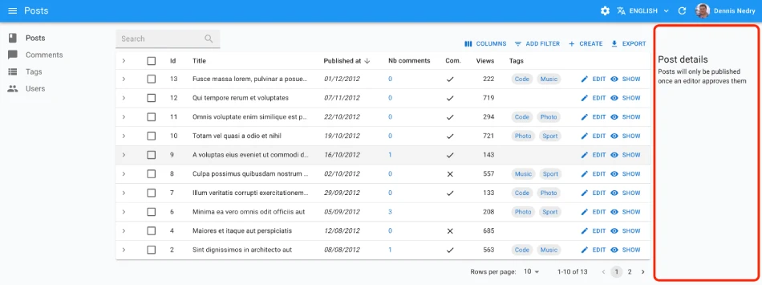

# `<List>`

The `<List>` component is the root component for list pages. It fetches a list of records from the data provider, puts it in a [`ListContext`](./useListContext.md), renders the default list page layout (title, buttons, filters, pagination), and renders its children. Usual children of `<List>`, like [`<Datagrid>`](./Datagrid.md), are responsible for displaying the list of records.

<iframe src="https://www.youtube-nocookie.com/embed/NNNPPmEMz6s" title="YouTube video player" frameborder="0" allow="accelerometer; autoplay; clipboard-write; encrypted-media; gyroscope; picture-in-picture; web-share" allowfullscreen style="aspect-ratio: 16 / 9;width:100%;"></iframe>

## Usage

Here is the minimal code necessary to display a list of posts using a [`<Datagrid>`](./Datagrid.md):

```jsx
// in src/posts.jsx
import { List, Datagrid, TextField, DateField, BooleanField } from 'react-admin';

export const PostList = () => (
    <List>
        <Datagrid>
            <TextField source="id" />
            <TextField source="title" />
            <DateField source="published_at" />
            <TextField source="category" />
            <BooleanField source="commentable" />
        </Datagrid>
    </List>
);

// in src/App.jsx
import { Admin, Resource } from 'react-admin';
import jsonServerProvider from 'ra-data-json-server';

import { PostList } from './posts';

const App = () => (
    <Admin dataProvider={jsonServerProvider('https://jsonplaceholder.typicode.com')}>
        <Resource name="posts" list={PostList} />
    </Admin>
);

export default App;
```

That's enough to display a basic post list, with functional sort and pagination.


You can find more advanced examples of `<List>` usage in the [demos](./Demos.md).

## Props

| Prop                      | Required | Type           | Default        | Description                                                                                  |
|---------------------------|----------|----------------|----------------|----------------------------------------------------------------------------------------------|
| `children`                | Required | `ReactNode`    | -              | The components rendering the list of records.                                          |
| `actions`                 | Optional | `ReactElement` | -              | The actions to display in the toolbar.                                                       |
| `aside`                   | Optional | `ReactElement` | -              | The component to display on the side of the list.                                            |
| `component`               | Optional | `Component`    | `Card`         | The component to render as the root element.                                                 |
| `debounce`                | Optional | `number`       | `500`          | The debounce delay in milliseconds to apply when users change the sort or filter parameters. |
| `disable Authentication`  | Optional | `boolean`      | `false`        | Set to `true` to disable the authentication check.                                           |
| `disable SyncWithLocation`| Optional | `boolean`      | `false`        | Set to `true` to disable the synchronization of the list parameters with the URL.            |
| `empty`                   | Optional | `ReactElement` | -              | The component to display when the list is empty.                                             |
| `empty WhileLoading`      | Optional | `boolean`      | `false`        | Set to `true` to return `null` while the list is loading.                                    |
| `exporter`                | Optional | `function`     | -              | The function to call to export the list.                                                     |
| `filters`                 | Optional | `ReactElement` | -              | The filters to display in the toolbar.                                                       |
| `filter`                  | Optional | `object`       | -              | The permanent filter values.                                                                 |
| `filter DefaultValues`    | Optional | `object`       | -              | The default filter values.                                                                   |
| `pagination`              | Optional | `ReactElement` | `<Pagination>` | The pagination component to use.                                                             |
| `perPage`                 | Optional | `number`       | `10`           | The number of records to fetch per page.                                                     |
| `queryOptions`            | Optional | `object`       | -              | The options to pass to the `useQuery` hook.                                                  |
| `resource`                | Optional | `string`       | -              | The resource name, e.g. `posts`.                                                             |
| `sort`                    | Optional | `object`       | -              | The initial sort parameters.                                                                 |
| `storeKey`                | Optional | `string | false` | -           | The key to use to store the current filter & sort. Pass `false` to disable store synchronization |
| `title`                   | Optional | `string | ReactElement | false` | -              | The title to display in the App Bar.                                                         |
| `sx`                      | Optional | `object`       | -              | The CSS styles to apply to the component.                                                    |

Additional props are passed down to the root component (a MUI `<Card>` by default).

## `actions`

By default, the `<List>` view displays a toolbar on top of the list. It contains:

- A `<FilterButton>` to display the filter form if you set [the `filters` prop](#filters-filter-inputs)
- A `<CreateButton>` if the resource has a creation view
- An `<ExportButton>`


The `actions` prop allows you to replace the default toolbar by your own.

For instance, you can force the toolbar to display a Create button, even if the resource has no creation view, by passing a custom `<ListActions>` component:

```jsx
import { List, ListActions } from 'react-admin';

export const PostList = () => (
    <List actions={<ListActions hasCreate />}>
        ...
    </List>
);
```

You can also add custom actions, e.g. a [`<SelectColumnsButton>`](./SelectColumnsButton.md) to let the user choose which columns to display in the list:

```jsx
import {
    CreateButton,
    DatagridConfigurable,
    ExportButton,
    FilterButton,
    List,
    SelectColumnsButton,
    TopToolbar,
    SearchInput,
} from 'react-admin';
import IconEvent from '@mui/icons-material/Event';

const ListActions = () => (
    <TopToolbar>
        <SelectColumnsButton />
        <FilterButton/>
        <CreateButton/>
        <ExportButton/>
    </TopToolbar>
);

const postFilters = [
    <SearchInput source="q" alwaysOn />,
    <TextInput label="Title" source="title" defaultValue="Hello, World!" />,
];

export const PostList = () => (
    <List actions={<ListActions/>} filters={postFilters}>
        <DatagridConfigurable>
            ...
        </DatagridConfigurable>
    </List>
);
```

**Tip**: If you are looking for an `<ImportButton>`, check out this third-party package: [benwinding/react-admin-import-csv](https://github.com/benwinding/react-admin-import-csv).

Use the `useListContext` hook to customize the actions depending on the list context, and the `usePermissions` to show/hide buttons depending on permissions. For example, you can hide the `<CreateButton>` when the user doesn't have the right permission, and disable the `<ExportButton>` when the list is empty:

```jsx
import {
    useListContext,
    usePermissions,
    TopToolbar,
    FilterButton,
    CreateButton,
    ExportButton,
    List
} from 'react-admin';
import IconEvent from '@mui/icons-material/Event';

const ListActions = () => {
    const { total, isPending } = useListContext();
    const { permissions } = usePermissions();
    return (
        <TopToolbar>
            <FilterButton />
            {permissions === "admin" && <CreateButton/>}
            <ExportButton disabled={isPending || total === 0} />
        </TopToolbar>
    );
}
```

## `aside`

The default `<List>` layout lets you render the component of your choice on the side of the list.



Pass a React element as the `aside` prop for that purpose:


```jsx
const Aside = () => (
    <div style={{ width: 200, margin: '4em 1em' }}>
        <Typography variant="h6">Post details</Typography>
        <Typography variant="body2">
            Posts will only be published once an editor approves them
        </Typography>
    </div>
);

const PostList = () => (
    <List aside={<Aside />}>
        ...
    </List>
);
```


The `aside` component can call the `useListContext()` hook to receive the same props as the `<List>` child component. This means you can display additional details of the current list in the aside component. For instance, you can display the total number of views of all posts in the list:


```jsx
import { Typography } from '@mui/material';
import { useListContext } from 'react-admin';

const Aside = () => {
    const { data, isPending } = useListContext();
    if (isPending) return null;
    return (
        <div style={{ width: 200, margin: '4em 1em' }}>
            <Typography variant="h6">Posts stats</Typography>
            <Typography variant="body2">
                Total views: {data.reduce((sum, post) => sum + post.views, 0)}
            </Typography>
        </div>
    );
};
```


The `aside` prop is also the preferred way to add a [Filter Sidebar](./FilteringTutorial.md#the-filterlist-sidebar) to a list view:


```jsx
// in src/PostFilterSidebar.js
import { SavedQueriesList, FilterLiveSearch, FilterList, FilterListItem } from 'react-admin';
import { Card, CardContent } from '@mui/material';
import MailIcon from '@mui/icons-material/MailOutline';
import CategoryIcon from '@mui/icons-material/LocalOffer';

export const PostFilterSidebar = () => (
    <Card sx={{ order: -1, mr: 2, mt: 9, width: 200 }}>
        <CardContent>
            <SavedQueriesList />
            <FilterLiveSearch />
            <FilterList label="Subscribed to newsletter" icon={<MailIcon />}>
                <FilterListItem label="Yes" value={{ has_newsletter: true }} />
                <FilterListItem label="No" value={{ has_newsletter: false }} />
            </FilterList>
            <FilterList label="Category" icon={<CategoryIcon />}>
                <FilterListItem label="Tests" value={{ category: 'tests' }} />
                <FilterListItem label="News" value={{ category: 'news' }} />
                <FilterListItem label="Deals" value={{ category: 'deals' }} />
                <FilterListItem label="Tutorials" value={{ category: 'tutorials' }} />
            </FilterList>
        </CardContent>
    </Card>
);
```


```jsx
// in src/PostList.js
import { PostFilterSidebar } from './PostFilterSidebar';

export const PostList = () => (
    <List aside={<PostFilterSidebar />}>
        ...
    </List>
);
```

**Tip**: the `<Card sx>` prop in the `PostFilterSidebar` component above is here to put the sidebar on the left side of the screen, instead of the default right side.

## `children`

`<List>` itself doesn't render the list of records. It delegates this task to its children components. These children components grab the `data` from the [`ListContext`](./useListContext.md) and render them on screen.


The most common List child is [`<Datagrid>`](./Datagrid.md):

```jsx
export const BookList = () => (
    <List>
        <Datagrid>
            <TextField source="id" />
            <TextField source="title" />
            <DateField source="published_at" />
            <ReferenceManyCount label="Nb comments" reference="comments" target="post_id" link />
            <BooleanField source="commentable" label="Com." />
            <NumberField source="nb_views" label="Views" />
            <>
                <EditButton />
                <ShowButton />
            </>
        </Datagrid>
    </List>
);
```

React-admin provides several components that can read and display a list of records from a `ListContext`, each with a different layout:

- [`<Datagrid>`](./Datagrid.md) displays records in a table
- [`<EditableDatagrid>`](./EditableDatagrid.md) displays records in a table AND lets users edit them inline
- [`<SimpleList>`](./SimpleList.md) displays records in a list without many details - suitable for mobile devices
- [`<Tree>`](./TreeWithDetails.md) displays records in a tree structure
- [`<Calendar>`](./Calendar.md) displays event records in a calendar
- [`<SingleFieldList>`](./SingleFieldList.md) displays records inline, showing one field per record

So for instance, you can use a `<SimpleList>` instead of a `<Datagrid>` on mobile devices:

```jsx
// in src/posts.js
import * as React from 'react';
import { useMediaQuery } from '@mui/material';
import { List, SimpleList, Datagrid, TextField, ReferenceField } from 'react-admin';

export const PostList = () => {
    const isSmall = useMediaQuery(theme => theme.breakpoints.down('sm'));
    return (
        <List>
            {isSmall ? (
                <SimpleList
                    primaryText={record => record.title}
                    secondaryText={record => `${record.views} views`}
                    tertiaryText={record => new Date(record.published_at).toLocaleDateString()}
                />
            ) : (
                <Datagrid>
                    <TextField source="id" />
                    <ReferenceField label="User" source="userId" reference="users">
                        <TextField source="name" />
                    </ReferenceField>
                    <TextField source="title" />
                    <TextField source="body" />
                </Datagrid>
            )}
        </List>
    );
};
```

You can also render the list of records using a custom React component. You'll need to grab the data from the `ListContext` using [`<WithListContext>`](./WithListContext.md):


```tsx
import { List, WithListContext } from 'react-admin';
import { Stack, Typography } from '@mui/material';

const BookList = () => (
    <List>
        <WithListContext render={({ data }) => (
            <Stack spacing={2} sx={{ padding: 2 }}>
                {data?.map(book => (
                    <Typography key={book.id}>
                        <i>{book.title}</i>, by {book.author} ({book.year})
                    </Typography>
                ))}
            </Stack>
        )} />
    </List>
);
```


Check [Building a custom List Iterator](./ListTutorial.md#building-a-custom-iterator) for more details.

## `component`

By default, the List view renders the main content area inside a Material UI `<Card>` element. The actual layout of the list depends on the child component you're using (`<Datagrid>`, `<SimpleList>`, or a custom layout component).

Some List layouts display each record in a `<Card>`, in which case the user ends up seeing a card inside a card, which is bad UI. To avoid that, you can override the main area container by passing a `component` prop:

```jsx
// use a div as root component
const PostList = () => (
    <List component="div">
        ...
    </List>
);

// use a custom component as root component
const PostList = () => (
    <List component={MyComponent}>
        ...
    </List>
);
```

The default value for the `component` prop is `Card`.

## `debounce`

By default, `<List>` does not refresh the data as soon as the user enters data in the filter form. Instead, it waits for half a second of user inactivity (via `lodash.debounce`) before calling the dataProvider on filter change. This is to prevent repeated (and useless) calls to the API.

You can customize the debounce duration in milliseconds - or disable it completely - by passing a `debounce` prop to the `<List>` component:

```jsx
// wait 1 seconds instead of 500 milliseconds befoce calling the dataProvider
const PostList = () => (
    <List debounce={1000}>
        ...
    </List>
);
```

## `disableAuthentication`

By default, all pages using `<List>` require the user to be authenticated - any anonymous access redirects the user to the login page.

If you want to allow anonymous access to a List page, set the `disableAuthentication` prop to `true`.

```jsx
import { List } from 'react-admin';

const BoolkList = () => (
    <List disableAuthentication>
        ...
    </List>
);
```

## `disableSyncWithLocation`

By default, react-admin synchronizes the `<List>` parameters (sort, pagination, filters) with the query string in the URL (using `react-router` location) and the [Store](./Store.md).

When you use a `<List>` component anywhere else than as `<Resource list>`, you may want to disable this synchronization to keep the parameters in a local state, independent for each `<List>` instance. This allows to have multiple lists on a single page. To do so, pass the `disableSyncWithLocation` prop. The drawback is that a hit on the "back" button doesn't restore the previous list parameters.


```jsx
const Dashboard = () => (
    <div>
        // ...
        <ResourceContextProvider value="posts">
            <List disableSyncWithLocation>
                <SimpleList
                    primaryText={record => record.title}
                    secondaryText={record => `${record.views} views`}
                    tertiaryText={record => new Date(record.published_at).toLocaleDateString()}
                />
            </List>
        </ResourceContextProvider>
        <ResourceContextProvider value="comments">
            <List disableSyncWithLocation>
                <SimpleList
                    primaryText={record => record.title}
                    secondaryText={record => `${record.views} views`}
                    tertiaryText={record => new Date(record.published_at).toLocaleDateString()}
                />
            </List>
        </ResourceContextProvider>
    </div>
)
```


**Tip**: `disableSyncWithLocation` also disables the persistence of the list parameters in the Store by default. To enable the persistence of the list parameters in the Store, you can pass a custom `storeKey` prop.

```diff
const Dashboard = () => (
    <div>
        // ...
        <ResourceContextProvider value="posts">
-           <List disableSyncWithLocation>
+           <List disableSyncWithLocation storeKey="postsListParams">
                <SimpleList
                    primaryText={record => record.title}
                    secondaryText={record => `${record.views} views`}
                    tertiaryText={record => new Date(record.published_at).toLocaleDateString()}
                />
            </List>
        </ResourceContextProvider>
        <ResourceContextProvider value="comments">
-           <List disableSyncWithLocation>
+           <List disableSyncWithLocation storeKey="commentsListParams">
                <SimpleList
                    primaryText={record => record.title}
                    secondaryText={record => `${record.views} views`}
                    tertiaryText={record => new Date(record.published_at).toLocaleDateString()}
                />
            </List>
        </ResourceContextProvider>
    </div>
)
```

Please note that the selection state is not synced in the URL but in a global store using the resource as key. Thus, all lists in the page using the same resource will share the same synced selection state. This is a design choice because if row selection is not tied to a resource, then when a user deletes a record it may remain selected without any ability to unselect it. If you want to allow custom `storeKey`'s for managing selection state, you will have to implement your own `useListController` hook and pass a custom key to the `useRecordSelection` hook. You will then need to implement your own `DeleteButton` and `BulkDeleteButton` to manually unselect rows when deleting records. You can still opt out of all store interactions including selection if you set it to `false`.

## `empty`

When there is no result, and there is no active filter, and the resource has a create page, react-admin displays a special page inviting the user to create the first record.


You can use the `empty` prop to replace that page by a custom component:


```jsx
import { Box, Button, Typography } from '@mui/material';
import { CreateButton, List } from 'react-admin';

const Empty = () => (
    <Box textAlign="center" m={1}>
        <Typography variant="h4" paragraph>
            No products available
        </Typography>
        <Typography variant="body1">
            Create one or import from a file
        </Typography>
        <CreateButton />
        <Button onClick={/* ... */}>Import</Button>
    </Box>
);

const ProductList = () => (
    <List empty={<Empty />}>
        ...
    </List>
);
```


The `empty` component can call the `useListContext()` hook to receive the same props as the `List` child component.

You can also set the `empty` props value to `false` to bypass the empty page display and render an empty list instead.

```jsx
import { List } from 'react-admin';

const ProductList = () => (
    <List empty={false}>
        ...
    </List>
);
```

## `emptyWhileLoading`

Default layout components (`<Datagrid>` and `<SimpleList>`) return null when the data is loading. If you use a custom layout component instead, you'll have to handle the case where the `data` is not yet defined.

That means that the following will fail on load with a "ReferenceError: data is not defined" error:

```jsx
import { List, useListContext } from 'react-admin';
import { Stack, Typography } from '@mui/icons-material/Star';

const SimpleBookList = () => {
    const { data } = useListContext();
    return (
        <Stack spacing={2}>
            {data.map(book => (
                <Typography key={book.id}>
                    <i>{book.title}</i>, by {book.author} ({book.year})
                </Typography>
            ))}
        </Stack>
    );
}

const BookList = () => (
    <List>
        <SimpleBookList />
    </List>
);
```

You can handle this case by getting the `isPending` variable from the [`useListContext`](./useListContext.md) hook:

```jsx
const SimpleBookList = () => {
    const { data, isPending } = useListContext();
    if (isPending) return null;
    return (
        <Stack spacing={2}>
            {data.map(book => (
                <Typography key={book.id}>
                    <i>{book.title}</i>, by {book.author} ({book.year})
                </Typography>
            ))}
        </Stack>
    );
}
```

The `<List emptyWhileLoading>` prop provides a convenient shortcut for that use case. When enabled, `<List>` won't render its child until `data` is defined.

```diff
const BookList = () => (
-   <List>
+   <List emptyWhileLoading>
        <SimpleBookList />
    </List>
);
```

## `exporter`

<video controls autoplay playsinline muted loop>
  <source src="./img/export-button.webm" type="video/webm"/>
  <source src="./img/export-button.mp4" type="video/mp4"/>
  Your browser does not support the video tag.
</video>

Among the default list actions, react-admin includes an `<ExportButton>`. This button is disabled when there is no record in the current `<List>`.

By default, clicking this button will:

1. Call the `dataProvider` with the current sort and filter (but without pagination),
2. Transform the result into a CSV string,
3. Download the CSV file.

The columns of the CSV file match all the fields of the records in the `dataProvider` response. That means that the export doesn't take into account the selection and ordering of fields in your `<List>` via `Field` components. If you want to customize the result, pass a custom `exporter` function to the `<List>`. This function will receive the data from the `dataProvider` (after step 1) and replace steps 2-3 (i.e. it's in charge of transforming, converting, and downloading the file).

**Tip**: For CSV conversion, you can import [jsonexport](https://github.com/kauegimenes/jsonexport#browser-import-examples), a JSON to CSV converter which is already a react-admin dependency. And for CSV download, take advantage of react-admin's `downloadCSV` function.

Here is an example for a Posts exporter, omitting, adding, and reordering fields:

```jsx
// in PostList.js
import { List, downloadCSV } from 'react-admin';
import jsonExport from 'jsonexport/dist';

const exporter = posts => {
    const postsForExport = posts.map(post => {
        const { backlinks, author, ...postForExport } = post; // omit backlinks and author
        postForExport.author_name = post.author.name; // add a field
        return postForExport;
    });
    jsonExport(postsForExport, {
        headers: ['id', 'title', 'author_name', 'body'] // order fields in the export
    }, (err, csv) => {
        downloadCSV(csv, 'posts'); // download as 'posts.csv` file
    });
};

const PostList = () => (
    <List exporter={exporter}>
        ...
    </List>
)
```

In many cases, you'll need more than simple object manipulation. You'll need to *augment* your objects based on relationships. For instance, the export for comments should include the title of the related post - but the export only exposes a `post_id` by default. For that purpose, the exporter receives a `fetchRelatedRecords` function as the second parameter. It fetches related records using your `dataProvider.getMany()` method and returns a promise.

Here is an example for a Comments exporter, fetching related Posts:

```tsx
// in CommentList.js
import { List, downloadCSV } from 'react-admin';
import type { FetchRelatedRecords } from 'react-admin';
import jsonExport from 'jsonexport/dist';

const exporter = async (comments: Comments[], fetchRelatedRecords: FetchRelatedRecords) => {
    // will call dataProvider.getMany('posts', { ids: records.map(record => record.post_id) }),
    // ignoring duplicate and empty post_id
    const posts = await fetchRelatedRecords<Post>(comments, 'post_id', 'posts')
    const commentsWithPostTitle = comments.map(comment => ({
            ...comment,
            post_title: posts[comment.post_id].title,
    }));
    return jsonExport(commentsWithPostTitle, {
        headers: ['id', 'post_id', 'post_title', 'body'],
    }, (err, csv) => {
        downloadCSV(csv, 'comments');
    });
};

const CommentList = () => (
    <List exporter={exporter}>
        ...
    </List>
);
```

**Tip**: If you need to call another verb in the exporter, take advantage of the third parameter passed to the function: it's the `dataProvider` function.

**Tip**: The `<ExportButton>` limits the main request to the `dataProvider` to 1,000 records. If you want to increase or decrease this limit, pass a `maxResults` prop to the `<ExportButton>` in a custom `<ListActions>` component.

**Tip**: React-admin also provides a `<BulkExportButton>` component that depends on the `exporter`, and that you can use in the `bulkActionButtons` prop of the `<Datagrid>` component.

**Tip**: For complex (or large) exports, fetching all the related records and assembling them client-side can be slow. In that case, create the CSV on the server side, and replace the `<ExportButton>` component by a custom one, fetching the CSV route.

**Tip**: You may also remove the `<ExportButton>` by passing `false` to the `exporter` prop: `exporter={false}`

**Tip**: Looking for an `<ImportButton>`? React-admin doesn't provide this feature, but the community has an excellent third-party module for CSV import: [benwinding/react-admin-import-csv](https://github.com/benwinding/react-admin-import-csv).

## `filters`: Filter Inputs

<video controls autoplay playsinline muted loop>
  <source src="./img/list_filter.mp4" type="video/mp4"/>
  Your browser does not support the video tag.
</video>


You can add an array of filter Inputs to the List using the `filters` prop:

```jsx
const postFilters = [
    <SearchInput source="q" alwaysOn />,
    <TextInput label="Title" source="title" defaultValue="Hello, World!" />,
];

export const PostList = () => (
    <List filters={postFilters}>
        ...
    </List>
);
```

**Tip**: Don't mix up this `filters` prop, expecting an array of `<Input>` elements, with the `filter` props, which expects an object to define permanent filters (see below).

**Tip**: Filters will render as disabled inputs or menu items (depending on filter context) if passed the prop `disabled`.

Filter Inputs are regular inputs. `<List>` hides them all by default, except those that have the `alwaysOn` prop.

You can also display filters as a sidebar:

<video controls autoplay playsinline muted loop>
  <source src="./img/filter-sidebar.webm" type="video/webm"/>
  <source src="./img/filter-sidebar.mp4" type="video/mp4"/>
  Your browser does not support the video tag.
</video>


For more details about customizing filters, see the [Filtering the List](./FilteringTutorial.md#filtering-the-list) documentation.

## `filter`: Permanent Filter

You can choose to always filter the list, without letting the user disable this filter - for instance to display only published posts. Write the filter to be passed to the data provider in the `filter` props:


```jsx
// in src/posts.js
export const PostList = () => (
    <List filter={{ is_published: true }}>
        ...
    </List>
);
```


The actual filter parameter sent to the data provider is the result of the combination of the *user* filters (the ones set through the `filters` component form), and the *permanent* filter. The user cannot override the permanent filters set by way of `filter`.

## `filterDefaultValues`

To set default values to filters, you can either pass an object literal as the `filterDefaultValues` prop of the `<List>` element, or use the `defaultValue` prop of any input component.

There is one exception: inputs with `alwaysOn` don't accept `defaultValue`. You have to use the `filterDefaultValues` for those.


```jsx
// in src/posts.js
const postFilters = [
    <TextInput label="Search" source="q" alwaysOn />,
    <BooleanInput source="is_published" alwaysOn />,
    <TextInput source="title" defaultValue="Hello, World!" />,
];

export const PostList = () => (
    <List filters={postFilters} filterDefaultValues={{ is_published: true }}>
        ...
    </List>
);
```


**Tip**: The `filter` and `filterDefaultValues` props have one key difference: the `filterDefaultValues` can be overridden by the user, while the `filter` values are always sent to the data provider. Or, to put it otherwise:

```js
const filterSentToDataProvider = { ...filterDefaultValues, ...filterChosenByUser, ...filter };
```

## `pagination`

By default, the `<List>` view displays a set of pagination controls at the bottom of the list.


The `pagination` prop allows to replace the default pagination controls by your own.

```jsx
// in src/MyPagination.js
import { Pagination, List } from 'react-admin';

const PostPagination = () => <Pagination rowsPerPageOptions={[10, 25, 50, 100]} />;

export const PostList = () => (
    <List pagination={<PostPagination />}>
        ...
    </List>
);
```

**Tip**: If you want the new pages to be automatically fetched when users scroll down, you can use the [`<InfiniteList>`](#infinite-scroll-pagination) component.

See [Paginating the List](./ListTutorial.md#building-a-custom-pagination) for details.

## `perPage`

By default, the list paginates results by groups of 10. You can override this setting by specifying the `perPage` prop:

```jsx
// in src/posts.js
export const PostList = () => (
    <List perPage={25}>
        ...
    </List>
);
```

**Note**: The default pagination component's `rowsPerPageOptions` includes options of 5, 10, 25 and 50. If you set your List `perPage` to a value not in that set, you must also customize the pagination so that it allows this value, or else there will be an error.

```diff
// in src/MyPagination.js
-import { List } from 'react-admin';
+import { List, Pagination } from 'react-admin';

export const PostList = () => (
-    <List perPage={6}>
+    <List perPage={6} pagination={<Pagination rowsPerPageOptions={[6, 12, 24, 36]} />}>
        ...
    </List>
);
```

## `queryOptions`

`<List>` accepts a `queryOptions` prop to pass options to the react-query client.

This can be useful e.g. to pass [a custom `meta`](./Actions.md#meta-parameter) to the `dataProvider.getList()` call.


```jsx
import { List } from 'react-admin';

const PostList = () => (
    <List queryOptions={{ meta: { foo: 'bar' } }}>
        ...
    </List>
);
```


With this option, react-admin will call `dataProvider.getList()` on mount with the ` meta: { foo: 'bar' }` option.

You can also use the `queryOptions` prop to override the default error side effect. By default, when the `dataProvider.getList()` call fails, react-admin shows an error notification.

You can override this behavior and pass custom side effects by providing a `queryOptions` prop:


```jsx
import { useNotify, useRedirect, List } from 'react-admin';

const PostList = () => {
    const notify = useNotify();
    const redirect = useRedirect();

    const onError = (error) => {
        notify(`Could not load list: ${error.message}`, { type: 'error' });
        redirect('/dashboard');
    };

    return (
        <List queryOptions={{ onError }}>
            ...
        </List>
    );
}
```


The `onError` function receives the error from the dataProvider call (`dataProvider.getList()`), which is a JavaScript Error object (see [the dataProvider documentation for details](./DataProviderWriting.md#error-format)).

## `resource`

By default, `<List>` operates on the current `ResourceContext` (defined at the routing level), so under the `/posts` path, the `resource` prop will be `posts`. You may want to force a different resource for a list. In this case, pass a custom `resource` prop, and it will override the `ResourceContext` value.

```jsx
export const UsersList = () => (
    <List resource="users">
        ...
    </List>
);
```

## `sort`

Pass an object literal as the `sort` prop to determine the default `field` and `order` used for sorting:


```jsx
export const PostList = () => (
    <List sort={{ field: 'published_at', order: 'DESC' }}>
        ...
    </List>
);
```


`sort` defines the *default* sort order ; the list remains sortable by clicking on column headers.

For more details on list sort, see the [Sorting The List](./ListTutorial.md#sorting-the-list) section below.

## `storeKey`

By default, react-admin stores the list parameters (sort, pagination, filters) in localStorage so that  users can come back to the list and find it in the same state as when they left it. React-admin uses the current resource as the identifier to store the list parameters (under the key `${resource}.listParams`).

If you want to display multiple lists of the same resource and keep distinct store states for each of them (filters, sorting and pagination), you must give each list a unique `storeKey` property. You can also disable the persistence of list parameters and selection in the store by setting the `storeKey` prop to `false`.

In the example below, both lists `NewerBooks` and `OlderBooks` use the same resource ('books'), but their list parameters are stored separately (under the store keys `'newerBooks'` and `'olderBooks'` respectively). This allows to use both components in the same app, each having its own state (filters, sorting and pagination).


```jsx
import {
    Admin,
    CustomRoutes,
    Resource,
    List,
    Datagrid,
    TextField,
} from 'react-admin';
import { Route } from 'react-router-dom';

const NewerBooks = () => (
    <List
        resource="books"
        storeKey="newerBooks"
        sort={{ field: 'year', order: 'DESC' }}
    >
        <Datagrid>
            <TextField source="id" />
            <TextField source="title" />
            <TextField source="author" />
            <TextField source="year" />
        </Datagrid>
    </List>
);

const OlderBooks = () => (
    <List
        resource="books"
        storeKey="olderBooks"
        sort={{ field: 'year', order: 'ASC' }}
    >
        <Datagrid>
            <TextField source="id" />
            <TextField source="title" />
            <TextField source="author" />
            <TextField source="year" />
        </Datagrid>
    </List>
);

const Admin = () => {
    return (
        <Admin dataProvider={dataProvider}>
            <CustomRoutes>
                <Route path="/newerBooks" element={<NewerBooks />} />
                <Route path="/olderBooks" element={<OlderBooks />} />
            </CustomRoutes>
            <Resource name="books" />
        </Admin>
    );
};
```


**Tip:** The `storeKey` is actually passed to the underlying `useListController` hook, which you can use directly for more complex scenarios. See the [`useListController` doc](./useListController.md#storekey) for more info.

**Note:** *Selection state* will remain linked to a resource-based key regardless of the specified `storeKey` string. This is a design choice because if row selection is not tied to a resource, then when a user deletes a record it may remain selected without any ability to unselect it. If you want to allow custom `storeKey`'s for managing selection state, you will have to implement your own `useListController` hook and pass a custom key to the `useRecordSelection` hook. You will then need to implement your own `DeleteButton` and `BulkDeleteButton` to manually unselect rows when deleting records. You can still opt out of all store interactions including selection if you set it to `false`.

## `title`

The default title for a list view is the plural name of the resource (e.g. "Posts").


Use the `title` prop to customize the List view title:

```jsx
export const PostList = () => (
    <List title="List of posts">
        ...
    </List>
);
```

The title can be a string, a React element, or `false` to disable the title.

## `sx`: CSS API

The `<List>` component accepts the usual `className` prop, but you can override many class names injected to the inner components by React-admin thanks to the `sx` property (see [the `sx` documentation](./SX.md) for syntax and examples). This property accepts the following subclasses:

| Rule name             | Description                                                   |
|-----------------------|---------------------------------------------------------------|
| `& .RaList-actions`   | Applied to the actions container                              |
| `& .RaList-main`      | Applied to the main container                                 |
| `& .RaList-content`   | Applied to the child component inside the main container      |
| `& .RaList-noResults` | Applied to the component shown when there is no result        |

Here is an example:


```jsx
const PostList = () => (
    <List
        sx={{
            backgroundColor: 'yellow',
            '& .RaList-content': {
                backgroundColor: 'red',
            },
        }}
    >
            ...
    </List>
);
```


**Tip**: The `List` component `classes` can also be customized for all instances of the component with its global css name `RaList` as [describe here](https://marmelab.com/blog/2019/12/18/react-admin-3-1.html#theme-overrides)

## Scaffolding a List page

You can use [`<ListGuesser>`](./ListGuesser.md) to quickly bootstrap a List view on top of an existing API, without adding the fields one by one.

```jsx
// in src/App.js
import * as React from "react";
import { Admin, Resource, ListGuesser } from 'react-admin';
import { dataProvider } from './dataProvider';

const App = () => (
    <Admin dataProvider={dataProvider}>
        {/* ... */}
        <Resource name="comments" list={ListGuesser} />
    </Admin>
);
```

Just like `<List>`, `<ListGuesser>` fetches the data. It then analyzes the response, and guesses the fields it should use to display a basic `<Datagrid>` with the data. It also dumps the components it has guessed in the console, so you can copy it into your own code.


You can learn more by reading [the `<ListGuesser>` documentation](./ListGuesser.md).

## Infinite Scroll Pagination

By default, the `<List>` component displays the first page of the list of records. To display the next page, the user must click on the "next" button. This is called "finite pagination". An alternative is to display the next page automatically when the user scrolls to the bottom of the list. This is called "infinite pagination".

<video controls autoplay playsinline muted loop width="100%">
  <source src="./img/infinite-book-list.webm" poster="./img/infinite-book-list.webp" type="video/webm">
  Your browser does not support the video tag.
</video>

To achieve infinite pagination, replace the `<List>` component with [the `<InfiniteList>` component](./InfiniteList.md).

```diff
import {
-   List,
+   InfiniteList,
    Datagrid,
    TextField,
    DateField
} from 'react-admin';

const BookList = () => (
-   <List>
+   <InfiniteList>
        <Datagrid>
            <TextField source="id" />
            <TextField source="title" />
            <DateField source="author" />
        </Datagrid>
-   </List>
+   </InfiniteList>
);
```

`<InfiniteList>` is a drop-in replacement for `<List>`. It accepts the same props, and uses the same view layout. Check [the `<InfiniteList>` documentation](./InfiniteList.md) for more information.

## Live Updates

If you want to subscribe to live updates on the list of records (topic: `resource/[resource]`), use [the `<ListLive>` component](./ListLive.md) instead.

```diff
-import { List, Datagrid, TextField } from 'react-admin';
+import { Datagrid, TextField } from 'react-admin';
+import { ListLive } from '@react-admin/ra-realtime';

const PostList = () => (
-   <List>
+   <ListLive>
        <Datagrid>
            <TextField source="title" />
        </Datagrid>
-   </List>
+   </ListLive>
);
```

The list will automatically update when a new record is created, or an existing record is updated or deleted.

## Adding `meta` To The DataProvider Call

Use [the `queryOptions` prop](#queryoptions) to pass [a custom `meta`](./Actions.md#meta-parameter) to the `dataProvider.getList()` call.


```jsx
import { List } from 'react-admin';

const PostList = () => (
    <List queryOptions={{ meta: { foo: 'bar' } }}>
        ...
    </List>
);
```


## Rendering An Empty List

When there is no data, react-admin displays a special page inviting the user to create the first record. This page can be customized using [the `empty` prop](#empty).

You can set the `empty` props value to `false` to render an empty list instead.

```tsx
import { List } from 'react-admin';

const ProductList = () => (
    <List empty={false}>
        ...
    </List>
)
```

## Disabling Parameters Persistence

By default, react-admin stores the list parameters (sort, pagination, filters) in localStorage so that  users can come back to the list and find it in the same state as when they left it. This also synchronizes the list parameters across tabs.

You can disable this feature by setting [the `storeKey` prop](#storekey) to `false`:

```tsx
import { List } from 'react-admin';

const ProductList = () => (
    <List storeKey={false}>
        ...
    </List>
)
```

## Accessing Extra Response Data

If `dataProvider.getList()` returns additional metadata in the response under the `meta` key, you can access it in the list view using the `meta` property of the `ListContext`.


This is often used by APIs to return facets, aggregations, statistics, or other metadata about the list of records.

```tsx
// dataProvider.getLists('books') returns response like
// {
//     data: [ ... ],
//     total: 293,
//     meta: {
//         genres: [
//             { value: 'Fictions', count: 134 },
//             { value: 'Essays', count: 24 },
//         ],
//         centuries: [
//             { value: '18th', count: 23 },
//             { value: '19th', count: 78 },
//             { value: '20th', count: 57 },
//             { value: '21st', count: 34 },
//         ],
//     },
// }
const Facets = () => {
    const { isPending, error, meta } = useListContext();
    if (isPending || error) return null;
    return (
        <Box>
            <Typography variant="subtitle2">
                Genres
            </Typography>
            <Typography component="ul">
                {meta.genres.map(facet => (
                    <li key={facet.value}>
                        <Link href="#">
                            {facet.value} ({facet.count})
                        </Link>
                    </li>
                ))}
            </Typography>
            <Typography variant="subtitle2">
                Century
            </Typography>
            <Typography component="ul">
                {meta.centuries.map(facet => (
                    <li key={facet.value}>
                        <Link href="#">
                            {facet.value} ({facet.count})
                        </Link>
                    </li>
                ))}
            </Typography>
        </Box>
    );
};
```

## Controlled Mode

`<List>` deduces the resource and the list parameters from the URL. This is fine for a page showing a single list of records, but if you need to display more than one list in a page, you probably want to define the list parameters yourself. 

In that case, use the [`resource`](#resource), [`sort`](#sort), [`filter`](#filter-permanent-filter), and [`perPage`](#perpage) props to set the list parameters.


```jsx
import { List, SimpleList } from 'react-admin';
import { Container, Typography } from '@mui/material';

const Dashboard = () => (
    <Container>
        <Typography>Latest posts</Typography>
        <List 
            resource="posts"
            sort={{ field: 'published_at', order: 'DESC' }}
            filter={{ is_published: true }}
            perPage={10}
        >
            <SimpleList
                primaryText={record => record.title}
                secondaryText={record => `${record.views} views`}
            />
        </List>
        <Typography>Latest comments</Typography>
        <List
            resource="comments"
            sort={{ field: 'published_at', order: 'DESC' }}
            perPage={10}
        >
            <SimpleList
                primaryText={record => record.author.name}
                secondaryText={record => record.body}
                tertiaryText={record => new Date(record.published_at).toLocaleDateString()}
            />
        </List>
    </Container>
)
```


**Note**: If you need to set the list parameters to render a list of records *related to another record*, there are better components than `<List>` for that. Check out the following components, specialized in fetching and displaying a list of related records:

- [`<ReferenceArrayField>`](./ReferenceArrayField.md),
- [`<ReferenceManyField>`](./ReferenceManyField.md),
- [`<ReferenceManyToManyField>`](./ReferenceManyToManyField.md).

If the `<List>` children allow to *modify* the list state (i.e. if they let users change the sort order, the filters, the selection, or the pagination), then you should also use the [`disableSyncWithLocation`](#disablesyncwithlocation) prop to prevent react-admin from changing the URL. This is the case e.g. if you use a `<Datagrid>`, which lets users sort the list by clicking on column headers.


```jsx
import { List, Datagrid, TextField, NumberField, DateField } from 'react-admin';
import { Container, Typography } from '@mui/material';

const Dashboard = () => (
    <Container>
        <Typography>Latest posts</Typography>
        <List 
            resource="posts"
            sort={{ field: 'published_at', order: 'DESC' }}
            filter={{ is_published: true }}
            perPage={10}
            disableSyncWithLocation
        >
            <Datagrid bulkActionButtons={false}>
                <TextField source="title" />
                <NumberField source="views" />
            </Datagrid>
        </List>
        <Typography>Latest comments</Typography>
        <List
            resource="comments"
            sort={{ field: 'published_at', order: 'DESC' }}
            perPage={10}
            disableSyncWithLocation
        >
            <Datagrid bulkActionButtons={false}>
                <TextField source="author.name" />
                <TextField source="body" />
                <DateField source="published_at" />
            </Datagrid>
        </List>
    </Container>
)
```


**Note**: If you render more than one `<Datagrid>` for the same resource in the same page, they will share the selection state (i.e. the checked checkboxes). This is a design choice because if row selection is not tied to a resource, then when a user deletes a record it may remain selected without any ability to unselect it. You can get rid of the checkboxes by setting `<Datagrid bulkActionButtons={false}>`.

## Headless Version

Besides fetching a list of records from the data provider, `<List>` renders the default list page layout (title, buttons, filters, a Material-UI `<Card>`, pagination) and its children. If you need a custom list layout, you may prefer [the `<ListBase>` component](./ListBase.md), which only renders its children in a [`ListContext`](./useListContext.md).

```jsx
import { ListBase, WithListContext } from 'react-admin';
import { Card, CardContent, Container, Stack, Typography } from '@mui/material';

const ProductList = () => (
    <ListBase>
        <Container>
            <Typography variant="h4">All products</Typography>
            <WithListContext render={({ isPending, data }) => (
                    !isPending && (
                        <Stack spacing={1}>
                            {data.map(product => (
                                <Card key={product.id}>
                                    <CardContent>
                                        <Typography>{product.name}</Typography>
                                    </CardContent>
                                </Card>
                            ))}
                        </Stack>
                    )
                )} />
            <WithListContext render={({ isPending, total }) => (
                !isPending && <Typography>{total} results</Typography>
            )} />
        </Container>
    </ListBase>
);
```

The previous example leverages [`<WithListContext>`](./WithListContext.md) to grab the data that `<ListBase>` stores in the `ListContext`.

If you don't need the `ListContext`, you can use [the `useListController` hook](./useListController.md), which does the same data fetching as `<ListBase>` but lets you render the content.

```jsx
import { useListController } from 'react-admin';
import { Card, CardContent, Container, Stack, Typography } from '@mui/material';

const ProductList = () => {
    const { isPending, data, total } = useListController();
    return (
        <Container>
            <Typography variant="h4">All products</Typography>
                {!isPending && (
                    <Stack spacing={1}>
                        {data.map(product => (
                            <Card key={product.id}>
                                <CardContent>
                                    <Typography>{product.name}</Typography>
                                </CardContent>
                            </Card>
                        ))}
                    </Stack>
                )}
            {!isPending && <Typography>{total} results</Typography>}
        </Container>
    );
};
```

`useListController` returns callbacks to sort, filter, and paginate the list, so you can build a complete List page. Check [the `useListController`hook documentation](./useListController.md) for details.

## Security

The `<List>` component requires authentication and will redirect anonymous users to the login page. If you want to allow anonymous access, use the [`disableAuthentication`](#disableauthentication) prop.

If your `authProvider` implements [Access Control](./Permissions.md#access-control), `<List>`  will only render if the user has the "list" access to the related resource.

For instance, for the `<PostList>` page below:

```tsx
import { List, Datagrid, TextField } from 'react-admin';

// Resource name is "posts"
const PostList = () => (
    <List>
        <Datagrid>
            <TextField source="title" />
            <TextField source="author" />
            <TextField source="published_at" />
        </Datagrid>
    </List>
);
```

`<List>` will call `authProvider.canAccess()` using the following parameters:

```jsx
{ action: "list", resource: "posts" }
```

Users without access will be redirected to the [Access Denied page](./Admin.md#accessdenied).

**Note**: Access control is disabled when you use [the `disableAuthentication` prop](#disableauthentication).