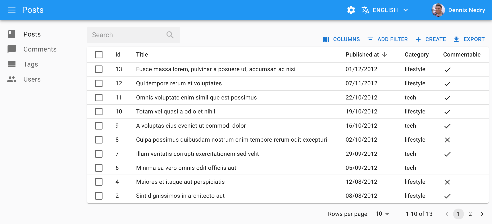

# `<List>`

The `<List>` component fetches the list of records from the data provider, and renders the default list layout (title, buttons, filters, pagination). It delegates the rendering of the list of records to its child component. Usually, it's a `<Datagrid>`, responsible for displaying a table with one row for each record.

## Usage

Here is the minimal code necessary to display a list of posts using a `<Datagrid>`:

```jsx
// in src/posts.js
import { List, Datagrid, TextField, DateField, BooleanField } from 'react-admin';

export const PostList = () => (
    <List>
        <Datagrid>
            <TextField source="id" />
            <TextField source="title" />
            <DateField source="published_at" />
            <TextField source="category" />
            <BooleanField source="commentable" />
        </Datagrid>
    </List>
);

// in src/App.js
import { Admin, Resource } from 'react-admin';
import jsonServerProvider from 'ra-data-json-server';

import { PostList } from './posts';

const App = () => (
    <Admin dataProvider={jsonServerProvider('https://jsonplaceholder.typicode.com')}>
        <Resource name="posts" list={PostList} />
    </Admin>
);

export default App;
```

That's enough to display a basic post list, with functional sort and pagination:



You can find more advanced examples of `<List>` usage in the [demos](./Demos.md). 

## `actions`


You can replace the list of default actions by your own elements using the `actions` prop:

```jsx
import { 
    TopToolbar,
    FilterButton,
    CreateButton,
    ExportButton,
    Button,
    List
} from 'react-admin';
import IconEvent from '@mui/icons-material/Event';

const ListActions = () => (
    <TopToolbar>
        <FilterButton/>
        <CreateButton/>
        <ExportButton/>
        {/* Add your custom actions */}
        <Button
            onClick={() => { alert('Your custom action'); }}
            label="Show calendar"
        >
            <IconEvent/>
        </Button>
    </TopToolbar>
);

export const PostList = () => (
    <List actions={<ListActions/>}>
        ...
    </List>
);
```

Use the `useListContext` hook to customize the actions depending on the list context, and the `usePermissions` to show/hide buttons depending on permissions. For example, you can hide the `<CreateButton>` when the user doesn't have the right permission, and disable the `<ExportButton>` when the list is empty:

```jsx
import { 
    useListContext,
    usePermissions,
    TopToolbar,
    FilterButton,
    CreateButton,
    ExportButton,
    List
} from 'react-admin';
import IconEvent from '@mui/icons-material/Event';

const ListActions = () => {
    const { total, isLoading } = useListContext();
    const { permissions } = usePermissions();
    return (
        <TopToolbar>
            <FilterButton />
            {permissions === "admin" && <CreateButton/>}
            <ExportButton disabled={isLoading || total === 0} />
        </TopToolbar>
    );
}
```

## `aside`: Side Component

You may want to display additional information on the side of the list. Use the `aside` prop for that, passing the component of your choice:


```jsx
const Aside = () => (
    <div style={{ width: 200, margin: '1em' }}>
        <Typography variant="h6">Post details</Typography>
        <Typography variant="body2">
            Posts will only be published once an editor approves them
        </Typography>
    </div>
);

const PostList = () => (
    <List aside={<Aside />}>
        ...
    </List>
);
```


The `aside` component can call the `useListContext()` hook to receive the same props as the `List` child component. This means you can display additional details of the current list in the aside component:


```jsx
import { Typography } from '@mui/material';
import { useListContext } from 'react-admin';

const Aside = () => {
    const { data, isLoading } = useListContext();
    if (isLoading) return null;
    return (
        <div style={{ width: 200, margin: '1em' }}>
            <Typography variant="h6">Posts stats</Typography>
            <Typography variant="body2">
                Total views: {data.reduce((sum, post) => sum + post.views, 0)}
            </Typography>
        </div>
    );
};
```


## `children`: List Layout

`<List>` doesn't render any content by default - it delegates this to its child. List layout components grab the `data` from the `ListContext` and render them on screen.

React-admin provides several List layout components:

- [`<Datagrid>`](./Datagrid.md) displays records in a table
- [`<SimpleList>`](./SimpleList.md) displays records in a list without many details
- [`<SingleFieldList>`](./SingleFieldList.md) displays records inline, showing one field per record 
- [`<EditableDatagrid>`](./EditableDatagrid.md) displays records in a table AND lets users edit them inline
- [`<Tree>`](./TreeWithDetails.md) displays records in a tree structure
- [`<Calendar>`](./Calendar.md) displays event records in a calendar

To use an alternative layout, switch the `<List>` child component:

```diff
export const BookList = () => (
    <List>
-       <Datagrid>
-           <TextField source="id" />
-           <TextField source="title" />
-           <TextField source="author" />
-           <TextField source="year" />
-       </Datagrid>
+       <SimpleList 
+           primaryText={record => <i>record.title</i>}
+           secondaryText={record => <>By {record.author} ({record.year})</>}
+       />
+   </List>
);
```

You can also pass React elements as children, to build a custom iterator. Check [Building a custom List Iterator](./ListTutorial.md#building-a-custom-iterator) for more details.

## `component`

By default, the List view renders the main content area inside a MUI `<Card>` element. The actual layout of the list depends on the child component you're using (`<Datagrid>`, `<SimpleList>`, or a custom layout component).

Some List layouts display each record in a `<Card>`, in which case the user ends up seeing a card inside a card, which is bad UI. To avoid that, you can override the main area container by passing a `component` prop:

```jsx
// use a div as root component
const PostList = () => (
    <List component="div">
        ...
    </List>
);

// use a custom component as root component 
const PostList = () => (
    <List component={MyComponent}>
        ...
    </List>
);
```

The default value for the `component` prop is `Card`.

## `debounce`

By default, `<List>` does not refresh the data as soon as the user enters data in the filter form. Instead, it waits for half a second of user inactivity (via `lodash.debounce`) before calling the dataProvider on filter change. This is to prevent repeated (and useless) calls to the API.

You can customize the debounce duration in milliseconds - or disable it completely - by passing a `debounce` prop to the `<List>` component:

```jsx
// wait 1 seconds instead of 500 milliseconds befoce calling the dataProvider
const PostList = () => (
    <List debounce={1000}>
        ...
    </List>
);
```

## `disableAuthentication`

By default, all pages using `<List>` require the user to be authenticated - any anonymous access redirects the user to the login page. 

If you want to allow anonymous access to a List page, set the `disableAuthentication` prop to `true`.

```jsx
import { List } from 'react-admin';

const BoolkList = () => (
    <List disableAuthentication>
        ...
    </List>
);
```

## `disableSyncWithLocation`

By default, react-admin synchronizes the `<List>` parameters (sort, pagination, filters) with the query string in the URL (using `react-router` location).

When you use a `<List>` component anywhere else than as `<Resource list>`, you may want to disable this synchronization to keep the parameters in a local state, independent for each `<List>` instance. This allows to have multiple lists on a single page. The drawback is that a hit on the "back" button doesn't restore the previous list parameters. To do so, pass the `disableSyncWithLocation` prop.


```jsx
const Dashboard = () => (
    <div>
        // ...
        <ResourceContextProvider value="posts">
            <List disableSyncWithLocation>
                <SimpleList
                    primaryText={record => record.title}
                    secondaryText={record => `${record.views} views`}
                    tertiaryText={record => new Date(record.published_at).toLocaleDateString()}
                />
            </List>
        </ResourceContextProvider>
        <ResourceContextProvider value="comments">
            <List disableSyncWithLocation>
                <SimpleList
                    primaryText={record => record.title}
                    secondaryText={record => `${record.views} views`}
                    tertiaryText={record => new Date(record.published_at).toLocaleDateString()}
                />
            </List>
        </ResourceContextProvider>
    </div>
)
```


Please note that the selection state is not synced in the URL but in a global store using the resource as key. Thus all lists in the page using the same resource will share the same selection state. This is a design choice because if row selection is not tied to a resource, then when a user deletes a record it may remain selected without any ability to unselect it. If you want the selection state to be local, you will have to implement your own `useListController` hook and pass a custom key to the `useRecordSelection` hook. You will then need to implement your own `DeleteButton` and `BulkDeleteButton` to manually unselect rows when deleting records.

## `empty`: Empty Page Component

When there is no result, and there is no active filter, and the resource has a create page, react-admin displays a special page inviting the user to create the first record.


You can use the `empty` prop to replace that page by a custom component:


```jsx
import { Box, Button, Typography } from '@mui/material';
import { CreateButton, List } from 'react-admin';

const Empty = () => (
    <Box textAlign="center" m={1}>
        <Typography variant="h4" paragraph>
            No products available
        </Typography>
        <Typography variant="body1">
            Create one or import from a file
        </Typography>
        <CreateButton />
        <Button onClick={/* ... */}>Import</Button>
    </Box>
);

const ProductList = () => (
    <List empty={<Empty />}>
        ...
    </List>
);
```


The `empty` component can call the `useListContext()` hook to receive the same props as the `List` child component. 

You can also set the `empty` props value to `false` to bypass the empty page display and render an empty list instead.

```jsx
import { List } from 'react-admin';

const ProductList = () => (
    <List empty={false}>
        ...
    </List>
);
```

## `emptyWhileLoading`

Default layout components (`<Datagrid>` and `<SimpleList>`) return null when the data is loading. If you use a custom layout component instead, you'll have to handle the case where the `data` is not yet defined.

That means that the following will fail on load with a "ReferenceError: data is not defined" error:

```jsx
import { List, useListContext } from 'react-admin';
import { Stack, Typography } from '@mui/icons-material/Star';

const SimpleBookList = () => {
    const { data } = useListContext();
    return (
        <Stack spacing={2}>
            {data.map(book => (
                <Typography key={book.id}>
                    <i>{book.title}</i>, by {book.author} ({book.year})
                </Typography>
            ))}
        </Stack>
    );
}

const BookList = () => (
    <List>
        <SimpleBookList />
    </List>
);
```

You can handle this case by getting the `isLoading` variable from the [`useListContext`](./useListContext.md) hook:

```jsx
const SimpleBookList = () => {
    const { data, isLoading } = useListContext();
    if (isLoading) return null;
    return (
        <Stack spacing={2}>
            {data.map(book => (
                <Typography key={book.id}>
                    <i>{book.title}</i>, by {book.author} ({book.year})
                </Typography>
            ))}
        </Stack>
    );
}
```

The `<List emptyWhileLoading>` prop provides a convenient shortcut for that use case. When enabled, `<List>` won't render its child until `data` is defined. 

```diff
const BookList = () => (
-   <List>
+   <List emptyWhileLoading>
        <SimpleBookList />
    </List>
);
```

## `exporter`


Among the default list actions, react-admin includes an `<ExportButton>`. This button is disabled when there is no record in the current `<List>`.

By default, clicking this button will:

1. Call the `dataProvider` with the current sort and filter (but without pagination),
2. Transform the result into a CSV string,
3. Download the CSV file.

The columns of the CSV file match all the fields of the records in the `dataProvider` response. That means that the export doesn't take into account the selection and ordering of fields in your `<List>` via `Field` components. If you want to customize the result, pass a custom `exporter` function to the `<List>`. This function will receive the data from the `dataProvider` (after step 1) and replace steps 2-3 (i.e. it's in charge of transforming, converting, and downloading the file).

**Tip**: For CSV conversion, you can import [jsonexport](https://github.com/kauegimenes/jsonexport#browser-import-examples), a CSV to JSON converter which is already a react-admin dependency. And for CSV download, take advantage of react-admin's `downloadCSV` function.

Here is an example for a Posts exporter, omitting, adding, and reordering fields:

```jsx
// in PostList.js
import { List, downloadCSV } from 'react-admin';
import jsonExport from 'jsonexport/dist';

const exporter = posts => {
    const postsForExport = posts.map(post => {
        const { backlinks, author, ...postForExport } = post; // omit backlinks and author
        postForExport.author_name = post.author.name; // add a field
        return postForExport;
    });
    jsonExport(postsForExport, {
        headers: ['id', 'title', 'author_name', 'body'] // order fields in the export
    }, (err, csv) => {
        downloadCSV(csv, 'posts'); // download as 'posts.csv` file
    });
};

const PostList = () => (
    <List exporter={exporter}>
        ...
    </List>
)
```

In many cases, you'll need more than simple object manipulation. You'll need to *augment* your objects based on relationships. For instance, the export for comments should include the title of the related post - but the export only exposes a `post_id` by default. For that purpose, the exporter receives a `fetchRelatedRecords` function as the second parameter. It fetches related records using your `dataProvider.getMany()` method and returns a promise.

Here is an example for a Comments exporter, fetching related Posts:

```jsx
// in CommentList.js
import { List, downloadCSV } from 'react-admin';
import jsonExport from 'jsonexport/dist';

const exporter = (records, fetchRelatedRecords) => {
    // will call dataProvider.getMany('posts', { ids: records.map(record => record.post_id) }), ignoring duplicate and empty post_id
    fetchRelatedRecords(records, 'post_id', 'posts').then(posts => {
        const data = records.map(record => ({
                ...record,
                post_title: posts[record.post_id].title,
        }));
        return jsonExport(data, {
            headers: ['id', 'post_id', 'post_title', 'body'],
        }, (err, csv) => {
            downloadCSV(csv, 'comments');
        });
    });
};

const CommentList = () => (
    <List exporter={exporter}>
        ...
    </List>
)
```

**Tip**: If you need to call another verb in the exporter, take advantage of the third parameter passed to the function: it's the `dataProvider` function.

**Tip**: The `<ExportButton>` limits the main request to the `dataProvider` to 1,000 records. If you want to increase or decrease this limit, pass a `maxResults` prop to the `<ExportButton>` in a custom `<ListActions>` component.

**Tip**: React-admin also provides a `<BulkExportButton>` component that depends on the `exporter`, and that you can use in the `bulkActionButtons` prop of the `<List>` component.

**Tip**: For complex (or large) exports, fetching all the related records and assembling them client-side can be slow. In that case, create the CSV on the server side, and replace the `<ExportButton>` component by a custom one, fetching the CSV route.

**Tip**: You may also remove the `<ExportButton>` by passing `false` to the `exporter` prop: `exporter={false}`

**Tip**: Looking for an `<ImportButton>`? React-admin doesn't provide this feature, but the community has an excellent third-party module for CSV import: [benwinding/react-admin-import-csv](https://github.com/benwinding/react-admin-import-csv).

## `filters`: Filter Inputs


You can add an array of filter Inputs to the List using the `filters` prop:

```jsx
const postFilters = [
    <TextInput label="Search" source="q" alwaysOn />,
    <TextInput label="Title" source="title" defaultValue="Hello, World!" />,
];

export const PostList = () => (
    <List filters={postFilters}>
        ...
    </List>
);
```

**Tip**: Don't mix up this `filters` prop, expecting an array of `<Input>` elements, with the `filter` props, which expects an object to define permanent filters (see below).

**Tip**: Filters will render as disabled inputs or menu items (depending on filter context) if passed the prop `disabled`.

Filter Inputs are regular inputs. `<List>` hides them all by default, except those that have the `alwaysOn` prop. 

You can also display filters as a sidebar:


For more details about customizing filters, see the [Filtering the List](./FilteringTutorial.md#filtering-the-list) section. 

## `filter`: Permanent Filter

You can choose to always filter the list, without letting the user disable this filter - for instance to display only published posts. Write the filter to be passed to the data provider in the `filter` props:


```jsx
// in src/posts.js
export const PostList = () => (
    <List filter={{ is_published: true }}>
        ...
    </List>
);
```


The actual filter parameter sent to the data provider is the result of the combination of the *user* filters (the ones set through the `filters` component form), and the *permanent* filter. The user cannot override the permanent filters set by way of `filter`.

## `filterDefaultValues`

To set default values to filters, you can either pass an object literal as the `filterDefaultValues` prop of the `<List>` element, or use the `defaultValue` prop of any input component.

There is one exception: inputs with `alwaysOn` don't accept `defaultValue`. You have to use the `filterDefaultValues` for those.


```jsx
// in src/posts.js
const postFilters = [
    <TextInput label="Search" source="q" alwaysOn />,
    <BooleanInput source="is_published" alwaysOn />,
    <TextInput source="title" defaultValue="Hello, World!" />,
];

export const PostList = () => (
    <List filters={postFilters} filterDefaultValues={{ is_published: true }}>
        ...
    </List>
);
```


**Tip**: The `filter` and `filterDefaultValues` props have one key difference: the `filterDefaultValues` can be overridden by the user, while the `filter` values are always sent to the data provider. Or, to put it otherwise:

```js
const filterSentToDataProvider = { ...filterDefaultValues, ...filterChosenByUser, ...filter };
```

## `hasCreate`

The List page shows a Create button if the resource has a create view, or if the `hasCreate` prop is set to true. Using this prop lets you force the display of the create button, or hide it.

```jsx
export const PostList = () => (
    <List hasCreate={false}>
        ...
    </List>
);
```

## `pagination`: Pagination Component

The `pagination` prop allows to replace the default pagination controls by your own.

```jsx
// in src/MyPagination.js
import { Pagination, List } from 'react-admin';

const PostPagination = props => <Pagination rowsPerPageOptions={[10, 25, 50, 100]} {...props} />;

export const PostList = () => (
    <List pagination={<PostPagination />}>
        ...
    </List>
);
```

See [Paginating the List](./ListTutorial.md#building-a-custom-pagination) for details.

## `perPage`: Pagination Size 

By default, the list paginates results by groups of 10. You can override this setting by specifying the `perPage` prop:

```jsx
// in src/posts.js
export const PostList = () => (
    <List perPage={25}>
        ...
    </List>
);
```

## `queryOptions`

`<List>` accepts a `queryOptions` prop to pass options to the react-query client. 

This can be useful e.g. to pass a custom `meta` to the `dataProvider.getList()` call.


```jsx
import { List } from 'react-admin';

const PostList = () => (
    <List queryOptions={{ meta: { foo: 'bar' } }}>
        ...
    </List>
);
```


With this option, react-admin will call the `dataProvider.getList()` on mount with the ` meta: { foo: 'bar' }` option.

You can also use the `queryOptions` prop to override the default error side effect. By default, when the `dataProvider.getList()` call fails, react-admin shows an error notification.

You can override this behavior and pass custom side effects by providing a `queryOptions` prop:


```jsx
import { useNotify, useRedirect, List } from 'react-admin';

const PostList = () => {
    const notify = useNotify();
    const redirect = useRedirect();

    const onError = (error) => {
        notify(`Could not load list: ${error.message}`, { type: 'warning' });
        redirect('/dashboard');
    };

    return (
        <List queryOptions={{ onError }}>
            ...
        </List>
    );
}
```


The `onError` function receives the error from the dataProvider call (`dataProvider.getList()`), which is a JavaScript Error object (see [the dataProvider documentation for details](./DataProviderWriting.md#error-format)).

## `resource`

By default, `<List>` operates on the current `ResourceContext` (defined at the routing level), so under the `/posts` path, the `resource` prop will be `posts`. You may want to force a different resource for a list. In this case, pass a custom `resource` prop, and it will override the `ResourceContext` value.

```jsx
export const UsersList = () => (
    <List resource="users">
        ...
    </List>
);
```

## `sort`: Default Sort Field & Order

Pass an object literal as the `sort` prop to determine the default `field` and `order` used for sorting:


```jsx
export const PostList = () => (
    <List sort={{ field: 'published_at', order: 'DESC' }}>
        ...
    </List>
);
```


`sort` defines the *default* sort order ; the list remains sortable by clicking on column headers.

For more details on list sort, see the [Sorting The List](./ListTutorial.md#sorting-the-list) section below. 

## `title`

The default title for a list view is "[resource] list" (e.g. "Posts list"). Use the `title` prop to customize the List view title:

```jsx
export const PostList = () => (
    <List title="List of posts">
        ...
    </List>
);
```

The title can be either a string or an element of your own.

## `sx`: CSS API

The `<List>` component accepts the usual `className` prop but you can override many class names injected to the inner components by React-admin thanks to the `sx` property (as most MUI components, see their [documentation about it](https://mui.com/customization/how-to-customize/#overriding-nested-component-styles)). This property accepts the following subclasses:

| Rule name             | Description                                                   |
|-----------------------|---------------------------------------------------------------|
| `& .RaList-actions`   | Applied to the actions container                              |
| `& .RaList-main`      | Applied to the main container                                 |
| `& .RaList-content`   | Applied to the child component inside the main container      |
| `& .RaList-noResults` | Applied to the component shown when there is no result        |

Here is an example:


```jsx
const PostList = () => (
    <List 
        sx={{
            backgroundColor: 'yellow',
            '& .RaList-content': {
                backgroundColor: 'red',
            },
        }}
    >
            ...
    </List>
);
```


**Tip**: The `List` component `classes` can also be customized for all instances of the component with its global css name `RaList` as [describe here](https://marmelab.com/blog/2019/12/18/react-admin-3-1.html#theme-overrides)
