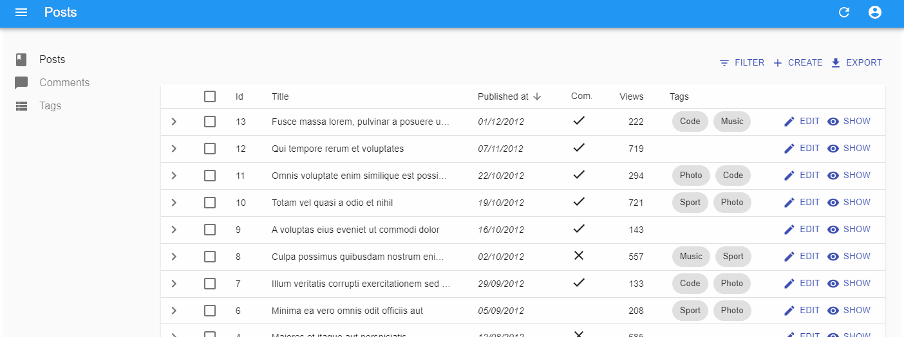
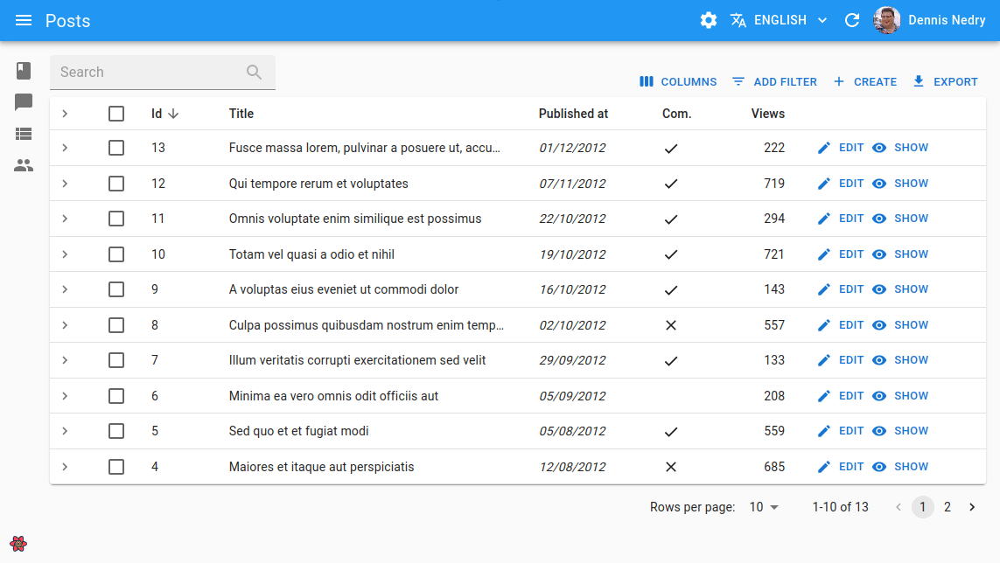
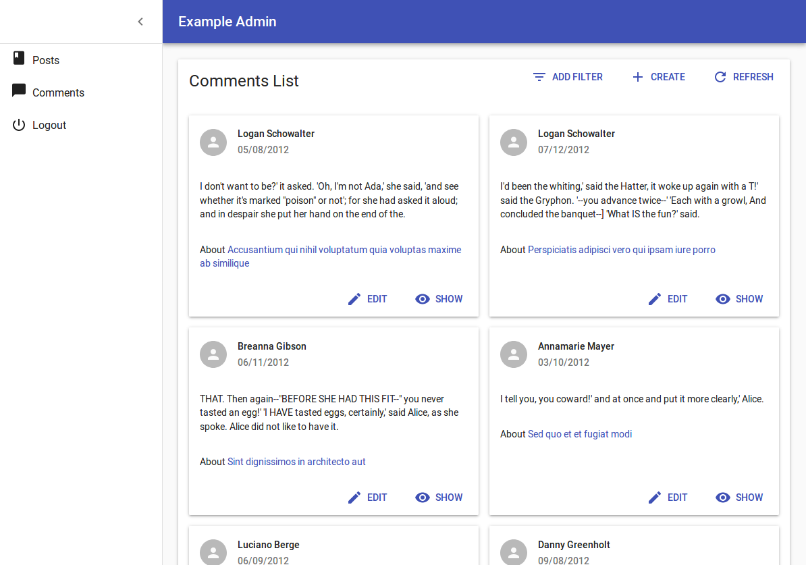

# The List View

The List view displays a list of records fetched from the API, and allows users to filter, sort, select, and paginate the records. You can display the list as a Datagrid, a list of images, a calendar, or using a component of your own.


The entry point for this view is the `<List>` component, which takes care of fetching the data. Then, it puts that data in a `ListContext` so that it's available for its descendants - usually `<Datagrid>`, which then delegates the rendering of each record property to [`<Field>`](./Fields.md) components.

## The `<List>` Component

The `<List>` component fetches the list of records from the data provider, and renders the default list layout (title, buttons, filters, pagination). It delegates the rendering of the list of records to its child component. Usually, it's a `<Datagrid>`, responsible for displaying a table with one row for each record.

Here is the minimal code necessary to display a list of posts using a `<Datagrid>`:

```jsx
// in src/posts.js
import * as React from "react";
import { List, Datagrid, TextField, DateField, BooleanField } from 'react-admin';

export const PostList = (props) => (
    <List {...props}>
        <Datagrid>
            <TextField source="id" />
            <TextField source="title" />
            <DateField source="published_at" />
            <TextField source="category" />
            <BooleanField source="commentable" />
        </Datagrid>
    </List>
);

// in src/App.js
import * as React from "react";
import { Admin, Resource } from 'react-admin';
import jsonServerProvider from 'ra-data-json-server';

import { PostList } from './posts';

const App = () => (
    <Admin dataProvider={jsonServerProvider('https://jsonplaceholder.typicode.com')}>
        <Resource name="posts" list={PostList} />
    </Admin>
);

export default App;
```

That's enough to display a basic post list, with functional sort and pagination:


Here are all the props accepted by the `<List>` component:

* [`actions`](#actions)
* [`aside`](#aside-aside-component)
* [`bulkActionButtons`](#bulkactionbuttons)
* [`component`](#component)
* [`empty`](#empty-empty-page-component)
* [`exporter`](#exporter)
* [`filter`](#filter-permanent-filter) (the permanent filter used in the REST request)
* [`filterDefaultValues`](#filterdefaultvalues) (the default values for `alwaysOn` filters)
* [`filters`](#filters-filter-inputs) (a React element used to display the filter form)
* [`pagination`](#pagination-pagination-component)
* [`perPage`](#perpage-pagination-size)
* [`sort`](#sort-default-sort-field--order)
* [`title`](#title)
* [`syncWithLocation`](#synchronize-with-url)

### `title`

The default title for a list view is "[resource] list" (e.g. "Posts list"). Use the `title` prop to customize the List view title:

```jsx
// in src/posts.js
export const PostList = (props) => (
    <List {...props} title="List of posts">
        ...
    </List>
);
```

The title can be either a string or an element of your own.

### `actions`


You can replace the list of default actions by your own elements using the `actions` prop:

```jsx
import * as React from 'react';
import { cloneElement } from 'react';
import { List, ListActions, Button, FilterButton } from 'react-admin';
import IconEvent from '@material-ui/icons/Event';

const ListActions = (props) => (
    <TopToolbar>
        <FilterButton/>
        <CreateButton/>
        <ExportButton/>
        {/* Add your custom actions */}
        <Button
            onClick={() => { alert('Your custom action'); }}
            label="Show calendar"
        >
            <IconEvent/>
        </Button>
    </TopToolbar>
);

export const PostList = (props) => (
        <List {...props} actions={<ListActions/>}>
          ...
        </List>
);
```
Note that in order to add the `<FilterButton>` component among your custom actions, either the parent `List` must have its `filters` prop set up or you must pass the filters to the button itself. 

This allows you to further control how the default actions behave. For example, you could disable the `<ExportButton>` when the list is empty:


```jsx
import * as React from 'react';
import { cloneElement, useMemo } from 'react';
import PropTypes from 'prop-types';
import {
    useListContext,
    TopToolbar,
    CreateButton,
    ExportButton,
    FilterButton,
    Button,
    sanitizeListRestProps
} from 'react-admin';
import IconEvent from '@material-ui/icons/Event';

const ListActions = (props) => {
    const {
        className,
        maxResults,
        ...rest
    } = props;
    const { total } = useListContext();

    return (
        <TopToolbar className={className} {...sanitizeListRestProps(rest)}>
            <FilterButton />
            <CreateButton />
            <ExportButton disabled={total === 0} maxResults={maxResults} />
            {/* Add your custom actions */}
            <Button
                onClick={() => { alert('Your custom action'); }}
                label="Show calendar"
            >
                <IconEvent />
            </Button>
        </TopToolbar>
    );
};

export const PostList = (props) => (
    <List {...props} actions={<ListActions />}>
        ...
    </List>
);
```


You can also use such a custom `<ListActions>` component to omit or reorder buttons based on permissions. Just pass the `permissions` down from the `List` component:

```jsx
export const PostList = ({ permissions, ...props }) => (
    <List {...props} actions={<PostActions permissions={permissions} {...props} />}>
        ...
    </List>
);
```

### `exporter`


Among the default list actions, react-admin includes an `<ExportButton>`. This button is disabled when there is no record in the current `<List>`.

By default, clicking this button will:

1. Call the `dataProvider` with the current sort and filter (but without pagination),
2. Transform the result into a CSV string,
3. Download the CSV file.

The columns of the CSV file match all the fields of the records in the `dataProvider` response. That means that the export doesn't take into account the selection and ordering of fields in your `<List>` via `Field` components. If you want to customize the result, pass a custom `exporter` function to the `<List>`. This function will receive the data from the `dataProvider` (after step 1) and replace steps 2-3 (i.e. it's in charge of transforming, converting, and downloading the file).

**Tip**: For CSV conversion, you can import [jsonexport](https://github.com/kauegimenes/jsonexport#browser-import-examples), a CSV to JSON converter which is already a react-admin dependency. And for CSV download, take advantage of react-admin's `downloadCSV` function.

Here is an example for a Posts exporter, omitting, adding, and reordering fields:

```jsx
// in PostList.js
import { List, downloadCSV } from 'react-admin';
import jsonExport from 'jsonexport/dist';

const exporter = posts => {
    const postsForExport = posts.map(post => {
        const { backlinks, author, ...postForExport } = post; // omit backlinks and author
        postForExport.author_name = post.author.name; // add a field
        return postForExport;
    });
    jsonExport(postsForExport, {
        headers: ['id', 'title', 'author_name', 'body'] // order fields in the export
    }, (err, csv) => {
        downloadCSV(csv, 'posts'); // download as 'posts.csv` file
    });
};

const PostList = props => (
    <List {...props} exporter={exporter}>
        ...
    </List>
)
```

In many cases, you'll need more than simple object manipulation. You'll need to *augment* your objects based on relationships. For instance, the export for comments should include the title of the related post - but the export only exposes a `post_id` by default. For that purpose, the exporter receives a `fetchRelatedRecords` function as the second parameter. It fetches related records using your `dataProvider.getMany()` method and returns a promise.

Here is an example for a Comments exporter, fetching related Posts:

```jsx
// in CommentList.js
import { List, downloadCSV } from 'react-admin';
import jsonExport from 'jsonexport/dist';

const exporter = (records, fetchRelatedRecords) => {
    // will call dataProvider.getMany('posts', { ids: records.map(record => record.post_id) }), ignoring duplicate and empty post_id
    fetchRelatedRecords(records, 'post_id', 'posts').then(posts => {
        const data = records.map(record => ({
                ...record,
                post_title: posts[record.post_id].title,
        }));
        jsonExport(data, {
            headers: ['id', 'post_id', 'post_title', 'body'],
        }, (err, csv) => {
            downloadCSV(csv, 'comments');
        });
    });
};

const CommentList = props => (
    <List {...props} exporter={exporter}>
        ...
    </List>
)
```

**Tip**: If you need to call another verb in the exporter, take advantage of the third parameter passed to the function: it's the `dataProvider` function.

**Tip**: The `<ExportButton>` limits the main request to the `dataProvider` to 1,000 records. If you want to increase or decrease this limit, pass a `maxResults` prop to the `<ExportButton>` in a custom `<ListActions>` component, as explained in the previous section.

**Tip**: React-admin also provides a `<BulkExportButton>` component that depends on the `exporter`, and that you can use in the `bulkActionButtons` prop of the `<List>` component.

**Tip**: For complex (or large) exports, fetching all the related records and assembling them client-side can be slow. In that case, create the CSV on the server side, and replace the `<ExportButton>` component by a custom one, fetching the CSV route.

**Tip**: You may also remove the `<ExportButton>` by passing `false` to the `exporter` prop: `exporter={false}`

**Tip**: Looking for an `<ImportButton>`? React-admin doesn't provide this feature, but the community has an excellent third-party module for CSV import: [benwinding/react-admin-import-csv](https://github.com/benwinding/react-admin-import-csv).

### `bulkActionButtons`


Bulk action buttons are buttons that affect several records at once, like mass deletion for instance. In the `<Datagrid>` component, the bulk actions toolbar appears when a user ticks the checkboxes in the first column of the table. The user can then choose a button from the bulk actions toolbar. By default, all list views have a single bulk action button, the bulk delete button. You can add other bulk action buttons by passing a custom element as the `bulkActionButtons` prop of the `<List>` component:

```jsx
import * as React from 'react';
import { Fragment } from 'react';
import Button from '@material-ui/core/Button';
import { BulkDeleteButton } from 'react-admin';
import ResetViewsButton from './ResetViewsButton';

const PostBulkActionButtons = props => (
    <Fragment>
        <ResetViewsButton label="Reset Views" {...props} />
        {/* default bulk delete action */}
        <BulkDeleteButton {...props} />
    </Fragment>
);

export const PostList = (props) => (
    <List {...props} bulkActionButtons={<PostBulkActionButtons />}>
        ...
    </List>
);
```

**Tip**: React-admin provides three components that you can use in `bulkActionButtons`: `<BulkDeleteButton>`, `<BulkUpdateButton>`, and `<BulkExportButton>`.

**Tip**: You can also disable bulk actions altogether by passing `false` to the `bulkActionButtons` prop. When using a `Datagrid` inside a `List` with disabled bulk actions, the checkboxes column won't be added.

Bulk action button components receive several props allowing them to perform their job:

* `resource`: the currently displayed resource (eg `posts`, `comments`, etc.)
* `basePath`: the current router base path for the resource (eg `/posts`, `/comments`, etc.)
* `filterValues`: the filter values. This can be useful if you want to apply your action on all items matching the filter.
* `selectedIds`: the identifiers of the currently selected items.

Here is an example of `BulkUpdateButton` usage, which sets the `views` property of all posts to `0` optimistically:

```jsx
// in ./ResetViewsButton.js
import * as React from 'react';
import { VisibilityOff } from '@material-ui/icons';
import { BulkUpdateButton } from 'react-admin';

const views = { views: 0 };

const ResetViewsButton = (props) => (
    <BulkUpdateButton
        {...props}
        label="Reset Views"
        data={views}
        icon={<VisibilityOff/>}
    />
);

export default ResetViewsButton;
```

You can also implement the same `ResetViewsButton` behind a confirmation dialog by using the [`mutationMode`](./CreateEdit.md#mutationmode) prop:

```diff
// in ./ResetViewsButton.js
import * as React from 'react';
import { VisibilityOff } from '@material-ui/icons';
import { BulkUpdateButton } from 'react-admin';

const views = { views: 0 };

const ResetViewsButton = (props) => (
    <BulkUpdateButton
        {...props}
        label="Reset Views"
        data={views}
        icon={VisibilityOff}
+       mutationMode="pessimistic"
    />
);

export default ResetViewsButton;
```

But let's say you need a customized bulkAction button, here is an example leveraging the `useUpdateMany` hook, which sets the `views` property of all posts to `0`:

```jsx
// in ./CustomResetViewsButton.js
import * as React from "react";
import {
    Button,
    useUpdateMany,
    useRefresh,
    useNotify,
    useUnselectAll,
} from 'react-admin';
import { VisibilityOff } from '@material-ui/icons';

const CustomResetViewsButton = ({ selectedIds }) => {
    const refresh = useRefresh();
    const notify = useNotify();
    const unselectAll = useUnselectAll();
    const [updateMany, { loading }] = useUpdateMany(
        'posts',
        selectedIds,
        { views: 0 },
        {
            onSuccess: () => {
                refresh();
                notify('Posts updated');
                unselectAll('posts');
            },
            onFailure: error => notify('Error: posts not updated', { type: 'warning' }),
        }
    );

    return (
        <Button
            label="simple.action.resetViews"
            disabled={loading}
            onClick={updateMany}
        >
            <VisibilityOff />
        </Button>
    );
};

export default CustomResetViewsButton;
```

But most of the time, bulk actions are mini-applications with a standalone user interface (in a Dialog). Here is the same `CustomResetViewsAction` implemented behind a confirmation dialog:

```jsx
// in ./CustomResetViewsButton.js
import * as React from 'react';
import { Fragment, useState } from 'react';
import {
    Button,
    Confirm,
    useUpdateMany,
    useRefresh,
    useNotify,
    useUnselectAll,
} from 'react-admin';

const CustomResetViewsButton = ({ selectedIds }) => {
    const [open, setOpen] = useState(false);
    const refresh = useRefresh();
    const notify = useNotify();
    const unselectAll = useUnselectAll();
    const [updateMany, { loading }] = useUpdateMany(
        'posts',
        selectedIds,
        { views: 0 },
        {
            onSuccess: () => {
                refresh();
                notify('Posts updated');
                unselectAll('posts');
            },
            onFailure: error => notify('Error: posts not updated', { type: 'warning' }),
        }
    );
    const handleClick = () => setOpen(true);
    const handleDialogClose = () => setOpen(false);

    const handleConfirm = () => {
        updateMany();
        setOpen(false);
    };

    return (
        <Fragment>
            <Button label="Reset Views" onClick={handleClick} />
            <Confirm
                isOpen={open}
                loading={loading}
                title="Update View Count"
                content="Are you sure you want to reset the views for these items?"
                onConfirm={handleConfirm}
                onClose={handleDialogClose}
            />
        </Fragment>
    );
}

export default CustomResetViewsButton;
```

**Tip**: `<Confirm>` leverages material-ui's `<Dialog>` component to implement a confirmation popup. Feel free to use it in your admins!

**Tip**: `<Confirm>` text props such as `title` and `content` are translatable. You can pass translation keys in these props. Note: `content` is only translatable when value is `string`, otherwise it renders the content as a `ReactNode`.

**Tip**: You can customize the text of the two `<Confirm>` component buttons using the `cancel` and `confirm` props which accept translation keys. You can customize the icons by setting the `ConfirmIcon` and `CancelIcon` props, which accept a SvgIcon type.

**Tip**: React-admin doesn't use the `<Confirm>` component internally, because deletes and updates are applied locally immediately, then dispatched to the server after a few seconds, unless the user chooses to undo the modification. That's what we call optimistic rendering. You can do the same for the `ResetViewsButton` by setting `undoable: true` in the last argument of `useUpdateMany()`, as follows:

```diff
// in ./CustomResetViewsButton.js
import * as React from "react";
import {
    Button,
    Confirm,
    useUpdateMany,
    useRefresh,
    useNotify,
    useUnselectAll,
} from 'react-admin';
import { VisibilityOff } from '@material-ui/icons';

const CustomResetViewsButton = ({ selectedIds }) => {
    const refresh = useRefresh();
    const notify = useNotify();
    const unselectAll = useUnselectAll();
    const [updateMany, { loading }] = useUpdateMany(
        'posts',
        selectedIds,
        { views: 0 },
        {
            onSuccess: () => {
                refresh();
-               notify('Posts updated');
+               notify('Posts updated', { undoable: true }); // the last argument forces the display of 'undo' in the notification
                unselectAll('posts');
            },
            onFailure: error => notify('Error: posts not updated', { type: 'warning' }),
+           mutationMode: 'undoable'
        }
    );

    return (
        <Button
            label="simple.action.resetViews"
            disabled={loading}
            onClick={updateMany}
        >
            <VisibilityOff />
        </Button>
    );
};
```

### `filters`: Filter Inputs


You can add an array of filter Inputs to the List using the `filters` prop:

```jsx
const postFilters = [
    <TextInput label="Search" source="q" alwaysOn />,
    <TextInput label="Title" source="title" defaultValue="Hello, World!" />,
];

export const PostList = (props) => (
    <List {...props} filters={postFilters}>
        ...
    </List>
);
```

**Tip**: Don't mix up this `filters` prop, expecting an array of `<Input>` elements, with the `filter` props, which expects an object to define permanent filters (see below).

Filter Inputs are regular inputs. `<List>` hides them all by default, except those that have the `alwaysOn` prop. 

You can also display filters as a sidebar:


For more details about customizing filters, see the [Filtering the List](#filtering-the-list) section. 

### `filter`: Permanent Filter

You can choose to always filter the list, without letting the user disable this filter - for instance to display only published posts. Write the filter to be passed to the data provider in the `filter` props:


```jsx
// in src/posts.js
export const PostList = (props) => (
    <List {...props} filter={{ is_published: true }}>
        ...
    </List>
);
```


The actual filter parameter sent to the data provider is the result of the combination of the *user* filters (the ones set through the `filters` component form), and the *permanent* filter. The user cannot override the permanent filters set by way of `filter`.

### `filterDefaultValues`

To set default values to filters, you can either pass an object literal as the `filterDefaultValues` prop of the `<List>` element, or use the `defaultValue` prop of any input component.

There is one exception: inputs with `alwaysOn` don't accept `defaultValue`. You have to use the `filterDefaultValues` for those.


```jsx
// in src/posts.js
const postFilters = [
    <TextInput label="Search" source="q" alwaysOn />,
    <BooleanInput source="is_published" alwaysOn />,
    <TextInput source="title" defaultValue="Hello, World!" />,
];

export const PostList = (props) => (
    <List {...props} filters={postFilters} filterDefaultValues={{ is_published: true }}>
        ...
    </List>
);
```


**Tip**: The `filter` and `filterDefaultValues` props have one key difference: the `filterDefaultValues` can be overridden by the user, while the `filter` values are always sent to the data provider. Or, to put it otherwise:

```js
const filterSentToDataProvider = { ...filterDefaultValues, ...filterChosenByUser, ...filter };
```

### `perPage`: Pagination Size 

By default, the list paginates results by groups of 10. You can override this setting by specifying the `perPage` prop:

```jsx
// in src/posts.js
export const PostList = (props) => (
    <List {...props} perPage={25}>
        ...
    </List>
);
```

### `sort`: Default Sort Field & Order

Pass an object literal as the `sort` prop to determine the default `field` and `order` used for sorting:


```jsx
// in src/posts.js
export const PostList = (props) => (
    <List {...props} sort={{ field: 'published_at', order: 'DESC' }}>
        ...
    </List>
);
```


`sort` defines the *default* sort order ; the list remains sortable by clicking on column headers.

For more details on list sort, see the [Sorting The List](#sorting-the-list) section below. 

### `pagination`: Pagination Component

The `pagination` prop allows to replace the default pagination controls by your own.

```jsx
// in src/MyPagination.js
import { Pagination, List } from 'react-admin';

const PostPagination = props => <Pagination rowsPerPageOptions={[10, 25, 50, 100]} {...props} />;

export const PostList = (props) => (
    <List {...props} pagination={<PostPagination />}>
        ...
    </List>
);
```

See [Paginating the List](#paginating-the-list) below for details.

### `aside`: Aside Component

You may want to display additional information on the side of the list. Use the `aside` prop for that, passing the component of your choice:


```jsx
const Aside = () => (
    <div style={{ width: 200, margin: '1em' }}>
        <Typography variant="h6">Post details</Typography>
        <Typography variant="body2">
            Posts will only be published once an editor approves them
        </Typography>
    </div>
);

const PostList = props => (
    <List aside={<Aside />} {...props}>
        ...
    </List>
);
```


The `aside` component can call the `useListContext()` hook to receive the same props as the `List` child component, including the following:

* `basePath`,
* `currentSort`,
* `data`,
* `defaultTitle`,
* `filterValues`,
* `ids`,
* `page`,
* `perPage`,
* `resource`,
* `selectedIds`,
* `total`,
* `version`,

That means you can display additional details of the current list in the aside component:


```jsx
const Aside = () => {
    const { data, ids } = useListContext();
    return (
        <div style={{ width: 200, margin: '1em' }}>
            <Typography variant="h6">Posts stats</Typography>
            <Typography variant="body2">
                Total views: {ids.map(id => data[id]).reduce((sum, post) => sum + post.views, 0)}
            </Typography>
        </div>
    );
};
```


### `empty`: Empty Page Component

When there is no result, and there is no active filter, and the resource has a create page, react-admin displays a special page inviting the user to create the first record.

You can use the `empty` prop to replace that page by a custom component:


```jsx
import Box from '@material-ui/core/Box';
import Button from '@material-ui/core/Button';
import Typography from '@material-ui/core/Typography';
import { CreateButton, List, useListContext } from 'react-admin';

const Empty = () => {
    const { basePath, resource } = useListContext();
    return (
        <Box textAlign="center" m={1}>
            <Typography variant="h4" paragraph>
                No products available
            </Typography>
            <Typography variant="body1">
                Create one or import from a file
            </Typography>
            <CreateButton basePath={basePath} />
            <Button onClick={/* ... */}>Import</Button>
        </Box>
    );
};

const ProductList = props => (
    <List empty={<Empty />} {...props}>
        ...
    </List>
);
```


The `empty` component can call the `useListContext()` hook to receive the same props as the `List` child component, including the following:

-   `basePath`,
-   `currentSort`,
-   `data`,
-   `defaultTitle`,
-   `filterValues`,
-   `ids`,
-   `page`,
-   `perPage`,
-   `resource`,
-   `selectedIds`,
-   `total`,
-   `version`,

You can also set the `empty` props value to `false` to bypass the empty page display and render an empty list instead.

```
import { List } from 'react-admin';

const ProductList = props => (
    <List empty={false} {...props}>
        ...
    </List>
);
```

### `component`

By default, the List view renders the main content area inside a material-ui `<Card>` element. The actual layout of the list depends on the child component you're using (`<Datagrid>`, `<SimpleList>`, or a custom layout component).

Some List layouts display each record in a `<Card>`, in which case the user ends up seeing a card inside a card, which is bad UI. To avoid that, you can override the main area container by passing a `component` prop:

```jsx
// use a div as root component
const PostList = props => (
    <List component="div" {...props}>
        ...
    </List>
);

// use a custom component as root component 
const PostList = props => (
    <List component={MyComponent} {...props}>
        ...
    </List>
);
```

The default value for the `component` prop is `Card`.

### Synchronize With URL

When a `<List>` based component (eg: `<PostList>`) is passed as a `<Resource list>`, react-admin synchronizes its parameters (sort, pagination, filters) with the query string in the URL (using `react-router` location). It does so by setting the `<List syncWithLocation>` prop by default.

When you use a `<List>` component anywhere else than as `<Resource list>`, `syncWithLocation` isn't enabled, and so `<List>` doesn't synchronize its parameters with the URL - the `<List>` parameters are kept in a local state, independent for each `<List>` instance. This allows to have multiple lists on a single page. The drawback is that a hit on the "back" button doesn't restore the previous list parameters.

You may, however, wish to enable `syncWithLocation` on a `<List>` component that is not a `<Resource list>`. For instance, you may want to display a `<List>` of Posts in a Dashboard, and allow users to use the "back" button to undo a sort, pagination, or filter change on that list. In such cases, set the `syncWithLocation` prop to `true`:


```jsx
const Dashboard = () => (
    <div>
        // ...
        <ResourceContextProvider value="posts">
            <List syncWithLocation basePath="/posts" >
                <SimpleList
                    primaryText={record => record.title}
                    secondaryText={record => `${record.views} views`}
                    tertiaryText={record => new Date(record.published_at).toLocaleDateString()}
                />
            </List>
        </ResourceContextProvider>
    </div>
)
```


### CSS API

The `List` component accepts the usual `className` prop but you can override many class names injected to the inner components by React-admin thanks to the `classes` property (as most Material UI components, see their [documentation about it](https://v4.mui.com/customization/components/#overriding-styles-with-classes)). This property accepts the following keys:

| Rule name              | Description                                                                              |
| ---------------------- | ---------------------------------------------------------------------------------------- |
| `root`                 | Alternative to using `className`. Applied to the root element                            |
| `actions`              | Applied to the actions container                                                         |
| `main`                 | Applied to the main container                                                            |
| `content`              | Applied to the child component inside the main container                                 |
| `bulkActionsDisplayed` | Applied to the child component inside the main container when there are selected records |
| `noResults`            | Applied to the component shown when there is no result                                   |

You can customize the `<List>` styles by passing a `classes` object as prop, through `useStyles()`. Here is an example:


```jsx
import * as React from 'react';
import { makeStyles } from '@material-ui/core';

const useStyles = makeStyles({
    actions: {
        backgroundColor: '#ccc',
    },
});

const PostList = props => {
    const classes = useStyles(props);
    return (
        <List {...props} classes={{ actions: classes.actions }}>
            <Datagrid>
                ...
            </Datagrid>
        </List>
    );
}

export default PostList;
```


**Tip**: The `List` component `classes` can also be customized for all instances of the component with its global css name `"RaList"` as [describe here](https://marmelab.com/blog/2019/12/18/react-admin-3-1.html#theme-overrides)

## Filtering The List

<table><tbody><tr style="border:none">
<td style="width:50%;border:none;">
<a title="Filter Button/Form Combo" href="./img/list_filter.gif"></a>
</td>
<td style="width:50%;border:none;">
<a title="<FilterList> Sidebar" href="./img/filter-sidebar.gif"></a>
</td>
</tr></tbody></table>

One of the most important features of the List page is the ability to filter the results. React-admin does its best to offer a powerful filter functionality, and to get out of the way when you want to go further. 

The next sections explain how to use the filter functionality. And first, a few explanations about the inner workings of filters:

- [Filter Query Parameter](#filter-query-parameter)
- [Linking To A Pre-Filtered List](#linking-to-a-pre-filtered-list)

React-admin proposes several UI components to let users see and modify filters, and gives you the tools to build custom ones.

- The Filter Button/Form Combo
  - [Usage](#the-filter-buttonform-combo)
  - [Full-Text Search](#full-text-search)
  - [Quick Filters](#quick-filters)
- The `<FilterList>` Sidebar
  - [Usage](#the-filterlist-sidebar)
  - [Full-Text Search](#live-search)
- [Saved Queries: Let Users Save Filter And Sort](#saved-queries-let-users-save-filter-and-sort)
- [Building A Custom Filter](#building-a-custom-filter)

### Filter Query Parameter

React-admin uses the `filter` query parameter from the URL to determine the filters to apply to the list. To change the filters, react-admin simply changes this `filter` query parameter, and the `<List>` components fetches `dataProvider.getList()` again with the new filters.

Here is a typical List URL:

> https://myadmin.dev/#/posts?displayedFilters=%7B%22commentable%22%3Atrue%7D&filter=%7B%22commentable%22%3Atrue%2C%22q%22%3A%22lorem%20%22%7D&order=DESC&page=1&perPage=10&sort=published_at

Once decoded, the `filter` query parameter reveals as a JSON value:

```
filter={"commentable":true,"q":"lorem "}
```

You can change the filters by updating the query parameter, e.g. using the `<Link>` component or the `history.push()` method from `react-router`. 

**Tip**: Once a user sets a filter, react-admin persists the filter value in the application state, so that when the user comes back to the list, they should see the filtered list. That's a design choice.

### Linking To A Pre-Filtered List

As the filter values are taken from the URL, you can link to a pre-filtered list by setting the `filter` query parameter.

For instance, if you have a list of tags, you can display a button for each category to link to the list of posts filtered by that tag:


```jsx
import * as React from "react";
import Button from '@material-ui/core/Button';
import { Link } from 'react-router-dom';

const LinkToRelatedProducts = ({ record }) => {
    const translate = useTranslate();
    return record ? (
        <Button
            color="primary"
            component={Link}
            to={{
                pathname: '/posts',
                search: `filter=${JSON.stringify({ category_id: record.id })}`,
            }}
        >
            All posts with the category {record.name} ; 
        </Button>
    ) : null;
};
```


You can use this button e.g. as a child of `<Datagrid>`. You can also create a custom Menu button with that technique to link to the unfiltered list by setting the filter value to `{}`.

### The Filter Button/Form Combo


The default appearance for filters is an inline form displayed on top of the list. Users also see a dropdown button allowing to add more inputs to that form. This functionality relies on the `filters` prop: 

```jsx
import { TextInput } from 'react-admin';

const postFilters = [
    <TextInput label="Search" source="q" alwaysOn />,
    <TextInput label="Title" source="title" defaultValue="Hello, World!" />,
];
```

Elements of the `filters` array are regular inputs. That means you can build sophisticated filters based on references, array values, etc. `<List>` hides all inputs in the filter form by default, except those that have the `alwaysOn` prop.

**Tip**: For technical reasons, react-admin does not accept Filter inputs having both a `defaultValue` and `alwaysOn`. To set default values for always on filters, use the [`filterDefaultValues`](#filterdefaultvalues) prop of the `<List>` component instead.

To inject the filter form in a `<List>`, use the `filters` prop:

```jsx
export const PostList = (props) => (
    <List {...props} filters={postFilters}>
        ...
    </List>
);
```

`<List>` uses the elements passed as `filters` twice:

- once to render the filter *form*
- once to render the filter *button* (using each element `label`, falling back to the humanized `source`)

#### Full-Text Search


In addition to [the usual input types](./Inputs.md) (`<TextInput>`, `<SelectInput>`, `<ReferenceInput>`, etc.), you can use the `<SearchInput>`, which is designed especially for the filter form. It's like a `<TextInput resettable>` with a magnifier glass icon - exactly the type of input users look for when they want to do a full-text search. 

```jsx
import { SearchInput, TextInput } from 'react-admin';

const postFilters = [
    <SearchInput source="q" alwaysOn />
];
```

In the example given above, the `q` filter triggers a full-text search on all fields. It's your responsibility to implement the full-text filtering capabilities in your `dataProvider`, or in your API.

#### Quick Filters


Users usually dislike using their keyboard to filter a list (especially on mobile). A good way to satisfy this user requirement is to turn filters into *quick filter*. A Quick filter is a filter with a non-editable `defaultValue`. Users can only enable or disable them. 

Here is how to implement a generic `<QuickFilter>` component:

```jsx
import { SearchInput } from 'react-admin';
import { makeStyles, Chip } from '@material-ui/core';

const useQuickFilterStyles = makeStyles(theme => ({
    chip: {
        marginBottom: theme.spacing(1),
    },
}));
const QuickFilter = ({ label }) => {
    const translate = useTranslate();
    const classes = useQuickFilterStyles();
    return <Chip className={classes.chip} label={translate(label)} />;
};

const postFilters = [
    <SearchInput source="q" alwaysOn />,
    <QuickFilter source="commentable" label="Commentable" defaultValue={true} />,
    <QuickFilter source="views_lte" label="Low views" defaultValue={150} />,
    <QuickFilter source="tags" label="Tagged Code" defaultValue={[3]} />,
];
```

**Tip**: It's currently not possible to use two quick filters for the same source. 

### The `<FilterList>` Sidebar


An alternative UI to the Filter Button/Form Combo is the FilterList Sidebar. Similar to what users usually see on e-commerce websites, it's a panel with many simple filters that can be enabled and combined using the mouse. The user experience is better than the Button/Form Combo, because the filter values are explicit, and it doesn't require typing anything in a form. But it's a bit less powerful, as only filters with a finite set of values (or intervals) can be used in the `<FilterList>`.

#### Basic usage

The `<FilterList>` component expects a list of `<FilterListItem>` as children. Each `<FilterListItem>` defines a filter `label` and a `value`, which is merged with the current filter value when enabled by the user. Here is an example usage for a list of customers:


```jsx
import * as React from 'react';
import AccessTimeIcon from '@material-ui/icons/AccessTime';
import MonetizationOnIcon from '@material-ui/icons/MonetizationOnOutlined';
import MailIcon from '@material-ui/icons/MailOutline';
import LocalOfferIcon from '@material-ui/icons/LocalOfferOutlined';
import { FilterList, FilterListItem } from 'react-admin';
import {
    endOfYesterday,
    startOfWeek,
    subWeeks,
    startOfMonth,
    subMonths,
} from 'date-fns';

import segments from '../segments/data';

const LastVisitedFilter = () => (
    <FilterList label="Last visited" icon={<AccessTimeIcon />}>
        <FilterListItem
            label="Today"
            value={{
                last_seen_gte: endOfYesterday().toISOString(),
                last_seen_lte: undefined,
            }}
        />
        <FilterListItem
            label="This week"
            value={{
                last_seen_gte: startOfWeek(new Date()).toISOString(),
                last_seen_lte: undefined,
            }}
        />
        <FilterListItem
            label="Last week"
            value={{
                last_seen_gte: subWeeks(startOfWeek(new Date()), 1).toISOString(),
                last_seen_lte: startOfWeek(new Date()).toISOString(),
            }}
        />
        <FilterListItem
            label="This month"
            value={{
                last_seen_gte: startOfMonth(new Date()).toISOString(),
                last_seen_lte: undefined,
            }}
        />
        <FilterListItem
            label="Last month"
            value={{
                last_seen_gte: subMonths(startOfMonth(new Date()),1).toISOString(),
                last_seen_lte: startOfMonth(new Date()).toISOString(),
            }}
        />
        <FilterListItem
            label="Earlier"
            value={{
                last_seen_gte: undefined,
                last_seen_lte: subMonths(startOfMonth(new Date()),1).toISOString(),
            }}
        />
    </FilterList>
);
const HasOrderedFilter = () => (
    <FilterList
        label="Has ordered"
        icon={<MonetizationOnIcon />}
    >
        <FilterListItem
            label="True"
            value={{
                nb_commands_gte: 1,
                nb_commands_lte: undefined,
            }}
        />
        <FilterListItem
            label="False"
            value={{
                nb_commands_gte: undefined,
                nb_commands_lte: 0,
            }}
        />
    </FilterList>
);
const HasNewsletterFilter = () => (
    <FilterList
        label="Has newsletter"
        icon={<MailIcon />}
    >
        <FilterListItem
            label="True"
            value={{ has_newsletter: true }}
        />
        <FilterListItem
            label="False"
            value={{ has_newsletter: false }}
        />
    </FilterList>
);
const SegmentFilter = () => (
    <FilterList
        label="Segment"
        icon={<LocalOfferIcon />}
    >
        {segments.map(segment => (
            <FilterListItem
                label={segment.name}
                key={segment.id}
                value={{ groups: segment.id }}
            />
        ))}
    </FilterList>
);
```


#### Placing Filters In A Sidebar

You can place these `<FilterList>` anywhere inside a `<List>`. The most common case is to put them in a sidebar that is on the left-hand side of the `Datagrid`. You can use the `aside` property for that:

```jsx
import * as React from 'react';
import { Card as MuiCard, CardContent, withStyles } from '@material-ui/core';

import { LastVisitedFilter, HasOrderedFilter, HasNewsletterFilter, SegmentFilter } from './filters';

const Card = withStyles(theme => ({
    root: {
        [theme.breakpoints.up('sm')]: {
            order: -1, // display on the left rather than on the right of the list
            width: '15em',
            marginRight: '1em',
        },
        [theme.breakpoints.down('sm')]: {
            display: 'none',
        },
    },
}))(MuiCard);

const FilterSidebar = () => (
    <Card>
        <CardContent>
            <LastVisitedFilter />
            <HasOrderedFilter />
            <HasNewsletterFilter />
            <SegmentFilter />
        </CardContent>
    </Card>
);

const CustomerList = props => (
    <List aside={<FilterSidebar />}>
        // ...
    </List>
)
```

**Tip**: The `<FilterList>` Sidebar is not a good UI for small screens. You can choose to hide it on small screens (as in the previous example). A good tradeoff is to use `<FilterList>` on large screens, and the Filter Button/Form combo on Mobile.

#### Live Search


The filter sidebar is not a form. Therefore, if your users need to enter complex filters, you'll have to recreate a filter form using react-final-form (see the [Building a custom filter](#building-a-custom-filter) section below for an example). However, if you only need one text input with a filter-as-you-type behavior, you'll find the `<FilterLiveSearch>` component convenient. 

It outputs a form containing a single `<SearchInput>`, which modifies the page filter on change. That's usually what users expect for a full-text filter. `<FilterLiveSearch>` only needs a `source` field.

So for instance, to add a search filter on the customer full name, add the following line to the Sidebar:

```diff
+import { FilterLiveSearch } from 'react-admin';

const FilterSidebar = () => (
    <Card>
        <CardContent>
+           <FilterLiveSearch source="full_name" />
            <LastVisitedFilter />
            <HasOrderedFilter />
            <HasNewsletterFilter />
            <SegmentFilter />
        </CardContent>
    </Card>
);
```

### Saved Queries: Let Users Save Filter And Sort

[](https://marmelab.com/ra-enterprise/modules/assets/ra-preferences-SavedQueriesList.gif)

Saved Queries are an [Enterprise Edition](https://marmelab.com/ra-enterprise) feature letting users save a combination of filters and sort parameters into a new, personal filter. Saved queries persist between sessions, so users can find their custom queries even after closing and reopening the admin. Saved queries are available both for the Filter Button/Form combo and for the `<FilterList>` Sidebar:

- `<FilterWithSave>` is a drop-in replacement for react-admin's `<Filter>` component

```diff
import {
-   Filter,
    SelectInput,
    DateInput,
    List,
    Datagrid,
    TextField,
    NumberField,
    DateField
} from 'react-admin';
+import { FilterWithSave } from '@react-admin/ra-preferences';

const SongFilter = props => (
-   <Filter {...props}>
+   <FilterWithSave {...props}>
        <SelectInput
            choices={[
                { id: 'Apple', name: 'Apple' },
                { id: 'Atlantic', name: 'Atlantic' },
                { id: 'Capitol', name: 'Capitol' },
                { id: 'Chess', name: 'Chess' },
                { id: 'Columbia', name: 'Columbia' },
                { id: 'DGC', name: 'DGC' },
                { id: 'London', name: 'London' },
                { id: 'Tamla', name: 'Tamla' },
            ]}
            source="recordCompany"
        />
        <DateInput source="released_gte" label="Released after" />
        <DateInput source="released_lte" label="Released before" />
-   </Filter>
+   </FilterWithSave>
);

const SongList = props => (
    <List {...props} filters={<SongFilter />}>
        <Datagrid rowClick="edit">
            <TextField source="title" />
            <TextField source="artist" />
            <TextField source="writer" />
            <TextField source="producer" />
            <TextField source="recordCompany" />
            <NumberField source="rank" />
            <DateField source="released" />
        </Datagrid>
    </List>
);
```

- `<SavedFilterList>` is a complement to `<FilterList>` sections for the filter sidebar

```diff
import { FilterList, FilterListItem, List, Datagrid } from 'react-admin';
import { Card, CardContent } from '@material-ui/core';

+import { SavedQueriesList } from '@react-admin/ra-preferences';

const SongFilterSidebar = () => (
    <Card>
        <CardContent>
+           <SavedQueriesList />
            <FilterList label="Record Company" icon={<BusinessIcon />}>
                ...
            </FilterList>
            <FilterList label="Released" icon={<DateRangeeIcon />}>
               ...
            </FilterList>
        </CardContent>
    </Card>
);

const SongList = props => (
    <List {...props} aside={<SongFilterSidebar />}>
        <Datagrid>
            ...
        </Datagrid>
    </List>
);
```

For mode details about Saved Queries, check the [`ra-preferences` module](https://marmelab.com/ra-enterprise/modules/ra-preferences#savedquerieslist-and-filterwithsave-store-user-queries-in-preferences) in React-Admin Enterprise Edition. 

### Building a Custom Filter



If neither the Filter button/form combo nor the `<FilterList>` sidebar match your need, you can always build your own. React-admin provides shortcuts to facilitate the development of custom filters.

For instance, by default, the filter button/form combo doesn't provide a submit button, and submits automatically after the user has finished interacting with the form. This provides a smooth user experience, but for some APIs, it can cause too many calls. 

In that case, the solution is to process the filter when users click on a submit button, rather than when they type values in form inputs. React-admin doesn't provide any component for that, but it's a good opportunity to illustrate the internals of the filter functionality. We'll actually provide an alternative implementation to the Filter button/form combo.

To create a custom filter UI, we'll have to override the default List Actions component, which will contain both a Filter Button and a Filter Form, interacting with the List filters via the ListContext.

#### Filter Callbacks

The new element can use the `useListContext()` hook to interact with the URI query parameter more easily. The hook returns the following constants:

- `filterValues`: Value of the filters based on the URI, e.g. `{"commentable":true,"q":"lorem "}`
- `setFilters()`: Callback to set the filter values, e.g. `setFilters({"commentable":true})`
- `displayedFilters`: Names of the filters displayed in the form, e.g. `['commentable','title']`
- `showFilter()`: Callback to display an additional filter in the form, e.g. `showFilter('views')`
- `hideFilter()`: Callback to hide a filter in the form, e.g. `hideFilter('title')`

Let's use this knowledge to write a custom `<List>` component that filters on submit.

#### Custom Filter Button

The `<PostFilterButton>` shows the filter form on click. We'll take advantage of the `showFilter` function:

```jsx
import { useListContext } from 'react-admin';
import { Button } from "@material-ui/core";
import ContentFilter from "@material-ui/icons/FilterList";

const PostFilterButton = () => {
    const { showFilter } = useListContext();
    return (
        <Button
            size="small"
            color="primary"
            onClick={() => showFilter("main")}
            startIcon={<ContentFilter />}
        >
            Filter
        </Button>
    );
};
```

Normally, `showFilter()` adds one input to the `displayedFilters` list. As the filter form will be entirely hidden or shown, we use `showFilter()` with a virtual "main" input, which represents the entire form. 

#### Custom Filter Form

Next is the filter form component, displayed only when the "main" filter is displayed (i.e. when a user has clicked the filter button). The form inputs appear directly in the form, and the form submission triggers the `setFilters()` callback passed as parameter. We'll use `react-final-form` to handle the form state:


```jsx
import * as React from 'react';
import { Form } from 'react-final-form';
import { Box, Button, InputAdornment } from '@material-ui/core';
import SearchIcon from '@material-ui/icons/Search';
import { TextInput, NullableBooleanInput, useListContext } from 'react-admin';

const PostFilterForm = () => {
  const {
    displayedFilters,
    filterValues,
    setFilters,
    hideFilter
  } = useListContext();

  if (!displayedFilters.main) return null;

  const onSubmit = (values) => {
    if (Object.keys(values).length > 0) {
      setFilters(values);
    } else {
      hideFilter("main");
    }
  };

  const resetFilter = () => {
    setFilters({}, []);
  };

  return (
    <div>
      <Form onSubmit={onSubmit} initialValues={filterValues}>
        {({ handleSubmit }) => (
          <form onSubmit={handleSubmit}>
            <Box display="flex" alignItems="flex-end" mb={1}>
              <Box component="span" mr={2}>
                {/* Full-text search filter. We don't use <SearchFilter> to force a large form input */}
                <TextInput
                  resettable
                  helperText={false}
                  source="q"
                  label="Search"
                  InputProps={{
                    endAdornment: (
                      <InputAdornment>
                        <SearchIcon color="disabled" />
                      </InputAdornment>
                    )
                  }}
                />
              </Box>
              <Box component="span" mr={2}>
                {/* Commentable filter */}
                <NullableBooleanInput helperText={false} source="commentable" />
              </Box>
              <Box component="span" mr={2} mb={1.5}>
                <Button variant="outlined" color="primary" type="submit">
                  Filter
                </Button>
              </Box>
              <Box component="span" mb={1.5}>
                <Button variant="outlined" onClick={resetFilter}>
                  Close
                </Button>
              </Box>
            </Box>
          </form>
        )}
      </Form>
    </div>
  );
};
```


#### Using The Custom Filters in The List Actions

To finish, create a `<ListAction>` component and pass it to the `<List>` component using the `actions` prop:

```jsx
import { TopToolbar, ExportButton } from 'react-admin';
import { Box } from '@material-ui/core';

const ListActions = () => (
  <Box width="100%">
    <TopToolbar>
      <PostFilterButton />
      <ExportButton />
    </TopToolbar>
    <PostFilterForm />
  </Box>
);

export const PostList = (props) => (
    <List {...props} actions={<ListActions />}>
        ...
    </List>
);
```

**Tip**: No need to pass any `filters` to the list anymore, as the `<PostFilterForm>` component will display them.

You can use a similar approach to offer alternative User Experiences for data filtering, e.g. to display the filters as a line in the datagrid headers.

### Global Search

Although list filters allow to make precise queries using per-field criteria, users often prefer simpler interfaces like full-text search. After all, that's what they use every day on search engines, email clients, and in their file explorer. 

If you want to display a full-text search allowing to look for any record in the admin using a single form input, check out [ra-search](https://marmelab.com/ra-enterprise/modules/ra-search), an [Enterprise Edition](https://marmelab.com/ra-enterprise) module.


`ra-search` can plug to any existing search engine (ElasticSearch, Lucene, or custom search engine), and lets you customize the search results to provide quick navigation to related items, turning the search engine into an "Omnibox": 


For mode details about the global search, check the [`ra-search` module](https://marmelab.com/ra-enterprise/modules/ra-search) in React-Admin Enterprise Edition. 

## Sorting The List

<table><tbody><tr style="border:none">
<td style="width:55%;border:none;">
<a title="<Datagrid> column sort" href="./img/sort-column-header.gif"></a>
</td>
<td style="width:45%;border:none;">
<a title="<SortButton> Component" href="./img/sort-button.gif"></a>
</td>
</tr></tbody></table>

React-admin does its best to offer a powerful sort functionality, and to get out of the way when you want to go further. 

The next sections explain how to use the sort functionality. And first, a few explanations about the inner workings of sorting in react-admin:

- [Sort Query Parameter](#sort-query-parameter)
- [Linking To A Pre-Sorted List](#linking-to-a-pre-sorted-list)

React-admin proposes several UI components to let users see and modify sort parameters, and gives you the tools to build custom ones.

- The `<Datagrid>` Column Headers
  - [Usage](#using-datagrid-headers-to-modify-list-sort)
  - [Disabling Sorting](#disabling-sorting)
  - [Specifying A Sort Field](#specifying-a-sort-field)
  - [Specifying The Sort Order](#specifying-the-sort-order)
- The `<SortButton>` Component
  - [Usage](#the-sortbutton-component)
- [Building A Custom Sort Control](#building-a-custom-sort-control)

### Sort Query Parameter

Just like for the filters, the List view uses the `sort` and `order` query parameters to determine the sort field and order passed to `dataProvider.getList()`.

Here is a typical List URL:

> https://myadmin.dev/#/posts?displayedFilters=%7B%22commentable%22%3Atrue%7D&filter=%7B%22commentable%22%3Atrue%2C%22q%22%3A%22lorem%20%22%7D&order=DESC&page=1&perPage=10&sort=published_at

Once decoded, this URL reveals the intended sort:

```
sort=published_at
order=DESC
```

### Linking to a Pre-Sorted List

As the sort values are taken from the URL, you can link to a pre-sorted list by setting the `sort` and `order` query parameters.

For instance, if you have a list of posts ordered by publication date, and you want to provide a button to sort the list by number of views descendent:


```jsx
import * as React from "react";
import Button from '@material-ui/core/Button';
import { Link } from 'react-router-dom';
import { stringify } from 'query-string';

const SortByViews = () => (
    <Button
        color="primary"
        component={Link}
        to={{
            pathname: '/posts',
            search: stringify({
                page: 1,
                perPage: 25,
                sort: 'nb_views',
                order: 'DESC',
                filter: {},
            }),
        }}
    >
        Sort by views 
    </Button>
);
```


**Tip**: You have to pass *all* the query string parameters - not just `sort` and `order`. That's a current limitation of react-admin.

### Using Datagrid Headers To Modify List Sort


If you're using a `<Datagrid>` inside the List view, then the column headers are buttons allowing users to change the list sort field and order. This feature requires no configuration and works out fo the box. The next sections explain how you can disable or modify the field used for sorting on a particular column.

### Disabling Sorting

It is possible to disable sorting for a specific `<Field>` by passing a `sortable` property set to `false`:


```jsx
// in src/posts.js
import * as React from "react";
import { List, Datagrid, TextField } from 'react-admin';

export const PostList = (props) => (
    <List {...props}>
        <Datagrid>
            <TextField source="id" sortable={false} />
            <TextField source="title" />
            <TextField source="body" />
        </Datagrid>
    </List>
);
```


### Specifying A Sort Field

By default, a column is sorted by the `source` property. To define another attribute to sort by, set it via the `<Field sortBy>` property:


```jsx
// in src/posts.js
import * as React from "react";
import { List, Datagrid, TextField } from 'react-admin';

export const PostList = (props) => (
    <List {...props}>
        <Datagrid>
            <ReferenceField label="Post" source="id" reference="posts" sortBy="title">
                <TextField source="title" />
            </ReferenceField>
            <FunctionField
                label="Author"
                sortBy="last_name"
                render={record => `${record.author.first_name} ${record.author.last_name}`}
            />
            <TextField source="body" />
        </Datagrid>
    </List>
);
```


### Specifying The Sort Order

By default, when the user clicks on a column header, the list becomes sorted in the ascending order. You change this behavior by setting the `sortByOrder` prop to `"DESC"` in a `<Datagrid>` `<Field>`:

```jsx
// in src/posts.js
import * as React from 'react';
import { List, Datagrid, TextField } from 'react-admin';

export const PostList = (props) => (
    <List {...props}>
        <Datagrid>
            <ReferenceField label="Post" source="id" reference="posts" sortByOrder="DESC">
                <TextField source="title" />
            </ReferenceField>
            <FunctionField
                label="Author"
                sortBy="last_name"
                sortByOrder="DESC"
                render={record => `${record.author.first_name} ${record.author.last_name}`}
            />
            <TextField source="body" />
        </Datagrid>
    </List>
);
```

### The `<SortButton>` Component


Some List views don't have a natural UI for sorting - e.g. the `<SimpleList>`, or a list of images, don't have column headers like the `<Datagrid>`. For these cases, react-admin offers the `<SortButton>`, which displays a dropdown list of fields that the user can choose to sort on.

`<SortButton>` expects one prop: `fields`, the list of fields it should allow to sort on. For instance, here is how to offer a button to sort on the `reference`, `sales`, and `stock` fields:

```jsx
import * as React from 'react';
import { TopToolbar, SortButton, CreateButton, ExportButton } from 'react-admin';

const ListActions = () => (
    <TopToolbar>
        <SortButton fields={['reference', 'sales', 'stock']} />
        <CreateButton basePath="/products" />
        <ExportButton />
    </TopToolbar>
);
```

### Building a Custom Sort Control

When neither the `<Datagrid>` or the `<SortButton>` fit your UI needs, you have to write a custom sort control. As with custom filters, this boils down to grabbing the required data and callbacks from the `ListContext`. Let's use the `<SortButton>` source as an example usage of `currentSort` and `setSort`:

```jsx
import * as React from 'react';
import { Button, Menu, MenuItem, Tooltip, IconButton } from '@material-ui/core';
import SortIcon from '@material-ui/icons/Sort';
import ArrowDropDownIcon from '@material-ui/icons/ArrowDropDown';
import { useListSortContext, useTranslate } from 'react-admin';

const SortButton = ({ fields }) => {
    // currentSort is an object { field, order } containing the current sort
    // setSort is a callback (field, order) => void allowing to change the sort field and order
    const { currentSort, setSort } = useListSortContext();
    // rely on the translations to display labels like 'Sort by sales descending'
    const translate = useTranslate();
    // open/closed state for dropdown
    const [anchorEl, setAnchorEl] = React.useState(null);

    // mouse handlers
    const handleClick = (event) => {
        setAnchorEl(event.currentTarget);
    };
    const handleClose = () => {
        setAnchorEl(null);
    };
    const handleChangeSort = (event) => {
        const field = event.currentTarget.dataset.sort;
        setSort(
            field,
            field === currentSort.field
                ? inverseOrder(currentSort.order)
                : 'ASC'
        );
        setAnchorEl(null);
    };

    // English stranslation is 'Sort by %{field} %{order}'
    const buttonLabel = translate('ra.sort.sort_by', {
        field: translate(`resources.products.fields.${currentSort.field}`),
        order: translate(`ra.sort.${currentSort.order}`),
    });

    return (<>
        <Button
            aria-controls="simple-menu"
            aria-haspopup="true"
            color="primary"
            onClick={handleClick}
            startIcon={<SortIcon />}
            endIcon={<ArrowDropDownIcon />}
            size="small"
        >
            {buttonLabel}
        </Button>
        <Menu
            id="simple-menu"
            anchorEl={anchorEl}
            keepMounted
            open={Boolean(anchorEl)}
            onClose={handleClose}
        >
            {fields.map(field => (
                <MenuItem
                    onClick={handleChangeSort}
                    // store the sort field in the element dataset to avoid creating a new click handler for each item (better for performance)
                    data-sort={field}
                    key={field}
                >
                    {translate(`resources.products.fields.${field}`)}{' '}
                    {translate(
                        `ra.sort.${
                            currentSort.field === field
                                ? inverseOrder(currentSort.order)
                                : 'ASC'
                        }`
                    )}
                </MenuItem>
            ))}
        </Menu>
    </>);
};

const inverseOrder = sort => (sort === 'ASC' ? 'DESC' : 'ASC');

export default SortButton;
```

## Paginating the List

### The `<Pagination>` Component


By default, the `<List>` uses the `<Pagination>` component for pagination. This component displays buttons to navigate between pages, including buttons for the surrounding pages.

By decorating this component, you can create your own variant with a different set of perPage options.

```jsx
// in src/MyPagination.js
import { Pagination } from 'react-admin';

const PostPagination = props => <Pagination rowsPerPageOptions={[10, 25, 50, 100]} {...props} />;
```

Then, to use this component instead of the default `<Pagination>`, use the `<List pagination>` prop:

```jsx
import { List } from 'react-admin';
import PostPagination from './PostPagination';

export const PostList = (props) => (
    <List {...props} pagination={<PostPagination />}>
        ...
    </List>
);
```

**Tip**: Pass an empty array to `rowsPerPageOptions` to disable the rows per page selection.

### Building a Custom Pagination Control

The `<Pagination>` component gets the following constants from [the `useListContext` hook](#uselistcontext):

* `page`: The current page number (integer). First page is `1`.
* `perPage`: The number of records per page.
* `setPage`: `Function(page: number) => void`. A function that set the current page number.
* `total`: The total number of records.
* `actions`: A component that displays the pagination buttons (default: `<PaginationActions>`)
* `limit`: An element that is displayed if there is no data to show (default: `<PaginationLimit>`)

If you want to replace the default pagination by a "<previous - next>" pagination, create a pagination component like the following:

```jsx
import { useListContext } from 'react-admin';
import { Button, Toolbar } from '@material-ui/core';
import ChevronLeft from '@material-ui/icons/ChevronLeft';
import ChevronRight from '@material-ui/icons/ChevronRight';

const PostPagination = () => {
    const { page, perPage, total, setPage } = useListContext();
    const nbPages = Math.ceil(total / perPage) || 1;
    return (
        nbPages > 1 &&
            <Toolbar>
                {page > 1 &&
                    <Button color="primary" key="prev" onClick={() => setPage(page - 1)}>
                        <ChevronLeft />
                        Prev
                    </Button>
                }
                {page !== nbPages &&
                    <Button color="primary" key="next" onClick={() => setPage(page + 1)}>
                        Next
                        <ChevronRight />
                    </Button>
                }
            </Toolbar>
    );
}

export const PostList = (props) => (
    <List {...props} pagination={<PostPagination />}>
        ...
    </List>
);
```

But if you just want to change the color property of the pagination button, you can extend the existing components:

```jsx
import {
    List,
    Pagination as RaPagination,
    PaginationActions as RaPaginationActions,
} from 'react-admin';

export const PaginationActions = props => <RaPaginationActions {...props} color="secondary" />;

export const Pagination = props => <RaPagination {...props} ActionsComponent={PaginationActions} />;

export const UserList = props => (
    <List {...props} pagination={<Pagination />} >
        //...
    </List>
);
```

## The `<ListGuesser>` Component

Instead of a custom `List`, you can use the `ListGuesser` to determine which fields to use based on the data returned by the API.

```jsx
// in src/App.js
import * as React from "react";
import { Admin, Resource, ListGuesser } from 'react-admin';
import jsonServerProvider from 'ra-data-json-server';

const App = () => (
    <Admin dataProvider={jsonServerProvider('https://jsonplaceholder.typicode.com')}>
        <Resource name="posts" list={ListGuesser} />
    </Admin>
);
```

Just like `<List>`, `<ListGuesser>` fetches the data. It then analyzes the response, and guesses the fields it should use to display a basic `<Datagrid>` with the data. It also dumps the components it has guessed in the console, so you can copy it into your own code. Use this feature to quickly bootstrap a `<List>` on top of an existing API, without adding the fields one by one.


React-admin provides guessers for the List view (`<ListGuesser>`), the Edit view ([`<EditGuesser>`](./CreateEdit.md#the-editguesser-component)), and the Show view ([`<ShowGuesser>`](./Show.md#the-showguesser-component)).

**Tip**: Do not use the guessers in production. They are slower than manually-defined components, because they have to infer types based on the content. Besides, the guessers are not always perfect.

## The `<ListBase>` Component

In addition to fetching the list data, the `<List>` component renders the page title, the actions, the content and aside areas. You may want to display a record list in an entirely different layout, i.e. use only the data fetching part of `<List>` and not the view layout. In that case, you should use `<ListBase>`.

`<ListBase>` fetches the data and puts it in a `ListContext`, then renders its child.

You can use `ListBase` to create your own custom List component, like this one:

```jsx
import * as React from 'react';
import { cloneElement } from 'react';
import { 
    Datagrid,
    ListBase,
    ListToolbar,
    BulkActionsToolbar,
    Pagination,
    Title,
    useListContext,
} from 'react-admin';
import Card from '@material-ui/core/Card';

const PostList = props => (
    <MyList {...props} title="Post List">
        <Datagrid>
            ...
        </Datagrid>
    </MyList>
);

const MyList = ({children, actions, bulkActionButtons, filters, title, ...props}) => (
    <ListBase {...props}>
        <Title title={title}/>
        <ListToolbar
            filters={filters}
            actions={actions}
        />
        <Card>
            <BulkActionsToolbar>
                {bulkActionButtons}
            </BulkActionsToolbar>
            {cloneElement(children, {
                hasBulkActions: bulkActionButtons !== false,
            })}
            <Pagination />
        </Card>
    </ListBase>
);
```

This custom List component has no aside component - it's up to you to add it in pure React.

**Tip**: You don't have to clone the child element. If you can't reuse an existing list view component like `<Datagrid>` or `<SimpleList>`, feel free to write the form code inside your custom `MyList` component. 

The `<ListBase>` component accepts a subset of the props accepted by `<List>` - only the props that change data fetching, and not the props related to the user interface:

* [`exporter`](#exporter)
* [`filter`](#filter-permanent-filter) (the permanent filter used in the REST request)
* [`filterDefaultValues`](#filterdefaultvalues) (the default values for `alwaysOn` filters)
* [`perPage`](#perpage-pagination-size)
* [`sort`](#sort-default-sort-field--order)
* [`pagination`](#pagination-pagination-component)

## `useListContext`

The List components (`<List>`, `<ListGuesser>`, `<ListBase>`) take care of fetching the data, and put that data in a context called `ListContext` so that it's available for their descendants. This context also stores filters, pagination, sort state, and provides callbacks to update them. 

Any component can grab information from the `ListContext` using the `useListContext` hook. As a matter of fact, react-admin's `<Datagrid>`, `<FilterForm>`, and `<Pagination>` components all use the `useListContext` hook. Here is what it returns:

```jsx
const {
    // fetched data
    data, // an id-based dictionary of the list data, e.g. { 123: { id: 123, title: 'hello world' }, 456: { ... } }
    ids, // an array listing the ids of the records in the list, e.g [123, 456, ...]
    total, // the total number of results for the current filters, excluding pagination. Useful to build the pagination controls. e.g. 23 
    loaded, // boolean that is false until the data is available
    loading, // boolean that is true on mount, and false once the data was fetched
    // pagination
    page, // the current page. Starts at 1
    setPage, // a callback to change the current page, e.g. setPage(3)
    perPage, // the number of results per page. Defaults to 10
    setPerPage, // a callback to change the number of results per page, e.g. setPerPage(25)
    // sorting
    currentSort, // a sort object { field, order }, e.g. { field: 'date', order: 'DESC' } 
    setSort, // a callback to change the sort, e.g. setSort('name', 'ASC')
    // filtering
    filterValues, // a dictionary of filter values, e.g. { title: 'lorem', nationality: 'fr' }
    setFilters, // a callback to update the filters, e.g. setFilters(filters, displayedFilters)
    displayedFilters, // a dictionary of the displayed filters, e.g. { title: true, nationality: true }
    showFilter, // a callback to show one of the filters, e.g. showFilter('title', defaultValue)
    hideFilter, // a callback to hide one of the filters, e.g. hidefilter('title')
    // row selection
    selectedIds, // an array listing the ids of the selected rows, e.g. [123, 456]
    onSelect, // callback to change the list of selected rows, e.g onSelect([456, 789])
    onToggleItem, // callback to toggle the selection of a given record based on its id, e.g. onToggleItem(456)
    onUnselectItems, // callback to clear the selection, e.g. onUnselectItems();
    // misc
    basePath, // deduced from the location, useful for action buttons
    defaultTitle, // the translated title based on the resource, e.g. 'Posts'
    resource, // the resource name, deduced from the location. e.g. 'posts'
    refetch, // a callback to refresh the list data
} = useListContext();
```

You can find many usage examples of `useListContext` in this page, including:

- [Building a Custom Actions Bar](#actions)
- [Building an Aside Component](#aside-aside-component)
- [Building a Custom Empty Page](#empty-empty-page-component)
- [Building a Custom Filter](#building-a-custom-filter)
- [Building a Custom Sort Control](#building-a-custom-sort-control)
- [Building a Custom Pagination Control](#building-a-custom-pagination-control)
- [Building a Custom Iterator](#using-a-custom-iterator)

**Tip**: [`<ReferenceManyField>`](./Fields.md#referencemanyfield), as well as other relationship-related components, also implement a `ListContext`. That means you can use a `<Datagrid>` of a `<Pagination>` inside these components!

## `useListController`

As explained above, `<ListBase>` fetches the data and puts it in a `ListContext`, then renders its child. In fact, the `<ListBase>` code is super simple:

```jsx
import * as React from 'react';
import { useListController, ListContextProvider } from 'react-admin';

const ListBase = ({ children, ...props }) => (
    <ListContextProvider value={useListController(props)}>
        {children}
    </ListContextProvider>
);

export default ListBase;
```

As you can see, the controller part of the List view is handled by a hook called `useListController`. If you don't want to use the `ListContext` in your custom List view, you can call `useListController` directly to access the list data. It returns the same object as the one documented in [`useListContext`](#uselistcontext) above.

**Tip**: If your custom List view doesn't use a `ListContextProvider`, you can't use `<Datagrid>`, `<SimpleList>`, `<Pagination>`, etc. All these components rely on the `ListContext`.

## `useList`

The `useList` hook allows to apply the list features such as filtering, sorting and paginating on an array of records you already have.

Thanks to it, you can display your data inside a [`<Datagrid>`](#the-datagrid-component), a [`<SimpleList>`](#the-simplelist-component) or an [`<EditableDatagrid>`](#the-editabledatagrid-component). For example:

```jsx
const data = [
    { id: 1, name: 'Arnold' },
    { id: 2, name: 'Sylvester' },
    { id: 3, name: 'Jean-Claude' },
]
const ids = [1, 2, 3];

const MyComponent = () => {
    const listContext = useList({
        data,
        ids,
        basePath: '/resource',
        resource: 'resource',
    });
    return (
        <ListContextProvider value={listContext}>
            <Datagrid>
                <TextField source="id" />
                <TextField source="name" />
            </Datagrid>
        </ListContextProvider>
    );
};
```

## The `<Datagrid>` component


The `Datagrid` component renders a list of records as a table. It is usually used as a descendant of the [`<List>`](#the-list-component) and [`<ReferenceManyField>`](./Fields.md#referencemanyfield) components. Outside these components, it must be used inside a `ListContext`.

Here are all the props accepted by the component:

* [`body`](#body-element)
* [`header`](#header-element)
* [`rowStyle`](#row-style-function)
* [`rowClick`](#rowclick)
* [`expand`](#expand)
* [`isRowExpandable`](#isrowexpandable)
* [`isRowSelectable`](#isrowselectable)
* [`optimized`](#performance)
* [`empty`](#empty)

Additional props are passed down to [the material-ui `<Table>` element](https://v4.mui.com/api/table/).

`<Datagrid>` renders as many columns as it receives `<Field>` children. It uses the field `label` as column header (or, for fields with no `label`, the field `source`).

```jsx
// in src/posts.js
import * as React from "react";
import { List, Datagrid, TextField, EditButton } from 'react-admin';

export const PostList = (props) => (
    <List {...props}>
        <Datagrid>
            <TextField source="id" />
            <TextField source="title" />
            <TextField source="body" />
            <EditButton />
        </Datagrid>
    </List>
);
```

**Tip**: To let users hide or show columns at will, check the [`<SelectColumnsButton>`](https://marmelab.com/ra-enterprise/modules/ra-preferences#selectcolumnsbutton-store-datagrid-columns-in-preferences), an [Enterprise Edition](https://marmelab.com/ra-enterprise) component.

The `<Datagrid>` is an **iterator** component: it gets an array of ids and a data store from the `ListContext`, and iterates over the ids to display each record. Other examples of iterator component are [`<SimpleList>`](#the-simplelist-component) and [`<SingleFieldList>`](#the-singlefieldlist-component).

### Body element

By default, `<Datagrid>` renders its body using `<DatagridBody>`, an internal react-admin component. You can pass a custom component as the `body` prop to override that default. And by the way, `<DatagridBody>` has a `row` prop set to `<DatagridRow>` by default for the same purpose. `<DatagridRow>` receives the row `record`, the `resource`, and a copy of the `<Datagrid>` children. That means you can create custom `<Datagrid>` logic without copying several components from the react-admin source.

For instance, the `<Datagrid isRowSelectable>` prop allows to hide the selection checkbox for some records. To show a *disabled* checkbox instead of hiding it, you can override `<DatagridRow>` and `<DatagridBody>` as follows:

```jsx
// in src/PostList.js
import * as React from "react";
import { Datagrid, DatagridBody, List, TextField } from 'react-admin';
import TableCell from '@material-ui/core/TableCell';
import TableRow from '@material-ui/core/TableRow';
import Checkbox from '@material-ui/core/Checkbox';

const MyDatagridRow = ({ record, resource, id, onToggleItem, children, selected, selectable, basePath }) => (
    <TableRow key={id}>
        {/* first column: selection checkbox */}
        <TableCell padding="none">
            <Checkbox
                disabled={selectable}
                checked={selected}
                onClick={event => onToggleItem(id, event)}
            />
        </TableCell>
        {/* data columns based on children */}
        {React.Children.map(children, field => (
            <TableCell key={`${id}-${field.props.source}`}>
                {React.cloneElement(field, {
                    record,
                    basePath,
                    resource,
                })}
            </TableCell>
        ))}
    </TableRow>
);

const MyDatagridBody = props => <DatagridBody {...props} row={<MyDatagridRow />} />;
const MyDatagrid = props => <Datagrid {...props} body={<MyDatagridBody />} />;

const PostList = props => (
    <List {...props}>
        <MyDatagrid>
            <TextField source="title" />
            ...
        </MyDatagrid>
    </List>
)

export default PostList;
```

### Header Element

By default, `<Datagrid>` renders its header using `<DatagridHeader>`, an internal react-admin component. You can pass a custom component as the `header` prop to override that default. This can be useful e.g. to add a second header row, or to create headers spanning multiple columns.

For instance, here is a simple datagrid header that displays column names with no sort and no "select all" button:

```jsx
import { TableHead, TableRow, TableCell } from '@material-ui/core';

const DatagridHeader = ({ children }) => (
    <TableHead>
        <TableRow>
            <TableCell></TableCell> {/* empty cell to account for the select row checkbox in the body */}
            {Children.map(children, child => (
                <TableCell key={child.props.source}>
                    {child.props.source}
                </TableCell>
            ))}
        </TableRow>
    </TableHead>
);

const PostList = props => (
    <List {...props}>
        <Datagrid header={<DatagridHeader />}>
            {/* ... */}
        </Datagrid>
    </List>
);
```

**Tip**: To handle sorting in your custom Datagrid header component, check out the [Building a custom sort control](#building-a-custom-sort-control) section.

### Row Style Function

You can customize the `<Datagrid>` row style (applied to the `<tr>` element) based on the record, thanks to the `rowStyle` prop, which expects a function. React-admin calls this function for each row, passing the current record and index as arguments. The function should return a style object, which react-admin uses as a `<tr style>` prop. 

For instance, this allows to apply a custom background to the entire row if one value of the record - like its number of views - passes a certain threshold.

```jsx
const postRowStyle = (record, index) => ({
    backgroundColor: record.nb_views >= 500 ? '#efe' : 'white',
});
export const PostList = (props) => (
    <List {...props}>
        <Datagrid rowStyle={postRowStyle}>
            ...
        </Datagrid>
    </List>
);
```

### `rowClick`

You can catch clicks on rows to redirect to the show or edit view by setting the `rowClick` prop:

```jsx
export const PostList = (props) => (
    <List {...props}>
        <Datagrid rowClick="edit">
            ...
        </Datagrid>
    </List>
);
```

`rowClick` accepts the following values:

* "edit" to redirect to the edition vue
* "show" to redirect to the show vue
* "expand" to open the `expand` panel
* "toggleSelection" to trigger the `onToggleItem` function
* a function `(id, basePath, record) => path` to redirect to a custom path

**Tip**: If you pass a function, it can return `edit`, `show` or a router path. This allows to redirect to either `edit` or `show` after checking a condition on the record. For example:

```js
const postRowClick = (id, basePath, record) => record.editable ? 'edit' : 'show';
```

**Tip**: If you pass a function, it can also return a promise allowing you to check an external API before returning a path. For example:

```js
import fetchUserRights from './fetchUserRights';

const postRowClick = (id, basePath, record) => fetchUserRights().then(({ canEdit }) => canEdit ? 'edit' : 'show');
```

### `expand`



To show more data from the resource without adding too many columns, you can show data in an expandable panel below the row on demand, using the `expand` prop. For instance, this code shows the `body` of a post in an expandable panel:


```jsx
const PostPanel = ({ id, record, resource }) => (
    <div dangerouslySetInnerHTML={{ __html: record.body }} />
);

const PostList = props => (
    <List {...props}>
        <Datagrid expand={<PostPanel />}>
            <TextField source="id" />
            <TextField source="title" />
            <DateField source="published_at" />
            <BooleanField source="commentable" />
            <EditButton />
        </Datagrid>
    </List>
)
```

The `expand` prop expects a component as value. When the user chooses to expand the row, the Datagrid renders the component and passes the current `record`, `id`, and `resource`.

**Tip**: Since the `expand` element receives the same props as a detail view, you can actually use a `<Show>` view as component for the `expand` prop:

```jsx
const PostShow = props => (
    <Show
        {...props}
        /* disable the app title change when shown */
        title=" "
    >
        <SimpleShowLayout>
            <RichTextField source="body" />
        </SimpleShowLayout>
    </Show>
);

const PostList = props => (
    <List {...props}>
        <Datagrid expand={<PostShow />}>
            <TextField source="id" />
            <TextField source="title" />
            <DateField source="published_at" />
            <BooleanField source="commentable" />
            <EditButton />
        </Datagrid>
    </List>
)
```

The result will be the same as in the previous snippet, except that `<Show>` encloses the content inside a material-ui `<Card>`.

**Tip**: You can go one step further and use an `<Edit>` view as `expand` component:

```jsx
const PostEdit = props => (
    <Edit
        {...props}
        /* disable the app title change when shown */
        title=" "
    >
        <SimpleForm>
            <RichTextInput source="body" />
        </SimpleForm>
    </Edit>
);

const PostList = props => (
    <List {...props}>
        <Datagrid expand={<PostEdit />}>
            <TextField source="id" />
            <TextField source="title" />
            <DateField source="published_at" />
            <BooleanField source="commentable" />
            <EditButton />
        </Datagrid>
    </List>
)
```

### `isRowExpandable`

You can customize which rows will allow to show an expandable panel below them using the `isRowExpandable` prop. It expects a function that will receive the record of each `<DatagridRow>` and returns a boolean expression.  For instance, this code shows an expand button only for rows that has a detail to show:

```jsx
const PostPanel = ({ id, record, resource }) => (
    <div dangerouslySetInnerHTML={{ __html: record.body }} />
);

const PostList = props => (
    <List {...props}>
        <Datagrid 
            expand={<PostPanel />}
            isRowExpandable={row => row.has_detail}    
        >
            <TextField source="id" />
            <TextField source="title" />
            <DateField source="published_at" />
            <BooleanField source="commentable" />
            <EditButton />
        </Datagrid>
    </List>
)
```

### `isRowSelectable`

You can customize which rows will show a selection checkbox using the `isRowSelectable` prop. It expects a function that will receive the record of each `<DatagridRow>` and returns a boolean expression.  For instance, this code shows a checkbox only for rows with an id greater than 300:

```jsx
export const PostList = props => (
    <List {...props}>
        <Datagrid isRowSelectable={ record => record.id > 300 }>
            ...
        </Datagrid>
    </List>
);
```


### Performance

When displaying large pages of data, you might experience some performance issues.
This is mostly due to the fact that we iterate over the `<Datagrid>` children and clone them.

In such cases, you can opt-in for an optimized version of the `<Datagrid>` by setting its `optimized` prop to `true`. 
Be aware that you can't have dynamic children, such as those displayed or hidden by checking permissions, when using this mode.

```jsx
const PostList = props => (
    <List {...props}>
        <Datagrid optimized>
            <TextField source="id" />
            <TextField source="title" />
            <TextField source="views" />
        </Datagrid>
    </List>
);

export default withStyles(styles)(PostList);
```

### Empty

It's possible that a Datagrid will have no records to display. If the Datagrid's parent component handles the loading state, the Datagrid will return `null` and render nothing.
Passing through a component to the `empty` prop will cause the Datagrid to render the `empty` component instead of `null`.

### Datagrid CSS API

The `Datagrid` component accepts the usual `className` prop but you can override many class names injected to the inner components by React-admin thanks to the `classes` property (as most Material UI components, see their [documentation about it](https://v4.mui.com/customization/components/#overriding-styles-with-classes)). This property accepts the following keys:

| Rule name        | Description                                                   |
| ---------------- | ------------------------------------------------------------- |
| `table`          | Alternative to using `className`. Applied to the root element |
| `thead`          | Applied to the header of the `Datagrid`                       |
| `tbody`          | Applied to the tbody                                          |
| `headerCell`     | Applied to each header cell                                   |
| `headerRow`      | Applied to each header row                                    |
| `row`            | Applied to each row                                           |
| `rowEven`        | Applied to each even row                                      |
| `rowOdd`         | Applied to each odd row                                       |
| `rowCell`        | Applied to each row cell                                      |
| `expandHeader`   | Applied to each expandable header cell                        |
| `clickableRow`   | Applied to each row if `rowClick` prop is truthy              |
| `expandIconCell` | Applied to each expandable cell                               |
| `expandIcon`     | Applied to each expand icon                                   |
| `expanded`       | Applied to each expanded icon                                 |
| `expandedPanel`  | Applied to each expandable panel                              |
| `checkbox`       | Applied to each checkbox cell                                 |

You can customize the `<Datagrid>` styles by passing a `classes` object as prop, through `useStyles()`. Here is an example:


```jsx
import * as React from 'react';
import { makeStyles } from '@material-ui/core';

const useStyles = makeStyles({
    row: {
        backgroundColor: '#ccc',
    },
});

const PostList = props => {
    const classes = useStyles();
    return (
        <List {...props}>
            <Datagrid classes={{ row: classes.row }}>
                ...
            </Datagrid>
        </List>
    );
}

export default PostList;
```


**Tip**: The `Datagrid` component `classes` can also be customized for all instances of the component with its global css name `"RaDatagrid"` as [describe here](https://marmelab.com/blog/2019/12/18/react-admin-3-1.html#theme-overrides)

**Tip**: If you want to override the `header` and `cell` styles independently for each column, use the `headerClassName` and `cellClassName` props in `<Field>` components. For instance, to hide a certain column on small screens:

```jsx
import * as React from "react";
import { makeStyles } from '@material-ui/core';

const useStyles = makeStyles(theme => ({
    hiddenOnSmallScreens: {
        [theme.breakpoints.down('md')]: {
            display: 'none',
        },
    },
}));

const PostList = props => {
    const classes = useStyles();
    return (
        <List {...props}>
            <Datagrid>
                <TextField source="id" />
                <TextField source="title" />
                <TextField
                    source="views"
                    headerClassName={classes.hiddenOnSmallScreens}
                    cellClassName={classes.hiddenOnSmallScreens}
                />
            </Datagrid>
        </List>
    );
};

export default PostList;
```

This feature has a limit, though. `Datagrid` inspects its children for `headerClassName` and `cellClassName` props. This means you can't use these props in a *wrapped* component:

```jsx
const useStyles = makeStyles({
    priceCell: { backgroundColor: 'blue' },
});

const PriceField = props => {
    const classes = useStyles();
    return <TextField cellClassName={classes.priceCell} {...props} />;
};

// the cell class name won't be applied here because Datagrid doesn't see it in its children
export const ProductList = (props) => (
    <List {...props}>
        <Datagrid>
            <PriceField source="price" />
        </Datagrid>
    </List>
);
```

For this kind of use case, you need to use a [custom datagrid body component](#body-element).

## The `<SimpleList>` component

<a href="./img/simple-list.gif">` component"></a>

For mobile devices, a `<Datagrid>` is often unusable - there is simply not enough space to display several columns. The convention in that case is to use a simple list, with only one column per row. The `<SimpleList>` component serves that purpose, leveraging [material-ui's `<List>` and `<ListItem>` components](https://v4.mui.com/components/lists/). `<SimpleList>` is an **iterator** component: it gets an array of ids and a data store from the `ListContext`, and iterates over the ids to display each record.

### Properties

| Prop            | Required | Type                                      | Default | Description                                                                                                                                              
| --------------- | -------- | ----------------------------------------- | ------- | ---------------------------------------------------------------------------------------------------------------------------------------------------------------------| 
| `primaryText`   | Required | `Function`                                | -       | Passed as `<ListItemText primary>` prop                                                                                                                              |
| `secondaryText` | Optional | `Function`                                | -       | Passed as `<ListItemText secondary>` prop                                                                                                                            |
| `tertiaryText`  | Optional | `Function`                                | -       | Passed as a complement to `<ListItemText primary>` with a custom style                                                                                               |
| `linkType`      | Optional | `string` &#124; `Function` &#124; `false` | `edit`  | Target of the `<ListItem>` link. Set to `false` to disable the link. Set to a function `(record, id) => string` to have the link target vary per record.             |
| `leftAvatar`    | Optional | `Function`                                | -       | When present, the `<ListItem>` renders a `<ListItemAvatar>` before the `<ListItemText>`                                                                              |
| `leftIcon`      | Optional | `Function`                                | -       | When present, the `<ListItem>` renders a `<ListIcon>` before the `<ListItemText>`                                                                                    |
| `rightAvatar`   | Optional | `Function`                                | -       | When present, the `<ListItem>` renders a `<ListItemAvatar>` after the `<ListItemText>`                                                                               |
| `rightIcon`     | Optional | `Function`                                | -       | When present, the `<ListItem>` renders a `<ListIcon>` after the `<ListItemText>`                                                                                     |
| `className`     | Optional | `string`                                  | -       | Applied to the root element                                                                                                                                          |
| `rowStyle`      | Optional | `Function`                                | -       | Applied to the `<ListItem>` styles prop. The function gets called for each row. Receives the current record and index as arguments and should return a style object. |
    
### Usage

You can use `<SimpleList>` as `<List>` or `<ReferenceManyField>` child:

```jsx
// in src/posts.js
import * as React from "react";
import { List, SimpleList } from 'react-admin';

const postRowStyle = (record, index) => ({
    backgroundColor: record.nb_views >= 500 ? '#efe' : 'white',
});

export const PostList = (props) => (
    <List {...props}>
        <SimpleList
            primaryText={record => record.title}
            secondaryText={record => `${record.views} views`}
            tertiaryText={record => new Date(record.published_at).toLocaleDateString()}
            linkType={record => record.canEdit ? "edit" : "show"}
            rowStyle={postRowStyle}
        />
    </List>
);
```

For each record, `<SimpleList>` executes the `primaryText`, `secondaryText`, `linkType`, `rowStyle`, `leftAvatar`, `leftIcon`, `rightAvatar`, and `rightIcon` props functions, and creates a `<ListItem>` with the result.

The `primaryText`, `secondaryText` and `tertiaryText` functions can return a React element. This means you can use any react-admin field, including reference fields:

```jsx
// in src/posts.js
import * as React from "react";
import { List, SimpleList } from 'react-admin';

const postRowStyle = (record, index) => ({
    backgroundColor: record.nb_views >= 500 ? '#efe' : 'white',
});

export const PostList = (props) => (
    <List {...props}>
        <SimpleList
            primaryText={<TextField source="title" />}
            secondaryText={record => `${record.views} views`}
            tertiaryText={
                <ReferenceField reference="categories" source="category_id">
                    <TextField source="name" />
                </ReferenceField>
            }
            linkType={record => record.canEdit ? "edit" : "show"}
            rowStyle={postRowStyle}
        />
    </List>
);
```

**Tip**: To use a `<SimpleList>` on small screens and a `<Datagrid>` on larger screens, use material-ui's `useMediaQuery` hook:

```jsx
// in src/posts.js
import * as React from "react";
import { useMediaQuery } from '@material-ui/core';
import { List, SimpleList, Datagrid, TextField, ReferenceField, EditButton } from 'react-admin';

export const PostList = props => {
    const isSmall = useMediaQuery(theme => theme.breakpoints.down('sm'));
    return (
        <List {...props}>
            {isSmall ? (
                <SimpleList
                    primaryText={record => record.title}
                    secondaryText={record => `${record.views} views`}
                    tertiaryText={record => new Date(record.published_at).toLocaleDateString()}
                    linkType={record => record.canEdit ? "edit" : "show"}   
                />
            ) : (
                <Datagrid>
                    //...
                </Datagrid>
            )}
        </List>
    );
}
```

**Tip**: The `<SimpleList>` items link to the edition page by default. You can also set the `linkType` prop to `show` directly to link to the `<Show>` page instead.

```jsx
// in src/posts.js
import * as React from "react";
import { List, SimpleList } from 'react-admin';

export const PostList = props => (
    <List {...props}>
        <SimpleList
            primaryText={record => record.title}
            secondaryText={record => `${record.views} views`}
            tertiaryText={record => new Date(record.published_at).toLocaleDateString()}
            linkType="show"
        />
    </List>
);
```

Setting the `linkType` prop to `false` (boolean, not string) removes the link in all list items.

## The `<SingleFieldList>` component

When you want to display only one property of a list of records, instead of using a `<Datagrid>`, use the `<SingleFieldList>`. It expects a single `<Field>` as child. `<SingleFieldList>` is an **iterator** component: it gets an array of ids and a data store from the `ListContext`, and iterates over the ids to display each record.

It's especially useful for `<ReferenceManyField>` or `<ReferenceArrayField>` components:

```jsx
// Display all the tags for the current post
<ReferenceArrayField
    label="Tags"
    reference="tags"
    source="tags"
>
    <SingleFieldList>
        <ChipField source="name" />
    </SingleFieldList>
</ReferenceArrayField>
```


**Tip**: The `<SingleFieldList>` items link to the edition page by default. You can set the `linkType` prop to `show` to link to the `<Show>` page instead.

```jsx
// Display all the tags for the current post
<ReferenceArrayField
    label="Tags"
    reference="tags"
    source="tags"
>
    <SingleFieldList linkType="show">
        <ChipField source="name" />
    </SingleFieldList>
</ReferenceArrayField>
```

## The `<EditableDatagrid>` Component

This [Enterprise Edition](https://marmelab.com/ra-enterprise) component offers an "edit-in-place" experience in a `<Datagrid>`.


```jsx
import * as React from 'react';
import {
    List,
    TextField,
    TextInput,
    DateField,
    DateInput,
    SelectField,
    SelectInput,
    required,
} from 'react-admin';
import { EditableDatagrid, RowForm } from '@react-admin/ra-editable-datagrid';

const ArtistList = props => (
    <List {...props} hasCreate empty={false}>
        <EditableDatagrid
            undoable
            createForm={<ArtistForm />}
            editForm={<ArtistForm />}
        >
            <TextField source="id" />
            <TextField source="firstname" />
            <TextField source="name" />
            <DateField source="dob" label="born" />
            <SelectField
                source="prof"
                label="Profession"
                choices={professionChoices}
            />
        </EditableDatagrid>
    </List>
);

const ArtistForm = props => (
    <RowForm {...props}>
        <TextField source="id" />
        <TextInput source="firstname" validate={required()} />
        <TextInput source="name" validate={required()} />
        <DateInput source="dob" label="born" validate={required()} />
        <SelectInput
            source="prof"
            label="Profession"
            choices={professionChoices}
        />
    </RowForm>
);
```

Check [the `ra-editable-datagrid` documentation](https://marmelab.com/ra-enterprise/modules/ra-editable-datagrid) for more details.

## The `<TreeWithDetails>` Component

This [Enterprise Edition](https://marmelab.com/ra-enterprise) component offers a replacement for the `<List>` component when the records form **tree structures** like directories, categories, etc. `<TreeWithDetails>` allows to display, edit, and rearrange trees.

```jsx
// in src/category.js
import * as React from 'react';
import {
    Admin,
    Resource,
    Create,
    Edit,
    TextInput,
} from 'react-admin';
import { CreateNode, EditNode, SimpleForm, TreeWithDetails } from '@react-admin/ra-tree';

// a Create view for a tree uses <CreateNode> instead of the standard <Create>
const CategoriesCreate = props => (
    <CreateNode {...props}>
        <SimpleForm>
            <TextInput source="name" />
        </SimpleForm>
    </CreateNode>
);

// an Edit view for a tree uses <EditNode> instead of the standard <Edit>
const CategoriesEdit = props => (
    <EditNode {...props}>
        <SimpleForm>
            <TextInput source="title" />
        </SimpleForm>
    </EditNode>
)

// a List view for a tree uses <TreeWithDetails>
export const CategoriesList = props => (
    <TreeWithDetails 
        create={CategoriesCreate}
        edit={CategoriesEdit}
        {...props}
    />
);

// in src/App.js
import { CategoriesList } from './category';

const App = () => (
    <Admin
        dataProvider={dataProvider}
        i18nProvider={i18nProvider}
        locale="en"
        customReducers={{ tree }}
    >
        <Resource list={CategoriesList} />
    </Admin>
)
```

Check [the `ra-tree` documentation](https://marmelab.com/ra-enterprise/modules/ra-tree) for more details.

## The `<Calendar>` Component

This [Enterprise Edition](https://marmelab.com/ra-enterprise) component, part of [the `ra-calendar` module](https://marmelab.com/ra-enterprise/modules/ra-calendar), renders a list of events as a calendar. 


The user interface offers everything you expect:

- month, week, day views
- list view
- drag and resize events
- whole-day events
- creating an event by clicking in the calendar
- edition of event title, and metadata
- events spanning on multiple days
- recurring events
- background events
- theming
- locales and timezones
- resource time grid (e.g. rooms) (requires additional licence from Full Calendar)

Use `<Calendar>` as a child of `<List>`:

```jsx
import { Calendar, getFilterValuesFromInterval } from '@react-admin/ra-calendar';
import { List } from 'react-admin';

const EventList = props => (
    <List
        {...props}
        filterDefaultValues={getFilterValuesFromInterval()}
        perPage={1000}
        pagination={false}
    >
        <Calendar />
    </List>
);
```

The `ra-calendar` module also offers a full replacement for the `<List>` component, complete with show and edit views for events, called `<CompleteCalendar>`:

```jsx
import React from 'react';
import {
    Admin,
    Resource,
    List,
    ListProps,
    SimpleForm,
    TextInput,
    DateTimeInput,
} from 'react-admin';
import { CompleteCalendar } from '@react-admin/ra-calendar';

import dataProvider from './dataProvider';

const EventList = props => (
    <CompleteCalendar {...props}>
        <SimpleForm>
            <TextInput source="title" autoFocus />
            <DateTimeInput source="start" />
            <DateTimeInput source="end" />
        </SimpleForm>
    </CompleteCalendar>
);

export const Basic = () => (
    <Admin dataProvider={dataProvider}>
        <Resource name="events" list={EventList} />
    </Admin>
);
```

Check [the `ra-calendar` documentation](https://marmelab.com/ra-enterprise/modules/ra-calendar) for more details.

## Recipes

### Using a Custom Iterator

A `<List>` can delegate to any iterator component - `<Datagrid>` is just one example. An iterator component can get the data to display from [the `useListContext` hook](#uselistcontext). The data comes in two constants:

- `ids` is an array of the ids currently displayed in the list
- `data` is an object of all the fetched data for this resource, indexed by id.

For instance, what if you prefer to show a list of cards rather than a datagrid?



You'll need to create your own iterator component as follows:


```jsx
// in src/comments.js
import * as React from 'react';
import { useListContext, List, TextField, DateField, ReferenceField, EditButton } from 'react-admin';
import { Card, CardActions, CardContent, CardHeader, Avatar } from '@material-ui/core';
import PersonIcon from '@material-ui/icons/Person';

const cardStyle = {
    width: 300,
    minHeight: 300,
    margin: '0.5em',
    display: 'inline-block',
    verticalAlign: 'top'
};
const CommentGrid = () => {
    const { ids, data, basePath } = useListContext();
    return (
        <div style={{ margin: '1em' }}>
        {ids.map(id =>
            <Card key={id} style={cardStyle}>
                <CardHeader
                    title={<TextField record={data[id]} source="author.name" />}
                    subheader={<DateField record={data[id]} source="created_at" />}
                    avatar={<Avatar icon={<PersonIcon />} />}
                />
                <CardContent>
                    <TextField record={data[id]} source="body" />
                </CardContent>
                <CardContent>
                    about&nbsp;
                    <ReferenceField label="Post" resource="comments" record={data[id]} source="post_id" reference="posts" basePath={basePath}>
                        <TextField source="title" />
                    </ReferenceField>
                </CardContent>
                <CardActions style={{ textAlign: 'right' }}>
                    <EditButton resource="posts" basePath={basePath} record={data[id]} />
                </CardActions>
            </Card>
        )}
        </div>
    );
};

export const CommentList = (props) => (
    <List title="All comments" {...props}>
        <CommentGrid />
    </List>
);
```


As you can see, nothing prevents you from using `<Field>` components inside your own components... provided you inject the current `record`. Also, notice that components building links require the `basePath` component, which is also available from `useListContext`.

### Displaying Fields Depending On The User Permissions

You might want to display some fields or filters only to users with specific permissions. 

Before rendering the `List`, react-admin calls the `authProvider.getPermissions()` method, and passes the result to the component as the `permissions` prop. It's up to your `authProvider` to return whatever you need to check roles and permissions inside your component.


```jsx
const getUserFilters = (permissions) => ([
    <TextInput label="user.list.search" source="q" alwaysOn />,
    <TextInput source="name" />,
    permissions === 'admin' ? <TextInput source="role" /> : null,
    ].filter(filter => filter !== null)
);

export const UserList = ({ permissions, ...props }) => {
    const isSmall = useMediaQuery(theme => theme.breakpoints.down('sm'));
    return (
        <List
            {...props}
            filters={getUserFilters(permissions)}
            sort={{ field: 'name', order: 'ASC' }}
        >
            {isSmall ? (
                <SimpleList
                    primaryText={record => record.name}
                    secondaryText={record =>
                        permissions === 'admin' ? record.role : null}
                />
            ): (
                <Datagrid>
                    <TextField source="id" />
                    <TextField source="name" />
                    {permissions === 'admin' && <TextField source="role" />}
                    {permissions === 'admin' && <EditButton />}
                    <ShowButton />
                </Datagrid>
            )}
        </List>
    )
};
```


**Tip**: Note how the `permissions` prop is passed down to the custom `filters` component.

### Rendering `<Datagrid>` With A Custom Query

You can use the `<Datagrid>` component with [custom queries](./Actions.md#usequery-hook):


```jsx
import keyBy from 'lodash/keyBy';
import { useState } from 'react';
import {
    useQuery,
    Datagrid,
    TextField,
    Pagination,
    Loading,
    ListContextProvider,
} from 'react-admin';

const CustomList = () => {
    const [page, setPage] = useState(1);
    const [perPage, setPerPage] = useState(25);
    const [sort, setSort] = useState({ field: 'id', order: 'ASC' });
    const { data, total, loading, error } = useQuery({
        type: 'getList',
        resource: 'posts',
        payload: {
            pagination: { page, perPage },
            sort,
            filter: {},
        },
    });

    if (loading) {
        return <Loading />;
    }
    if (error) {
        return <p>ERROR: {error}</p>;
    }
    return (
        <ListContextProvider
            value={{
                data: keyBy(data, 'id'),
                ids: data.map(({ id }) => id),
                total,
                page,
                perPage,
                setPage,
                setPerPage,
                currentSort: sort,
                setSort: (field, order) => setSort({ field, order }),
                basePath: '/posts',
                resource: 'posts',
                selectedIds: [],
            }}
        >
            <Datagrid>
                <TextField source="id" />
                <TextField source="title" />
            </Datagrid>
            <Pagination />
        </ListContextProvider>
    );
}
```


**Tip**: If you use the `<Datagrid rowClick>` prop in this case, you must also set the `basePath` prop to let the `<Datagrid>` compute the link to the record pages. 

## Third-Party Components

You can find components for react-admin in third-party repositories.

- [ra-customizable-datagrid](https://github.com/fizix-io/ra-customizable-datagrid): plugin that allows to hide / show columns dynamically.
- [ra-datagrid](https://github.com/marmelab/ra-datagrid): Integration of [Material-ui's `<Datagrid>`](https://v4.mui.com/components/data-grid/) into react-admin.
