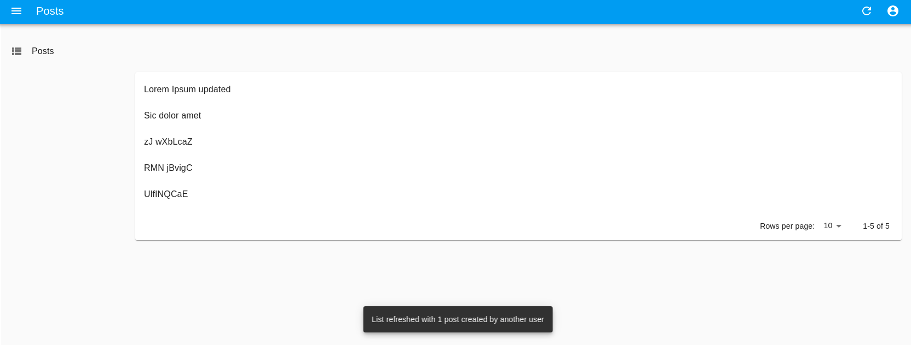

# `<ListLive>`

`<ListLive>` is an [Enterprise Edition](https://react-admin-ee.marmelab.com) component that fetches a list of records, and refreshes the page when a record is created, updated, or deleted.



## Usage

Use `<ListLive>` instead of `<List>`:

```jsx
import { Datagrid, TextField } from 'react-admin';
import { ListLive } from '@react-admin/ra-realtime';

const PostList = () => (
    <ListLive>
        <Datagrid>
            <TextField source="title" />
        </Datagrid>
    </ListLive>
);
```

To trigger refreshes of `<ListLive>`, the API has to publish events containing at least the followings:

```js
{
    topic : '/resource/{resource}',
    event: {
        type: '{deleted || created || updated}',
        payload: { ids: [{listOfRecordIdentifiers}]},
    }
}
```

`<ListLive>` accepts the same props as `<List>`. Refer to [the `<List>` documentation](https://marmelab.com/react-admin/List.html) for more information.

## `onEventReceived`

The `<ListLive>` allows you to customize the side effects triggered when it receives a new event, by passing a function to the `onEventReceived` prop:

```jsx
import { Datagrid, TextField, useNotify, useRefresh } from 'react-admin';
import { ListLive } from '@react-admin/ra-realtime';

const PostList = () => {
    const notify = useNotify();
    const refresh = useRefresh();

    const handleEventReceived = event => {
        const count = get(event, 'payload.ids.length', 1);
        notify(`${count} items updated by another user`);
        refresh();
    };

    return (
        <ListLive onEventReceived={handleEventReceived}>
            <Datagrid>
                <TextField source="title" />
            </Datagrid>
        </ListLive>
    );
};
```
