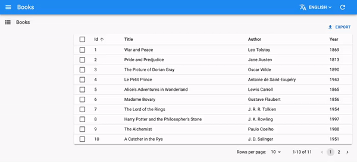

# `<LocalesMenuButton>`

The `<LocalesMenuButton>` component, also known as the "language switcher", displays a menu allowing users to select the language of the interface. It leverages the [store](./Store.md) so that their selection is persisted.



## Usage

Add the `<LocalesMenuButton>` to a custom `<AppBar>`, and list the locales available to end users:

```jsx
import { LocalesMenuButton, AppBar } from 'react-admin';
import { Typography } from '@mui/material';

export const MyAppBar = (props) => (
    <AppBar {...props}>
        <Typography flex="1" variant="h6" id="react-admin-title"></Typography>
        <LocalesMenuButton />
    </AppBar>
);
```

Then, pass the custom App Bar in a custom `<Layout>`, and the `<Layout>` to your `<Admin>`:

```jsx
import polyglotI18nProvider from 'ra-i18n-polyglot';
import englishMessages from 'ra-language-english';
import frenchMessages from 'ra-language-french';
import { Admin, Resource, Layout } from 'react-admin';

import { MyAppBar } from './MyAppBar';

const MyLayout = (props) => <Layout {...props} appBar={MyAppBar} />;

const i18nProvider = polyglotI18nProvider(
    locale => (locale === 'fr' ? frenchMessages : englishMessages),
    getLocales: () => [{ locale: 'en', name: 'English' }, { locale: 'fr', name: 'Français' }],
    'en' // Default locale
);

const App = () => (
    <Admin
        i18nProvider={i18nProvider}
        dataProvider={dataProvider}
        layout={MyLayout}
    >
        ...
    </Admin>
);
```

## `languages`

An array of objects (`{ locale, name }`) representing the key and the label of the languages available to end users. You can omit this prop if your `i18nProvider` has a `getLocales` function.

```jsx
<LocalesMenuButton languages={[
    { locale: 'en', name: 'English' },
    { locale: 'fr', name: 'Français' },
]} />
```

The `locale` will be passed to `setLocale` when the user selects the language, and must be supported by the `i18nProvider`.

## `sx`: CSS API

The `<LocalesMenuButton>` component accepts the usual `className` prop. You can also override many styles of the inner components thanks to the `sx` property (as most MUI components, see their [documentation about it](https://mui.com/customization/how-to-customize/#overriding-nested-component-styles)). This property accepts the following subclasses:

| Rule name                 | Description                                             |
|---------------------------|---------------------------------------------------------|
| `& .RaLocalesMenuButton-selectedLanguage`      | Applied to the current language element |

To override the style of all instances of `<LocalesMenuButton>` using the [MUI style overrides](https://mui.com/customization/globals/#css), use the `RaLocalesMenuButton` key.

## API

* [`LocalesMenuButton`]

[`LocalesMenuButton`]: https://github.com/marmelab/react-admin/blob/master/packages/ra-ui-materialui/src/button/LocalesMenuButton.tsx
