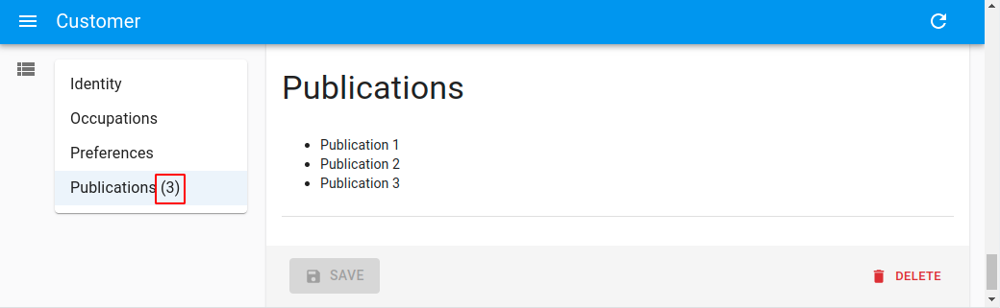

# `<LongForm>`

This [Enterprise Edition](https://marmelab.com/ra-enterprise) component offers an alternative form layout, to be used as child of `<Create>` or `<Edit>`. Expects `<LongForm.Section>` elements as children.

<video controls autoplay playsinline muted loop>
  <source src="./img/ra-longform-overview.webm" type="video/webm"/>
  <source src="./img/ra-longform-overview.mp4" type="video/mp4"/>
  Your browser does not support the video tag.
</video>


Test it live on [the Enterprise Edition Storybook](https://storybook.ra-enterprise.marmelab.com/?path=/story/ra-form-layout-longform--basic).

This component will come in handy if you need to create a long form, with many input fields divided into several sections. It makes navigation easier, by providing a TOC (Table Of Contents) and by keeping the toolbar fixed at the bottom position.

## Usage

Use `<LongForm>` as a child of `<Create>` or `<Edit>`. It should have `<LongForm.Section>` children, which contain inputs.

```jsx
import {
    ArrayInput,
    BooleanInput,
    DateInput,
    Edit,
    required,
    SelectInput,
    SimpleFormIterator,
    TextField,
    TextInput,
    Labeled,
} from 'react-admin';
import { LongForm } from '@react-admin/ra-form-layout';

const sexChoices = [
    { id: 'male', name: 'Male' },
    { id: 'female', name: 'Female' },
];

const languageChoices = [
    { id: 'en', name: 'English' },
    { id: 'fr', name: 'French' },
];

const CustomerEdit = () => (
    <Edit component="div">
        <LongForm>
            <LongForm.Section label="Identity">
                <Labeled label="id">
                    <TextField source="id" />
                </Labeled>
                <TextInput source="first_name" validate={required()} />
                <TextInput source="last_name" validate={required()} />
                <DateInput source="dob" label="born" validate={required()} />
                <SelectInput source="sex" choices={sexChoices} />
            </LongForm.Section>
            <LongForm.Section label="Occupations">
                <ArrayInput source="occupations" label="">
                    <SimpleFormIterator>
                        <TextInput source="name" validate={required()} />
                        <DateInput source="from" validate={required()} />
                        <DateInput source="to" />
                    </SimpleFormIterator>
                </ArrayInput>
            </LongForm.Section>
            <LongForm.Section label="Preferences">
                <SelectInput
                    source="language"
                    choices={languageChoices}
                    defaultValue="en"
                />
                <BooleanInput source="dark_theme" />
                <BooleanInput source="accepts_emails_from_partners" />
            </LongForm.Section>
        </LongForm>
    </Edit>
);
```

## Props 

Here are all the props you can set on the `<LongForm>` component:

| Prop                     | Required | Type              | Default | Description                                                |
| ------------------------ | -------- | ----------------- | ------- | ---------------------------------------------------------- |
| `children`               | Required | `ReactNode`       | -       | A list of `<LongForm.Section>` elements.                   |
| `defaultValues`          | Optional | `object|function` | -       | The default values of the record.                          |
| `id`                     | Optional | `string`          | -       | The id of the underlying `<form>` tag.                     |
| `noValidate`             | Optional | `boolean`         | -       | Set to `true` to disable the browser's default validation. |
| `onSubmit`               | Optional | `function`        | `save`  | A callback to call when the form is submitted.             |
| `sanitizeEmptyValues`    | Optional | `boolean`         | -       | Set to `true` to remove empty values from the form state.  |
| `sx`                     | Optional | `object`          | -       | An object containing the Material UI style overrides to apply to the root component |
| `toolbar`                | Optional | `ReactElement`    | -       | A custom toolbar element.                                  |
| `validate`               | Optional | `function`        | -       | A function to validate the form values.                    |
| `warnWhenUnsavedChanges` | Optional | `boolean`         | -       | Set to `true` to warn the user when leaving the form with unsaved changes. |


Additional props are passed to `react-hook-form`'s [`useForm` hook](https://react-hook-form.com/docs/useform).

## `children`

The children of `<LongForm>` must be [`<LongForm.Section>` elements](#longformsection).

```jsx
const CustomerEdit = () => (
    <Edit component="div">
        <LongForm>
            <LongForm.Section label="Identity">
                ...
            </LongForm.Section>
            <LongForm.Section label="Occupations">
                ...
            </LongForm.Section>
            <LongForm.Section label="Preferences">
                ...
            </LongForm.Section>
        </LongForm>
    </Edit>
);
```

## `defaultValues`

The value of the form `defaultValues` prop is an object, or a function returning an object, specifying default values for the created record. For instance:

```jsx
const postDefaultValue = () => ({ id: uuid(), created_at: new Date(), nb_views: 0 });

export const PostCreate = () => (
    <Create>
        <LongForm defaultValues={postDefaultValue}>
            <LongForm.Section label="Summary">
                <TextInput source="title" />
                <RichTextInput source="body" />
                <NumberInput source="nb_views" />
                <SaveButton />
            </LongForm.Section>
        </LongForm>
    </Create>
);
```

**Tip**: You can include properties in the form `defaultValues` that are not listed as input components, like the `created_at` property in the previous example.

**Tip**: React-admin also allows to define default values at the input level. See the [Setting default Values](./EditTutorial.md#setting-default-values) section.

## `id`

Normally, a submit button only works when placed inside a `<form>` tag. However, you can place a submit button outside the form if the submit button `form` matches the form `id`.

Set this form `id` via the `id` prop.

```jsx
export const PostCreate = () => (
    <Create>
        <LongForm id="post_create_form">
            <LongForm.Section label="summary">
                <TextInput source="title" />
                <RichTextInput source="body" />
                <NumberInput source="nb_views" />
            </LongForm.Section>
        </LongForm>
        <SaveButton form="post_create_form" />
    </Create>
);
```

## `noValidate`

The `<form novalidate>` attribute prevents the browser from validating the form. This is useful if you don't want to use the browser's default validation, or if you want to customize the error messages. To set this attribute on the underlying `<form>` tag, set the `noValidate` prop to `true`.

```jsx
const PostCreate = () => (
    <Create>
        <LongForm noValidate>
            ...
        </LongForm>
    </Create>
);
```

## `onSubmit`

By default, `<LongForm>` calls the `save` callback passed to it by the edit or create controller, via the `SaveContext`. You can override this behavior by setting a callback as the `onSubmit` prop manually.

```jsx
export const PostCreate = () => {
    const [create] = useCreate();
    const postSave = (data) => {
        create('posts', { data });
    };
    return (
        <Create>
            <LongForm onSubmit={postSave}>
                ...
            </LongForm>
        </Create>
    );
};
```

## `sanitizeEmptyValues`

In HTML, the value of empty form inputs is the empty string (`''`). React-admin inputs (like `<TextInput>`, `<NumberInput>`, etc.) automatically transform these empty values into `null`.

But for your own input components based on react-hook-form, this is not the default. React-hook-form doesn't transform empty values by default. This leads to unexpected `create` and `update` payloads like:

```jsx
{
    id: 1234,
    title: 'Lorem Ipsum',
    is_published: '',
    body: '',
    // etc.
}
```

If you prefer to omit the keys for empty values, set the `sanitizeEmptyValues` prop to `true`. This will sanitize the form data before passing it to the `dataProvider`, i.e. remove empty strings from the form state, unless the record actually had a value for that field before edition.

```jsx
const PostCreate = () =>  (
    <Create>
        <LongForm sanitizeEmptyValues>
            ...
        </LongForm>
    </Create>
);
```

For the previous example, the data sent to the `dataProvider` will be:

```jsx
{
    id: 1234,
    title: 'Lorem Ipsum',
}
```

**Note:** Setting the `sanitizeEmptyValues` prop to `true` will also have a (minor) impact on react-admin inputs (like `<TextInput>`, `<NumberInput>`, etc.): empty values (i.e. values equal to `null`) will be removed from the form state on submit, unless the record actually had a value for that field.

If you need a more fine-grained control over the sanitization, you can use [the `transform` prop](./Edit.md#transform) of `<Edit>` or `<Create>` components, or [the `parse` prop](./Inputs.md#parse) of individual inputs.

## `sx`: CSS API

The `<LongForm>` component accepts the usual `className` prop. You can also override the styles of the inner components thanks to the `sx` property. This property accepts the following subclasses:

| Rule name              | Description                            |
|------------------------|----------------------------------------|
| `RaLongForm`           | Applied to the root component          |
| `& .RaLongForm-toc`    | Applied to the TOC                     |
| `& .RaLongForm-main`   | Applied to the main `<Card>` component |
| `& .RaLongForm-toolbar`| Applied to the toolbar                 |
| `& .RaLongForm-error`  | Applied to the `<MenuItem>` in case the section has validation errors |

## `toolbar`

You can customize the form Toolbar by passing a custom element in the `toolbar` prop. The form expects the same type of element as `<SimpleForm>`, see [the `<SimpleForm toolbar>` prop documentation](https://marmelab.com/react-admin/CreateEdit.html#toolbar) in the react-admin docs.

```jsx
import {
    Edit,
    SaveButton,
    Toolbar as RaToolbar,
} from 'react-admin';
import { LongForm } from '@react-admin/ra-form-layout';

const CustomToolbar = () => (
    <RaToolbar>
        <SaveButton label="Save and return" type="button" variant="outlined" />
    </RaToolbar>
);

const CustomerEdit = () => (
    <Edit component="div">
        <LongForm toolbar={<CustomToolbar />}>
            <LongForm.Section label="Identity">
                ...
            </LongForm.Section>
            <LongForm.Section label="Occupations">
                ...
            </LongForm.Section>
            <LongForm.Section label="Preferences">
                ...
            </LongForm.Section>
        </LongForm>
    </Edit>
);
```

## `validate`

The value of the form `validate` prop must be a function taking the record as input, and returning an object with error messages indexed by field. For instance:

```jsx
const validateUserCreation = (values) => {
    const errors = {};
    if (!values.firstName) {
        errors.firstName = 'The firstName is required';
    }
    if (!values.age) {
        // You can return translation keys
        errors.age = 'ra.validation.required';
    } else if (values.age < 18) {
        // Or an object if the translation messages need parameters
        errors.age = {
            message: 'ra.validation.minValue',
            args: { min: 18 }
        };
    }
    return errors
};

export const UserCreate = () => (
    <Create>
        <LongForm validate={validateUserCreation}>
            <LongForm.Section label="Summary">
                <TextInput label="First Name" source="firstName" />
                <TextInput label="Age" source="age" />
            </LongForm.Section>
        </LongForm>
    </Create>
);
```

**Tip**: React-admin also allows to define validation rules at the input level. See [the Validation chapter](./Validation.md#per-input-validation-built-in-field-validators) for details.

**Tip**: The `validate` function can return a promise for asynchronous validation. See [the Server-Side Validation section](./Validation.md#server-side-validation) in the Validation documentation.

## `warnWhenUnsavedChanges`

React-admin keeps track of the form state, so it can detect when the user leaves an `Edit` or `Create` page with unsaved changes. To avoid data loss, you can use this ability to ask the user to confirm before leaving a page with unsaved changes. 


Warning about unsaved changes is an opt-in feature: you must set the `warnWhenUnsavedChanges` prop in the form component to enable it:

```jsx
export const TagEdit = () => (
    <Edit>
        <LongForm warnWhenUnsavedChanges>
            ...
        </LongForm>
    </Edit>
);
```

**Warning**: This feature only works if you have a dependency on react-router 6.3.0 **at most**. The react-router team disabled this possibility in react-router 6.4, so `warnWhenUnsavedChanges` will silently fail with react-router 6.4 or later.

## `<LongForm.Section>`

The children of `<LongForm>` must be `<LongForm.Section>` elements.

This component adds a section title (using a `<Typography variant="h4">`), then renders each child inside a [Material UI `<Stack>`](https://mui.com/material-ui/react-stack/), and finally adds a Material UI `<Divider>` at the bottom of the section.

It accepts the following props:

| Prop              | Required | Type        | Default | Description                                                                          |
| ----------------- | -------- | ----------- | ------- | ------------------------------------------------------------------------------------ |
| `label`           | Required | `string`    | -       | The main label used as the section title. Appears in red when the section has errors |
| `children`        | Required | `ReactNode` | -       | A list of `<Input>` elements                                                         |
| `cardinality`     | Optional | `number`    | -       | A number to be displayed next to the label in TOC, to quantify it                    |
| `sx`              | Optional | `object`    | -       | An object containing the Material UI style overrides to apply to the root component          |

### `cardinality`

The `cardinality` prop allows to specify a numeral quantity to be displayed next to the section label in the TOC.



```jsx
import React, { useEffect, useState } from 'react';
import {
    Edit,
    TextField,
} from 'react-admin';

import { LongForm } from '@react-admin/ra-form-layout';

const CustomerEditWithCardinality = () => {
    const [publications, setPublications] = useState([]);
    useEffect(() => {
        setTimeout(() => {
            setPublications([
                { id: 1, title: 'Publication 1' },
                { id: 2, title: 'Publication 2' },
                { id: 3, title: 'Publication 3' },
            ]);
        }, 500);
    }, []);

    return (
        <Edit component="div">
            <LongForm>
                <LongForm.Section label="Identity">
                    ...
                </LongForm.Section>
                <LongForm.Section label="Occupations">
                    ...
                </LongForm.Section>
                <LongForm.Section label="Preferences">
                    ...
                </LongForm.Section>
                <LongForm.Section
                    label="Publications"
                    cardinality={publications.length}
                >
                    <ul>
                        {publications.map(publication => (
                            <li key={publication.id}>
                                <TextField
                                    source="title"
                                    record={publication}
                                />
                            </li>
                        ))}
                    </ul>
                </LongForm.Section>
            </LongForm>
        </Edit>
    );
};
```

## AutoSave

In forms where users may spend a lot of time, it's a good idea to save the form automatically after a few seconds of inactivity. You turn on this feature by using [the `<AutoSave>` component](./AutoSave.md).


```tsx
import { LongForm, AutoSave } from '@react-admin/ra-form-layout';
import { Edit, TextInput, DateInput, SelectInput, Toolbar } from 'react-admin';

const AutoSaveToolbar = () => (
    <Toolbar>
        <AutoSave />
    </Toolbar>
);

const PersonEdit = () => (
    <Edit mutationMode="optimistic">
        <LongForm
            resetOptions={{ keepDirtyValues: true }}
            toolbar={<AutoSaveToolbar />}
        >
            <LongForm.Section label="identity">
                <TextInput source="first_name" />
                <TextInput source="last_name" />
                <DateInput source="dob" />
                <SelectInput source="sex" choices={[
                    { id: 'male', name: 'Male' },
                    { id: 'female', name: 'Female' },
                ]}/>
            </LongForm.Section>
        </LongForm>
    </Edit>
);
```


Note that you **must** set the `<LongForm resetOptions>` prop to `{ keepDirtyValues: true }`. If you forget that prop, any change entered by the end user after the autosave but before its acknowledgement by the server will be lost.

If you're using it in an `<Edit>` page, you must also use a `pessimistic` or `optimistic` [`mutationMode`](https://marmelab.com/react-admin/Edit.html#mutationmode) - `<AutoSave>` doesn't work with the default `mutationMode="undoable"`.

Check [the `<AutoSave>` component](./AutoSave.md) documentation for more details.

## Role-Based Access Control (RBAC)

Fine-grained permissions control can be added by using the [`<LongForm>`](./AuthRBAC.md#longform) and [`<LongFormSection>`](./AuthRBAC.md#longform) components provided by the `@react-admin/ra-enterprise` package. 


```tsx
import { LongForm } from '@react-admin/ra-enterprise';

const authProvider = {
    checkAuth: () => Promise.resolve(),
    login: () => Promise.resolve(),
    logout: () => Promise.resolve(),
    checkError: () => Promise.resolve(),
    getPermissions: () =>Promise.resolve([
        // 'delete' is missing
        { action: ['list', 'edit'], resource: 'products' },
        { action: 'write', resource: 'products.reference' },
        { action: 'write', resource: 'products.width' },
        { action: 'write', resource: 'products.height' },
        // 'products.description' is missing
        { action: 'write', resource: 'products.thumbnail' },
        // 'products.image' is missing
        { action: 'write', resource: 'products.Section.description' },
        { action: 'write', resource: 'products.Section.images' },
        // 'products.Section.stock' is missing
    ]),
};

const ProductEdit = () => (
    <Edit>
        <LongForm>
            <LongForm.Section name="description" label="Description">
                <TextInput source="reference" />
                <TextInput source="width" />
                <TextInput source="height" />
                <TextInput source="description" />
            </LongForm.Section>
            <LongForm.Section name="images" label="Images">
                <TextInput source="image" />
                <TextInput source="thumbnail" />
            </LongForm.Section>
            <LongForm.Section name="stock" label="Stock">
                <TextInput source="stock" />
            </LongForm.Section>
            // delete button not displayed
        </LongForm>
    </Edit>
);
```


Check [the RBAC `<LongForm>`](./AuthRBAC.md#longform) documentation for more details.
