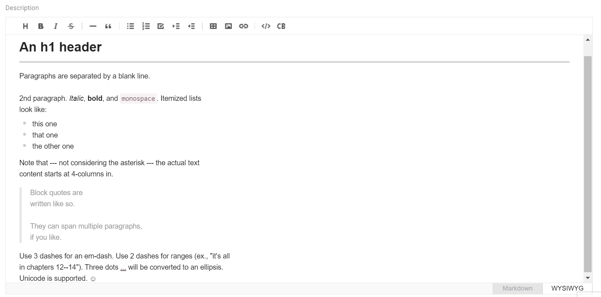

# `<MarkdownInput>`

This [Enterprise Edition](https://marmelab.com/ra-enterprise) component allows to edit and preview Markdown data, based on [the Toast UI editor](https://nhn.github.io/tui.editor/latest/ToastUIEditor).



```jsx
import { Edit, SimpleForm, TextInput } from 'react-admin';
import { MarkdownInput } from '@react-admin/ra-markdown';

const PostEdit = () => (
    <Edit>
        <SimpleForm>
            <TextInput source="title" />
            <MarkdownInput source="description" />
        </SimpleForm>
    </Edit>
);
```

Check [the `ra-markdown` documentation](https://marmelab.com/ra-enterprise/modules/ra-markdown) for more details.
