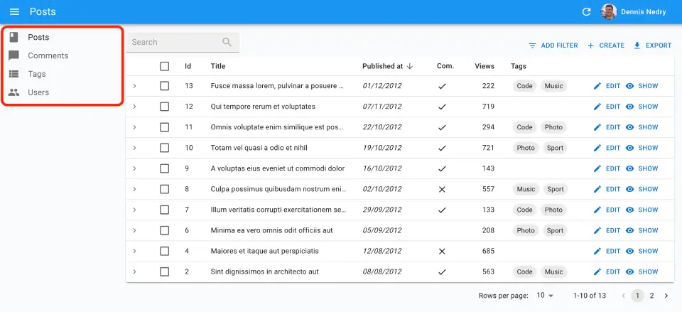
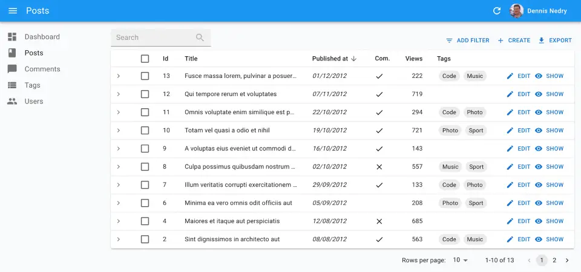
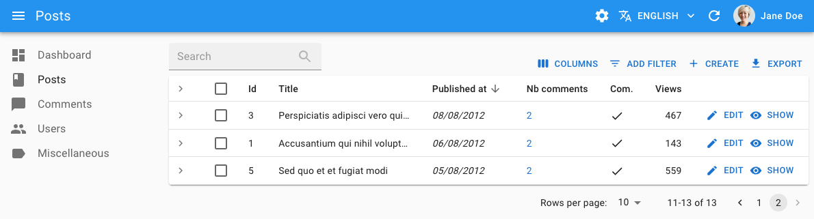
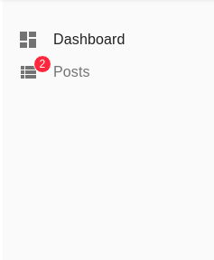

# `<Menu>`

This component renders a menu, with one menu item per resource by default. You can also set menu items by hand.



## Usage

Create a custom menu component using react-admin's `<Menu>` as the root component, and a combination of `<Menu.DashboardItem>`, `<Menu.ResourceItems>`, `<Menu.ResourceItem>`, and `<Menu.Item>` as children:

```jsx
// in src/MyMenu.js
import { Menu } from 'react-admin';
import LabelIcon from '@mui/icons-material/Label';

export const MyMenu = () => (
    <Menu>
        <Menu.DashboardItem />
        <Menu.ResourceItem name="posts" />
        <Menu.ResourceItem name="comments" />
        <Menu.ResourceItem name="users" />
        <Menu.Item to="/custom-route" primaryText="Miscellaneous" leftIcon={<LabelIcon />} />
    </Menu>
);
```

Then, create a custom layout using [the `<Layout>` component](./Layout.md) and pass your custom menu component to it:

```jsx
// in src/MyLayout.js
import { Layout } from 'react-admin';

import { MyMenu } from './MyMenu';

export const MyLayout = props => <Layout {...props} menu={MyMenu} />;
```

Finally, pass this custom layout to the `<Admin>` component:

```jsx
// in src/App.js
import { MyLayout } from './MyLayout';

const App = () => (
    <Admin layout={MyLayout} dataProvider={...}>
        // ...
    </Admin>
);
```

**Tip**: `<Menu.DashboardItem>` is a shortcut for `<DashboardMenuItem>`, and `<Menu.Item>` is a shortcut for `<MenuItemLink>`.

## Props

| Prop        | Required | Type        | Default  | Description                                                                          |
| ----------- | -------- | ----------- | -------- | ------------------------------------------------------------------------------------ |
| `children`  | Optional | `ReactNode` | -        | The Menu Item Links to be rendered. If not provided, defaults to the Resource names. |
| `sx`        | Optional | `SxProps`   | -        | Style overrides, powered by MUI System                                               |

Additional props are passed down to the root component (the Material UI [`<MenuList>`](https://mui.com/material-ui/api/menu-list/) component)

## `children`

`<Menu>` without children renders one menu item per resource, in the same order as they are declared in `<Admin>`, using the `<Resource icon>` prop as menu icon. The menu target is the `list` route of the resource. If you define a `<Admin dashboard>` component, react-admin adds a dashboard menu item at the top of the menu.

So the following example of `<Menu>` used without children:

```jsx
import { Admin, Resource, Layout, Menu } from 'react-admin';
import BookIcon from '@mui/icons-material/Book';
import ChatBubbleIcon from '@mui/icons-material/ChatBubble';
import PeopleIcon from '@mui/icons-material/People';

import { dataProvider } from './dataProvider';

const MyMenu = () => <Menu />;
const MyLayout = (props) => <Layout {...props} menu={MyMenu} />

const App = () => (
    <Admin dataProvider={dataProvider} layout={MyLayout} dashboard={MyDashboard}>
        <Resource name="posts" list={PostList} icon={BookIcon} />
        <Resource name="comments" list={CommentList} icon={ChatBubbleIcon} />
        <Resource name="tags" list={TagList} />
        <Resource name="users" list={UserList} icon={PeopleIcon} />
    </Admin>
);
```

Renders the following menu: 



If you pass children to `<Menu>`, they will override the default menu items. The children should be a combination of:

- [`<Menu.DashboardItem>`](#menudashboarditem) to add a menu item for the dashboard,
- [`<Menu.ResourceItems>`](#menuresourceitems) to add menu items for the list views of all resources,
- [`<Menu.ResourceItem>`](#menuresourceitem) to add menu items for the list view of one resource,
- [`<Menu.Item>`](#menuitem) to add custom menu items.

`<Menu>` will render its children in the order they are declared.

So the following example of `<Menu>` used with children:

```jsx
// in src/MyMenu.js
import { Menu } from 'react-admin';
import LabelIcon from '@mui/icons-material/Label';

export const MyMenu = () => (
    <Menu>
        <Menu.DashboardItem />
        <Menu.ResourceItem name="posts" />
        <Menu.ResourceItem name="comments" />
        <Menu.ResourceItem name="users" />
        <Menu.Item to="/custom-route" primaryText="Miscellaneous" leftIcon={<LabelIcon />} />
    </Menu>
);
```

Renders the following menu:



Check [the `<Menu.Item>` section](#menuitem) for more information.

## `sx`: CSS API

Pass an `sx` prop to customize the style of the main component and the underlying elements.


```jsx
export const MyMenu = () => (
    <Menu sx={{ 
        marginTop: 0,
        '&.RaMenu-closed': {
            opacity: 0.8,
        },
    }} />
);
```


This property accepts the following subclasses:

| Rule name         | Description                          |
|-------------------|------------------------------------- |
| `&.RaMenu-open`   | Applied the menu when it's open      |
| `&.RaMenu-closed` | Applied to the menu when it's closed |

To override the style of `<Menu>` using the [application-wide style overrides](./AppTheme.md#theming-individual-components), use the `RaMenu` key.

## `<Menu.Item>`

The `<Menu.Item>` component displays a menu item with a label and an icon - or only the icon with a tooltip when the sidebar is minimized. It also handles the automatic closing of the menu on tap on mobile.

```jsx
// in src/MyMenu.js
import { Menu } from 'react-admin';

export const MyMenu = () => (
    <Menu>
        ...
        <Menu.Item to="/custom-route" primaryText="Miscellaneous" />
    </Menu>
);
```

The `primaryText` prop accepts a string, that react-admin passes through the [translation utility](./Translation.md). Alternately, you can set the menu item content using the `children`, e.g. to display a badge on top of the menu item:

```jsx
import Badge from '@mui/material/Badge';
import { Menu } from 'react-admin';

export const MyMenu = () => (
    <Menu>
        ...
        <Menu.Item to="/custom-route" primaryText="Notifications">
            <Badge badgeContent={4} color="primary">
                Notifications
            </Badge>
        </Menu.Item>
    </Menu>
);
```

Note that if you use the `children` prop, you'll have to translate the menu item content yourself using [`useTranslate`](./useTranslate.md). You'll also need to provide a `primaryText` either way, because it will be rendered in the tooltip when the side menu is collapsed.

The `letfIcon` prop allows setting the menu left icon.

```jsx
// in src/MyMenu.js
import { Menu } from 'react-admin';
import LabelIcon from '@mui/icons-material/Label';

export const MyMenu = () => (
    <Menu>
        ...
        <Menu.Item 
            to="/custom-route"
            primaryText="Miscellaneous"
            leftIcon={<LabelIcon />}
        />
    </Menu>
);
```

Additional props are passed down to [the underling Material UI `<MenuItem>` component](https://mui.com/material-ui/api/menu-item/).

**Tip**: The `<Menu.Item>` component makes use of the React Router [NavLink](https://reactrouter.com/docs/en/v6/components/nav-link) component, hence allowing to customize the active menu style. For instance, here is how to use a custom theme to show a left border for the active menu:

```jsx
export const theme = {
    palette: {
        // ...
    },
    components: {
        // ... 
        RaMenuItemLink: {
            styleOverrides: {
                root: {
                    // invisible border when not active, to avoid position flashs
                    borderLeft: '3px solid transparent', 
                    '&.RaMenuItemLink-active': {
                        borderLeft: '10px solid #4f3cc9',
                    },
                    '& .RaMenuItemLink-icon': {
                        color: '#EFC44F',
                    },
                },
            },
       },
    },
};
```

## `<Menu.DashboardItem>`

The `<Menu.DashboardItem>` component displays a menu item for the dashboard.

```jsx
// in src/MyMenu.js
import { Menu } from 'react-admin';

export const MyMenu = () => (
    <Menu>
        <Menu.DashboardItem />
        ...
    </Menu>
);
```

Clicking on the dashboard menu item leads to the `/` route and renders the component defined in [the `<Admin dashboard>` prop](./Admin.md#dashboard).

You can customize this menu item label by using the `primaryText` or `children` prop (see [the `<Menu.Item>` section](#menuitem) for more information).

## `<Menu.ResourceItems>`

The `<Menu.ResourceItems>` component displays one menu item for each resource, using the resource label and icon defined in the `<Resource>` components, and in the order in which they were declared in `<Admin>`.

```jsx
import { Menu } from 'react-admin';

export const MyMenu = () => (
    <Menu>
        ...
        <Menu.ResourceItems />
        ...
    </Menu>
);
```

So with the following `<Admin>` component:

```jsx
const App = () => (
    <Admin dataProvider={dataProvider} layout={MyLayout} dashboard={MyDashboard}>
        <Resource name="posts" list={PostList} icon={BookIcon} />
        <Resource name="comments" list={CommentList} icon={ChatBubbleIcon} />
        <Resource name="tags" list={TagList} />
        <Resource name="users" list={UserList} icon={PeopleIcon} />
    </Admin>
);
```

`<Menu.ResourceItems>` renders the following menu items:

```jsx
<Menu.ResourceItem name="posts" />
<Menu.ResourceItem name="comments" />
<Menu.ResourceItem name="tags" />
<Menu.ResourceItem name="users" />
```

## `<Menu.ResourceItem>`

The `<Menu.ResourceItem>` component displays a menu item for the list page of a resource, based on the resource name.

```jsx
import { Menu } from 'react-admin';

export const MyMenu = () => (
    <Menu>
        <Menu.ResourceItem name="posts" />
        <Menu.ResourceItem name="comments" />
        <Menu.ResourceItem name="tags" />
        <Menu.ResourceItem name="users" />
    </Menu>
);
```

`<Menu.ResourceItem>` renders a menu item for a resource based on its name, using the resource label and icon defined in the corresponding `<Resource>` component.

So using the following resource definition:

```jsx
<Resource name="posts" list={PostList} icon={BookIcon} />
```

the following code:

```jsx
<Menu.ResourceItem name="posts" />
```

translates to:

```jsx
<Menu.Item to="/posts" primaryText="Posts" leftIcon={<BookIcon />} />
```

You can customize this menu item label by using the `primaryText` or `children` prop (see [the `<Menu.Item>` section](#menuitem) for more information).

## Creating Menu Items For Resources

If you want to reorder the default menu, create a new Menu and use `<Menu.ResourceItem>` components as children.

```jsx
// in src/MyMenu.js
import { Menu } from 'react-admin';

export const MyMenu = () => (
    <Menu>
        <Menu.ResourceItem name="posts" />
        <Menu.ResourceItem name="comments" />
        <Menu.ResourceItem name="tags" />
        <Menu.ResourceItem name="users" />
    </Menu>
);
```

Passing `children` to `<Menu>` actually *replaces* the default menu items. If you want to render a custom menu item **in addition to** the default resource menu items, use the [`<Menu.ResourceItems>`](#menuresourceitems) component to render one menu item per resource.

```jsx
// in src/MyMenu.js
import { Menu } from 'react-admin';
import LabelIcon from '@mui/icons-material/Label';

export const MyMenu = () => (
    <Menu>
        <Menu.ResourceItems />
        <Menu.Item to="/custom-route" primaryText="Miscellaneous" leftIcon={<LabelIcon />} />
    </Menu>
);
```

## Adding A Menu To A Filtered List

As the filter values are taken from the URL, you can link to a pre-filtered list by setting the `filter` query parameter.

For instance, to include a menu to a list of published posts:


```jsx
<Menu.Item
    to={{
        pathname: '/posts',
        search: `filter=${JSON.stringify({ is_published: true })}`,
    }}
    primaryText="Published Posts"
    leftIcon={<BookIcon />}
/>
```


## Resetting Filters On Menu Click

By default, a click on `<Menu.Item >` for a list page opens the list with the same filters as they were applied the last time the user saw them. This is usually the expected behavior, but your users may prefer that clicking on a menu item resets the list filters.

Just use an empty `filter` query parameter to force empty filters:

```jsx
<Menu.Item
    to="/posts?filter=%7B%7D" // %7B%7D is JSON.stringify({})
    primaryText="Posts"
    leftIcon={<BookIcon />}
/>
```

## Nested Menu Items

If you need to display a menu item with a submenu, you should use [the `<MultiLevelMenu>` component](./MultiLevelMenu.md) instead of `<Menu>`.

<video controls autoplay playsinline muted loop>
  <source src="https://marmelab.com/ra-enterprise/modules/assets/ra-multilevelmenu-item.webm" type="video/webm" />
  <source src="https://marmelab.com/ra-enterprise/modules/assets/ra-multilevelmenu-item.mp4" type="video/mp4" />
  Your browser does not support the video tag.
</video>

## Live Updates

You can display a badge on the menu item to indicate that new data is available. Use [the `<MenuLive>` component](./MenuLive.md) instead of `<Menu>` to enable this feature.

```tsx
import { Admin, Layout, LayoutProps, Resource } from 'react-admin';
import { MenuLive } from '@react-admin/ra-realtime';
import { PostList, PostShow, PostEdit, realTimeDataProvider } from '.';

const CustomLayout = (props: LayoutProps) => (
    <Layout {...props} menu={MenuLive} />
);

const MyReactAdmin = () => (
    <Admin dataProvider={realTimeDataProvider} layout={CustomLayout}>
        <Resource name="posts" list={PostList} show={PostShow} edit={PostEdit} />
    </Admin>
);
```


