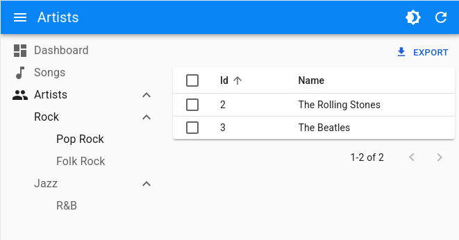

# `<MultiLevelMenu>`

This [Enterprise Edition](https://react-admin-ee.marmelab.com) component adds support for nested sub menus in the left navigation bar.



When a React-admin application grows significantly, the default menu might not be the best solution. The `<MultiLevelMenu>` can help unclutter the navigation: it renders a menu with an infinite number of levels and sub-menus. Menu Items that are not at the top level are rendered inside a collapsible panel.

<video controls autoplay playsinline muted loop>
  <source src="https://react-admin-ee.marmelab.com/assets/ra-multilevelmenu-item.mp4" type="video/mp4" />
  Your browser does not support the video tag.
</video>

When a React-admin application grows significantly, [the default `<Menu>` component](./Menu.md) might not be the best solution. The `<MultiLevelMenu>` can help unclutter the navigation: it renders a menu with an infinite number of levels and sub menus. Menu Items that are not at the top level are rendered inside a collapsible panel.

Test it live on [the Enterprise Edition Storybook](https://storybook.ra-enterprise.marmelab.com/?path=/story/ra-navigation-multilevelmenu--with-icons).

## Usage

Create a custom Menu component using `<MultiLevelMenu>` as root instead of `<Menu>`. Menu entries should be `<MultiLevelMenu.Item>`, `<MultiLevelMenu.ResourceItem>` or `<MultiLevelMenu.DashboardItem>` components.
They are very similar to the default `<MenuItemLink>` from react-admin, except that they accept other `<MultiLevelMenu.Item>` (or `<MultiLevelMenu.ResourceItem>` or `<MultiLevelMenu.DashboardItem>`) as their children.

For instance, here is how to create a menu with sub menus for each artist genre. The menu target is actually the same page - the artists list - but with a different filter:

```jsx
import { MultiLevelMenu } from '@react-admin/ra-navigation';

import DashboardIcon from '@mui/icons-material/Dashboard';
import MusicIcon from '@mui/icons-material/MusicNote';
import PeopleIcon from '@mui/icons-material/People';

const MyMenu = () => (
    <MultiLevelMenu>
        <MultiLevelMenu.DashboardItem />
        <MultiLevelMenu.ResourceItem resource="songs" icon={<MusicIcon />}  />
        {/* The empty filter is required to avoid falling back to the previously set filter */}
        <MultiLevelMenu.ResourceItem resource="artists" to={'/artists?filter={}'} icon={<PeopleIcon />}>
            <MultiLevelMenu.Item name="artists.rock" to={'/artists?filter={"type":"Rock"}'} label="Rock">
                <MultiLevelMenu.Item name="artists.rock.pop" to={'/artists?filter={"type":"Pop Rock"}'} label="Pop Rock" />
                <MultiLevelMenu.Item name="artists.rock.folk" to={'/artists?filter={"type":"Folk Rock"}'} label="Folk Rock" />
            </MultiLevelMenu.Item>
            <MultiLevelMenu.Item name="artists.jazz" to={'/artists?filter={"type":"Jazz"}'} label="Jazz">
                <MultiLevelMenu.Item name="artists.jazz.rb" to={'/artists?filter={"type":"RB"}'} label="R&B" />
            </MultiLevelMenu.Item>
        </MultiLevelMenu.ResourceItem>
    </MultiLevelMenu>
);
```

Note that each `<MultiLevelMenu.Item>` requires a unique `name` attribute.

Then, create a custom layout using [the `<Layout>` component](./Layout.md) and pass your custom menu component to it. Make sure you wrap the layout with the `<AppLocationContext>` component.

```jsx
// in src/MyLayout.js
import { Layout } from 'react-admin';
import { AppLocationContext } from '@react-admin/ra-navigation';

import { MyMenu } from './MyMenu';

export const MyLayout = ({ children }) => (
  <AppLocationContext>
    <Layout menu={MyMenu}>
        {children}
    </Layout>
  </AppLocationContext>
);
```

`<AppLocationContext>` is necessary because `ra-navigation` doesn't use the URL to detect the current location. Instead, page components *declare* their location using a custom hook (`useDefineAppLocation()`). This allows complex site maps, with multiple levels of nesting. That's the reason why each `<MultiLevelMenu.Item>` requires a unique `name`, that matches a particular page location.

You can set the `AppLocation` for a given page like so:

```jsx
import { useDefineAppLocation } from '@react-admin/ra-navigation';

const ArtistRockList = () => {
    useDefineAppLocation('artists.rock');
    return <h1>Artist Rock List</h1>;
};
```

And then use this `AppLocation` as `name` for `<MultiLevelMenu.Item>`:

```jsx
<MultiLevelMenu.Item
    name="artists.rock"
    to={'/artists/rock'}
    label="Rock"
>
```

Check [the ra-navigation documentation](https://react-admin-ee.marmelab.com/documentation/ra-navigation) to learn more about App Location.

Finally, pass this custom layout to the `<Admin>` component

```jsx
// in src/App.js
import { Admin, Resource } from "react-admin";

import { MyLayout } from './MyLayout';

const App = () => (
    <Admin
        layout={MyLayout}
        dataProvider={...}
    >
        // ...
    </Admin>
);
```

## Props

| Prop           | Required | Type        | Default  | Description                                                                                                      |
| -------------- | -------- | ----------- | -------- | ---------------------------------------------------------------------------------------------------------------- |
| `children`     | Optional | `ReactNode` | -        | The Menu Items to be rendered.                                                                                   |
| `initialOpen`  | Optional | `boolean`   | `false`  | Whether the menu items with sub menus should be open initially. Has no effect if using the `categories` variant. |
| `openItemList` | Optional | `string[]`  | -        | List of names of menu items that should be opened by default.                                                    |
| `sx`           | Optional | `SxProps`   | -        | Style overrides, powered by MUI System                                                                           |

Additional props are passed down to the root `<div>` component.

## `children`

The menu items to render:

```jsx
// in src/MyMenu.js
import { MultiLevelMenu } from "@react-admin/ra-navigation";

import MusicIcon from '@mui/icons-material/MusicNote';
import PeopleIcon from '@mui/icons-material/People';

const MyMenu = () => (
    <MultiLevelMenu>
        <MultiLevelMenu.DashboardItem />
        <MultiLevelMenu.ResourceItem resource="songs" icon={<MusicIcon />}  />
        {/* The empty filter is required to avoid falling back to the previously set filter */}
        <MultiLevelMenu.ResourceItem
            resource="artists"
            to={'/artists?filter={}'}
            icon={<PeopleIcon />}
        >
            <MultiLevelMenu.Item
                name="artists.rock"
                to={'/artists?filter={"type":"Rock"}'}
                label="Rock"
            >
                <MultiLevelMenu.Item
                    name="artists.rock.pop"
                    to={'/artists?filter={"type":"Pop Rock"}'}
                    label="Pop Rock"
                />
                <MultiLevelMenu.Item
                    name="artists.rock.folk"
                    to={'/artists?filter={"type":"Folk Rock"}'}
                    label="Folk Rock"
                />
            </MultiLevelMenu.Item>
            <MultiLevelMenu.Item
                name="artists.jazz"
                to={'/artists?filter={"type":"Jazz"}'}
                label="Jazz"
            >
                <MultiLevelMenu.Item
                    name="artists.jazz.rb"
                    to={'/artists?filter={"type":"RB"}'}
                    label="R&B"
                />
            </MultiLevelMenu.Item>
        </MultiLevelMenu.ResourceItem>
    </MultiLevelMenu>
);
```

Check [the `<MultiLevelMenu.Item>` section](#multilevelmenuitem) for more information.

## `initialOpen`

Whether the menu items with sub menus should be open initially. Has no effect if using the `categories` variant. Defaults to `false`.

```jsx
export const MyMenu = () => (
    <MultiLevelMenu initialOpen>
        // ...
    </MultiLevelMenu>
);
```

## `openItemList`

List of names of menu items that should be opened by default.
If the menu item to be opened is nested, you have to fill in the name of all the parent items. Ex: `['artists', 'artists.rock', 'artists.rock.pop']`

```tsx
import { MultiLevelMenu } from '@react-admin/ra-navigation';
const MyMenu = () => (
    <MultiLevelMenu openItemList={['artists', 'artists.rock', 'artists.rock.pop']}>
        <MultiLevelMenu.DashboardItem />
        <MultiLevelMenu.ResourceItem resource="songs" />
        {/* The empty filter is required to avoid falling back to the previously set filter */}
        <MultiLevelMenu.ResourceItem
            resource="artists"
            to={'/artists?filter={}'}
        >
            <MultiLevelMenu.Item
                name="artists.rock"
                to={'/artists?filter={"type":"Rock"}'}
                label="Rock"
            >
                <MultiLevelMenu.Item
                    name="artists.rock.pop"
                    to={'/artists?filter={"type":"Pop Rock"}'}
                    label="Pop Rock"
                />
                <MultiLevelMenu.Item
                    name="artists.rock.folk"
                    to={'/artists?filter={"type":"Folk Rock"}'}
                    label="Folk Rock"
                />
            </MultiLevelMenu.Item>
            <MultiLevelMenu.Item
                name="artists.jazz"
                to={'/artists?filter={"type":"Jazz"}'}
                label="Jazz"
            >
                <MultiLevelMenu.Item
                    name="artists.jazz.rb"
                    to={'/artists?filter={"type":"RB"}'}
                    label="R&B"
                />
            </MultiLevelMenu.Item>
        </MultiLevelMenu.ResourceItem>
    </MultiLevelMenu>
);
```

## `sx`: CSS API

Pass an `sx` prop to customize the style of the main component and the underlying elements.



```jsx
export const MyMenu = () => (
    <MultiLevelMenu sx={{ marginTop: 0 }}>
        // ...
    </MultiLevelMenu>
);
```



To override the style of `<MultiLevelMenu>` using the [application-wide style overrides](./AppTheme.md#theming-individual-components), use the `RaMenuRoot` key.

Style overrides, powered by MUI System:

| Rule name                               | Description                                                                               |
| --------------------------------------- | ----------------------------------------------------------------------------------------- |
| `RaMultiLevelMenu`                      | Applied to the root `div` element                                                         |
| `& .RaMultiLevelMenu-nav`               | Applied to the `nav` element                                                              |
| `& .RaMultiLevelMenu-navWithCategories` | Applied to the `nav` element when using the `categories` variant                          |
| `& .RaMultiLevelMenu-list`              | Applied to the MUI `<List>`                                                               |

## `<MultiLevelMenu.Item>`

The `<MultiLevelMenu.Item>` component displays a menu item with a label and an icon.

```jsx
<MultiLevelMenu.Item
    name="songs"
    to="/songs"
    label="Songs"
    icon={<MusicIcon />}
/>
```

### Usage

```tsx
import { MultiLevelMenu } from '@react-admin/ra-navigation';
const MyMenu = () => (
    <MultiLevelMenu>
        {/* The empty filter is required to avoid falling back to the previously set filter */}
        <MultiLevelMenu.Item
            name="artists"
            to={'/artists?filter={}'}
            label="artists"
        >
            <MultiLevelMenu.Item
                name="artists.rock"
                to={'/artists?filter={"type":"Rock"}'}
                label="Rock"
            >
                <MultiLevelMenu.Item
                    name="artists.rock.pop"
                    to={'/artists?filter={"type":"Pop Rock"}'}
                    label="Pop Rock"
                />
                <MultiLevelMenu.Item
                    name="artists.rock.folk"
                    to={'/artists?filter={"type":"Folk Rock"}'}
                    label="Folk Rock"
                />
            </MultiLevelMenu.Item>
            <MultiLevelMenu.Item
                name="artists.jazz"
                to={'/artists?filter={"type":"Jazz"}'}
                label="Jazz"
            >
                <MultiLevelMenu.Item
                    name="artists.jazz.rb"
                    to={'/artists?filter={"type":"RB"}'}
                    label="R&B"
                />
            </MultiLevelMenu.Item>
        </MultiLevelMenu.Item>
    </MultiLevelMenu>
);
```

### Props

In addition to the props of react-router [`<NavLink>`](https://reactrouter.com/web/api/NavLink) and those of material-ui [`<ListItem>`](https://material-ui.com/api/list-item/).

| Prop    | Required | Type        | Default | Description                                                   |
| ------- | -------- | ----------- | ------- | ------------------------------------------------------------- |
| `name`  | Required | `string`    |         | The name of the item. Used to manage its open/closed state.   |
| `icon`  | Optional | `ReactNode` | -       | An icon element to display in front of the item.              |
| `label` | Optional | `string`    | -       | The label to display for this item. Accepts translation keys. |
| `sx`    | Optional | `SxProps`   | -       | Style overrides, powered by MUI System.                       |

**Tip:** You can omit the `to` from `<NavLink>` property for `<MultiLevelMenu.Item>` elements that have a child menu item.

### `name`

The name of the item. Used to manage its open/closed state.

```tsx
import { MultiLevelMenu } from '@react-admin/ra-navigation';
const MyMenu = () => (
    <MultiLevelMenu>
        <MultiLevelMenu.Item name="artists" to={'/artists?filter={}'} />
    </MultiLevelMenu>
);
```

### `icon`

An icon element to display in front of the item.

```tsx
import { MultiLevelMenu } from '@react-admin/ra-navigation';
import PeopleIcon from '@mui/icons-material/People';
const MyMenu = () => (
    <MultiLevelMenu>
        <MultiLevelMenu.Item name="artists" to={'/artists?filter={}'} icon={<PeopleIcon />} />
    </MultiLevelMenu>
);
```

### `label`

The label to display for this item. Accepts translation keys.

```tsx
import { MultiLevelMenu } from '@react-admin/ra-navigation';
import PeopleIcon from '@mui/icons-material/People';
const MyMenu = () => (
    <MultiLevelMenu>
        <MultiLevelMenu.Item name="artists" to={'/artists?filter={}'} label="Artists" />
        <MultiLevelMenu.Item name="settings" to={'/artists?filter={}'} label="myapp.menu.settings" />
    </MultiLevelMenu>
);
```

### `sx`

Style overrides, powered by MUI System:

| Rule name                        | Description                                                                        |
| -------------------------------- | ---------------------------------------------------------------------------------- |
| `RaMenuItem`                     | Applied to the root `div` element                                                  |
| `& .RaMenuItem-container`        | Applied to the MUI `<ListItem>` element                                            |
| `& .RaMenuItem-link`             | Applied to the text of the `NavLink`                                               |
| `& .RaMenuItem-active`           | Applied to the text of the `NavLink` when active (this item is the current page)   |
| `& .RaMenuItem-menuIcon`         | Applied to the MUI `<ListItemIcon>` element                                        |
| `& .RaMenuItem-icon`             | Applied to the item icon element                                                   |
| `& .RaMenuItem-button`           | Applied to the MUI `<IconButton>` that open/closes the item children list          |
| `& .RaMenuItem-nestedList`       | Applied to the MUI `<List>` element that contains the item children                |
| `& .RaMenuItem-hiddenNestedList` | Applied to the MUI `<List>` element that contains the item children when collapsed |
| `& .RaMenuItem-itemButton`       | Applied to the MUI `<ListItemButton>`                                              |



```tsx
import { MultiLevelMenu } from '@react-admin/ra-navigation';
const MyMenu = () => (
    <MultiLevelMenu>
        <MultiLevelMenu.Item name="artists" to={'/artists?filter={}'} sx={{ border: 'solid 1px #000' }} />
    </MultiLevelMenu>
);
```



## `<MultiLevelMenu.DashboardItem>`

A `<MultiLevelMenu.Item>` for the dashboard.

### Usage

```tsx
import { MultiLevelMenu } from '@react-admin/ra-navigation';

const MyMenu = () => (
    <MultiLevelMenu>
        <MultiLevelMenu.DashboardItem />
    </MultiLevelMenu>
);
```

It accepts all props from [`<MultiLevelMenu.Item>`](#multilevelmenuitem)

## `<MultiLevelMenu.ResourceItem>`

A `<MultiLevelMenu.Item>` for resources. It only needs the `resource` name and automatically applies access control if your [`authProvider` implements `canAccess`](./Permissions.md#authprovidercanaccess) by calling it with the following parameters:

```js
{
    resource: "posts",
    action: "list",
}
```

### Usage

```tsx
import { MultiLevelMenu } from '@react-admin/ra-navigation';

const MyMenu = () => (
    <MultiLevelMenu>
        <MultiLevelMenu.ResourceItem resource="artists" />
    </MultiLevelMenu>
);
```

### Props

In addition to the props of [`<MultiLevelMenu.Item>`](#multilevelmenuitem), it accepts the following props

| Prop       | Required | Type        | Default | Description                       |
| ---------- | -------- | ----------- | ------- | --------------------------------- |
| `resource` | Required | `string`    |         | The resource this item refers to. |

**Tip:** Note that the `name` prop from [`<MultiLevelMenu.Item>`](#multilevelmenuitem) is optional for `<MultiLevelMenu.ResourceItem>`.

### `resource`

The resource this item refers to

```tsx
import { MultiLevelMenu } from '@react-admin/ra-navigation';

const MyMenu = () => (
    <MultiLevelMenu>
        <MultiLevelMenu.ResourceItem resource="artists" />
    </MultiLevelMenu>
);
```

## Creating Menu Items For Resources

If you want to render a custom menu item and the default resource menu items, use the `useResourceDefinitions` hook to retrieve the list of resources and create one menu item per resource.

```jsx
// in src/MyMenu.js
import { createElement } from 'react';
import { useResourceDefinitions } from 'react-admin';
import { MultiLevelMenu } from "@react-admin/ra-navigation";
import LabelIcon from '@mui/icons-material/Label';

export const MyMenu = () => {
    const resources = useResourceDefinitions();

    return (
        <MultiLevelMenu>
            {Object.keys(resources).map(name => (
                <MultiLevelMenu.ResourceItem
                    key={name}
                    resource={name}
                    label={resources[name].options && resources[name].options.label || name}
                    icon={createElement(resources[name].icon)}
                />
            ))}
            <MultiLevelMenu.Item name="custom.route" to="/custom-route" label="Miscellaneous" icon={<LabelIcon />} />
        </MultiLevelMenu>
    );
};
```
