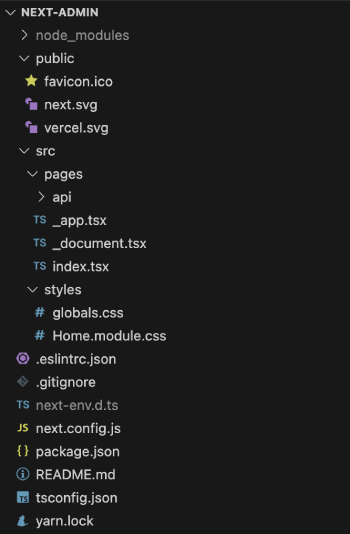

# Next.js Integration

React-admin runs seamlessly on [Next.js](https://nextjs.org/), with minimal configuration.

## Setting Up Next.js

Let's start by creating a new Next.js project called `nextjs-react-admin`.

```bash
npx create-next-app --ts nextjs-react-admin --use-yarn
```


This creates a project with the following folder structure:



## Setting Up React-Admin

Add the `react-admin` npm package, as well as a data provider package. In this example, we'll use `ra-data-json-server` to connect to a test API provided by [JSONPlaceholder](https://jsonplaceholder.typicode.com).

```bash
yarn add react-admin ra-data-json-server
```

Next, create the admin app component in `src/Admin/App.jsx`:

```jsx
// in src/admin/App.jsx
import * as React from "react";
import { Admin, Resource, ListGuesser } from 'react-admin';
import jsonServerProvider from 'ra-data-json-server';

const dataProvider = jsonServerProvider('https://jsonplaceholder.typicode.com');

const App = () => (
  <Admin dataProvider={dataProvider}>
    <Resource name="posts" list={ListGuesser} />
    <Resource name="comments" list={ListGuesser} />
  </Admin>
);

export default App;
```

This is a minimal admin for 2 resources. React-admin should be able to render a list of posts and a list of comments, guessing the data structure from the API response. 

## Using React-Admin As The Root Application

Now, let's configure Next.js to render the admin app component in the root path ('/'). Edit the file called `pages/index.tsx`, and replace the content with the following:

```jsx
// in pages/index.tsx
import type { NextPage } from "next";
import dynamic from "next/dynamic";

const App = dynamic(() => import("../src/admin/App"), { ssr: false });

const Home: NextPage = () => {
  return <App />;
};

export default Home;
```

**Tip**: Why the dynamic import? React-admin is designed as a Single-Page Application, rendered on the client-side. It comes with its own [routing sytem](./Routing.md), which conflicts with the Next.js routing system. So we must prevent Next.js from rendering the react-admin component on the server-side. Using `dynamic` allows disabling Server-Side Rendering for the `<App>` component.

Now, start the server with `yarn dev`, browse to `http://localhost:3000/`, and you should see the working admin:


## Rendering React-Admin In A Sub Route

In many cases, the admin is only a part of the application. For instance, you may want to render the admin in a subpath, e.g. `/admin`.

Next.js makes it trivial: create a `pages/admin.tsx` file with the same content as in the previous section:

```jsx
// in pages/admin.tsx
import type { NextPage } from "next";
import dynamic from "next/dynamic";

const App = dynamic(() => import("../src/admin/App"), { ssr: false });

const Admin: NextPage = () => {
  return <App />;
};

export default Admin;
```

Now the admin renders at `http://localhost:3000/admin`, and you can use the Next.js routing system to add more pages.

## Adding an API

[Next.js allows to serve an API](https://nextjs.org/docs/api-routes/introduction) from the same server. You *could* use this to build a CRUD API by hand. However, we consider that building a CRUD API on top of a relational database is a solved problem and that developers shouldn't spend time reimplementing it. 

For instance, if you store your data in a [PostgreSQL](https://www.postgresql.org/) database, you can use [PostgREST](https://postgrest.org/en/stable/) to expose the data as a REST API with zero configuration. Even better, you can use a Software-as-a-Service like [Supabase](https://supabase.com/) to do that for you. 

In such cases, the Next.js API can only serve as a Proxy to authenticate client queries and pass them down to Supabase. 

Let's see an example in practice. 

First, create a Supabase REST API and its associated PostgreSQL database directly on the [Supabase website](https://app.supabase.com/) (it's free for tests and low usage). Once the setup is finished, use the Supabase manager to add the following tables:

- `posts` with fields: `id`, `title`, and `body` 
- `comments` with fields: `id`, `name`, `body`, and `postId` (a foreign key to the `posts.id` field)

You can populate these tables via the Supabse UI if you want. Supabase exposes a REST API at `https://YOUR_INSTANCE.supabase.co/rest/v1`.

Copy the supabase API URL and service role key into Next.js's `.env.local` file:

```sh
# In `.env.local`
SUPABASE_URL="https://MY_INSTANCE.supabase.co"
SUPABASE_SERVICE_ROLE="MY_SERVICE_ROLE_KEY"
```

**Tip**: This example uses the **service role key** here and not the anonymous role. This allows mutations without dealing with authorization. **You shouldn't do this in production**, but use the [Supabase authorization](https://supabase.com/docs/guides/auth) feature instead.

Create [a "catch-all" API route](https://nextjs.org/docs/api-routes/dynamic-api-routes#optional-catch-all-api-routes) in the Next.js app by adding a `pages/api/admin/[[...slug]].ts` file. This API route redirects all calls from the react-admin app to the Supabase CRUD API:

```jsx
// in pages/api/admin/[[...slug]].ts
export default async function handler(req, res) {
  // get the incoming request URL, e.g. 'posts?limit=10&offset=0&order=id.asc'
  const requestUrl = req.url.substring("/api/admin/".length);
  // build the CRUD request based on the incoming request
  const url = `${process.env.SUPABASE_URL}/rest/v1/${requestUrl}`;
  const options = {
    method: req.method,
    headers: {
      prefer: req.headers["prefer"] ?? "",
      accept: req.headers["accept"] ?? "application/json",
      ["content-type"]: req.headers["content-type"] ?? "application/json",
      // supabase authentication
      apiKey: process.env.SUPABASE_SERVICE_ROLE,
    },
  };
  if (req.body) {
    options.body = JSON.stringify(req.body);
  }
  // call the CRUD API
  const response = await fetch(url, options);
  // send the response back to the client
  res.setHeader("Content-Range", response.headers.get("content-range"));
  res.end(await response.text());
}
```

**Tip**: Some of this code is really PostgREST-specific. The `prefer` header is required to let PostgREST return one record instead of an array containing one record in response to `getOne` requests. The `Content-Range` header is returned by PostgREST and must be passed down to the client. A proxy for another CRUD API will require different parameters.

Finally, update the react-admin data provider to use the Supabase adapter instead of the JSON Server one. As Supabase provides a PostgREST endpoint, we'll use [`ra-data-postgrest`](https://github.com/promitheus7/ra-data-postgrest):

```sh
yarn add @promitheus/ra-data-postgrest
```

```jsx
// in src/admin/App.jsx
import * as React from "react";
import { Admin, Resource, ListGuesser } from 'react-admin';
import postgrestRestProvider from "@promitheus/ra-data-postgrest";

const dataProvider = postgrestRestProvider("/api/admin");

const App = () => (
  <Admin dataProvider={dataProvider}>
    <Resource name="posts" list={ListGuesser} />
    <Resource name="comments" list={ListGuesser} />
  </Admin>
);

export default App;
```
