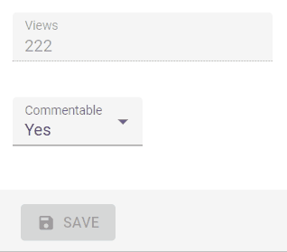

# `<NullableBooleanInput>`

`<NullableBooleanInput />` renders as a dropdown list, allowing choosing between `true`, `false`, and `null` values.

```jsx
import { NullableBooleanInput } from 'react-admin';

<NullableBooleanInput label="Commentable" source="commentable" />
```



The labels of the options can be customized for the entire application by overriding the translation.

```jsx
import polyglotI18nProvider from 'ra-i18n-polyglot';
import englishMessages from 'ra-language-english';

englishMessages.ra.boolean.null = 'Null label';
englishMessages.ra.boolean.false = 'False label';
englishMessages.ra.boolean.true = 'True label';
const i18nProvider = polyglotI18nProvider(() => englishMessages, 'en');

<Admin i18nProvider={i18nProvider}></Admin>
```

Additionally, individual instances of `NullableBooleanInput` may be customized by setting the `nullLabel`, `falseLabel` and `trueLabel` properties. Values specified for those properties will be translated by react-admin.

```jsx
import { NullableBooleanInput } from 'react-admin';

<NullableBooleanInput
    label="Commentable"
    source="commentable"
    nullLabel="Either"
    falseLabel="No"
    trueLabel="Yes"
/>
```


`<NullableBooleanInput>` also accepts the [common input props](./Inputs.md#common-input-props).

## `sx`: CSS API

The `<NullableBooleanInput>` component accepts the usual `className` prop. You can also override many styles of the inner components thanks to the `sx` property (as most MUI components, see their [documentation about it](https://mui.com/customization/how-to-customize/#overriding-nested-component-styles)). This property accepts the following subclasses:

| Rule name                         | Description                                                   |
|-----------------------------------|---------------------------------------------------------------|
| `& .RaNullableBooleanInput-input` | Applied to the underlying MUI's `TextField` component |

To override the style of all instances of `<NullableBooleanInput>` using the [MUI style overrides](https://mui.com/customization/globals/#css), use the `RaNullableBooleanInput` key.
