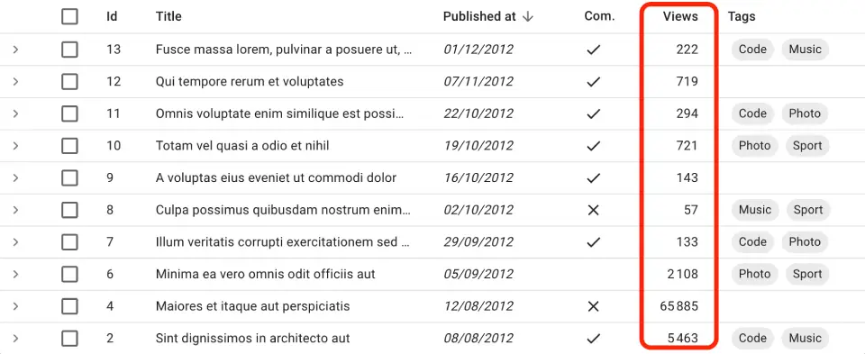

# `<NumberField>`

Displays a number formatted according to the browser locale, right aligned. Ideal for floats, currencies, percentages, units, etc.

`

## Usage

```jsx
import { NumberField }  from 'react-admin';

<NumberField source="views" />
// renders the record { id: 1234, views: 2108 } as
<span>2 108</span>
```

`<NumberField>` works for values that are numbers (e.g. `2108`) or strings that convert to numbers (e.g. `'2108'`).

`<NumberField>` uses `Intl.NumberFormat()` if available, passing the `locales` and `options` props as arguments. This allows a perfect display of decimals, currencies, percentages, etc. See [Intl.NumberFormat documentation](https://developer.mozilla.org/en-US/docs/Web/JavaScript/Reference/Global_Objects/Intl/NumberFormat/NumberFormat) for the `options` prop syntax.


```jsx
import { NumberField }  from 'react-admin';

<NumberField source="price" options={{
    style: 'currency',
    currency: 'USD',
    minimumFractionDigits: 2
}} />
// renders the record { id: 1234, price: 1.2 } as
<span>$1.20</span>
```


If Intl is not available, `<NumberField>` outputs numbers as is (and ignores the `locales` and `options` props).

## Props

| Prop        | Required | Type               | Default | Description                                                                      |
| ----------- | -------- | ------------------ | ------- | -------------------------------------------------------------------------------- |
| `locales`   | Optional | string             | ''      | Locale to use for formatting. Passed as first argument to `Intl.NumberFormat()`. |
| `options`   | Optional | Object             | -       | Number formatting options. Passed as second argument to `Intl.NumberFormat()`.   |
| `textAlign` | Optional | `'left' | 'right'` | `right` | Text alignment in a Datagrid                                                     |
| `transform` | Optional | Function           | -       | A function to transform the value before display.                                |


`<NumberField>` also accepts the [common field props](./Fields.md#common-field-props).

## `locales`

Override the browser locale in the number formatting. Passed as first argument to `Intl.NumberFormat()`.


```jsx
import { NumberField }  from 'react-admin';

<NumberField source="price" locales="fr-FR" options={{ style: 'currency', currency: 'USD' }} />
// renders the record { id: 1234, price: 25.99 } as
<span>25,99 $US</span>
```


When not provided, it uses the browser locale.

## `options`

Options passed to `Intl.NumberFormat()`. See [the Intl.NumberFormat documentation](https://developer.mozilla.org/en-US/docs/Web/JavaScript/Reference/Global_Objects/Intl/NumberFormat/NumberFormat) for the `options` prop syntax.


```jsx
import { NumberField }  from 'react-admin';

<NumberField source="score" options={{ maximumFractionDigits: 2 }}/>
// renders the record { id: 1234, score: 567.3567458569 } as
<span>567.35</span>

<NumberField source="share" options={{ style: 'percent' }} />
// renders the record { id: 1234, share: 0.2545 } as
<span>25%</span>

<NumberField source="price" options={{ style: 'currency', currency: 'USD' }} />
// renders the record { id: 1234, price: 25.99 } as
<span>$25.99</span>

<NumberField source="volume" options={{ style: 'unit', unit: 'liter' }} />
// renders the record { id: 1234, volume: 3500 } as
<span>3,500 L</span>
```


**Tip**: If you need more formatting options than what `Intl.NumberFormat()` can provide, build your own field component leveraging a third-party library like [numeral.js](http://numeraljs.com/).

## `textAlign`

By default, `<NumberField>` is right-aligned in a [`<Datagrid>`](./Datagrid.md). Change it by setting the `textAlign` prop to "left":

```jsx
import { NumberField }  from 'react-admin';

<NumberField source="score" textAlign="left" />
```

## `transform`

`<NumberField>` excepts the field value to be a number or a string. If the value is a string, `<NumberField>` does an automatic conversion to number (using the `+` operator).

You may want to override that string to number conversion if the value uses a special format, like representing a float as an integer (e.g. 3.14 as 314) to avoid rounding errors. Use the `transform` prop for that. It expects a function that takes the field value as argument and returns the transformed value.

```jsx
import { NumberField }  from 'react-admin';

<NumberField source="price" transform={v => Math.floor(v / 100)} />
```

For information, the default `transform` function is:

```jsx
const defaultTransform = value => {
    if (!value || typeof value === 'number') {
        return value;
    } else if (typeof value === 'string' && !isNaN(value as any)) {
        return +value;
    } else {
        return value;
    }
};
```