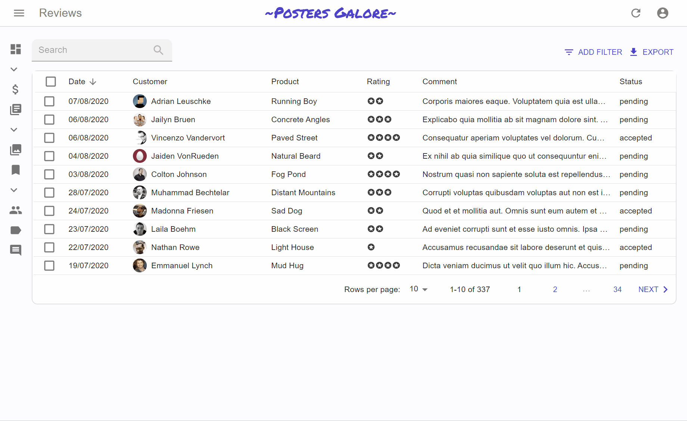

# `<Pagination>`

By default, the `<List>` uses the `<Pagination>` component for pagination. This component displays buttons to navigate between pages, including buttons for the surrounding pages.



## Usage

By decorating this component, you can create your own variant with a different set of perPage options.

```jsx
// in src/MyPagination.js
import { Pagination } from 'react-admin';

const PostPagination = () => <Pagination rowsPerPageOptions={[10, 25, 50, 100]} />;
```

Then, to use this component instead of the default `<Pagination>`, use the `<List pagination>` prop:

```jsx
import { List } from 'react-admin';
import PostPagination from './PostPagination';

export const PostList = () => (
    <List pagination={<PostPagination />}>
        ...
    </List>
);
```

## `rowsPerPage`

The `<Pagination>` component renders a dropdown allowing users to selevct how many rows to display per page. You can customize the options of this dropdown by passing a `rowsPerPageOptions` prop.

```jsx
// in src/MyPagination.js
import { Pagination } from 'react-admin';

const PostPagination = () => <Pagination rowsPerPageOptions={[10, 25, 50, 100]} />;
```

**Tip**: Pass an empty array to `rowsPerPageOptions` to disable the rows per page selection.