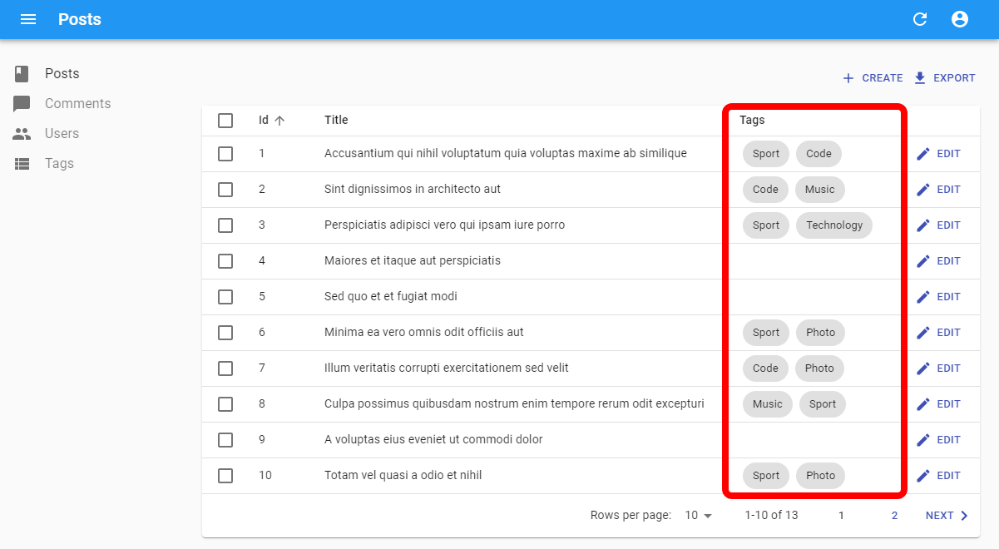

# `<ReferenceArrayField>`

Use `<ReferenceArrayField>` to display a list of related records, via a one-to-many relationship materialized by an array of foreign keys.



For instance, let's consider a model where a `post` has many `tags`, materialized to a `tags_ids` field containing an array of ids:

```
┌──────────────┐       ┌────────┐
│ posts        │       │ tags   │
│--------------│       │--------│
│ id           │   ┌───│ id     │
│ title        │   │   │ name   │
│ body         │   │   └────────┘
│ is_published │   │
│ tag_ids      │╾──┘   
└──────────────┘       
```

A typical `post` record therefore looks like this:

```json
{
  "id": 1,
  "title": "Hello world",
  "body": "...",
  "is_published": true,
  "tags_ids": [1, 2, 3]
}
```

In that case, use `<ReferenceArrayField>` to display the post tags names as follows:

```jsx
<ReferenceArrayField label="Tags" reference="tags" source="tag_ids" />
```

`<ReferenceArrayField>` fetches a list of referenced records (using the `dataProvider.getMany()` method), and puts them in a [`ListContext`](./useListContext.md). It then renders each related record, using its [`recordRepresentation`](./Resource.md#recordrepresentation), in a [`<ChipField>`](./ChipField.md). 

**Tip**: If the relationship is materialized by a foreign key on the referenced resource, use [the `<ReferenceManyField>` component](./ReferenceManyField.md) instead.

## Usage

`<ReferenceArrayField>` expects a `reference` attribute, which specifies the resource to fetch for the related records. It also expects a `source` attribute, which defines the field containing the list of ids to look for in the referenced resource.

For instance, if each post contains a list of tag ids (e.g. `{ id: 1234, title: 'Lorem Ipsum', tag_ids: [1, 23, 4] }`), here is how to fetch the list of tags for each post in a list, and display the `name` for each `tag` in a `<ChipField>`:

```jsx
import * as React from "react";
import { List, Datagrid, ReferenceArrayField, TextField } from 'react-admin';

export const PostList = () => (
    <List>
        <Datagrid>
            <TextField source="id" />
            <TextField source="title" />
            <ReferenceArrayField label="Tags" reference="tags" source="tag_ids" />
            <EditButton />
        </Datagrid>
    </List>
);
```

`<ReferenceArrayField>` fetches the `tag` resources related to each `post` resource by matching `post.tag_ids` to `tag.id`. By default, it renders one string by related record, via a [`<SingleFieldList>`](./SingleFieldList.md) with a [`<ChipField>`](./ChipField.md) child using the resource [`recordRepresentation`](./Resource.md#recordrepresentation) as source

Configure the `<Resource recordRepresentation>` to render related records in a meaningul way. For instance, for the `tags` resource, if you want the `<ReferenceArrayField>` to display the tag `name`:

```jsx
<Resource name="tags" list={TagList} recordRepresentation="name" />
```

You can change how the list of related records is rendered by passing a custom child reading the `ListContext` (e.g. a [`<Datagrid>`](./Datagrid.md)). See the [`children`](#children) section for details. 

## Props

| Prop           | Required | Type                                                                              | Default                          | Description                                                                                            |
| -------------- | -------- | --------------------------------------------------------------------------------- | -------------------------------- | ------------------------------------------------------------------------------------------------------ |
| `source`       | Required | `string`                                                                          | -                                | Name of the property to display                                                                        |
| `reference`    | Required | `string`                                                                          | -                                | The name of the resource for the referenced records, e.g. 'tags'                                       |
| `children`     | Optional | `Element`                                                                         | `<SingleFieldList>`              | One or several elements that render a list of records based on a `ListContext`                         |
| `filter`       | Optional | `Object`                                                                          | -                                | Filters to use when fetching the related records (the filtering is done client-side)                   |
| `pagination`   | Optional | `Element`                                                                         | -                                | Pagination element to display pagination controls. empty by default (no pagination)                    |
| `perPage`      | Optional | `number`                                                                          | 1000                             | Maximum number of results to display                                                                   |
| `queryOptions` | Optional | [`UseQuery Options`](https://tanstack.com/query/v3/docs/react/reference/useQuery) | `{}`                             | `react-query` options for the `getMany` query                                                                           |
| `sort`         | Optional | `{ field, order }`                                                                | `{ field: 'id', order: 'DESC' }` | Sort order to use when displaying the related records (the sort is done client-side)                   |
| `sortBy`       | Optional | `string | Function`                                                               | `source`                         | When used in a `List`, name of the field to use for sorting when the user clicks on the column header. |

`<ReferenceArrayField>` also accepts the [common field props](./Fields.md#common-field-props), except `emptyText` (use the child `empty` prop instead).

## `children`

By default, `<ReferenceArrayField>` renders one string by related record, via a [`<SingleFieldList>`](./SingleFieldList.md) with a [`<ChipField>`](./ChipField.md) using the resource [`recordRepresentation`](./Resource.md#recordrepresentation). 


You can pass any component of your own as child, to render the list of related records in another way.

That means that using the field without child:

```jsx
<ReferenceArrayField label="Tags" reference="tags" source="tag_ids" />
```

Is equivalent to:

```jsx
<ReferenceArrayField label="Tags" reference="tags" source="tag_ids">
    <SingleFieldList>
        <ChipField source="name" />
    </SingleFieldList>
</ReferenceArrayField>
```

`<ReferenceArrayField>` creates a [`ListContext`](./useListContext.md), so you can use any child that uses a `ListContext`:

- [`<SingleFieldList>`](./SingleFieldList.md)
- [`<Datagrid>`](./Datagrid.md)
- [`<SimpleList>`](./SimpleList.md)
- [`<EditableDatagrid>`](./EditableDatagrid.md)
- [`<Calendar>`](./Calendar.md)
- Or a component of your own (check the [`<WithListContext>`](./WithListContext.md) and the [`useListContext`](./useListContext.md) chapters to learn how). 

For instance, use a `<Datagrid>` to render the related records in a table:

```jsx
import { Show, SimpleShowLayout, TextField, ReferenceArrayField, Datagrid, ShowButton } from 'react-admin';

export const PostShow = () => (
    <Show>
        <SimpleShowLayout>
            <TextField source="id" />
            <TextField source="title" />
            <ReferenceArrayField label="Tags" reference="tags" source="tag_ids">
                <Datagrid>
                    <TextField source="id" />
                    <TextField source="name" />
                    <ShowButton />
                </Datagrid>
            </ReferenceArrayField>
            <EditButton />
        </SimpleShowLayout>
    </Show>
);
```

Or [`<WithListContext>`](./WithListContext.md) to render the related records in a custom way:

```jsx
import { Show, SimpleShowLayout, TextField, ReferenceArrayField, WithListContext } from 'react-admin';

export const PostShow = () => (
    <Show>
        <SimpleShowLayout>
            <TextField source="id" />
            <TextField source="title" />
            <ReferenceArrayField label="Tags" reference="tags" source="tag_ids">
                <WithListContext render={({ data }) => (
                    <ul>
                        {data.map(tag => (
                            <li key={tag.id}>{tag.name}</li>
                        ))}
                    </ul>
                )} />
            </ReferenceArrayField>
            <EditButton />
        </SimpleShowLayout>
    </Show>
);
```

## `filter`

`<ReferenceArrayField>` fetches all the related records, and displays them all, too. You can use the `filter` prop to filter the list of related records to display (this works by filtering the records client-side, after the fetch).

For instance, to render only tags that are 'published', you can use the following code:


```jsx
<ReferenceArrayField 
    label="Tags"
    source="tag_ids"
    reference="tags"
    filter={{ is_published: true }}
/>
```


## `label`

By default, `<SimpleShowLayout>`, `<Datagrid>` and other layout components infer the label of a field based on its `source`. For a `<ReferenceArrayField>`, this may not be what you expect:

```jsx
{/* default label is 'Tag Ids', or the translation of 'resources.posts.fields.tag_ids' if it exists */}
<ReferenceArrayField source="tag_ids" reference="tags" />
```

That's why you often need to set an explicit `label` on a `<ReferenceField>`:

```jsx
<ReferenceArrayField label="Tags" source="tag_ids" reference="tags" />
```

React-admin uses [the i18n system](./Translation.md) to translate the label, so you can use translation keys to have one label for each language supported by the interface:

```jsx
<ReferenceArrayField label="resource.posts.fields.tags" source="tag_ids" reference="tags" />
```

## `pagination`

`<ReferenceArrayField>` fetches *all* the related fields, and puts them all in a `ListContext`. If a record has a large number of related records, you can limit the number of displayed records with the [`perPage`](#perpage) prop. Then, let users display remaining records by rendering pagination controls. For that purpose, pass a pagination element to the `pagination` prop.

For instance, to limit the display of related records to 10, you can use the following code:

```jsx
import { Pagination, ReferenceArrayField } from 'react-admin';

<ReferenceArrayField
    label="Tags"
    source="tag_ids"
    reference="tags"
    perPage={10}
    pagination={<Pagination />}
/>
```

## `perPage`

`<ReferenceArrayField>` fetches *all* the related fields, and puts them all in a `ListContext`. If a record has a large number of related records, it may be a good idea to limit the number of displayed records. The `perPage` prop allows to create a client-side pagination for the related records.

For instance, to limit the display of related records to 10, you can use the following code:

```jsx
 <ReferenceArrayField label="Tags" source="tag_ids" reference="tags" perPage={10} />
```

If you want to let the user display the remaining records, you have to pass a [`pagination`](#pagination) element.

## `queryOptions`

Use the `queryOptions` prop to pass options to [the `dataProvider.getMany()` query](./useGetOne.md#aggregating-getone-calls) that fetches the referenced record.

For instance, to pass [a custom `meta`](./Actions.md#meta-parameter):


```jsx
<ReferenceArrayField queryOptions={{ meta: { foo: 'bar' } }} />
```



## `reference`

The resource to fetch for the relateds record.

For instance, if the `posts` resource has a `tag_ids` field, set the `reference` to `tags` to fetch the tags related to each post.

```jsx
<ReferenceArrayField label="Tags" source="tag_ids" reference="tags" />
```

## `sort`

By default, the related records are displayed in the order in which they appear in the `source`. For instance, if the current record is `{ id: 1234, title: 'Lorem Ipsum', tag_ids: [1, 23, 4] }`, a `<ReferenceArrayField>` on the `tag_ids` field will display tags in the order 1, 23, 4.

`<ReferenceArrayField>` can force a different order (via a client-side sort after fetch) if you specify a `sort` prop.

For instance, to sort tags by title in ascending order, you can use the following code:


```jsx
<ReferenceArrayField 
    label="Tags"
    source="tag_ids"
    reference="tags"
    sort={{ field: 'title', order: 'ASC' }}
/>
```


## `sx`: CSS API

The `<ReferenceArrayField>` component accepts the usual `className` prop. You can also override many styles of the inner components thanks to the `sx` property (see [the `sx` documentation](./SX.md) for syntax and examples). This property accepts the following subclasses:

| Rule name                           | Description                                                                              |
|-------------------------------------|------------------------------------------------------------------------------------------|
| `& .RaReferenceArrayField-progress` | Applied to the Material UI's `LinearProgress` component while `isLoading` prop is `true` |

To override the style of all instances of `<ReferenceArrayField>` using the [application-wide style overrides](./AppTheme.md#theming-individual-components), use the `RaReferenceArrayField` key.

