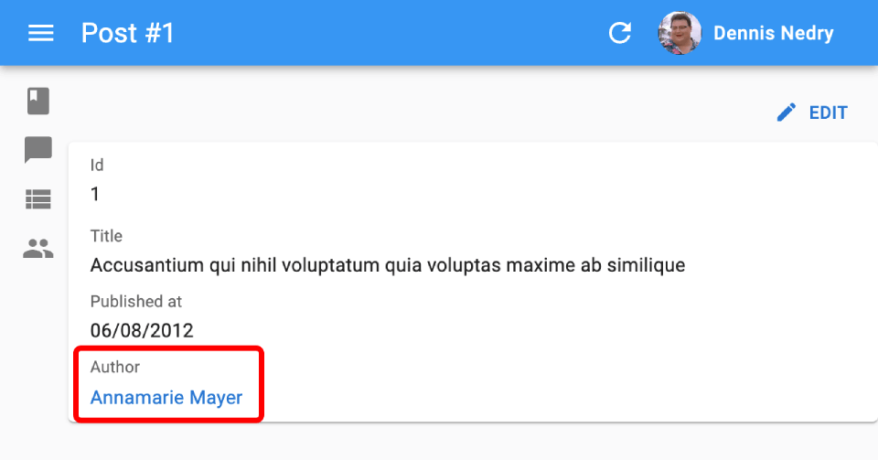

# `<ReferenceField>`

`<ReferenceField>` is useful for displaying many-to-one and one-to-one relationships, e.g. the details of a user when rendering a post authored by that user. 

<iframe src="https://www.youtube-nocookie.com/embed/UeM31-65Wc4" title="YouTube video player" frameborder="0" allow="accelerometer; autoplay; clipboard-write; encrypted-media; gyroscope; picture-in-picture; web-share" allowfullscreen style="aspect-ratio: 16 / 9;width:100%;margin-bottom:1em;"></iframe>

## Usage

For instance, let's consider a model where a `post` has one author from the `users` resource, referenced by a `user_id` field.

```
┌──────────────┐       ┌────────────────┐
│ posts        │       │ users          │
│--------------│       │----------------│
│ id           │   ┌───│ id             │
│ user_id      │╾──┘   │ name           │
│ title        │       │ date_of_birth  │
│ published_at │       └────────────────┘
└──────────────┘
```

In that case, use `<ReferenceField>` to display the post author's as follows:

```jsx
import { Show, SimpleShowLayout, ReferenceField, TextField, DateField } from 'react-admin';

export const PostShow = () => (
    <Show>
        <SimpleShowLayout>
            <TextField source="id" />
            <TextField source="title" />
            <DateField source="published_at" />
            <ReferenceField source="user_id" reference="users" label="Author" />
        </SimpleShowLayout>
    </Show>
);
```

`<ReferenceField>` fetches the data, puts it in a [`RecordContext`](./useRecordContext.md), and renders the [`recordRepresentation`](./Resource.md#recordrepresentation) (the record `id` field by default) wrapped in a link to the related user `<Edit>` page.



So it's a good idea to configure the `<Resource recordRepresentation>` to render related records in a meaningul way. For instance, for the `users` resource, if you want the `<ReferenceField>` to display the full name of the author:

```jsx
<Resource
    name="users"
    list={UserList}
    recordRepresentation={(record) => `${record.first_name} ${record.last_name}`}
/>
```

Alternately, if you pass a child component, `<ReferenceField>` will render it instead of the `recordRepresentation`. Usual child components for `<ReferenceField>` are other `<Field>` components (e.g. [`<TextField>`](./TextField.md)).

```jsx
<ReferenceField source="user_id" reference="users">
    <TextField source="name" />
</ReferenceField>
```

This component fetches a referenced record (`users` in this example) using the `dataProvider.getMany()` method, and passes it to its child. 

It uses `dataProvider.getMany()` instead of `dataProvider.getOne()` [for performance reasons](#performance). When using several `<ReferenceField>` in the same page (e.g. in a `<Datagrid>`), this allows to call the `dataProvider` once instead of once per row. 

## Props

| Prop        | Required | Type                | Default  | Description                                                                                                         |
| ----------- | -------- | ------------------- | -------- | ------------------------------------------------------------------------------------------------------------------- |
| `source`    | Required | `string`            | -        | Name of the property to display |
| `reference` | Required | `string`            | -        | The name of the resource for the referenced records, e.g. 'posts' |
| `children`  | Optional | `ReactNode`         | -        | One or more Field elements used to render the referenced record |
| `emptyText` | Optional | `string`            | ''       | Defines a text to be shown when the field has no value or when the reference is missing |
| `label`     | Optional | `string | Function` | `resources. [resource]. fields.[source]`   | Label to use for the field when rendered in layout components  |
| `link`      | Optional | `string | Function` | `edit`   | Target of the link wrapping the rendered child. Set to `false` to disable the link. |
| `queryOptions`     | Optional | [`UseQuery Options`](https://tanstack.com/query/v5/docs/react/reference/useQuery)                       | `{}`                             | `react-query` client options                                                                   |
| `sortBy`    | Optional | `string | Function` | `source` | Name of the field to use for sorting when used in a Datagrid |

`<ReferenceField>` also accepts the [common field props](./Fields.md#common-field-props).

## `emptyText`

`<ReferenceField>` can display a custom message when the referenced record is missing, thanks to the `emptyText` prop.

```jsx
<ReferenceField source="user_id" reference="users" emptyText="Missing user" />
```

`<ReferenceField>` renders the `emptyText`:

- when the referenced record is missing (no record in the `users` table with the right `user_id`), or
- when the field is empty (no `user_id` in the record).

## `label`

By default, `<SimpleShowLayout>`, `<Datagrid>` and other layout components infer the label of a field based on its `source`. For a `<ReferenceField>`, this may not be what you expect:

```jsx
{/* default label is 'User Id', or the translation of 'resources.posts.fields.user_id' if it exists */}
<ReferenceField source="user_id" reference="users" />
```

That's why you often need to set an explicit `label` on a `<ReferenceField>`:

```jsx
<ReferenceField label="Author name" source="user_id" reference="users" />
```

React-admin uses [the i18n system](./Translation.md) to translate the label, so you can use translation keys to have one label for each language supported by the interface:

```jsx
<ReferenceField label="resources.posts.fields.author" source="user_id" reference="users" />
```

## `link`

To change the link from the `<Edit>` page to the `<Show>` page, set the `link` prop to "show".

```jsx
<ReferenceField source="user_id" reference="users" link="show" />
```

You can also prevent `<ReferenceField>` from adding a link to children by setting `link` to `false`.

```jsx
// No link
<ReferenceField source="user_id" reference="users" link={false} />
```

You can also use a custom `link` function to get a custom path for the children. This function must accept `record` and `reference` as arguments.

```jsx
// Custom path
<ReferenceField 
    source="user_id"
    reference="users"
    link={(record, reference) => `/my/path/to/${reference}/${record.id}`}
/>
```

## `queryOptions`

Use the `queryOptions` prop to pass options to [the `dataProvider.getMany()` query](./useGetOne.md#aggregating-getone-calls) that fetches the referenced record.

For instance, to pass [a custom `meta`](./Actions.md#meta-parameter):


```jsx
<ReferenceField 
    source="user_id"
    reference="users"
    queryOptions={{ meta: { foo: 'bar' } }}
>
    <TextField source="name" />
</ReferenceField>
```


## `reference`

The resource to fetch for the related record.

For instance, if the `posts` resource has a `user_id` field, set the `reference` to `users` to fetch the user related to each post.

```jsx
<ReferenceField source="user_id" reference="users" />
```

## `sortBy`

By default, when used in a `<Datagrid>`, and when the user clicks on the column header of a `<ReferenceField>`, react-admin sorts the list by the field `source`. To specify another field name to sort by, set the `sortBy` prop.

```jsx
<ReferenceField source="user_id" reference="users" sortBy="user.name" />
```

## `sx`: CSS API

The `<ReferenceField>` component accepts the usual `className` prop. You can also override many styles of the inner components thanks to the `sx` property (see [the `sx` documentation](./SX.md) for syntax and examples). This property accepts the following subclasses:

| Rule name                  | Description                   |
|----------------------------|-------------------------------|
| `& .RaReferenceField-link` | Applied to each child element |

To override the style of all instances of `<ReferenceField>` using the [application-wide style overrides](./AppTheme.md#theming-individual-components), use the `RaReferenceField` key.

## Performance

<iframe src="https://www.youtube-nocookie.com/embed/egBhWqF3sWc" title="YouTube video player" frameborder="0" allow="accelerometer; autoplay; clipboard-write; encrypted-media; gyroscope; picture-in-picture; web-share" allowfullscreen style="aspect-ratio: 16 / 9;width:100%;margin-bottom:1em;"></iframe>

When used in a `<Datagrid>`, `<ReferenceField>` fetches the referenced record only once for the entire table. 


For instance, with this code:

```jsx
import { List, Datagrid, ReferenceField, TextField, EditButton } from 'react-admin';

export const PostList = () => (
    <List>
        <Datagrid>
            <TextField source="id" />
            <ReferenceField label="User" source="user_id" reference="users" />
            <TextField source="title" />
            <EditButton />
        </Datagrid>
    </List>
);
```

React-admin accumulates and deduplicates the ids of the referenced records to make *one* `dataProvider.getMany()` call for the entire list, instead of n `dataProvider.getOne()` calls. So for instance, if the API returns the following list of posts:

```js
[
    {
        id: 123,
        title: 'Totally agree',
        user_id: 789,
    },
    {
        id: 124,
        title: 'You are right my friend',
        user_id: 789
    },
    {
        id: 125,
        title: 'Not sure about this one',
        user_id: 735
    }
]
```

Then react-admin renders the `<PostList>` with a loader for the `<ReferenceField>`, fetches the API for the related users in one call (`dataProvider.getMany('users', { ids: [789,735] }`), and re-renders the list once the data arrives. This accelerates the rendering and minimizes network load.

## Prefetching

When you know that a page will contain a `<ReferenceField>`, you can configure the main page query to prefetch the referenced records to avoid a flicker when the data arrives. To do so, pass a `meta.prefetch` parameter to the page query.

For example, the following code prefetches the authors referenced by the posts:


```jsx
const PostList = () => (
    <List queryOptions={{ meta: { prefetch: ['author'] } }}>
        <Datagrid>
            <TextField source="title" />
            {/** renders without an additional request */}
            <ReferenceField source="author_id" />
        </Datagrid>
    </List>
);
```


**Note**: For prefetching to function correctly, your data provider must support [Prefetching Relationships](./DataProviders.md#prefetching-relationships). Refer to your data provider's documentation to verify if this feature is supported.

**Note**: Prefetching is a frontend performance feature, designed to avoid flickers and repaints. It doesn't always prevent `<ReferenceField>` to fetch the data. For instance, when coming to a show view from a list view, the main record is already in the cache, so the page renders immediately, and both the page controller and the `<ReferenceField>` controller fetch the data in parallel. The prefetched data from the page controller arrives after the first render of the `<ReferenceField>`, so the data provider fetches the related data anyway. But from a user perspective, the page displays immediately, including the `<ReferenceField>`. If you want to avoid the `<ReferenceField>` to fetch the data, you can use the React Query Client's `staleTime` option.

## Rendering More Than One Field

You often need to render more than one field of the reference table (e.g. if the `users` table has a `first_name` and a `last_name` field).

Given that `<ReferenceField>` can accept more than one child, you can use as many `<Field>` as you like:

```jsx
import { Show, SimpleShowLayout, ReferenceField, TextField, DateField, FunctionField } from 'react-admin';

export const PostShow = () => (
    <Show>
        <SimpleShowLayout>
            <TextField source="id" />
            <TextField source="title" />
            <DateField source="published_at" />
            <ReferenceField label="Author" source="user_id" reference="users">
                <TextField source="first_name" />{' '}
                <TextField source="last_name" />
            </ReferenceField>
        </SimpleShowLayout>
    </Show>
);
```

You can also use several `<ReferenceField>` for the same resource in a given view - react-admin will deduplicate them and only make one call to the distant table. This is useful e.g. is you want to have one label per field:

```jsx
import { Show, SimpleShowLayout, ReferenceField, TextField, DateField } from 'react-admin';

export const PostShow = () => (
    <Show>
        <SimpleShowLayout>
            <TextField source="id" />
            <TextField source="title" />
            <DateField source="published_at" />
            <ReferenceField label="First name" source="user_id" reference="users">
                <TextField source="first_name" />
            </ReferenceField>
            <ReferenceField label="Last name" source="user_id" reference="users">
                <TextField source="last_name" />
            </ReferenceField>
        </SimpleShowLayout>
    </Show>
);
```

You can also use a [`<FunctionField>`](./FunctionField.md) to render a string composed of several fields.

```jsx
import { Show, SimpleShowLayout, ReferenceField, TextField, DateField, FunctionField } from 'react-admin';

export const PostShow = () => (
    <Show>
        <SimpleShowLayout>
            <TextField source="id" />
            <TextField source="title" />
            <DateField source="published_at" />
            <ReferenceField label="Name" source="user_id" reference="users">
                <FunctionField render={record => `${record.first_name} ${record.last_name}`} />
            </ReferenceField>
        </SimpleShowLayout>
    </Show>
);
```

## Removing The Link

You can prevent `<ReferenceField>` from adding a link to its children by setting `link` to `false`.

```jsx
// No link
<ReferenceField source="user_id" reference="users" link={false} />
```

## Access Control

If your authProvider implements [the `canAccess` method](./AuthProviderWriting.md#canaccess) and you don't provide the [`link`](#link) prop, React-Admin will verify whether users have access to the Show and Edit views.

For instance, given the following `ReferenceField`:

```jsx
<ReferenceField source="user_id" reference="users" />
```

React-Admin will call `canAccess` with the following parameters:
- If the `users` resource has a Show view: `{ action: "show", resource: 'posts', record: Object }`
- If the `users` resource has an Edit view: `{ action: "edit", resource: 'posts', record: Object }`