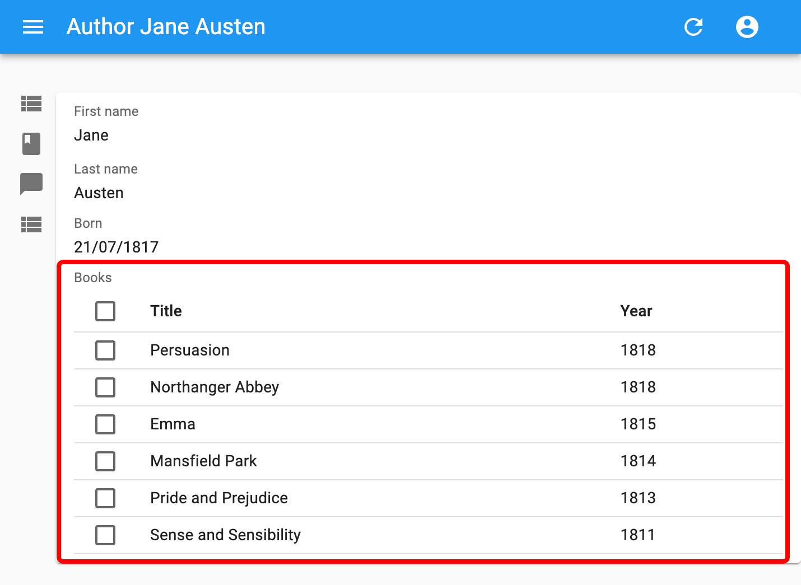

# `<ReferenceManyField>`

`<ReferenceManyField>` is useful for displaying one-to-many relationships, when the foreign key is carried by the referenced resource. 



For instance, if an `author` has many `books`, and each book resource exposes an `author_id` field:

```
┌────────────────┐       ┌──────────────┐
│ authors        │       │ books        │
│----------------│       │--------------│
│ id             │───┐   │ id           │
│ first_name     │   └──╼│ author_id    │
│ last_name      │       │ title        │
│ date_of_birth  │       │ published_at │
└────────────────┘       └──────────────┘
```

`<ReferenceManyField>` can render the titles of all the books by a given author.

```jsx
<ReferenceManyField label="Books" reference="books" target="author_id">
  <Datagrid>
    <TextField source="title" />
    <TextField source="year" />
  </Datagrid>
</ReferenceManyField>
```

This component fetches a list of referenced records by a reverse lookup of the current `record.id` in the `target` field of another resource (using the `dataProvider.getManyReference()` REST method), and puts them in a [`ListContext`](./useListContext.md). Its children can then use the data from this context. The most common case is to use [`<SingleFieldList>`](./SingleFieldList.md) or [`<Datagrid>`](./Datagrid.md) as child.

## Usage

For instance, here is how to show the title of the books written by a particular author in a show view.

```jsx
import { Show, SimpleShowLayout, TextField, ReferenceManyField, Datagrid } from 'react-admin';

export const AuthorShow = () => (
  <Show>
    <SimpleShowLayout>
      <TextField source="first_name" />
      <TextField source="last_name" />
      <DateField label="Born" source="dob" />
      <ReferenceManyField label="Books" reference="books" target="author_id">
        <Datagrid>
          <TextField source="title" />
          <TextField source="year" />
        </Datagrid>
      </ReferenceManyField>
    </SimpleShowLayout>
  </Show>
);
```

`<ReferenceManyField>` accepts a `reference` attribute, which specifies the resource to fetch for the related record. It also accepts a `source` attribute which defines the field containing the value to look for in the `target` field of the referenced resource. By default, this is the `id` of the resource (`authors.id` in the previous example).

You can also use `<ReferenceManyField>` in a list, e.g. to display the authors of the comments related to each post in a list by matching `post.id` to `comment.post_id`. We're using `<SingleFieldList>` to display an inline list using only one field for each of the referenced record:

```jsx
import * as React from "react";
import { List, Datagrid, ChipField, ReferenceManyField, SingleFieldList, TextField } from 'react-admin';

export const PostList = () => (
    <List>
        <Datagrid>
            <TextField source="id" />
            <TextField source="title" type="email" />
            <ReferenceManyField label="Comments by" reference="comments" target="post_id">
                <SingleFieldList>
                    <ChipField source="author.name" />
                </SingleFieldList>
            </ReferenceManyField>
            <EditButton />
        </Datagrid>
    </List>
);
```


## Props

| Prop         | Required | Type      | Default | Description                                                                         |
| ------------ | -------- | --------- | ------- | ----------------------------------------------------------------------------------- |
| `target`     | Required | `string`  | -       | Target field carrying the relationship on the referenced resource, e.g. 'user_id'   |
| `reference`  | Required | `string`  | -       | The name of the resource for the referenced records, e.g. 'books'                   |
| `children`   | Required | `Element` | -       | One or several elements that render a list of records based on a `ListContext`      |
| `source`     | Optional | `string`  | `id`    | Name of the property to display                                                     |
| `filter`     | Optional | `Object`  | -       | Filters to use when fetching the related records, passed to `getManyReference()`    |
| `pagination` | Optional | `Element` | -       | Pagination element to display pagination controls. empty by default (no pagination) |
| `perPage`    | Optional | `number`  | 25      | Maximum number of referenced records to fetch                                       |
| `sort`       | Optional | `{ field, order }` | `{ field: 'id', order: 'DESC' }` | Sort order to use when fetching the related records, passed to `getManyReference()` |

`<ReferenceManyField>` also accepts the [common field props](./Fields.md#common-field-props), except `emptyText` (use the child `empty` prop instead).

## `perPage`

By default, react-admin restricts the possible values to 25 and displays no pagination control. You can change the limit by setting the `perPage` prop:

```jsx
<ReferenceManyField perPage={10} reference="comments" target="post_id">
   ...
</ReferenceManyField>
```

## `pagination`

And if you want to allow users to paginate the list, pass a `<Pagination>` element as the `pagination` prop:

```jsx
import { Pagination } from 'react-admin';

<ReferenceManyField pagination={<Pagination />} reference="comments" target="post_id">
   ...
</ReferenceManyField>
```

## `sort`

By default, it orders the possible values by id desc. You can change this order by setting the `sort` prop (an object with `field` and `order` properties).


```jsx
<ReferenceManyField sort={{ field: 'created_at', order: 'DESC' }} reference="comments" target="post_id">
   ...
</ReferenceManyField>
```


## `filter`

Also, you can filter the query used to populate the possible values. Use the `filter` prop for that.


```jsx
<ReferenceManyField filter={{ is_published: true }} reference="comments" target="post_id">
   ...
</ReferenceManyField>
```

