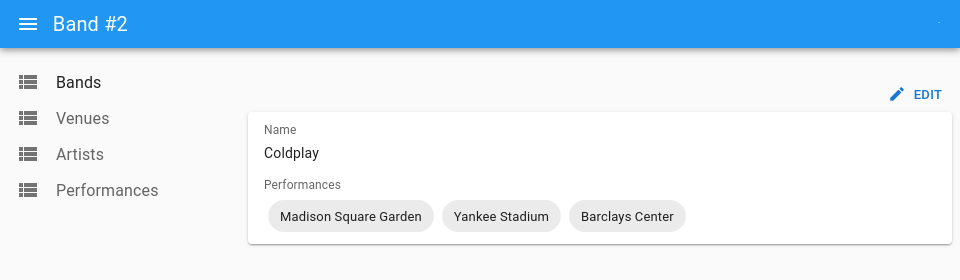

# `<ReferenceManyToManyField>`

This [Enterprise Edition](https://marmelab.com/ra-enterprise) component fetches a list of referenced records by lookup in an associative table, and passes the records down to its child component, which must be an iterator component.



For instance, here is how to fetch the authors related to a book record by matching `book.id` to `book_authors.book_id`, then matching `book_authors.author_id` to `authors.id`, and then display the author last_name for each, in a `<ChipField>`:

```jsx
import {
    Show,
    SimpleShowLayout,
    TextField,
    DateField,
    SingleFieldList,
    ChipField,
} from 'react-admin';
import { ReferenceManyToManyField } from '@react-admin/ra-relationships';

export const BookShow = () => (
    <Show>
        <SimpleShowLayout>
            <TextField source="name" />
            <ReferenceManyToManyField
                reference="venues"
                through="performances"
                using="band_id,venue_id"
                fullWidth
                label="Performances"
                validate={required()}
            >
                <SingleFieldList>
                    <ChipField source="name" />
                </SingleFieldList>
            </ReferenceManyToManyField>
            <EditButton />
        </SimpleShowLayout>
    </Show>
);
```

This example uses the following schema:

```
┌─────────┐       ┌──────────────┐      ┌───────────────┐
│ bands   │       │ performances │      │ venues        │
│---------│       │--------------│      │---------------│
│ id      │───┐   │ id           │   ┌──│ id            │
│ name    │   └──╼│ band_id      │   │  │ name          │
│         │       │ venue_id     │╾──┘  │ location      │
│         │       │ date         │      │               │
└─────────┘       └──────────────┘      └───────────────┘
```

Check [the `ra-relationships` documentation](https://marmelab.com/ra-enterprise/modules/ra-relationships#referencemanytomanyfield) for more details.
