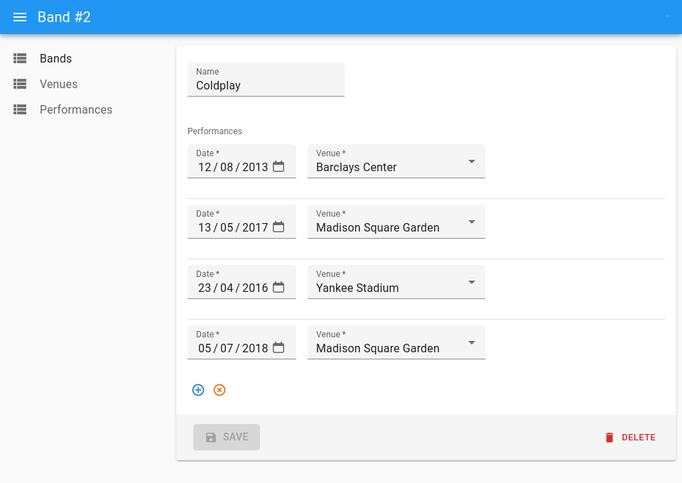

# `<ReferenceManyToManyInput>`

This [Enterprise Edition](https://react-admin-ee.marmelab.com) component allows to create, edit or remove relationships between two resources sharing an associative table. The changes in the associative table are sent to the dataProvider _when the user submits the form_, so that they can cancel the changes before submission.

<video controls autoplay playsinline muted loop width="100%">
  <source src="https://react-admin-ee.marmelab.com/assets/reference-many-to-many-input.mp4" type="video/mp4" />
  Your browser does not support the video tag.
</video>

**Note**: The `<ReferenceManyToManyInput>` cannot currently display multiple records with the same id from the end reference resource even though they might have different properties in the associative table.

## Usage

Let's imagine that you're writing an app managing concerts for artists. The data model features a many-to-many relationship between the `bands` and `venues` tables through a `performances` associative table.

```
┌─────────┐       ┌──────────────┐      ┌───────────────┐
│ bands   │       │ performances │      │ venues        │
│---------│       │--------------│      │---------------│
│ id      │───┐   │ id           │   ┌──│ id            │
│ name    │   └──╼│ band_id      │   │  │ name          │
│         │       │ venue_id     │╾──┘  │ location      │
│         │       │ date         │      │               │
└─────────┘       └──────────────┘      └───────────────┘
```

In this example, `bands.id` matches `performances.band_id`, and `performances.venue_id` matches `venues.id`. 

To let users edit the `venues` for given `band` in an `<AutocompleteArrayInput>`, wrap that input in a `<ReferenceManyToManyInput>` where you define the relationship via the `reference`, `through` and `using` props:

```tsx
import { Edit, AutocompleteArrayInput, SimpleForm, TextInput } from 'react-admin';
import { ReferenceManyToManyInput } from '@react-admin/ra-relationships';

export const BandEdit = () => (
    <Edit>
        <SimpleForm>
            <TextInput source="name" />
            <ReferenceManyToManyInput
                reference="venues"
                through="performances"
                using="band_id,venue_id"
            >
                <AutocompleteArrayInput
                    label="Performances"
                    optionText="name"
                />
            </ReferenceManyToManyInput>
        </SimpleForm>
    </Edit>
);
```

`<ReferenceManyToManyInput>` expects a child that is an input allowing to select multiple values as child - like `<AutocompleteArrayInput>` in the example above. Other possible children are `<SelectArrayInput>`, `<CheckboxGroupInput>`, and `<DualListInput>`.

Note that although all possible child components support a `defaultValue` prop, it will only be applied on create views.

**Tip**: If you need to edit the fields of the associative table (e.g. the `date` in `performances`), you can use a [`<ReferenceManyInput>`](./ReferenceManyInput.md) instead of `<ReferenceManyToManyInput>`. 



You will need to let users select the related record (`venues` in the example above) via a `<ReferenceInput>`:

```jsx
import {
    DateInput,
    Edit,
    ReferenceInput,
    SelectInput,
    SimpleForm,
    SimpleFormIterator,
    TextInput,
    required,
} from 'react-admin';
import { ReferenceManyInput } from '@react-admin/ra-relationships';

const BandEdit = () => (
    <Edit mutationMode="pessimistic">
        <SimpleForm>
            <TextInput source="name" />
            <ReferenceManyInput reference="performances" target="band_id">
                <SimpleFormIterator inline>
                    <DateInput source="date" />
                    <ReferenceInput reference="venues" source="venue_id">
                        <SelectInput optionText="name" />
                    </ReferenceInput>
                </SimpleFormIterator>
            </ReferenceManyInput>
        </SimpleForm>
    </Edit>
);
```

**Limitation**: `<ReferenceManyToManyInput>` cannot be used to filter a list.

## Props

| Prop             | Required | Type                                        | Default                            | Description                                                                                                                                                                                                       |
| ---------------- | -------- | ------------------------------------------- | ---------------------------------- | ----------------------------------------------------------------------------------------------------------------------------------------------------------------------------------------------------------------- |
| `children`       | Required | `element`                                   | -                                  | A select array input element (e.g. `<SelectArrayInput>`).                                                                                                                                                         |
| `reference`      | Required | `string`                                    | -                                  | Name of the reference resource, e.g. 'venues'                                                                                                                                                                    |
| `through`        | Required | `string`                                    | -                                  | Name of the resource for the associative table, e.g. 'book_authors'                                                                                                                                               |
| `filter`         | Optional | `object`                                    | `{}`                               | Filter for the associative table (passed to the `getManyReference()` call)                                                                                                                                        |
| `filter Choices`  | Optional | `object`                                    | `{}`                               | Filter for the possible choices fetched from the reference table (passed to the `getList()` call)                                                                                                                 |
| `perPage`        | Optional | `number`                                    | 25                                 | Limit for the number of results fetched from the associative table                                                                                                                                                |
| `perPage Choices` | Optional | `number`                                    | 25                                 | Limit for the number of possible choices fetched from the reference table                                                                                                                                         |
| `sort`           | Optional | `{ field: string, order: 'ASC' or 'DESC' }` | `{ field: 'id', order: 'DESC' }`   | Sort for the associative table (passed to the `getManyReference()` call)                                                                                                                                          |
| `sort Choices`    | Optional | `{ field: string, order: 'ASC' or 'DESC' }` | `{ field: 'id', order: 'DESC' }`   | Sort for the possible choices fetched from the reference table (passed to the `getList()` call)                                                                                                                   |
| `source`         | Optional | `string`                                    | `'id'`                             | Name of the field containing the identity of the main resource. Used determine the value to look for in the associative table.                                                                                    |
| `using`          | Optional | `string`                                    | `'([resource]_id,[reference]_id)'` | Tuple (comma separated) of the two field names used as foreign keys, e.g 'book_id,author_id'. The tuple should start with the field pointing to the resource, and finish with the field pointing to the reference |

## `children`

`<ReferenceManyToManyInput>` expects a _select_ component as child, i.e. a component working inside a `ChoiceContext`. That means you can use a [`<SelectArrayInput>`](./SelectArrayInput.md), or a [`<AutocompleteArrayInput>`](./AutocompleteArrayInput.md). 

For instance, to allow user to choose `performances` using a `<SelectArrayInput>` instead of an `<AutocompleteArrayInput>`, you can write:

```diff
import React from 'react';
- import { Edit, AutocompleteArrayInput, SimpleForm, TextInput } from 'react-admin';
+ import { Edit, SelectArrayInput, SimpleForm, TextInput } from 'react-admin';
import { ReferenceManyToManyInput } from '@react-admin/ra-relationships';

export const BandEdit = () => (
    <Edit>
        <SimpleForm>
            <TextInput source="name" />
            <ReferenceManyToManyInput
                resource="bands"
                reference="venues"
                through="performances"
                using="band_id,venue_id"
            >
-                <AutocompleteArrayInput
-                    label="Performances"
-                    optionText="name"
-                />
+            <SelectArrayInput label="Performances" />
            </ReferenceManyToManyInput>
        </SimpleForm>
    </Edit>
);
```

## `filter`

You can filter the records of the associative table (e.g. `performances`) using the `filter` prop. This `filter` is passed to the `getManyReference()` call.


```tsx
<ReferenceManyToManyInput
    reference="venues"
    through="performances"
    using="band_id,venue_id"
    filter={{ date: '2018-08-31' }}
>
    {/* ... */}
</ReferenceManyToManyInput>
```


## `filterChoices`

`<ReferenceManyToManyInput>` displays a list of possible values from the reference table (e.g. `venues`) as suggestions in the input. It uses the `getList()` dataProvider call to fetch these possible values.

You can filter the possible values of the reference table using the `filterChoices` prop. This `filterChoices` is passed to the `getList()` call.


```tsx
<ReferenceManyToManyInput
    reference="venues"
    through="performances"
    using="band_id,venue_id"
    filterChoice={{ location: 'New York' }}
>
    {/* ... */}
</ReferenceManyToManyInput>
```


## `perPage`

By default, react-admin displays at most 25 entries from the associative table (e.g. 25 `performances`). You can change the limit by setting the `perPage` prop:

```tsx
<ReferenceManyToManyInput
    reference="venues"
    through="performances"
    using="band_id,venue_id"
    perPage={10}
>
    {/* ... */}
</ReferenceManyToManyInput>
```

## `perPageChoices`

`<ReferenceManyToManyInput>` displays a list of possible values from the reference table (e.g. `venues`) as suggestions in the input. It uses the `getList()` dataProvider call to fetch these possible values.

By default, react-admin displays at most 25 possible values from the reference table (e.g. 25 `venues`). You can change the limit by setting the `perPageChoices` prop:

```tsx
<ReferenceManyToManyInput
    reference="venues"
    through="performances"
    using="band_id,venue_id"
    perPageChoices={10}
>
    {/* ... */}
</ReferenceManyToManyInput>
```
## `reference`

The name of the target resource to fetch.

For instance, if you want to display the venues of a given bands, through performances, the reference name should be venues:

```tsx
<ReferenceManyToManyInput
    source="id"
    reference="venues"
    resource="bands"
    through="performances"
>
    {/* ... */}
</ReferenceManyToManyInput>
```
## `sort`

By default, react-admin orders the possible values by `id` desc for the associative table (e.g. `performances`). You can change this order by setting the `sort` prop (an object with `field` and `order` properties) to be applied to the associative resource.


```tsx
<ReferenceManyToManyInput
    reference="venues"
    through="performances"
    using="band_id,venue_id"
    sort={{ field: 'id', order: 'DESC' }}
>
    {/* ... */}
</ReferenceManyToManyInput>
```


## `sortChoices`

By default, react-admin orders the possible values by `id` desc for the reference table (e.g. `venues`). You can change this order by setting the `sortChoices` prop (an object with `field` and `order` properties).


```tsx
<ReferenceManyToManyInput
    reference="venues"
    through="performances"
    using="band_id,venue_id"
    sortChoices={{ field: 'id', order: 'DESC' }}
>
    {/* ... */}
</ReferenceManyToManyInput>
```


## `source`

By default, ReferenceManyToManyField uses the `id` field as target for the reference. If the foreign key points to another field of your record, you can select it with the `source` prop:

```tsx
<ReferenceManyToManyInput
    source="_id"
    reference="venues"
    resource="bands"
    through="performances"
>
    {/* ... */}
</ReferenceManyToManyInput>
```

## `through`

You must specify the associative table name using the `through` prop.

```tsx
<ReferenceManyToManyInput reference="venues" through="performances">
    {/* ... */}
</ReferenceManyToManyInput>
```

## `using`

You can specify the columns to use in the associative using the `using` prop.

```tsx
<ReferenceManyToManyInput
    reference="venues"
    through="performances"
    using="band_id,venue_id"
>
    {/* ... */}
</ReferenceManyToManyInput>
```

## Limitations

-   `<ReferenceManyToManyInput>` cannot be used inside an `<ArrayInput>`, a `<ReferenceOneInput>` or a `<ReferenceManyInput>`.
-   `<ReferenceManyToManyInput>` does not support server side validation.

## DataProvider Calls

When rendered, `<ReferenceManyToManyInput>` fetches the `dataProvider` three times in a row:

-   once to get the records of the associative resource (`performances` in this case), using a `getManyReference()` call
-   once to get the records of the reference resource (`venues` in this case), using a `getMany()` call.
-   once to get the possible values of the reference resource (`venues` in this case) to show as suggestions in the input, using a `getList()` call

For instance, if the user edits the band of id `123`, `<ReferenceManyToManyInput>` first issues the following query to the `dataProvider`:

```js
dataProvider.getManyReference('venues', {
    target: 'band_id',
    id: 123,
});
```

Let's say that the `dataProvider` returns the following response:

```json
{
    "data": [
        { "id": 667, "band_id": 123, "venue_id": 732 },
        { "id": 895, "band_id": 123, "venue_id": 874 }
        { "id": 901, "band_id": 123, "venue_id": 756 }
    ],
    "total": 3
}
```

Then, `<ReferenceManyToManyInput>` issues a second query to the `dataProvider`:

```js
dataProvider.getMany('venues', {
    ids: [732, 874, 756],
});
```

Which returns the following:

```json
{
    "data": [
        { "id": 732, "name": "Madison Square Garden" },
        { "id": 874, "name": "Yankee Stadium" }
        { "id": 874, "name": "Barclays Center" }
    ]
}
```

That's enough to display the current value in the input. But to display venues suggestions, the component makes a final call:

```js
dataProvider.getList('venues', {
    sort: { field: 'id', order: 'DESC' },
    pagination: { page: 1, perPage: 25 },
    filter: {},
});
```

```json
{
    "data": [
        { "id": 732, "name": "Madison Square Garden" },
        { "id": 874, "name": "Yankee Stadium" }
        { "id": 874, "name": "Barclays Center" }
        ...
    ],
    "total": 32
}
```

And that's it for the display phase.

When the user submits the form, the `save` function compares the value of the `<ReferenceManyToManyInput>` (the list of relationships edited by the user) with the value previously returned by the `dataProvider`. Using a diffing algorithm, it deduces a list of **insertions** and **deletions** in the associative table, that are executed all at once.

For instance, let's say that after displaying the venues 732 and 874 where bands 123 performs, the user removes venue 732, and adds venues 2 and 3. Upon submission, the `dataProvider` will detect removals and additions, and send the following queries:

```js
dataProvider.delete('performances', {
    id: 667,
    previousData: { id: 667, band_id: 123, venue_id: 732 },
});
dataProvider.create('performances', {
    data: { band_id: 123, venue_id: 2 },
});
dataProvider.create('performances', {
    data: { band_id: 123, venue_id: 3 },
});
```
