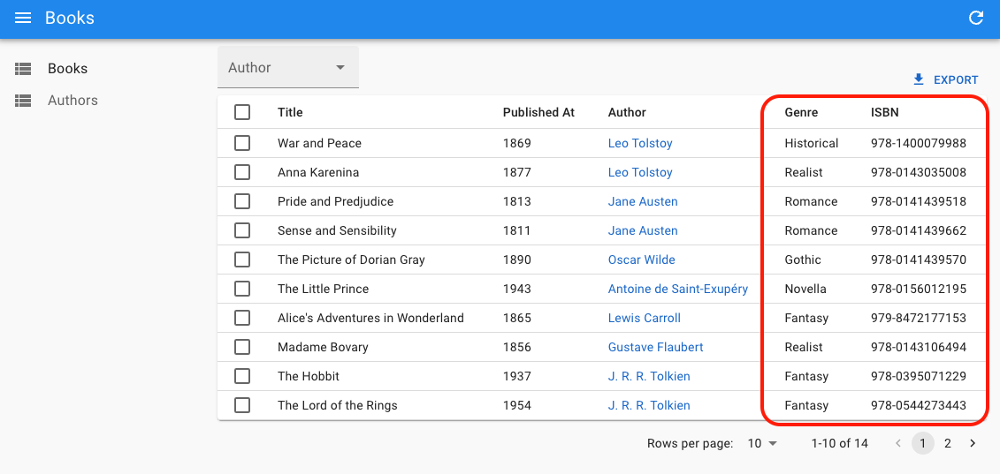

# `<ReferenceOneField>`

This field fetches a one-to-one relationship, e.g. the details of a book, when using a foreign key on the distant resource.

```
┌──────────────┐       ┌──────────────┐
│ books        │       │ book_details │
│--------------│       │--------------│
│ id           │───┐   │ id           │
│ title        │   └──╼│ book_id      │
│ published_at │       │ genre        │
└──────────────┘       │ ISBN         │
                       └──────────────┘
```



`<ReferenceOneField>` behaves like `<ReferenceManyField>`: it uses the current `record` (a book in this example) to build a filter for the book details with the foreign key (`book_id`). Then, it uses `dataProvider.getManyReference('book_details', { target: 'book_id', id: book.id })` to fetch the related details, and takes the first one.

`<ReferenceOneField>` renders the [`recordRepresentation`](./Resource.md#recordrepresentation) of the related record. It also creates a `RecordContext` with the reference record, so you can use any component relying on this context (`<TextField>`, `<SimpleShowLayout>`, etc.) as child.

For the inverse relationships (the book linked to a book_detail), you can use a [`<ReferenceField>`](./ReferenceField.md).

**Tip**: To edit the records of a one-to-one relationship, use [the `<ReferenceOneInput>` component](./ReferenceOneInput.md).

## Usage

Here is how to render a field of the `book_details` resource inside a Show view for the `books` resource:

```jsx
const BookShow = () => (
    <Show>
        <SimpleShowLayout>
            <TextField source="title" />
            <DateField source="published_at" />
            <ReferenceField source="authorId" reference="authors" />
            <ReferenceOneField label="Genre" reference="book_details" target="book_id">
                <TextField source="genre" />
            </ReferenceOneField>
            <ReferenceOneField label="ISBN" reference="book_details" target="book_id">
                <TextField source="ISBN" />
            </ReferenceOneField>
        </SimpleShowLayout>
    </Show>
);
```

**Tip**: As with `<ReferenceField>`, you can call `<ReferenceOneField>` as many times as you need in the same component, react-admin will only make one call to `dataProvider.getManyReference()` per reference.

## Props

| Prop           | Required | Type               | Default                          | Description                                                                                                  |
| -------------- | -------- | ------------------------------------------- | -------------------------------- | ----------------------------------------------------------------------------------- |
| `reference`    | Required | `string`                                    | -                                | The name of the resource for the referenced records, e.g. 'book_details'            |
| `target`       | Required | string                                      | -                                | Target field carrying the relationship on the referenced resource, e.g. 'book_id'   |
| `children`     | Optional | `Element`                                   | -                                | The Field element used to render the referenced record                              |
| `filter`       | Optional | `Object`                                    | `{}`                             | Used to filter referenced records                                                   |
| `link`         | Optional | `string | Function`                         | `edit`                           | Target of the link wrapping the rendered child. Set to `false` to disable the link. |
| `queryOptions` | Optional | [`UseQueryOptions`](https://tanstack.com/query/v3/docs/react/reference/useQuery) | `{}` | `react-query` client options |
| `sort`         | Optional | `{ field: String, order: 'ASC' or 'DESC' }` | `{ field: 'id', order: 'ASC' }`  | Used to order referenced records                                                    |

`<ReferenceOneField>` also accepts the [common field props](./Fields.md#common-field-props), except `emptyText` (use the child `empty` prop instead).

## `children`

By default, `<ReferenceOneField>` renders the [`recordRepresentation`](./Resource.md#recordrepresentation) of the related record. If you pass a child component, it will be rendered instead, inside a `<RecordContext>` of the fetched reference. This gives you entire freedom to display the related record.

For instance, if you want to render both the genre and the ISBN for a book:

```jsx
<ReferenceOneField label="Details" reference="book_details" target="book_id">
    <TextField source="genre" /> (<TextField source="ISBN" />)
</ReferenceOneField>
```

## `filter`

You can also use `<ReferenceOneField>` in a one-to-many relationship. In that case, the first record will be displayed. The `filter` prop becomes super useful in that case, as it allows you to select the appropriate record to display.

For instance, if a product has prices in many currencies, and you only want to render the price in euros, you can use:


```jsx
<ReferenceOneField
    label="Price (€)"
    reference="product_prices"
    target="product_id"
    filter={{ currency: "EUR" }}
>
    <NumberField source="price" />
</ReferenceOneField>
```


## `link`

By default, `<ReferenceOneField>` links to the edition page of the related record. You can disable this behavior by setting the `link` prop to `false`.

```jsx
<ReferenceOneField label="Genre" reference="book_details" target="book_id" link={false}>
    <TextField source="genre" />
</ReferenceOneField>
```

You can also set the `link` prop to a string, which will be used as the link type. It can be either `edit`, `show`, a route path, or a function returning a route path based on the given record.

```jsx
<ReferenceOneField 
    label="Genre"
    reference="book_details"
    target="book_id"
    link={record => `/custom/${record.id}`}
>
    <TextField source="genre" />
</ReferenceOneField>
```

## `queryOptions`

`<ReferenceOneField>` uses `react-query` to fetch the related record. You can set [any of `useQuery` options](https://tanstack.com/query/v3/docs/react/reference/useQuery) via the the `queryOptions` prop.

For instance, if you want to disable the refetch on window focus for this query, you can use:


```jsx
<ReferenceOneField
    label="Genre"
    reference="book_details"
    target="book_id"
    queryOptions={{ refetchOnWindowFocus: false }}
>
    <TextField source="genre" />
</ReferenceOneField>
```


## `reference`

The name of the resource to fetch for the related records.

For instance, if you want to display the details of a given book, the `reference` name should be `book_details`:

```jsx
<ReferenceOneField label="Genre" reference="book_details" target="book_id">
    <TextField source="genre" />
</ReferenceOneField>
```

## `sort`

You can also use `<ReferenceOneField>` in a one-to-many relationship. In that case, the first record will be displayed. This is where the `sort` prop comes in handy. It allows you to select the appropriate record to display.


For instance, if you want to display the latest message in a discussion, you can use:


```jsx
<ReferenceOneField
    reference="messages"
    target="discussion_id"
    sort={{ field: "createdAt", order: "DESC" }}
>
    <TextField source="body" />
</ReferenceOneField>
```


## `target`

The name of the field carrying the relationship on the referenced resource.

For example, in the following schema, the relationship is carried by the `book_id` field:

```
┌──────────────┐       ┌──────────────┐
│ books        │       │ book_details │
│--------------│       │--------------│
│ id           │───┐   │ id           │
│ title        │   └──╼│ book_id      │
│ published_at │       │ genre        │
└──────────────┘       │ ISBN         │
                       └──────────────┘
```

In that case, the `target` prop should be set to `book_id`:

```jsx
<ReferenceOneField label="Genre" reference="book_details" target="book_id">
    <TextField source="genre" />
</ReferenceOneField>
```

## Displaying One Record In A Collection

`<ReferenceOneField>` can also be used to display one record of a one-to-many relationship. Use `sort` and/or `filter` props to select the appropriate records to fetch. The first record will be displayed.

For instance, to display only the latest review with a 5-star rating for a book:


```jsx
const BookShow = () => (
    <Show>
        <SimpleShowLayout>
            <TextField source="title" />
            <DateField source="published_at" />
            <ReferenceOneField
                label="Latest cool review"
                reference="book_reviews"
                target="book_id"
                sort={{ field: "createdAt", order: "DESC" }}
                filter={{ rating: 5 }}
            >
                <TextField source="title" />
            </ReferenceOneField>
        </SimpleShowLayout>
    </Show>
);
```


## Removing The Link

By default, `<ReferenceOneField>` links to the edition page of the related record. You can disable this behavior by setting the `link` prop to `false`.

```jsx
<ReferenceOneField label="Genre" reference="book_details" target="book_id" link={false}>
    <TextField source="genre" />
</ReferenceOneField>
```
