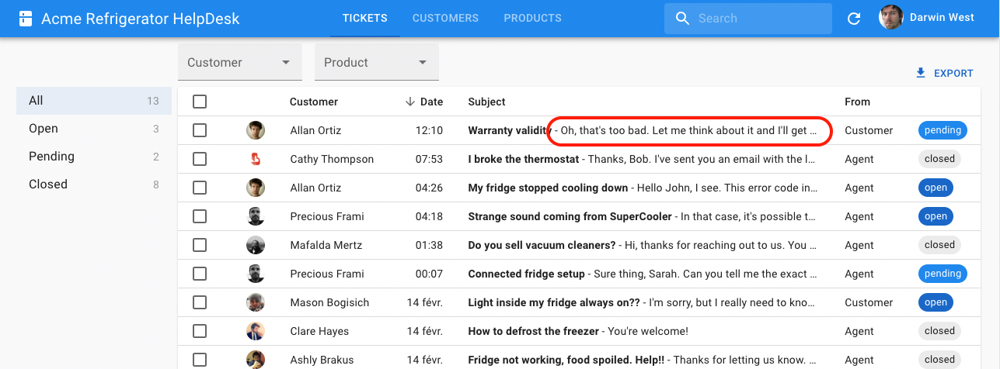

# `<ReferenceOneFieldBase>`

This field fetches a one-to-one relationship, e.g. the details of a book, when using a foreign key on the distant resource.

```
┌──────────────┐       ┌──────────────┐
│ books        │       │ book_details │
│--------------│       │--------------│
│ id           │───┐   │ id           │
│ title        │   └──╼│ book_id      │
│ published_at │       │ genre        │
└──────────────┘       │ ISBN         │
                       └──────────────┘
```

`<ReferenceOneFieldBase>` behaves like `<ReferenceManyFieldBase>`: it uses the current `record` (a book in this example) to build a filter for the book details with the foreign key (`book_id`). Then, it uses `dataProvider.getManyReference('book_details', { target: 'book_id', id: book.id })` to fetch the related details, and takes the first one.

`<ReferenceOneFieldBase>` is a headless component, handling only the logic. This allows to use any UI library for the render. For a version based on MUI see [`<ReferenceOneField>`](/ReferenceOneField.html)

For the inverse relationships (the book linked to a book_detail), you can use a [`<ReferenceFieldBase>`](./ReferenceFieldBase.md).

## Usage

Here is how to render a field of the `book_details` resource inside a Show view for the `books` resource:

```jsx

const BookShow = () => (
    <Show>
        <SimpleShowLayout>
            <TextField source="title" />
            <DateField source="published_at" />
            <ReferenceField source="authorId" reference="authors" />
            <ReferenceOneFieldBase reference="book_details" target="book_id">
                <BookDetails />
            </ReferenceOneFieldBase>
        </SimpleShowLayout>
    </Show>
);

// with BookDetails something like
const BookDetails = ({ source }) => {
    const context = useReferenceOneFieldContext({
        reference,
        target,
    });

    if (context.isPending) {
        return <p>Loading...</p>;
    }

    if (context.error) {
        return <p className="error" >{context.error.toString()}</p>;
    }
    return (
        <div>
            <p>{record ? record.genre : ''}</p>
            <p>{record ? record.ISBN : ''}</p>
        </div>
    );
}
```

**Tip**: As with `<ReferenceFieldBase>`, you can call `<ReferenceOneFieldBase>` as many times as you need in the same component, react-admin will only make one call to `dataProvider.getManyReference()` per reference.

## Props

| Prop           | Required | Type               | Default                          | Description                                                                                                  |
| -------------- | -------- | ------------------------------------------- | -------------------------------- | ----------------------------------------------------------------------------------- |
| `reference`    | Required | `string`                                    | -                                | The name of the resource for the referenced records, e.g. 'book_details'            |
| `target`       | Required | string                                      | -                                | Target field carrying the relationship on the referenced resource, e.g. 'book_id'   |
| `children`     | Optional\* | `Element`                                   | -                                | React component to render the referenced record.                              |
| `render`     | Optional\* | `(referenceFieldContext) => Element`                                   | -                                | A function that takes the reference field context and return a React element                              |
| `empty`        | Optional | `ReactNode`                         | -                                | The text or element to display when the referenced record is empty                   |
| `filter`       | Optional | `Object`                                    | `{}`                             | Used to filter referenced records                                                   |
| `link`         | Optional | `string | Function`                         | `edit`                           | Target of the link wrapping the rendered child. Set to `false` to disable the link. |
| `queryOptions` | Optional | [`UseQueryOptions`](https://tanstack.com/query/v5/docs/react/reference/useQuery) | `{}` | `react-query` client options |
| `sort`         | Optional | `{ field: String, order: 'ASC' or 'DESC' }` | `{ field: 'id', order: 'ASC' }`  | Used to order referenced records                                                    |

`<ReferenceOneFieldBase>` also accepts the [common field props](./Fields.md#common-field-props).

\* Either one of children or render is required.

## `children`

You can pass any component of your own as children, to render the referenced record as you wish.
You can access the list context using the `useReferenceOneFieldController` hook.

```jsx
const BookDetails = () => {
    const { isPending, error, referenceRecord } = useReferenceOneFieldContext({
        reference,
        target,
    });

    if (isPending) {
        return <p>Loading...</p>;
    }

    if (error) {
        return <p className="error" >{error.toString()}</p>;
    }
    return (
        <div>
            <p>{referenceRecord ? referenceRecord.genre : ''}</p>
            <p>{referenceRecord ? referenceRecord.ISBN : ''}</p>
        </div>
    );
}

const BookShow = () => (
    <ReferenceOneFieldBase reference="book_details" target="book_id">
        <BookDetails />
    </ReferenceOneFieldBase>
);
```

## `render`

Alternatively to children you can pass a `render` function prop to `<ReferenceOneFieldBase>`. The `render` function prop will receive the `ReferenceFieldContext` as its argument, allowing to inline the render logic.
When receiving a `render` function prop the `<ReferenceOneFieldBase>` component will ignore the children property.

```jsx
const BookShow = () => (
    <ReferenceOneFieldBase
        reference="book_details"
        target="book_id"
        render={({ isPending, error, referenceRecord }) => {
            if (isPending) {
                return <p>Loading...</p>;
            }

            if (error) {
                return <p className="error" >{error.toString()}</p>;
            }
            return (
                <div>
                    <p>{referenceRecord ? referenceRecord.genre : ''}</p>
                    <p>{referenceRecord ? referenceRecord.ISBN : ''}</p>
                </div>
            );
        }}
    />
);
```

## `empty`

Use `empty` to customize the text displayed when the related record is empty.

```jsx
<ReferenceOneFieldBase label="Details" reference="book_details" target="book_id" empty="no detail">
    <TextField source="genre" /> (<TextField source="ISBN" />)
</ReferenceOneFieldBase>
```

`empty` also accepts a translation key.

```jsx
<ReferenceOneFieldBase label="Details" reference="book_details" target="book_id" empty="resources.books.not_found">
    <TextField source="genre" /> (<TextField source="ISBN" />)
</ReferenceOneFieldBase>
```

`empty` also accepts a `ReactNode`.

```jsx
<ReferenceOneFieldBase
    label="Details"
    reference="book_details"
    target="book_id"
    empty={<CreateButton to="/book_details/create" />}
>
    <TextField source="genre" /> (<TextField source="ISBN" />)
</ReferenceOneFieldBase>
```

## `filter`

You can also use `<ReferenceOneFieldBase>` in a one-to-many relationship. In that case, the first record will be displayed. The `filter` prop becomes super useful in that case, as it allows you to select the appropriate record to display.

For instance, if a product has prices in many currencies, and you only want to render the price in euros, you can use:


```jsx
<ReferenceOneFieldBase
    reference="product_prices"
    target="product_id"
    filter={{ currency: "EUR" }}
>
    <NumberField source="price" />
</ReferenceOneFieldBase>
```


## `link`

By default, `<ReferenceOneFieldBase>` will set pass a links to the edition page of the related record in the context.link. You can disable this behavior by setting the `link` prop to `false`.

```jsx
<ReferenceOneFieldBase label="Genre" reference="book_details" target="book_id" link={false}>
    <TextField source="genre" />
</ReferenceOneFieldBase>
```

You can also set the `link` prop to a string, which will be used as the link type. It can be either `edit`, `show`, a route path, or a function returning a route path based on the given record.


```jsx
<ReferenceOneFieldBase
    reference="book_details"
    target="book_id"
    link={record => `/custom/${record.id}`}
>
    <TextField source="genre" />
</ReferenceOneFieldBase>
```


## `queryOptions`

`<ReferenceOneFieldBase>` uses `react-query` to fetch the related record. You can set [any of `useQuery` options](https://tanstack.com/query/v5/docs/react/reference/useQuery) via the `queryOptions` prop.

For instance, if you want to disable the refetch on window focus for this query, you can use:


```jsx
<ReferenceOneFieldBase
    label="Genre"
    reference="book_details"
    target="book_id"
    queryOptions={{ refetchOnWindowFocus: false }}
>
    <TextField source="genre" />
</ReferenceOneFieldBase>
```


## `reference`

The name of the resource to fetch for the related records.

For instance, if you want to display the details of a given book, the `reference` name should be `book_details`:

```jsx
<ReferenceOneFieldBase label="Genre" reference="book_details" target="book_id">
    <TextField source="genre" />
</ReferenceOneFieldBase>
```

## `sort`

You can also use `<ReferenceOneFieldBase>` in a one-to-many relationship. In that case, the first record will be displayed. This is where the `sort` prop comes in handy. It allows you to select the appropriate record to display.



For instance, if you want to display the latest message in a discussion, you can use:


```jsx
<ReferenceOneFieldBase
    reference="messages"
    target="discussion_id"
    sort={{ field: "createdAt", order: "DESC" }}
>
    <TextField source="body" />
</ReferenceOneFieldBase>
```


## `target`

The name of the field carrying the relationship on the referenced resource.

For example, in the following schema, the relationship is carried by the `book_id` field:

```
┌──────────────┐       ┌──────────────┐
│ books        │       │ book_details │
│--------------│       │--------------│
│ id           │───┐   │ id           │
│ title        │   └──╼│ book_id      │
│ published_at │       │ genre        │
└──────────────┘       │ ISBN         │
                       └──────────────┘
```

In that case, the `target` prop should be set to `book_id`:

```jsx
<ReferenceOneFieldBase label="Genre" reference="book_details" target="book_id">
    <TextField source="genre" />
</ReferenceOneFieldBase>
```
