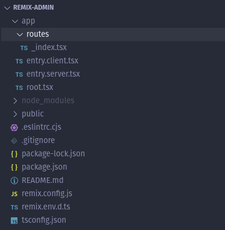

# Remix Integration

[Remix](https://remix.run/) is a Node.js framework for server-side-rendered React apps. But even if react-admin is designed to build Single-Page Applications, Remix and react-admin integrate seamlessly.

These instructions are targeting Remix v2.

## Setting Up Remix

Let's start by creating a new Remix project. Run the following command:

```sh
npx create-remix@latest
```

This script will ask you for more details about your project. You can use the following options:

- The name you want to give to your project, e.g. `remix-admin`
- Initialize a new git repository? Choose Yes
- Install dependencies with npm? Choose Yes

The project structure should look like this:



## Setting Up React-Admin In Remix

Add the `react-admin` npm package, as well as a data provider package. In this example, we'll use `ra-data-json-server` to connect to a test API provided by [JSONPlaceholder](https://jsonplaceholder.typicode.com).

```sh
cd remix-admin
npm add react-admin ra-data-json-server
```

Edit the `vite.config.ts` file to prevent Remix from executing the data provider package server-side:

```diff
import { vitePlugin as remix } from "@remix-run/dev";
import { defineConfig } from "vite";
import tsconfigPaths from "vite-tsconfig-paths";

export default defineConfig({
	plugins: [
		remix({
			future: {
				v3_fetcherPersist: true,
				v3_relativeSplatPath: true,
				v3_throwAbortReason: true,
			},
		}),
		tsconfigPaths(),
	],
+	ssr: {
+		noExternal: ['ra-data-json-server'] // or the dataProvider you are using
+	},
});
```

**Tip**: If you're using yarn, Remix and react-admin both install `react-router`, and due to the way each library handles its dependencies, this results in duplicate packages. To avoid this, use [yarn resolutions](https://yarnpkg.com/configuration/manifest#resolutions) to force React Admin to use the same version of `react-router` as Remix. So add the following to the `package.json` file:

```js
{
  // ...
  "resolutions": {
    "react-router": "6.26.1",
    "react-router-dom": "6.26.1"
  }
}
```

And call `yarn` again to install the dependencies:

```sh
yarn
```

## Adding React-Admin In A Sub Route

In many cases, the admin is only a part of the application. For instance, you may want to render the admin in a subpath like `/admin`.

To do so, add a [splat route](https://remix.run/docs/en/main/file-conventions/routes#splat-routes), i.e. a route that matches all URLs inside a sub path. A splat route is named `$.tsx`. Create a file called `app/routes/admin.$.tsx` file with the following content:

```jsx
// in app/routes/admin.$.tsx
import { Admin, Resource, ListGuesser } from "react-admin";
import jsonServerProvider from "ra-data-json-server";

const dataProvider = jsonServerProvider("https://jsonplaceholder.typicode.com");

export default function App() {
  return (
    <Admin basename="/admin" dataProvider={dataProvider}>
      <Resource name="posts" list={ListGuesser} />
      <Resource name="comments" list={ListGuesser} />
    </Admin>
  );
}
```

**Tip** Don't forget to set the `<Admin basename>` prop, so that react-admin generates links relative to the "/admin/" subpath:

You can now start the app in `development` mode with `npm run dev`. The admin should render at `http://localhost:5173/admin/`, and you can use the Remix routing system to add more pages.

## Adding an API

[Remix allows to serve an API](https://remix.run/docs/en/main/guides/api-routes) from the same server. You *could* use this to build a CRUD API by hand. However, we consider that building a CRUD API on top of a relational database is a solved problem and that developers shouldn't spend time reimplementing it.

For instance, if you store your data in a [PostgreSQL](https://www.postgresql.org/) database, you can use [PostgREST](https://postgrest.org/en/stable/) to expose the data as a REST API with zero configuration. Even better, you can use a Software-as-a-Service like [Supabase](https://supabase.com/) to do that for you.

In such cases, the Remix API can only serve as a Proxy to authenticate client queries and pass them down to Supabase.

Let's see an example in practice.

First, create a Supabase REST API and its associated PostgreSQL database directly on the [Supabase website](https://app.supabase.com/) (it's free for tests and low usage). Once the setup is finished, use the Supabase manager to add the following tables:

- `posts` with fields: `id`, `title`, and `body`
- `comments` with fields: `id`, `name`, `body`, and `postId` (a foreign key to the `posts.id` field)

You can populate these tables via the Supabse UI if you want. Supabase exposes a REST API at `https://YOUR_INSTANCE.supabase.co/rest/v1`.

Next, create a configuration to let the Remix app connect to Supabase. As Remix supports [`dotenv`](https://dotenv.org/) by default in `development` mode, you just need to create a `.env` file:

```sh
# In `.env`
SUPABASE_URL="https://MY_INSTANCE.supabase.co"
SUPABASE_SERVICE_ROLE="MY_SERVICE_ROLE_KEY"
```

**Tip**: This example uses the **service role key** here and not the anonymous role. This allows mutations without dealing with authorization. **You shouldn't do this in production**, but use the [Supabase authorization](https://supabase.com/docs/guides/auth) feature instead.

Time to bootstrap the API Proxy. Create a new Remix route at `app/routes/admin.api.$.tsx`. Inside this file, a `loader` function should convert the GET requests into Supabase API calls, and an `action` function should do the same for POST, PUT, and DELETE requests.

```tsx
// in /app/routes/admin.api.$.tsx
import { type ActionFunctionArgs, type LoaderFunctionArgs } from "@remix-run/node";

// handle read requests (getOne, getList, getMany, getManyReference)
export const loader = ({ request }: LoaderFunctionArgs) => {
  const apiUrl = getSupabaseUrlFromRequestUrl(request.url);

  return fetch(apiUrl, {
    headers: {
      prefer: request.headers.get("prefer") ?? "",
      accept: request.headers.get("accept") ?? "application/json",
      "Accept-Encoding": "",
      apiKey: `${process.env.SUPABASE_SERVICE_ROLE}`,
      Authorization: `Bearer ${process.env.SUPABASE_SERVICE_ROLE}`,
    },
  });
};

// handle write requests (create, update, delete, updateMany, deleteMany)
export const action = ({ request }: ActionFunctionArgs) => {
  const apiUrl = getSupabaseUrlFromRequestUrl(request.url);

  return fetch(apiUrl, {
    method: request.method,
    body: request.body,
    headers: {
      prefer: request.headers.get("prefer") ?? "",
      accept: request.headers.get("accept") ?? "application/json",
      "Accept-Encoding": "",
      apiKey: `${process.env.SUPABASE_SERVICE_ROLE}`,
      Authorization: `Bearer ${process.env.SUPABASE_SERVICE_ROLE}`,
    },
  });
};

const ADMIN_PREFIX = "/admin/api";

const getSupabaseUrlFromRequestUrl = (url: string) => {
  const startOfRequest = url.indexOf(ADMIN_PREFIX);
  const query = url.substring(startOfRequest + ADMIN_PREFIX.length);
  return `${process.env.SUPABASE_URL}/rest/v1${query}`;
};
```

**Tip**: Some of this code is really PostgREST-specific. The `prefer` header is required to let PostgREST return one record instead of an array containing one record in response to `getOne` requests. A proxy for another CRUD API will require different parameters.

Update the react-admin data provider to use the Supabase adapter instead of the JSON Server one. As Supabase provides a PostgREST endpoint, we'll use [`ra-data-postgrest`](https://github.com/raphiniert-com/ra-data-postgrest):

```sh
npm add @raphiniert/ra-data-postgrest
```

Update your `vite.config.ts` to add `@raphiniert/ra-data-postgrest` to the `noExternal` array:


```diff
import { vitePlugin as remix } from "@remix-run/dev";
import { defineConfig } from "vite";
import tsconfigPaths from "vite-tsconfig-paths";

export default defineConfig({
	plugins: [
		remix({
			future: {
				v3_fetcherPersist: true,
				v3_relativeSplatPath: true,
				v3_throwAbortReason: true,
			},
		}),
		tsconfigPaths(),
	],
+	ssr: {
+		noExternal: ['@raphiniert/ra-data-postgrest']
+	},
});
```

Finally, update your Admin dataProvider:

```jsx
// in app/routes/admin.$.tsx
import { Admin, Resource, ListGuesser, fetchUtils } from "react-admin";
import postgrestRestProvider, { defaultPrimaryKeys, defaultSchema } from '@raphiniert/ra-data-postgrest';
import styles from "~/styles/admin.css";

export function links() {
  return [{ rel: "stylesheet", href: styles }];
}

const dataProvider = postgrestRestProvider({
    apiUrl: '/admin/api',
    httpClient: fetchUtils.fetchJson,
    defaultListOp: 'eq',
    primaryKeys: defaultPrimaryKeys,
    schema: defaultSchema
});

export default function App() {
  return (
    <Admin basename="/admin" dataProvider={dataProvider}>
      <Resource name="posts" list={ListGuesser} />
      <Resource name="comments" list={ListGuesser} />
    </Admin>
  );
}
```

That's it! Now Remix both renders the admin app and serves as a proxy to the Supabase API. You can test the app by visiting `http://localhost:5173/admin/`, and the API Proxy by visiting `http://localhost:5173/admin/api/posts`.

Note that the Supabase credentials never leave the server. It's up to you to add your own authentication to the API proxy.
