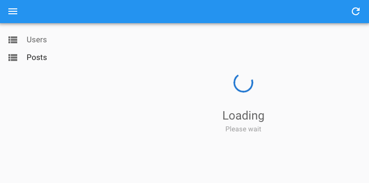

# The `<Resource>` component

`<Resource>` components define the CRUD routes of a react-admin application. 

<iframe src="https://www.youtube-nocookie.com/embed/AURvUMu-Fb4" title="YouTube video player" frameborder="0" allow="accelerometer; autoplay; clipboard-write; encrypted-media; gyroscope; picture-in-picture; web-share" allowfullscreen style="aspect-ratio: 16 / 9;width:100%;margin-bottom:1em;"></iframe>

In react-admin terms, a *resource* is a string that refers to an entity type (like 'products', 'subscribers', or 'tags'). *Records* are objects with an `id` field, and two records of the same *resource* have the same field structure (e.g. all posts records have a title, a publication date, etc.). 

A `<Resource>` component has 3 responsibilities:

- It defines the CRUD routes of a given resource (to display a list of records, the details of a record, or to create a new one).
- It creates a context that lets every descendant component know the current resource name (this context is called `ResourceContext`).
- It stores the resource definition (its name, icon, and label) inside a shared context (this context is called `ResourceDefinitionContext`).

`<Resource>` components can only be used as children of [the `<Admin>` component](./Admin.md).

## Usage

For instance, the following admin app offers an interface to the resources exposed by the JSONPlaceholder API ([posts](https://jsonplaceholder.typicode.com/posts), [users](https://jsonplaceholder.typicode.com/users), [comments](https://jsonplaceholder.typicode.com/comments), and [tags](https://jsonplaceholder.typicode.com/tags)):

```jsx
import * as React from "react";
import { Admin, Resource } from 'react-admin';
import jsonServerProvider from 'ra-data-json-server';

import { PostList, PostCreate, PostEdit, PostShow, PostIcon } from './posts';
import { UserList } from './posts';
import { CommentList, CommentEdit, CommentCreate, CommentIcon } from './comments';

const App = () => (
    <Admin dataProvider={jsonServerProvider('https://jsonplaceholder.typicode.com')}>
        {/* complete CRUD pages for posts */}
        <Resource name="posts" list={PostList} create={PostCreate} edit={PostEdit} show={PostShow} />
        {/* read-only user list */}
        <Resource name="users" list={UserList} />
        {/* no show page for the comments resource */}
        <Resource name="comments" list={CommentList} create={CommentCreate} edit={CommentEdit} icon={CommentIcon} />
    </Admin>
);
```

The routes call the following `dataProvider` methods:

* `list` calls `getList()` on mount
* `show` calls `getOne()` on mount
* `edit` calls `getOne()` on mount, and `update()` or `delete()` on submission
* `create` calls `create()` on submission

**Tip**: Which API endpoint does a resource rely on? The `<Resource>` component doesn't know this mapping - it's [the `dataProvider`'s job](./DataProviders.md) to define it.

## Props

`<Resource>` accepts the following props:

| Prop   | Required | Type | Default  | Description |
|--------|----------|------|----------|-------------|
| `name` | Required | `string` | - | The name of the resource, used to determine the API endpoint and the URL for the resource |
| `list` |  | `React.ComponentType` | - | The component to render for the list view |
| `create` |  | `React.ComponentType` | - | The component to render for the create view |
| `edit` |  | `React.ComponentType` | - | The component to render for the edit view |
| `show` |  | `React.ComponentType` | - | The component to render for the show view |
| `record Representation` |  | `string` or `function` or `React.ComponentType` | - | The representation of a record to use in the UI |
| `icon` |  | `React.ComponentType` | - | The component to render in the menu |
| `options` |  | `object` | - | Additional options for the resource |
| `children` |  | `Route` | - | Sub-routes for the resource |

## `name`

`name` is the only required prop for a `<Resource>`. React-admin uses the `name` prop both to determine the API endpoint (passed to the `dataProvider`), and to form the URL for the resource.

```jsx
<Resource name="posts" list={PostList} create={PostCreate} edit={PostEdit} show={PostShow} />
```

For this resource react-admin will fetch the `https://jsonplaceholder.typicode.com/posts` endpoint for data.

The routing will map the component as follows:

* `/posts/` maps to `PostList`
* `/posts/create` maps to `PostCreate`
* `/posts/:id` maps to `PostEdit`
* `/posts/:id/show` maps to `PostShow`

**Tip**: If you want to use a special API endpoint (e.g. 'https://jsonplaceholder.typicode.com/my-custom-posts-endpoint') without altering the URL in the react-admin application (so still use `/posts`), write the mapping from the resource `name` (`posts`) to the API endpoint (`my-custom-posts-endpoint`) in your own [`dataProvider`](./Admin.md#dataprovider).

## `list`, `create`, `edit`, `show`

`<Resource>` allows you to define a component for each CRUD route, using the following prop names:

* `list` (usually using [the `<List>` component](./List.md)) (if defined, the resource is displayed on the Menu)
* `create` (usually using [the `<Create>` component](./Create.md))
* `edit` (usually using [the `<Edit>` component](./Edit.md))
* `show` (usually using [the `<Show>` component](./Show.md))

**Tip**: Under the hood, `<Resource>` uses [react-router](https://reactrouter.com/web/guides/quick-start) to create several routes:

* `/` maps to the `list` component
* `/create` maps to the `create` component
* `/:id` maps to the `edit` component
* `/:id/show` maps to the `show` component

## `children`

`<Resource>` defines the CRUD routes of your application. So `<Resource name="posts">` defines a set of routes starting with `/posts`. 

`<Resource>` accepts `<Route>` components as `children`, to let you define sub routes for the resource. 

For instance, the following code creates an `authors` resource, and adds an `/authors/:authorId/books` route displaying the books of the given author:

```jsx
// in src/App.jsx
import { Admin, Resource } from 'react-admin';
import { Route } from 'react-router-dom';

import { AuthorList } from './AuthorList';
import { BookList } from './BookList';

export const App = () => (
    <Admin dataProvider={dataProvider}>
        <Resource name="authors" list={AuthorList}>
            <Route path=":authorId/books" element={<BookList />} />
        </Resource>
    </Admin>
);
```

The `BookList` component can grab the `authorId` parameter from the URL using the `useParams` hook, and pass it as a `<List filter>` parameter to display a list of books for the given author:


```jsx
// in src/BookList.jsx
import { List, Datagrid, TextField } from 'react-admin';
import { useParams } from 'react-router-dom';

export const BookList = () => {
    const { authorId } = useParams();
    return (
        <List resource="books" filter={{ authorId }}>
            <Datagrid>
                <TextField source="id" />
                <TextField source="title" />
                <TextField source="year" />
            </Datagrid>
        </List>
    );
};
```


**Tip**: In the above example, the `resource="books"` prop is required in `<List>` because the `ResourceContext` defaults to `authors` inside the `<Resource name="authors">`.

It's your responsibility to route to the `/authors/:id/books` route, e.g. from each line of the `AuthorList` component:

```jsx
// in src/AuthorList.jsx
const BooksButton = () => {
    const record = useRecordContext();
    return (
        <Button
            component={Link}
            to={`/authors/${record.id}/books`}
            color="primary"
        >
            Books
        </Button>
    );
};

export const AuthorList = () => (
    <List>
        <Datagrid>
            <TextField source="id" />
            <TextField source="firstName" />
            <TextField source="lastName" />
            <BooksButton />
        </Datagrid>
    </List>
);
```

**Tip**: As the `/authors/:authorId/books` route is a sub-route of the `/authors` route, the active menu item will be "Authors". 

## `icon`

React-admin will render the `icon` prop component in the menu:

```jsx
// in src/App.js
import * as React from "react";
import PostIcon from '@mui/icons-material/Book';
import UserIcon from '@mui/icons-material/People';
import { Admin, Resource } from 'react-admin';
import jsonServerProvider from 'ra-data-json-server';

import { PostList } from './posts';

const App = () => (
    <Admin dataProvider={jsonServerProvider('https://jsonplaceholder.typicode.com')}>
        <Resource name="posts" list={PostList} icon={PostIcon} />
        <Resource name="users" list={UserList} icon={UserIcon} />
    </Admin>
);
```

## `options`

`options.label` allows to customize the display name of a given resource in the menu.


```jsx
<Resource name="v2/posts" options={{ label: 'Posts' }} list={PostList} />
```


## `recordRepresentation`

Whenever react-admin needs to render a record (e.g. in the title of an edition view, or in a `<ReferenceField>`), it uses the `recordRepresentation` to do it. By default, react-admin will use the first available field among the following:
- `name`
- `title`
- `label`
- `reference`
- `id`

However, you can customize it by specifying the representation you want.

For instance, to change the default representation of "users" records to render the full name instead of the id:

```jsx
<Resource
    name="users"
    list={UserList}
    recordRepresentation={(record) => `${record.first_name} ${record.last_name}`}
/>
```

`recordRepresentation` can take 3 types of values:

- a string (e.g. `'title'`) to specify the field to use as representation
- a function (e.g. `(record) => record.title`) to specify a custom string representation
- a React component (e.g. `<MyCustomRecordRepresentation />`). In such components, use [`useRecordContext`](./useRecordContext.md) to access the record.

If you want to display this record representation somewhere, you can leverage the [`useGetRecordRepresentation`](./useGetRecordRepresentation.md) hook or the [`<RecordRepresentation>`](./RecordRepresentation.md) component.

## `hasCreate`, `hasEdit`, `hasShow`

Some components, like [`<CreateDialog>`](./CreateDialog.md), [`<EditDialog>`](./EditDialog.md) or [`<ShowDialog>`](./ShowDialog.md) need to declare the CRUD components outside of the `<Resource>` component. In such cases, you can use the `hasCreate`, `hasEdit` and `hasShow` props to tell react-admin which CRUD components are available for a given resource.

This is useful, for instance, to have the `<ReferenceField>` component display a link to the edit or show view of the referenced record.

```jsx
// in src/App.js
import { Admin, Resource } from 'react-admin';
import { dataProvider } from './dataProvider';

import { PostList } from './posts';
import { CommentEdit } from './commentEdit';

const App = () => (
    <Admin dataProvider={dataProvider}>
        <Resource name="posts" list={PostList} hasEdit />
        <Resource name="comment" edit={CommentEdit} />
    </Admin>
);

// in src/commentEdit.js
import { Edit, SimpleForm, ReferenceField } from 'react-admin';

const CommentEdit = () => (
    <Edit>
        <SimpleForm>
            {/* renders a link to the edit view only because `hasEdit` has been set on `<Resource>` */}
            <ReferenceField source="post_id" reference="posts" />
        </SimpleForm>
    </Edit>
);
```

## Resource Context

`<Resource>` also creates a `ResourceContext`, that gives access to the current resource name to all descendants of the main page components (`list`, `create`, `edit`, `show`). 

To read the current resource name, use the `useResourceContext()` hook.

For instance, the following component displays the name of the current resource:

```jsx
import * as React from 'react';
import { Datagrid, DateField, TextField, List, useResourceContext } from 'react-admin';

const ResourceName = () => {
    const resource = useResourceContext();
    return <>{resource}</>;
}

const PostList = () => (
    <List>
        <>
            <ResourceName /> {/* renders 'posts' */}
            <Datagrid>
                <TextField source="title" />
                <DateField source="published_at" />
            </Datagrid>
        </>
    </List>
)
```

**Tip**: You can *change* the current resource context, e.g. to use a component for a related resource. Use the `<ResourceContextProvider>` component for that:

```jsx
const MyComponent = () => (
    <ResourceContextProvider value="comments">
        <ResourceName /> {/* renders 'comments' */}
        ...
    </ResourceContextProvider>
);
```

## Security

The usual components for the `<Resource>` routes ( `<List>`, `<Create>`, `<Edit>`, `<Show>`) require authentication and will redirect anonymous users to the login page. If you want to allow anonymous access, use the [`disableAuthentication`](./List.md#disableauthentication) prop on the component.

In addition, if your `authProvider` implements [Access Control](./Permissions.md#access-control), these components will only render if the user has the right permission (e.g., `{ action: 'list', resource: 'posts' }` for the `list` page of the `posts` resource).

For instance, given the following resource:

```tsx
<Resource name="posts" list={PostList} create={PostCreate} edit={PostEdit} show={PostShow} />
```

React-admin will call the `authProvider.canAccess` method when users try to access the pages with the following parameters:

- For the list page: `{ action: "list", resource: "posts" }`
- For the create page: `{ action: "create", resource: "posts" }`
- For the edit page: `{ action: "edit", resource: "posts" }`
- For the show page: `{ action: "show", resource: "posts" }`

## Nested Resources

React-admin doesn't support nested resources, but you can use [the `children` prop](#children) to render a custom component for a given sub-route. For instance, to display a list of songs for a given artist:

```jsx
import { Admin, Resource } from 'react-admin';
import { Route } from 'react-router-dom';

export const App = () => (
    <Admin dataProvider={dataProvider}>
        <Resource name="artists" list={ArtistList} edit={ArtistDetail}>
            <Route path=":id/songs" element={<SongList />} />
            <Route path=":id/songs/:songId" element={<SongDetail />} />
        </Resource>
    </Admin>
);
```

<video controls autoplay playsinline muted loop width="100%">
  <source src="https://react-admin-ee.marmelab.com/assets/ra-navigation/latest/breadcumb-nested-resource.mp4" type="video/mp4" />
  Your browser does not support the video tag.
</video>

This setup creates four routes:

- `/artists` renders the `<ArtistList>` element
- `/artists/:id` renders the `<ArtistDetail>` element
- `/artists/:id/songs` renders the `<SongList>` element
- `/artists/:id/songs/:songId` renders the `<SongDetail>` element

In order to display a list of songs for the selected artist, `<SongList>` should filter the songs by the `id` parameter. To do so, use the `useParams` hook from `react-router-dom`:


```jsx
// in src/SongList.jsx
import { List, Datagrid, TextField, useRecordContext } from 'react-admin';
import { useParams } from 'react-router-dom';
import { Button } from '@mui/material';

export const SongList = () => {
    const { id } = useParams();
    return (
        <List resource="songs" filter={{ artistId: id }}>
            <Datagrid>
                <TextField source="title" />
                <DateField source="released" />
                <TextField source="writer" />
                <TextField source="producer" />
                <TextField source="recordCompany" label="Label" />
                <EditSongButton />
            </Datagrid>
        </List>
    );
};

const EditSongButton = () => {
    const song = useRecordContext();
    return (
        <Button
            component={Link}
            to={`/artists/${song?.artist_id}/songs/${song?.id}`}
            startIcon={<EditIcon />}
        >
            Edit
        </Button>
    );
};
```


In the `<SongDetail>` component, you must also use the `useParams` hook to get the `songId` parameter and display the song with the corresponding `id`:


```jsx
// in src/SongDetail.jsx
import { Edit, SimpleForm, TextInput } from 'react-admin';
import { useParams } from 'react-router-dom';

export const SongDetail = () => {
    const { id, songId } = useParams();
    return (
        <Edit resource="posts" id={songId} redirect={`/artists/${id}/songs`}>
            <SimpleForm>
                <TextInput source="title" />
                <DateInput source="released" />
                <TextInput source="writer" />
                <TextInput source="producer" />
                <TextInput source="recordCompany" label="Label" />
            </SimpleForm>
        </Edit>
    );
};
```


**Tip**: As seen in the screencast above, when browsing to nested resources, users can get lost unless they have a breadcrumb path displayed on screen. Check [the `<Breadcrumb>` component](./Breadcrumb.md#nested-resources) for more details about how to set up this navigation element.

## Lazy Loading

If you need to speed up the initial loading of your application, you may want to enable code splitting using [`React.lazy()`](https://react.dev/reference/react/lazy#suspense-for-code-splitting). The default react-admin layout uses Suspense, so there is no special setup required to use lazy loaded components in `<Resource>`.

```jsx
// in src/App.js
import * as React from 'react';
import { Admin, Resource } from 'react-admin';

import { dataProvider } from './dataProvider';
import { users } from './users';

const PostList = React.lazy(() => import('./posts/PostList'));
const PostEdit = React.lazy(() => import('./posts/PostEdit'));

const App = () => (
    <Admin dataProvider={dataProvider}>
        <Resource name="users" {...users} />
        <Resource name="posts" list={PostList} edit={PostEdit} />
    </Admin>
);
```

When users navigate to the `/posts` route, react-admin will display a loading indicator while the `PostList` component is being loaded.



