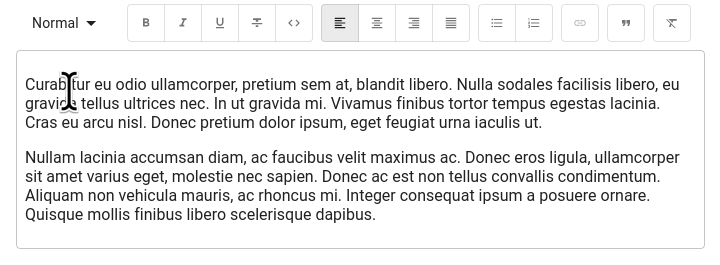

# `<RichTextInput>`

`<RichTextInput>` is the ideal component if you want to allow your users to edit some HTML contents. It is powered by [Quill](https://quilljs.com/).



**Note**: Due to its size, `<RichTextInput>` is not bundled by default with react-admin. You must install it first, using npm:

```sh
npm install ra-input-rich-text
```

Then use it as a normal input component:

```jsx
import RichTextInput from 'ra-input-rich-text';

<RichTextInput source="body" />
```

You can customize the rich text editor toolbar using the `toolbar` attribute, as described on the [Quill official toolbar documentation](https://quilljs.com/docs/modules/toolbar/).

```jsx
<RichTextInput source="body" toolbar={[ ['bold', 'italic', 'underline', 'link'] ]} />
```

If you need to add Quill `modules` or `themes`, you can do so by passing them in the `options` prop.


```jsx
<RichTextInput
    source="body"
    options={{
        modules: {
            history: { // History module
                delay: 2000,
                maxStack: 500,
                userOnly: true
            }
        },
        theme: "snow"
    }}
/>
```


If you need more customization, you can access the quill object through the `configureQuill` callback that will be called just after its initialization.

```jsx
const configureQuill = quill => quill.getModule('toolbar').addHandler('bold', function (value) {
    this.quill.format('bold', value)
});

// ...

<RichTextInput source="text" configureQuill={configureQuill}/>
```

`<RichTextInput>` also accepts the [common input props](./Inputs.md#common-input-props).

**Tip**: When used inside a material-ui `<Card>` (e.g. in the default `<Edit>` view), `<RichTextInput>` displays link tooltip as cut off when the user wants to add a hyperlink to a word located on the left side of the input. This is due to an incompatibility between material-ui's `<Card>` component and Quill's positioning algorithm for the link tooltip.

To fix this problem, you should override the default card style, as follows:

```diff
import { Edit, SimpleForm, TextInput } from 'react-admin';
+import { withStyles } from '@material-ui/core/styles';

-const PostEdit = props => (
+const PostEdit = withStyles({ card: { overflow: 'initial' } })(() => (
   <Edit>
       <SimpleForm>
            // ...
       </SimpleForm>
   </Edit>
-);
+));
```
