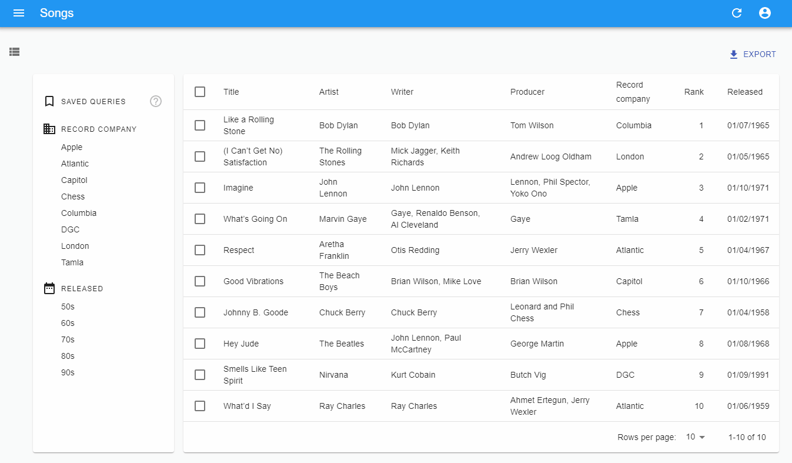

# `<SavedQueriesList>`



`<SavedQueriesList>` is a complement to `<FilterList>` sections for the filter sidebar

## Usage

```diff
import {
    FilterList,
    FilterListItem,
    List,
    Datagrid
+    SavedQueriesList
} from 'react-admin';
import { Card, CardContent } from '@mui/material';

const SongFilterSidebar = () => (
    <Card>
        <CardContent>
+           <SavedQueriesList />
            <FilterList label="Record Company" icon={<BusinessIcon />}>
                ...
            </FilterList>
            <FilterList label="Released" icon={<DateRangeeIcon />}>
               ...
            </FilterList>
        </CardContent>
    </Card>
);

const SongList = props => (
    <List {...props} aside={<SongFilterSidebar />}>
        <Datagrid>
            ...
        </Datagrid>
    </List>
);
```

`<SavedQueriesList>` accept a single props:

* [`icon`](#icon)

## `icon`

When set, the `<SavedQueriesList icon>` prop appears on the left side of the filter label.


```jsx
import { FilterList, FilterListItem, List, Datagrid, SavedQueriesList } from 'react-admin';
import { Card, CardContent } from '@mui/material';
import BookmarkIcon from '@mui/icons-material/BookmarkBorder';

const SongFilterSidebar = () => (
    <Card>
        <CardContent>
            <SavedQueriesList icon={<BookmarkIcon />} />
            <FilterList label="Record Company" icon={<BusinessIcon />}>
                ...
            </FilterList>
            <FilterList label="Released" icon={<DateRangeeIcon />}>
               ...
            </FilterList>
        </CardContent>
    </Card>
);

const SongList = props => (
    <List {...props} aside={<SongFilterSidebar />}>
        <Datagrid>
            ...
        </Datagrid>
    </List>
);
```


## API

[`<SavedQueriesList>`]: https://github.com/marmelab/react-admin/blob/master/packages/ra-ui-materialui/src/list/filter/SavedQueriesList.tsx
