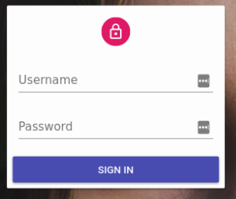

# Security

<video controls autoplay playsinline muted loop>
  <source src="./img/login.mp4" type="video/mp4"/>
  Your browser does not support the video tag.
</video>

Web applications often need to limit access to specific pages or resources to authenticated users ("**authentication**") and ensure that users can only perform permitted actions ("**authorization**").

React-admin supports both authentication and authorization, allowing you to secure your admin app with your preferred authentication strategy. Since there are many strategies (e.g., OAuth, MFA, passwordless, magic link), react-admin delegates this logic to an `authProvider`.

## The Auth Provider

Authentication and authorization features rely on an **authentication backend** (e.g., OAuth server, API server, or SAML server). The `authProvider` acts as a bridge between react-admin and this authentication backend.

For example, when the user accesses a page component (`<List>`, `<Edit>`, `<Create>`, `<Show>`), react-admin checks if the user is authenticated by calling the `authProvider.checkAuth()` method. If the user is not authenticated, they are redirected to the login page:

```tsx
try {
    await authProvider.checkAuth();
} catch (error) {
    // The user is not authenticated
    return <Redirect to="/login" />;
}
```

If you use JWT tokens, this method checks if the user token is valid and refreshes it if necessary.

An Auth Provider must implement the following methods:

```js
const authProvider = {
    // Send username and password to the auth server and get back credentials
    async login(params) {/** ... **/},
    // Check if an error from the dataProvider indicates an authentication issue
    async checkError(error) {/** ... **/},
    // Verify that the user's credentials are still valid during navigation
    async checkAuth(params) {/** ... **/},
    // Remove local credentials and notify the auth server of the logout
    async logout() {/** ... **/},
    // Retrieve the user's profile
    async getIdentity() {/** ... **/},
    // (Optional) Check if the user has permission for a specific action on a resource
    async canAccess() {/** ... **/},
};
```

You can use an existing Auth Provider from the [List of Available Auth Providers](./AuthProviderList.md) or create your own following the [Building Your Own Auth Provider](./AuthProviderWriting.md) guide.

## Authentication

Once you set an `<Admin authProvider>`, react-admin enables authentication automatically.

```tsx
const App = () => (
    <Admin authProvider={authProvider}>
        ...
    </Admin>
);
```

For page components (`<List>`, `<Edit>`, `<Create>`, `<Show>`) and the dashboard, anonymous users are redirected to the login screen. To allow anonymous access on a page, use the `disableAuthentication` prop. For example, in a list view:

```tsx
import { List } from 'react-admin';

const PostList = () => (
    <List disableAuthentication>
        ...
    </List>
);
```

For custom routes, anonymous users have access by default. To require authentication on a custom route, wrap the page component in an `<Authenticated>` component:

```tsx
import { Admin, Resource, CustomRoutes, Authenticated } from 'react-admin';
import { Route } from "react-router-dom";
import { MyCustomPage } from './MyCustomPage';

const App = () => (
    <Admin>
        ...
        <CustomRoutes>
            <Route path="/my-custom-page" element={
                <Authenticated>
                    <MyCustomPage />
                </Authenticated>
            } />
        </CustomRoutes>
    </Admin>
);
```

If all your custom routes require authentication, use the `<Admin requireAuth>` prop instead of wrapping each route in `<Authenticated>`:

```tsx
const App = () => (
    <Admin
        dataProvider={dataProvider}
        authProvider={authProvider}
        requireAuth
    >
        ...
    </Admin>
);
```

Check the [Auth Provider Setup Guide](./Authentication.md) for more details.

## Authorization

After a user is authenticated, your application may need to check if the user has the right to access a specific resource or perform an action.

<video controls autoplay muted loop>
  <source src="./img/AccessControl.mp4" type="video/mp4"/>
  Your browser does not support the video tag.
</video>

The `authProvider.canAccess()` method determines if the user can access a resource or perform an action. This flexibility allows you to implement various authorization strategies, such as:

- Role-Based Access Control (RBAC)
- Attribute-Based Access Control (ABAC)
- Access Control List (ACL).

Since the auth logic is abstracted by the Auth Provider, you can integrate react-admin with popular authorization solutions like Okta, Casbin, Cerbos, and others.

Page components (`<List>`, `<Create>`, `<Edit>`, `<Show>`) have built-in access control. Before rendering them, react-admin calls `authProvider.canAccess()` with the relevant action and resource parameters.

```tsx
<Resource
    name="posts"
    // Available if canAccess({ action: 'list', resource: 'posts' }) returns true
    list={PostList}
    // Available if canAccess({ action: 'create', resource: 'posts' }) returns true
    create={PostCreate}
    // Available if canAccess({ action: 'edit', resource: 'posts' }) returns true
    edit={PostEdit}
    // Available if canAccess({ action: 'show', resource: 'posts' }) returns true
    show={PostShow}
/>;
```

To control access in your own components, use the `useCanAccess()` hook or the `<CanAccess>` component. 

In the following example, only users who can access the `delete` action on the `comments` resource can see the `DeleteCommentButton`:

```tsx
import Stack from '@mui/material/Stack';
import { CanAccess } from 'react-admin';

const CommentsToolbar = ({ record }) => (
    <Stack direction="row" spacing={2}>
        <ApproveCommentButton record={record} />
        <RejectCommentButton record={record} />
        <CanAccess action="delete" resource="comments" record={record}>
            <DeleteCommentButton record={record} />
        </CanAccess>
    </Stack>
);
```

Check the [Authorization Guide](./Authorization.md) for more details.

## Login Page

React-admin displays a login page when the user is not authenticated. The login page is a simple form with username and password fields.



You can customize the login page by providing your own component via the `<Admin loginPage>` prop. For example, to use an email field instead of a username field, create a custom login page component:

```tsx
// in src/MyLoginPage.js
import { useState } from 'react';
import { useLogin, useNotify, Notification } from 'react-admin';

const MyLoginPage = ({ theme }) => {
    const [email, setEmail] = useState('');
    const [password, setPassword] = useState('');
    const login = useLogin();
    const notify = useNotify();

    const handleSubmit = e => {
        e.preventDefault();
        login({ email, password }).catch(() =>
            notify('Invalid email or password')
        );
    };

    return (
        <form onSubmit={handleSubmit}>
            <input
                name="email"
                type="email"
                value={email}
                onChange={e => setEmail(e.target.value)}
            />
            <input
                name="password"
                type="password"
                value={password}
                onChange={e => setPassword(e.target.value)}
            />
        </form>
    );
};

export default MyLoginPage;

// in src/App.js
import { Admin } from "react-admin";
import { dataProvider } from "./dataProvider";
import { authProvider } from "./authProvider";
import MyLoginPage from "./MyLoginPage";

const App = () => (
    <Admin loginPage={MyLoginPage} authProvider={authProvider} dataProvider={dataProvider}>
        ...
    </Admin>
);
```

You can also disable the `/login` route entirely by passing `false` to this prop. In this case, the `authProvider` must handle redirecting unauthenticated users to a custom login page by returning a `redirectTo` field in response to `checkAuth` (see [`authProvider.checkAuth()`](./AuthProviderWriting.md#checkauth) for details). If you fail to customize the redirection, the app may end up in an infinite loop.

```tsx
const authProvider = {
    // ...
    async checkAuth() {
        // ...
        if (!authenticated) {
            throw { redirectTo: '/no-access' };
        }
    },
};

const App = () => (
    <Admin authProvider={authProvider} loginPage={false}>
        ...
    </Admin>
);
```

## Calling The Auth Provider

React-admin provides several ways to call authentication provider methods in your components:

- [`useLogin`](./useLogin.md): Calls the `authProvider.login()` method. Use it in custom login screens.
- [`useLogout`](./useLogout.md): Calls the `authProvider.logout()` method. Use it in custom logout buttons.
- [`<Authenticated>`](./Authenticated.md): Redirects to the login page if the user is not authenticated. Use it to protect custom routes.
- [`useAuthState`](./useAuthState.md): Calls the `authProvider.checkAuth()` method. Use it to display different UI elements based on the user's authentication state.
- [`useAuthenticated`](./useAuthenticated.md): Calls the `authProvider.checkAuth()` method and redirect to the login page if the user is not authenticated. Use it to protect custom routes.
- [`useGetIdentity`](./useGetIdentity.md): Calls the `authProvider.getIdentity()` method. Use it to display the user's profile information.
- [`useCanAccess`](./useCanAccess.md): Calls the `authProvider.canAccess()` method. Use it to display different UI elements based on the user's permissions.
- [`<CanAccess>`](./CanAccess.md): Renders its children only of `authProvider.canAccess()` method returns true.
- [`useAuthProvider`](./useAuthProvider.md): Returns the `authProvider` instance. Use it to call other methods of the `authProvider`.

