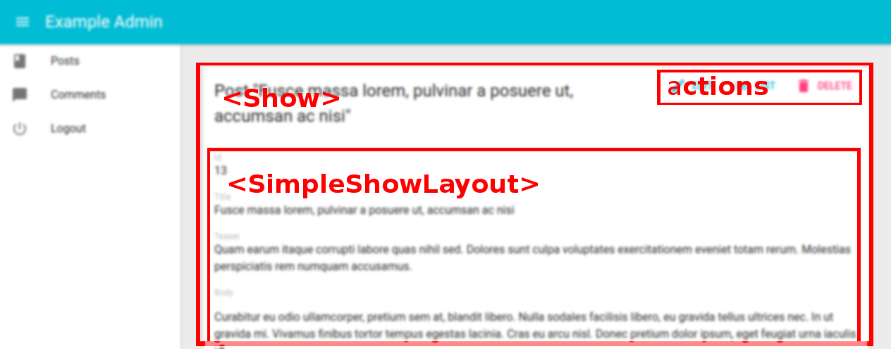
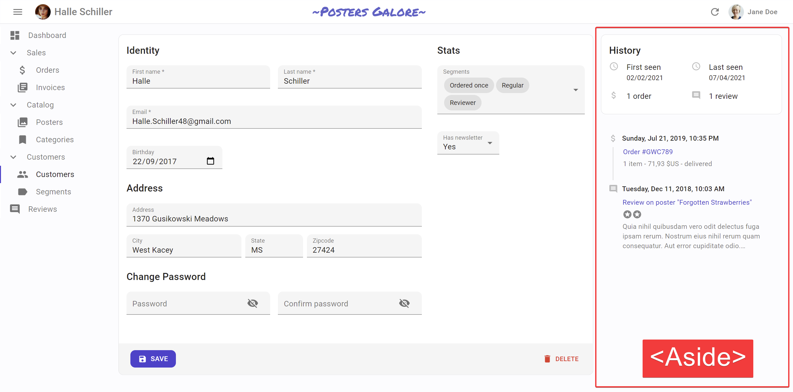

# The Show View

The Show view displays a record fetched from the API in a read-only fashion. It delegates the actual rendering of the record to a layout component - usually `<SimpleShowLayout>`. This layout component uses its children ([`<Fields>`](./Fields.md) components) to render each record field.



## The `<Show>` component

The `<Show>` component renders the page title and actions, and fetches the record from the REST API. It is not responsible for rendering the actual record - that's the job of its child component (usually `<SimpleShowLayout>`), to which they pass the `record` as prop.

Here are all the props accepted by the `<Show>` component:

* [`title`](#page-title)
* [`actions`](#actions)
* [`aside`](#aside-component)
* [`component`](#component)

### CSS API

The `<Show>` component accepts the usual `className` prop but you can override many class names injected to the inner components by React-admin thanks to the `classes` property (as most Material UI components, see their [documentation about it](https://material-ui.com/customization/components/#overriding-styles-with-classes)). This property accepts the following keys:

| Rule name   | Description                                                                                |
| ----------- | ------------------------------------------------------------------------------------------ |
| `root`      | Alternative to using `className`. Applied to the root element                              |
| `main`      | Applied to the main container                                                              |
| `noActions` | Applied to the main container when `actions` prop is `false`                               |
| `card`      | Applied to the child component inside the main container (Material UI's `Card` by default) |

To override the style of all instances of `<Show>` using the [material-ui style overrides](https://material-ui.com/customization/globals/#css), use the `RaShow` key.

Here is the minimal code necessary to display a view to show a post:


```jsx
// in src/App.js
import * as React from "react";
import { Admin, Resource } from 'react-admin';
import jsonServerProvider from 'ra-data-json-server';

import { PostCreate, PostEdit, PostShow } from './posts';

const App = () => (
    <Admin dataProvider={jsonServerProvider('https://jsonplaceholder.typicode.com')}>
        <Resource name="posts" show={PostShow} create={PostCreate} edit={PostEdit} />
    </Admin>
);

export default App;

// in src/posts.js
import * as React from "react";
import { Show, SimpleShowLayout, TextField, DateField, RichTextField } from 'react-admin';

export const PostShow = (props) => (
    <Show {...props}>
        <SimpleShowLayout>
            <TextField source="title" />
            <TextField source="teaser" />
            <RichTextField source="body" />
            <DateField label="Publication date" source="created_at" />
        </SimpleShowLayout>
    </Show>
);
```


That's enough to display the post show view:


### Page Title

By default, the title for the Show view is "[resource_name] #[record_id]".

You can customize this title by specifying a custom `title` prop:

```jsx
export const PostShow = (props) => (
    <Show title="Post view" {...props}>
        ...
    </Show>
);
```

More interestingly, you can pass a component as `title`. React-admin clones this component and, in the `<ShowView>`, injects the current `record`. This allows to customize the title according to the current record:

```jsx
const PostTitle = ({ record }) => {
    return <span>Post {record ? `"${record.title}"` : ''}</span>;
};
export const PostShow = (props) => (
    <Show title={<PostTitle />} {...props}>
        ...
    </Show>
);
```

### Actions

You can replace the list of default actions by your own component using the `actions` prop:

```jsx
import Button from '@material-ui/core/Button';
import { EditButton, TopToolbar } from 'react-admin';

const PostShowActions = ({ basePath, data, resource }) => (
    <TopToolbar>
        <EditButton basePath={basePath} record={data} />
        {/* Add your custom actions */}
        <Button color="primary" onClick={customAction}>Custom Action</Button>
    </TopToolbar>
);

export const PostShow = (props) => (
    <Show actions={<PostShowActions />} {...props}>
        ...
    </Show>
);
```

### Aside component



You may want to display additional information on the side of the resource detail. Use the `aside` prop for that, passing the element of your choice:


```jsx
const Aside = () => (
    <div style={{ width: 200, margin: '1em' }}>
        <Typography variant="h6">Post details</Typography>
        <Typography variant="body2">
            Posts will only be published once an editor approves them
        </Typography>
    </div>
);

const PostShow = props => (
    <Show aside={<Aside />} {...props}>
        ...
    </Show>
);
```


You can use the `useRecordContext` hook to display non-editable details about the current record in the aside component: 


```jsx
const Aside = () => {
    const record = useRecordContext();
    return (
        <div style={{ width: 200, margin: '1em' }}>
            <Typography variant="h6">Post details</Typography>
            {record && (
                <Typography variant="body2">
                    Creation date: {record.createdAt}
                </Typography>
            )}
        </div>
    );
}
```


**Tip**: Always test the `record` is defined before using it, as react-admin starts rendering the UI before the API call is over.

### Component

By default, the Show view renders the main content area inside a material-ui `<Card>` element. The actual layout of the area depends on the `ShowLayout` component you're using (`<SimpleShowLayout>`, `<TabbedShowLayout>`, or a custom layout component).

Some layouts also use `Card`, in which case the user ends up seeing a card inside a card, which is bad UI. To avoid that, you can override the main area container by passing a `component` prop:

```jsx
// use a div as root component
const PostShow = props => (
    <Show component="div" {...props}>
        ...
    </Show>
);

// use a custom component as root component 
const PostShow = props => (
    <Show component={MyComponent} {...props}>
        ...
    </Show>
);
```

The default value for the `component` prop is `Card`.

## The `<ShowGuesser>` component

Instead of a custom `Show`, you can use the `ShowGuesser` to determine which fields to use based on the data returned by the API.

```jsx
// in src/App.js
import * as React from "react";
import { Admin, Resource, ShowGuesser } from 'react-admin';
import jsonServerProvider from 'ra-data-json-server';

const App = () => (
    <Admin dataProvider={jsonServerProvider('https://jsonplaceholder.typicode.com')}>
        <Resource name="posts" show={ShowGuesser} />
    </Admin>
);
```

Just like `Show`, `ShowGuesser` fetches the data. It then analyzes the response, and guesses the fields it should use to display a basic page with the data. It also dumps the components it has guessed in the console, where you can copy it into your own code. Use this feature to quickly bootstrap a `Show` on top of an existing API, without adding the inputs one by one.


React-admin provides guessers for the `List` view (`ListGuesser`), the `Edit` view (`EditGuesser`), and the `Show` view (`ShowGuesser`).

**Tip**: Do not use the guessers in production. They are slower than manually-defined components, because they have to infer types based on the content. Besides, the guesses are not always perfect.

## `useShowController`

The `<Show>` component takes care of two things:

1. (the "controller") Fetching data based on the URL and transforming it
2. (the "view") Rendering the page title, the actions, the content and aside areas 

In some cases, you may want to customize the view entirely (i.e. keep the code for step 1, and provide your own code for step 2). For these cases, react-admin provides a hook called `useShowController()`, which contains just the controller part of the `<Show>` component.

This hook takes one object as input (the props passed to a `<Show>` component) and returns the fetched data for the Show view. You can use it to create your own custom Show view, like this one:

```jsx
import { useShowController, SimpleShowLayout } from 'react-admin';

const MyShow = props => {
    const {
        basePath, // deduced from the location, useful for action buttons
        defaultTitle, // the translated title based on the resource, e.g. 'Post #123'
        loaded, // boolean that is false until the record is available
        loading, // boolean that is true on mount, and false once the record was fetched
        record, // record fetched via dataProvider.getOne() based on the id from the location
        resource, // the resource name, deduced from the location. e.g. 'posts'
        version, // integer used by the refresh feature
    } = useShowController(props);
    return (
        <div>
            <h1>{defaultTitle}</h1>
            {cloneElement(props.children, {
                basePath,
                record,
                resource,
                version,
            })}
        </div>
    );
}

const PostShow = props => (
    <MyShow {...props}>
        <SimpleShowLayout>
            ...
        </SimpleShowLayout>
    </MyShow>
)
```

This custom Show view has no action buttons or aside component - it's up to you to add them in pure React.

**Tip**: You don't have to clone the child element. If you can't reuse an existing form component like `<SimpleShowLayout>`, feel free to write the form code inside your custom `MyShow` component. 

## The `<SimpleShowLayout>` component

The `<SimpleShowLayout>` component receives the `record` as prop from its parent component. It is responsible for rendering the actual view.

The `<SimpleShowLayout>` renders its child components line by line (within `<div>` components) inside a material-ui `<CardContent/>`.

```jsx
export const PostShow = (props) => (
    <Show {...props}>
        <SimpleShowLayout>
            <TextField source="title" />
            <RichTextField source="body" />
            <NumberField source="nb_views" />
        </SimpleShowLayout>
    </Show>
);
```

It accepts a `className` prop to let you override the style of the `<CardContent/>`.

## The `<TabbedShowLayout>` component

Just like `<SimpleShowLayout>`, `<TabbedShowLayout>` receives the `record` prop and renders the actual view. However, the `<TabbedShowLayout>` component renders fields grouped by tab. The tabs are set by using `<Tab>` components, which expect a `label` and an optional `icon` prop. Switching tabs will update the current url. By default, it uses the tabs indexes and the first tab will be displayed at the root url. You can customize the path by providing a `path` prop to each `Tab` component. If you'd like the first one to act as an index page, just omit the `path` prop.



```jsx
import { TabbedShowLayout, Tab } from 'react-admin'

export const PostShow = (props) => (
    <Show {...props}>
        <TabbedShowLayout>
            <Tab label="summary">
                <TextField label="Id" source="id" />
                <TextField source="title" />
                <TextField source="teaser" />
            </Tab>
            <Tab label="body" path="body">
                <RichTextField source="body" addLabel={false} />
            </Tab>
            <Tab label="Miscellaneous" path="miscellaneous">
                <TextField label="Password (if protected post)" source="password" type="password" />
                <DateField label="Publication date" source="published_at" />
                <NumberField source="average_note" />
                <BooleanField label="Allow comments?" source="commentable" defaultValue />
                <TextField label="Nb views" source="views" />
            </Tab>
            <Tab label="comments" path="comments">
                <ReferenceManyField reference="comments" target="post_id" addLabel={false}>
                    <Datagrid>
                        <TextField source="body" />
                        <DateField source="created_at" />
                        <EditButton />
                    </Datagrid>
                </ReferenceManyField>
            </Tab>
        </TabbedShowLayout>
    </Show>
);
```


To style the tabs, the `<Tab>` component accepts two props:

- `className` is passed to the tab *header*
- `contentClassName` is passed to the tab *content*

You can also opt out the location synchronization by passing `false` to the `syncWithLocation` prop of the `<TabbedShowLayout>` component. This allows e.g. to have several `<TabbedShowLayout>` components in a page.


```jsx
import { TabbedShowLayout, Tab } from 'react-admin'

export const PostShow = (props) => (
    <Show {...props}>
        <TabbedShowLayout syncWithLocation={false}>
            <Tab label="summary">
                <TextField label="Id" source="id" />
                <TextField source="title" />
                <TextField source="teaser" />
            </Tab>
            <Tab label="body" path="body">
                <RichTextField source="body" addLabel={false} />
            </Tab>
            <Tab label="Miscellaneous" path="miscellaneous">
                <TextField label="Password (if protected post)" source="password" type="password" />
                <DateField label="Publication date" source="published_at" />
                <NumberField source="average_note" />
                <BooleanField label="Allow comments?" source="commentable" defaultValue />
                <TextField label="Nb views" source="views" />
            </Tab>
            <Tab label="comments" path="comments">
                <ReferenceManyField reference="comments" target="post_id" addLabel={false}>
                    <Datagrid>
                        <TextField source="body" />
                        <DateField source="created_at" />
                        <EditButton />
                    </Datagrid>
                </ReferenceManyField>
            </Tab>
        </TabbedShowLayout>
    </Show>
);
```

**Tip**: When `syncWithLocation` is `false`, the `path` prop of the `<Tab>` components is ignored.
### Tabs element

By default, `<TabbedShowLayout>` renders its tabs using `<TabbedShowLayoutTabs>`, an internal react-admin component. You can pass a custom component as the `tabs` prop to override that default. Also, props passed to `<TabbedShowLayoutTabs>` are passed to the material-ui's `<Tabs>` component inside `<TabbedShowLayoutTabs>`. That means you can create a custom `tabs` component without copying several components from the react-admin source.

For instance, to make use of scrollable `<Tabs>`, you can pass a `variant="scrollable"` prop to `<TabbedShowLayoutTabs>` and use it in the `tabs` prop from `<TabbedShowLayout>` as follows:

```jsx
import {
    Show,
    TabbedShowLayout,
    TabbedShowLayoutTabs,
} from 'react-admin';

const ScrollableTabbedShowLayout = props => (
    <Show {...props}>
        <TabbedShowLayout tabs={<TabbedShowLayoutTabs variant="scrollable" {...props} />}>
            ...
        </TabbedShowLayout>
    </Show>
);

export default ScrollableTabbedShowLayout;

```

## Third-Party Components

You can find components for react-admin in third-party repositories.

- [ra-compact-ui](https://github.com/ValentinnDimitroff/ra-compact-ui#layouts): plugin that allows to have custom styled show layouts.

## Displaying Fields depending on the user permissions

You might want to display some fields only to users with specific permissions. 

Before rendering the `Show` component, react-admin calls the `authProvider.getPermissions()` method, and passes the result to the component as the `permissions` prop. It's up to your `authProvider` to return whatever you need to check roles and permissions inside your component.

Here's an example inside a `Show` view with a `SimpleShowLayout` and a custom `actions` component:


```jsx
import TopToolbar from '@material-ui/core/TopToolbar';
import Button from '@material-ui/core/Button';
import { EditButton, DeleteButton } from 'react-admin';

const PostShowActions = ({ permissions, basePath, data, resource }) => (
    <TopToolbar>
        <EditButton basePath={basePath} record={data} />
        {permissions === 'admin' &&
            <DeleteButton basePath={basePath} record={data} resource={resource} />
        }
    </TopToolbar>
);

export const PostShow = ({ permissions, ...props }) => (
    <Show actions={<PostShowActions permissions={permissions} />} {...props}>
        <SimpleShowLayout>
            <TextField source="title" />
            <RichTextField source="body" />
            {permissions === 'admin' &&
                <NumberField source="nb_views" />
            }
        </SimpleShowLayout>
    </Show>
);
```


**Tip** Note how the `permissions` prop is passed down to the custom `actions` component.

This also works inside a `TabbedShowLayout`, and you can hide a `Tab` completely:


```jsx
export const UserShow = ({ permissions, ...props }) =>
    <Show {...props}>
        <TabbedShowLayout>
            <Tab label="user.form.summary">
                {permissions === 'admin' && <TextField source="id" />}
                <TextField source="name" />
            </Tab>
            {permissions === 'admin' &&
                <Tab label="user.form.security">
                    <TextField source="role" />
                </Tab>}
        </TabbedShowLayout>
    </Show>;
```

