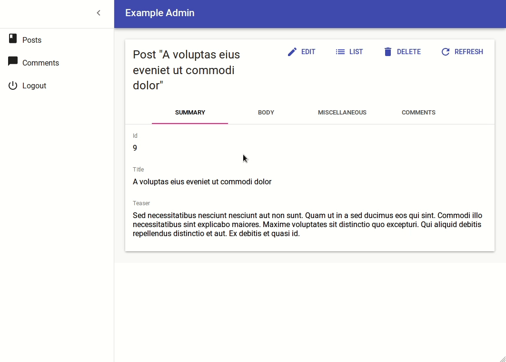

# The Show View

The Show view displays a record fetched from the API in a read-only fashion. It delegates the actual rendering of the record to a layout component - usually `<SimpleShowLayout>`. This layout component uses its children ([`<Fields>`](./Fields.md) components) to render each record field.


## The `<Show>` component

The `<Show>` component renders the page title and actions, and fetches the record from the REST API. It is not responsible for rendering the actual record - that's the job of its child component (usually `<SimpleShowLayout>`), to which they pass the `record` as prop.

Here are all the props accepted by the `<Show>` component:

* [`title`](#page-title)
* [`actions`](#actions)
* [`aside`](#aside-component)

Here is the minimal code necessary to display a view to show a post:


```jsx
// in src/App.js
import React from 'react';
import { Admin, Resource } from 'react-admin';
import jsonServerProvider from 'ra-data-json-server';

import { PostCreate, PostEdit, PostShow } from './posts';

const App = () => (
    <Admin dataProvider={jsonServerProvider('http://jsonplaceholder.typicode.com')}>
        <Resource name="posts" show={PostShow} create={PostCreate} edit={PostEdit} />
    </Admin>
);

export default App;

// in src/posts.js
import React from 'react';
import { Show, SimpleShowLayout, TextField, DateField, EditButton, RichTextField } from 'react-admin';

export const PostShow = (props) => (
    <Show {...props}>
        <SimpleShowLayout>
            <TextField source="title" />
            <TextField source="teaser" />
            <RichTextField source="body" />
            <DateField label="Publication date" source="created_at" />
        </SimpleShowLayout>
    </Show>
);
```


That's enough to display the post show view:


### Page Title

By default, the title for the Show view is "[resource_name] #[record_id]".

You can customize this title by specifying a custom `title` prop:

```jsx
export const PostShow = (props) => (
    <Show title="Post view" {...props}>
        ...
    </Show>
);
```

More interestingly, you can pass a component as `title`. React-admin clones this component and, in the `<ShowView>`, injects the current `record`. This allows to customize the title according to the current record:

```jsx
const PostTitle = ({ record }) => {
    return <span>Post {record ? `"${record.title}"` : ''}</span>;
};
export const PostShow = (props) => (
    <Show title={<PostTitle />} {...props}>
        ...
    </Show>
);
```

### Actions

You can replace the list of default actions by your own element using the `actions` prop:

```jsx
import CardActions from '@material-ui/core/CardActions';
import Button from '@material-ui/core/Button';
import { EditButton } from 'react-admin';

const cardActionStyle = {
    zIndex: 2,
    display: 'inline-block',
    float: 'right',
};

const PostShowActions = ({ basePath, data, resource }) => (
    <CardActions style={cardActionStyle}>
        <EditButton basePath={basePath} record={data} />
        {/* Add your custom actions */}
        <Button color="primary" onClick={customAction}>Custom Action</Button>
    </CardActions>
);

export const PostShow = (props) => (
    <Show actions={<PostShowActions />} {...props}>
        ...
    </Show>
);
```

### Aside component

You may want to display additional information on the side of the resource detail. Use the `aside` prop for that, passing the component of your choice:


```jsx
const Aside = () => (
    <div style={{ width: 200, margin: '1em' }}>
        <Typography variant="title">Post details</Typography>
        <Typography variant="body1">
            Posts will only be published one an editor approves them
        </Typography>
    </div>
);

const PostShow = props => (
    <Show aside={<Aside />} {...props}>
        ...
    </Show>
```


The `aside` component receives the same props as the `Show` child component: `basePath`, `record`, `resource`, and `version`. That means you can display secondary details of the current record in the aside component:


```jsx
const Aside = ({ record }) => (
    <div style={{ width: 200, margin: '1em' }}>
        <Typography variant="title">Post details</Typography>
        {record && (
            <Typography variant="body1">
                Creation date: {record.createdAt}
            </Typography>
        )}
    </div>
);
```


**Tip**: Always test that the `record` is defined before using it, as react-admin starts rendering the UI before the API call is over.

## The `<ShowGuesser>` component

Instead of a custom `Show`, you can use the `ShowGuesser` to determine which fields to use based on the data returned by the API.

```jsx
// in src/App.js
import React from 'react';
import { Admin, Resource, ShowGuesser } from 'react-admin';
import jsonServerProvider from 'ra-data-json-server';

const App = () => (
    <Admin dataProvider={jsonServerProvider('http://jsonplaceholder.typicode.com')}>
        <Resource name="posts" show={ShowGuesser} />
    </Admin>
);
```

Just like `Show`, `ShowGuesser` fetches the data. It then analyzes the response, and guesses the fields it should use to display a basic page with the data. It also dumps the components it has guessed in the console, where you can copy it into your own code. Use this feature to quickly bootstrap a `Show` on top of an existing API, without adding the inputs one by one.


React-admin provides guessers for the `List` view (`ListGuesser`), the `Edit` view (`EditGuesser`), and the `Show` view (`ShowGuesser`).

**Tip**: Do not use the guessers in production. They are slower than manually-defined components, because they have to infer types based on the content. Besides, the guesses are not always perfect.

## The `<SimpleShowLayout>` component

The `<SimpleShowLayout>` component receives the `record` as prop from its parent component. It is responsible for rendering the actual view.

The `<SimpleShowLayout>` renders its child components line by line (within `<div>` components) inside a material-ui `<CardContent/>`.

```jsx
export const PostShow = (props) => (
    <Show {...props}>
        <SimpleShowLayout>
            <TextField source="title" />
            <RichTextField source="body" />
            <NumberField source="nb_views" />
        </SimpleShowLayout>
    </Show>
);
```

It accepts a `className` prop to let you override the style of the `<CardContent/>`.

## The `<TabbedShowLayout>` component

Just like `<SimpleShowLayout>`, `<TabbedShowLayout>` receives the `record` prop and renders the actual view. However, the `<TabbedShowLayout>` component renders fields grouped by tab. The tabs are set by using `<Tab>` components, which expect a `label` and an optional `icon` prop. Switching tabs will update the current url. By default, it uses the tabs indexes and the first tab will be displayed at the root url. You can customize the path by providing a `path` prop to each `Tab` component. If you'd like the first one to act as an index page, just omit the `path` prop.




```jsx
import { TabbedShowLayout, Tab } from 'react-admin'

export const PostShow = (props) => (
    <Show {...props}>
        <TabbedShowLayout>
            <Tab label="summary">
                <TextField label="Id" source="id" />
                <TextField source="title" />
                <TextField source="teaser" />
            </Tab>
            <Tab label="body" path="body">
                <RichTextField source="body" addLabel={false} />
            </Tab>
            <Tab label="Miscellaneous" path="miscellaneous">
                <TextField label="Password (if protected post)" source="password" type="password" />
                <DateField label="Publication date" source="published_at" />
                <NumberField source="average_note" />
                <BooleanField label="Allow comments?" source="commentable" defaultValue />
                <TextField label="Nb views" source="views" />
            </Tab>
            <Tab label="comments" path="comments">
                <ReferenceManyField reference="comments" target="post_id" addLabel={false}>
                    <Datagrid>
                        <TextField source="body" />
                        <DateField source="created_at" />
                        <EditButton />
                    </Datagrid>
                </ReferenceManyField>
            </Tab>
        </TabbedShowLayout>
    </Show>
);
```



### Tabs element

By default, `<TabbedShowLayout>` renders its tabs using `<TabbedShowLayoutTabs>`, an internal react-admin component. You can pass a custom component as the `tabs` prop to override that default. Also, props passed to `<TabbedShowLayoutTabs>` are passed to the material-ui's `<Tabs>` component inside `<TabbedShowLayoutTabs>`. That means you can create a custom `tabs` component without copying several components from the react-admin source.

For instance, to make use of scrollable `<Tabs>`, you can pass a scrollable props to `<TabbedShowLayoutTabs>` and use it in the `tabs` prop from `<TabbedShowLayout>` as follows:

```jsx
import React from 'react';
import {
    Show,
    Tab,
    TabbedShowLayout,
    TabbedShowLayoutTabs,
} from 'react-admin';

const ScrollableTabbedShowLayout = props => (
    <Show{...props}>
        <TabbedShowLayout tabs={<TabbedShowLayoutTabs scrollable={true}/>}>
            <Tab label="Tab Component 1">
                ...
            </Tab>
            <Tab label="Tab Component 2">
                ...
            </Tab>
            <Tab label="Tab Component 3">
                ...
            </Tab>
            <Tab label="Tab Component 4">
                ...
            </Tab>
            ...
        </TabbedShowLayout>
    </Show>
);

export default ScrollableTabbedShowLayout;

```

## Displaying Fields depending on the user permissions

You might want to display some fields only to users with specific permissions. Those permissions are retrieved for each route and will provided to your component as a `permissions` prop.

Each route will call the `authProvider` with the `AUTH_GET_PERMISSIONS` type and some parameters including the current location and route parameters. It's up to you to return whatever you need to check inside your component such as the user's role, etc.

Here's an example inside a `Show` view with a `SimpleShowLayout` and a custom `actions` component:


```jsx
import CardActions from '@material-ui/core/CardActions';
import Button from '@material-ui/core/Button';
import { EditButton, DeleteButton } from 'react-admin';

const cardActionStyle = {
    zIndex: 2,
    display: 'inline-block',
    float: 'right',
};

const PostShowActions = ({ permissions, basePath, data, resource }) => (
    <CardActions style={cardActionStyle}>
        <EditButton basePath={basePath} record={data} />
        {permissions === 'admin' &&
            <DeleteButton basePath={basePath} record={data} resource={resource} />
        }
    </CardActions>
);

export const PostShow = ({ permissions, ...props }) => (
    <Show actions={<PostShowActions permissions={permissions} />} {...props}>
        <SimpleShowLayout>
            <TextField source="title" />
            <RichTextField source="body" />
            {permissions === 'admin' &&
                <NumberField source="nb_views" />
            }
        </SimpleShowLayout>
    </Show>
);
```


**Tip** Note how the `permissions` prop is passed down to the custom `actions` component.

This also works inside a `TabbedShowLayout`, and you can hide a `Tab` completely:


```jsx
export const UserShow = ({ permissions, ...props }) =>
    <Show {...props}>
        <TabbedShowLayout>
            <Tab label="user.form.summary">
                {permissions === 'admin' && <TextField source="id" />}
                <TextField source="name" />
            </Tab>
            {permissions === 'admin' &&
                <Tab label="user.form.security">
                    <TextField source="role" />
                </Tab>}
        </TabbedShowLayout>
    </Show>;
```

