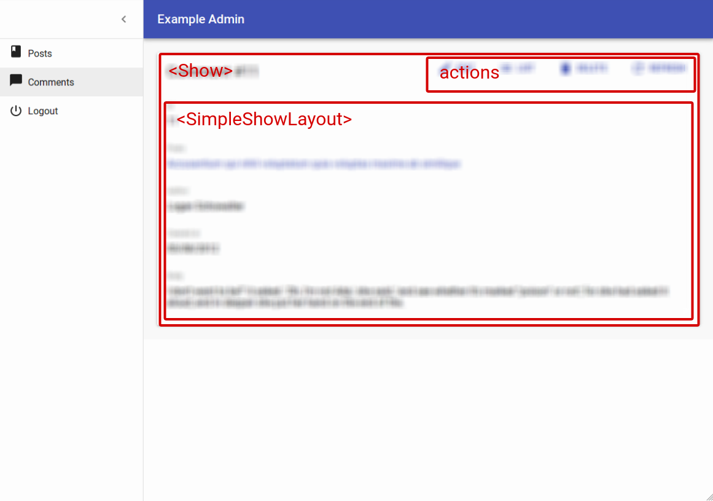

# The Show View

The Show view displays a record fetched from the API in a readonly fashion. It delegates the actual rendering of the record to a layout component - usually `<SimpleShowLayout>`. This layout component uses its children ([`<Fields>`](./Fields.html) components) to render each record field.



## The `<Show>` component

The `<Show>` component renders the page title and actions, and fetch the record from the REST API. It is not responsible for rendering the actual record - that's the job of its child component (usually `<SimpleShowLayout>`), to which they pass the `record` as prop.

Here are all the props accepted by the `<Show>` component:

* [`title`](#page-title)
* [`actions`](#actions)

Here is the minimal code necessary to display a view to show a post:


```jsx
// in src/App.js
import React from 'react';
import { jsonServerRestClient, Admin, Resource } from 'admin-on-rest';

import { PostCreate, PostEdit, PostShow } from './posts';

const App = () => (
    <Admin restClient={jsonServerRestClient('http://jsonplaceholder.typicode.com')}>
        <Resource name="posts" show={PostShow} create={PostCreate} edit={PostEdit} />
    </Admin>
);

export default App;

// in src/posts.js
import React from 'react';
import { Show, Create, Edit, SimpleForm, SimpleShowLayout, DisabledInput, TextInput, DateInput, LongTextInput, ReferenceManyField, Datagrid, TextField, DateField, EditButton, RichTextField } from 'admin-on-rest';
import RichTextInput from 'aor-rich-text-input';

export const PostShow = (props) => (
    <Show {...props}>
        <SimpleShowLayout>
            <TextField source="title" />
            <TextField source="teaser" />
            <RichTextField source="body" />
            <DateField label="Publication date" source="created_at" />
        </SimpleShowLayout>
    </Show>
);

export const PostCreate = (props) => (
    <Create {...props}>
        <SimpleForm>
            <TextInput source="title" />
            <TextInput source="teaser" options={{ multiLine: true }} />
            <RichTextInput source="body" />
            <DateInput label="Publication date" source="published_at" defaultValue={new Date()} />
        </SimpleForm>
    </Create>
);

export const PostEdit = (props) => (
    <Edit title={<PostTitle />} {...props}>
        <SimpleForm>
            <DisabledInput label="Id" source="id" />
            <TextInput source="title" validate={required} />
            <LongTextInput source="teaser" validate={required} />
            <RichTextInput source="body" validate={required} />
            <DateInput label="Publication date" source="published_at" />
            <ReferenceManyField label="Comments" reference="comments" target="post_id">
                <Datagrid>
                    <TextField source="body" />
                    <DateField source="created_at" />
                    <EditButton />
                </Datagrid>
            </ReferenceManyField>
        </SimpleForm>
    </Edit>
);
```


That's enough to display the post show view:


### Page Title

By default, the title for the Show view is "[resource_name] #[record_id]".

You can customize this title by specifying a custom `title` prop:

```jsx
export const PostShow = (props) => (
    <Show title="Post view" {...props}>
        ...
    </Show>
);
```

More interestingly, you can pass a component as `title`. Admin-on-rest clones this component and, in the `<ShowView>`, injects the current `record`. This allows to customize the title according to the current record:

```jsx
const PostTitle = ({ record }) => {
    return <span>Post {record ? `"${record.title}"` : ''}</span>;
};
export const PostShow = (props) => (
    <Show title={<PostTitle />} {...props}>
        ...
    </Show>
);
```

### Actions

You can replace the list of default actions by your own element using the `actions` prop:

```jsx
import { CardActions } from 'material-ui/Card';
import FlatButton from 'material-ui/FlatButton';
import NavigationRefresh from 'material-ui/svg-icons/navigation/refresh';
import { ListButton, EditButton, DeleteButton } from 'admin-on-rest';

const cardActionStyle = {
    zIndex: 2,
    display: 'inline-block',
    float: 'right',
};

const PostShowActions = ({ basePath, data, refresh }) => (
    <CardActions style={cardActionStyle}>
        <EditButton basePath={basePath} record={data} />
        <ListButton basePath={basePath} />
        <DeleteButton basePath={basePath} record={data} />
        <FlatButton primary label="Refresh" onClick={refresh} icon={<NavigationRefresh />} />
        {/* Add your custom actions */}
        <FlatButton primary label="Custom Action" onClick={customAction} />
    </CardActions>
);

export const PostShow = (props) => (
    <Show actions={<PostShowActions />} {...props}>
        ...
    </Show>
);
```

## The `<SimpleShowLayout>` component

The `<SimpleShowLayout>` component receives the `record` as prop from its parent component. It is responsible for rendering the actual view.

The `<SimpleShowLayout>` renders its child components line by line (within `<div>` components).

```jsx
export const PostShow = (props) => (
    <Show {...props}>
        <SimpleShowLayout>
            <TextField source="title" />
            <RichTextField source="body" />
            <NumberField source="nb_views" />
        </SimpleShowLayout>
    </Show>
);
```
