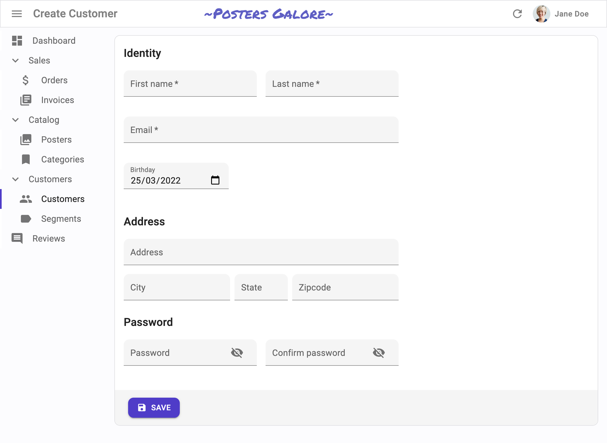

# `<SimpleForm>`

The `<SimpleForm>` creates a `<form>` to edit a record, and renders its children (usually Input components) in a simple layout, one child per row.


## Usage

`<SimpleForm>` reads the `record` from the `RecordContext`, uses it to initialize the defaultValues of a `<Form>`, renders its children in a MUI `<Stack>`, and renders a toolbar with a `<SaveButton>` that calls the `save` callback prepared by the edit or the create controller when pressed. 

`<SimpleForm>` is often used as child of `<Create>` or `<Edit>`. It accepts Input and Field components as children. It relies on [react-hook-form](https://react-hook-form.com/) for form handling. It requires no prop by default.

```jsx
import { Create, SimpleForm, TextInput, RichTextInput, NumberInput } from 'react-admin';

export const PostCreate = () => (
    <Create>
        <SimpleForm>
            <TextInput source="title" />
            <RichTextInput source="body" />
            <NumberInput source="nb_views" />
        </SimpleForm>
    </Create>
);
```

`<SimpleForm>` calls react-hook-form's `useForm` hook, and places the result in a `FormProvider` component. This means you can take advantage of the [`useFormContext`](https://react-hook-form.com/api/useformcontext) and [`useFormState`](https://react-hook-form.com/api/useformstate) hooks to access the form state.

Here are all the props you can set on the `<SimpleForm>` component:

* [`component`](#component)
* [`defaultValues`](#defaultvalues)
* [`id`](#id)
* [`noValidate`](#novalidate)
* [`onSubmit`](#onsubmit)
* [`sx`](#sx-css-api)
* [`toolbar`](#toolbar)
* [`validate`](#validate)
* [`warnWhenUnsavedChanges`](#warnwhenunsavedchanges)

Additional props are passed to [the `useForm` hook](https://react-hook-form.com/api/useform).

## `component`

`<SimpleForm>` renders a MUI `<CardContent>` by default. You replace it by any component you want as wrapper, just pass it as the `component` prop.

```jsx
const PostCreate = () => (
    <Create>
        <SimpleForm component={MyWrapper}>
            <TextInput source="title" />
            <RichTextInput source="body" />
            <NumberInput source="nb_views" />
        </SimpleForm>
    </Create>
);
```

## `defaultValues`

The value of the form `defaultValues` prop is an object, or a function returning an object, specifying default values for the created record. For instance:

```jsx
const postDefaultValue = () => ({ id: uuid(), created_at: new Date(), nb_views: 0 });

export const PostCreate = () => (
    <Create>
        <SimpleForm defaultValues={postDefaultValue}>
            <TextInput source="title" />
            <RichTextInput source="body" />
            <NumberInput source="nb_views" />
        </SimpleForm>
    </Create>
);
```

**Tip**: You can include properties in the form `defaultValues` that are not listed as input components, like the `created_at` property in the previous example.

**Tip**: React-admin also allows to define default values at the input level. See the [Setting default Values](./EditTutorial.md#setting-default-values) section.

## `id`

Normally, a submit button only works when placed inside a `<form>` tag. However, you can place a submit button outside of the form if the submit button `form_id` matches the form `id`.

Set this form `id` via the `id` prop.

```jsx
export const PostCreate = () => (
    <Create>
        <SimpleForm toolbar={false} id="post_create_form">
            <TextInput source="title" />
            <RichTextInput source="body" />
            <NumberInput source="nb_views" />
        </SimpleForm>
        <SaveButton formId="post_create_form" />
    </Create>
);
```

## `noValidate`

The `<form novalidate>` attribute prevents the browser from validating the form. This is useful if you don't want to use the browser's default validation, or if you want to customize the error messages. To set this attribute on the underlying `<form>` tag, set the `noValidate` prop to `true`.

```jsx
const PostCreate = () => (
    <Create>
        <SimpleForm noValidate>
            <TextInput source="title" />
            <RichTextInput source="body" />
            <NumberInput source="nb_views" />
        </SimpleForm>
    </Create>
);
```

## `onSubmit`

By default, the `<SimpleForm>` calls the `save` callback passed to it by the edit or create controller, via the `SaveContext`. You can override this behavior by setting a callback as the `onSubmit` prop manually.

```jsx
export const PostCreate = () => {
    const { id } = useParams();
    const [create] = useCreate();
    const postSave = (data) => {
        create('posts', { id, data });
    };
    return (
        <Create>
            <SimpleForm onSubmit={postSave}>
                <TextInput source="title" />
                <RichTextInput source="body" />
                <NumberInput source="nb_views" />
            </SimpleForm>
        </Create>
    );
};
```

## `sx`: CSS API

Pass an `sx` prop to customize the style of the main component and the underlying elements.

The most common usage is to limit the width of the form, to avoid long inputs on large screens:


```jsx
export const PostCreate = () => (
    <Create>
        <SimpleForm sx={{ maxWidth: 600 }}>
            <TextInput source="title" />
            <RichTextInput source="body" />
            <NumberInput source="nb_views" />
        </SimpleForm>
    </Create>
);
```


## `toolbar`

By default, `<SimpleForm>` renders a toolbar at the bottom of the form, containing:

- a submit button on Creation pages,
- a submit button and a delete button on Edition pages. 

If you want to tweak the look and feel of that toolbar, add or remove buttons, pass your own toolbar component to the form using the `toolbar` prop.

```jsx
const PostCreate = () => (
    <Create>
        <SimpleForm toolbar={<MyToolbar />}>
            <TextInput source="title" />
            <RichTextInput source="body" />
            <NumberInput source="nb_views" />
        </SimpleForm>
    </Create>
);
```

**Tip**: Set the `toolbar` prop to `false` to hide the toolbar.

The most common use case is to display two submit buttons in the `<Create>` view:

- One that creates and redirects to the `<Show>` view of the new resource, and
- One that redirects to a blank `<Create>` view after creation (allowing bulk creation)


For that use case, use the `<SaveButton>` component with a custom `onSuccess` prop:


```jsx
import * as React from "react";
import { Create, SimpleForm, SaveButton, Toolbar, useRedirect, useNotify } from 'react-admin';

const PostCreateToolbar = () => {
    const redirect = useRedirect();
    const notify = useNotify();
    return (
        <Toolbar>
            <SaveButton
                label="post.action.save_and_show"
            />
            <SaveButton
                label="post.action.save_and_add"
                mutationOptions={{
                    onSuccess: data => {
                        notify('ra.notification.created', {
                            type: 'info',
                            messageArgs: { smart_count: 1 },
                        });
                        redirect(false);
                    }}
                }
                type="button"
                variant="text"
            />
        </Toolbar>
    );
};

export const PostCreate = () => (
    <Create redirect="show">
        <SimpleForm toolbar={<PostCreateToolbar />}>
            ...
        </SimpleForm>
    </Create>
);
```


Another use case is to remove the `<DeleteButton>` from the toolbar in an edit view. In that case, create a custom toolbar containing only the `<SaveButton>` as a child:

```jsx
import * as React from "react";
import { Edit, SimpleForm, SaveButton, Toolbar } from 'react-admin';

const PostEditToolbar = props => (
    <Toolbar {...props} >
        <SaveButton />
    </Toolbar>
);

export const PostEdit = () => (
    <Edit>
        <SimpleForm toolbar={<PostEditToolbar />}>
            // ...
        </SimpleForm>
    </Edit>
);
```

In the default `<Toolbar>`, the `<SaveButton>` is disabled when the form is `pristine`. You can bypass this behavior and always enable it without customizing the `<Toolbar>` thanks to the prop `alwaysEnableSaveButton`:

```jsx
import * as React from 'react';
import { Edit, SimpleForm, Toolbar } from 'react-admin';

export const PostEdit = () => (
    <Edit>
        <SimpleForm toolbar={<Toolbar alwaysEnableSaveButton />}>
            ...
        </SimpleForm>
    </Edit>
);
```

But if you want to customize the `<Toolbar>` (to remove the `<DeleteButton>` for example), you have to manage the _disabled_ behavior of the `<SaveButton>` by yourself:

```jsx
import * as React from "react";
import { Edit, SimpleForm, SaveButton, Toolbar } from 'react-admin';
import { useFormState } from 'react-hook-form';

const PostEditToolbar = props => {
    const { isDirty } = useFormState();

    return (
      <Toolbar {...props} >
          <SaveButton disabled={!isDirty}/>
      </Toolbar>
    );
};

export const PostEdit = () => (
  <Edit>
      <SimpleForm toolbar={<PostEditToolbar/>}>
          // ...
      </SimpleForm>
  </Edit>
);
```

## `validate`

The value of the form `validate` prop must be a function taking the record as input, and returning an object with error messages indexed by field. For instance:

```jsx
const validateUserCreation = (values) => {
    const errors = {};
    if (!values.firstName) {
        errors.firstName = 'The firstName is required';
    }
    if (!values.age) {
        // You can return translation keys
        errors.age = 'ra.validation.required';
    } else if (values.age < 18) {
        // Or an object if the translation messages need parameters
        errors.age = {
            message: 'ra.validation.minValue',
            args: { min: 18 }
        };
    }
    return errors
};

export const UserCreate = () => (
    <Create>
        <SimpleForm validate={validateUserCreation}>
            <TextInput label="First Name" source="firstName" />
            <TextInput label="Age" source="age" />
        </SimpleForm>
    </Create>
);
```

**Tip**: The `validate` function can return a promise for asynchronous validation. See [the Server-Side Validation section](./Validation.md#server-side-validation) in the Validation documentation.

**Tip**: React-admin also allows to define validation rules at the input level. See [the Validation chapter](./Validation.md#per-input-validation-built-in-field-validators) for details.

## `warnWhenUnsavedChanges`

React-admin keeps track of the form state, so it can detect when the user leaves an `Edit` or `Create` page with unsaved changes. To avoid data loss, you can use this ability to ask the user to confirm before leaving a page with unsaved changes. 


Warning about unsaved changes is an opt-in feature: you must set the `warnWhenUnsavedChanges` prop in the form component to enable it:

```jsx
export const TagEdit = () => (
    <Edit>
        <SimpleForm warnWhenUnsavedChanges>
            <TextInput source="id" />
            <TextInput source="name" />
            ...
        </SimpleForm>
    </Edit>
);
```

## Using Fields As Children

The basic usage of `<SimpleForm>` is to pass [Input components](./Inputs.md) as children. For non-editable fields, you can pass `disabled` inputs, or even [Field components](./Fields.md). But since `<Field>` components have no label by default, you'll have to wrap your inputs in a `<Labeled>` component in that case:

```jsx
import { Edit, SimpleForm, TextInput, Labeled, TextField } from 'react-admin';

const PostEdit = () => (
    <Edit>
        <SimpleForm>
            <TextInput source="id" />
            <Labeled label="Title">
                <TextField source="title" />
            </Labeled>
            <TextInput source="body" />
        </SimpleForm>
    </Edit>
);
```

## Complex Input Layout

`<SimpleForm>` can be used to render more than one input per row, and arrange inputs in a more user-friendly way.



By default, `<SimpleForm>` renders one child per row. But a given child can be a layout element (e.g. `<Grid>`, `<Stack>`, `<Box>`) and contain several input elements. This lets you build form layouts of any complexity:


```jsx
const UserCreate = () => (
    <Create>
        <SimpleForm sx={{ maxWidth: 500 }}>
            <Typography variant="h6" gutterBottom>
                Identity
            </Typography>
            <Box display={{ xs: 'block', sm: 'flex', width: '100%' }}>
                <Box flex={1} mr={{ xs: 0, sm: '0.5em' }}>
                    <TextInput source="first_name" isRequired fullWidth />
                </Box>
                <Box flex={1} ml={{ xs: 0, sm: '0.5em' }}>
                    <TextInput source="last_name" isRequired fullWidth />
                </Box>
            </Box>
            <TextInput type="email" source="email" isRequired fullWidth />
            <DateInput source="birthday" />
            <Separator />
            
            <Typography variant="h6" gutterBottom>
                Address
            </Typography>
            <TextInput
                source="address"
                multiline
                fullWidth
                helperText={false}
            />
            <Box display={{ xs: 'block', sm: 'flex' }}>
                <Box flex={2} mr={{ xs: 0, sm: '0.5em' }}>
                    <TextInput source="city" fullWidth helperText={false} />
                </Box>
                <Box flex={1} mr={{ xs: 0, sm: '0.5em' }}>
                    <TextInput
                        source="stateAbbr"
                        fullWidth
                        helperText={false}
                    />
                </Box>
                <Box flex={2}>
                    <TextInput source="zipcode" fullWidth helperText={false} />
                </Box>
            </Box>
            <Separator />
            
            <Typography variant="h6" gutterBottom>
                Password
            </Typography>
            <Box display={{ xs: 'block', sm: 'flex' }}>
                <Box flex={1} mr={{ xs: 0, sm: '0.5em' }}>
                    <PasswordInput source="password" fullWidth />
                </Box>
                <Box flex={1} ml={{ xs: 0, sm: '0.5em' }}>
                    <PasswordInput source="confirm_password" fullWidth />
                </Box>
            </Box>
        </SimpleForm>
    </Create>
);

const Separator = () => <Box pt="1em" />;
```


