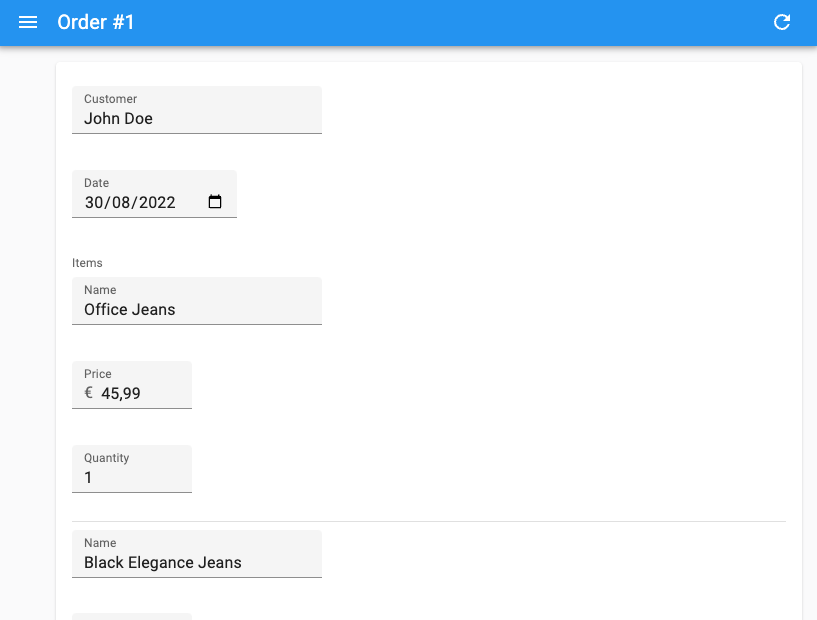
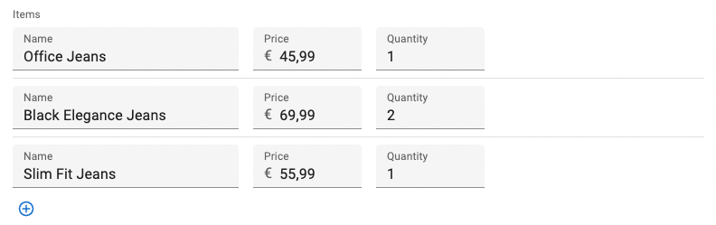
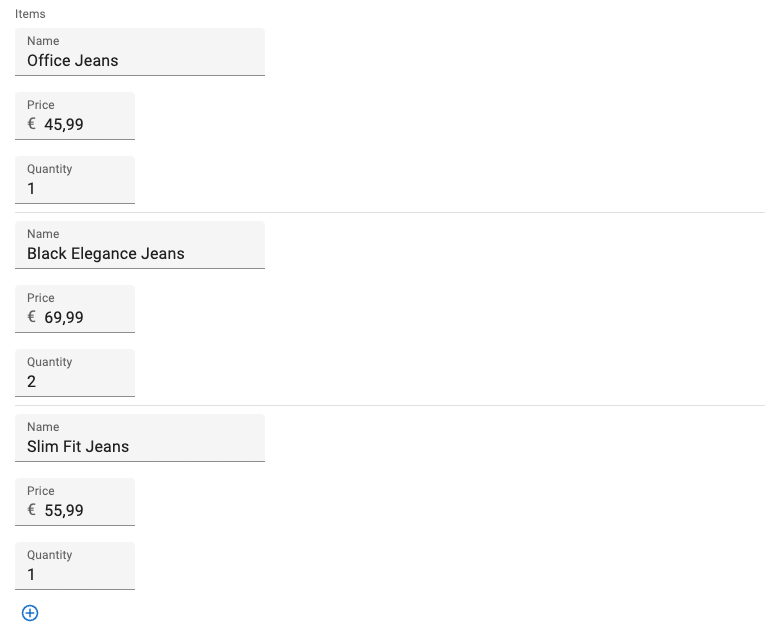

# `<SimpleFormIterator>`

This component provides a UI for editing arrays of objects, one row per object.

<video controls autoplay playsinline muted loop>
  <source src="./img/array-input.webm" type="video/webm"/>
  <source src="./img/array-input.mp4" type="video/mp4"/>
  Your browser does not support the video tag.
</video>


`<SimpleFormIterator>` lets users edit, add, remove and reorder sub-records. It is designed to be used as a child of [`<ArrayInput>`](./ArrayInput.md) or [`<ReferenceManyInput>`](./ReferenceManyInput.md). You can also use it within an `ArrayInputContext` containing a *field array*, i.e. the value returned by [react-hook-form's `useFieldArray` hook](https://react-hook-form.com/docs/usefieldarray).

## Usage

`<SimpleFormIterator>` requires no prop by default. It expects an array of inputs as children. It renders these inputs once per row and takes care of setting a different source for each row. 

```jsx
import { 
    Edit,
    SimpleForm,
    TextInput,
    DateInput,
    ArrayInput,
    NumberInput,
    SimpleFormIterator
} from 'react-admin';

const OrderEdit = () => (
    <Edit>
        <SimpleForm>
            <TextInput source="customer" />
            <DateInput source="date" />
            <ArrayInput source="items">
                <SimpleFormIterator inline>
                    <TextInput source="name" helperText={false} />
                    <NumberInput source="price" helperText={false} />
                    <NumberInput source="quantity" helperText={false} />
                </SimpleFormIterator>
            </ArrayInput>
        </SimpleForm>
    </Edit>
);
```

In the example above, the inputs for each row appear inline, with no helper text. This dense layout is adapted to arrays with many items. If you need more room, omit the `inline` prop to use the default layout, where each input is displayed in a separate row.

```jsx
const OrderEdit = () => (
    <Edit>
        <SimpleForm>
            <TextInput source="customer" />
            <DateInput source="date" />
            <ArrayInput source="items">
                <SimpleFormIterator>
                    <TextInput source="name" />
                    <NumberInput source="price" />
                    <NumberInput source="quantity" />
                </SimpleFormIterator>
            </ArrayInput>
        </SimpleForm>
    </Edit>
);
```



## Props

| Prop     | Required | Type           | Default               | Description                         |
|----------|----------|----------------|-----------------------|-------------------------------------|
| `addButton` | Optional | `ReactElement` | - | Component to render for the add button |
| `children` | Optional | `ReactElement` | - | List of inputs to display for each row |
| `className` | Optional | `string` | - | Applied to the root element (`<ul>`) |
| `disableAdd` | Optional | `boolean` | `false` | When true, the user cannot add new rows |
| `disableClear` | Optional | `boolean` | `false` | When true, the user cannot clear the array |
| `disableRemove` | Optional | `boolean` | `false` | When true, the user cannot remove rows |
| `disableReordering` | Optional | `boolean` | `false` | When true, the user cannot reorder rows |
| `fullWidth` | Optional | `boolean` | `false` | Set to true to push the actions to the right |
| `getItemLabel` | Optional | `function` | `x => x` | Callback to render the label displayed in each row |
| `inline` | Optional | `boolean` | `false` | When true, inputs are put on the same line |
| `removeButton` | Optional | `ReactElement` | - | Component to render for the remove button |
| `reOrderButtons` | Optional | `ReactElement` | - | Component to render for the up / down button |
| `sx` | Optional | `SxProps` | - | Material UI shortcut for defining custom styles |

## `addButton`

This prop lets you pass a custom element to replace the default Add button. 

```jsx
<SimpleFormIterator addButton={<Button>Add</Button>}>
    <TextInput source="name" />
    <NumberInput source="price" />
    <NumberInput source="quantity" />
</SimpleFormIterator>
```

## `children`

A list of Input elements, that will be rendered on each row. 

```jsx
<SimpleFormIterator>
    <TextInput source="name" />
    <NumberInput source="price" />
    <NumberInput source="quantity" />
</SimpleFormIterator>
```

By default, `<SimpleFormIterator>` renders one input per line, but they can be displayed inline with the `inline` prop.

`<SimpleFormIterator>` also accepts `<FormDataConsumer>` as child. When used inside a form iterator, `<FormDataConsumer>` provides two additional properties to its children function:

- `scopedFormData`: an object containing the current values of the currently rendered item from the ArrayInput
- `getSource`: a function that translates the source into a valid one for the ArrayInput

And here is an example usage for `getSource` inside `<ArrayInput>`:

```jsx
import { FormDataConsumer } from 'react-admin';

const PostEdit = () => (
    <Edit>
        <SimpleForm>
            <ArrayInput source="authors">
                <SimpleFormIterator>
                    <TextInput source="name" />
                    <FormDataConsumer>
                        {({
                            formData, // The whole form data
                            scopedFormData, // The data for this item of the ArrayInput
                            getSource, // A function to get the valid source inside an ArrayInput
                            ...rest
                        }) =>
                            scopedFormData && scopedFormData.name ? (
                                <SelectInput
                                    source={getSource('role')} // Will translate to "authors[0].role"
                                    choices={[{ id: 1, name: 'Head Writer' }, { id: 2, name: 'Co-Writer' }]}
                                    {...rest}
                                />
                            ) : null
                        }
                    </FormDataConsumer>
                </SimpleFormIterator>
            </ArrayInput>
        </SimpleForm>
    </Edit>
);
```

**Tip:** TypeScript users will notice that `scopedFormData` and `getSource` are typed as optional parameters. This is because the `<FormDataConsumer>` component can be used outside of a `<SimpleFormIterator>` and in that case, these parameters will be `undefined`. If you are inside a `<SimpleFormIterator>`, you can safely assume that these parameters will be defined.

**Note**: `<SimpleFormIterator>` only accepts `Input` components as children. If you want to use some `Fields` instead, you have to use a `<FormDataConsumer>`, as follows:

```jsx
import { ArrayInput, SimpleFormIterator, DateInput, TextField, FormDataConsumer, Labeled } from 'react-admin';

<ArrayInput source="backlinks">
    <SimpleFormIterator disableRemove>
        <DateInput source="date" />
        <FormDataConsumer>
            {({ scopedFormData }) => (
                <Labeled label="Url">
                    <TextField source="url" record={scopedFormData} />
                </Labeled>
            )}
        </FormDataConsumer>
    </SimpleFormIterator>
</ArrayInput>
```

**Caution**: `<SimpleFormIterator>` **clones** its children several times, as it needs to override their actual source for each record. If you use a custom Input element, make sure they accept a custom `source` prop. 

## `className`

CSS classes passed to the root component. 

```jsx
<SimpleFormIterator className="dummy">
    <TextInput source="name" />
    <NumberInput source="price" />
    <NumberInput source="quantity" />
</SimpleFormIterator>
```

**Note**: To customize field styles, prefer [the `sx` prop](#sx).

## `disableAdd`

When true, the Add button isn't rendered, so users cannot add new rows.

```jsx
<SimpleFormIterator disableAdd>
    <TextInput source="name" />
    <NumberInput source="price" />
    <NumberInput source="quantity" />
</SimpleFormIterator>
```

## `disableClear`

When true, the array clear button isn't rendered, so the user cannot clear the array.

```jsx
<SimpleFormIterator disableClear>
    <TextInput source="name" />
    <NumberInput source="price" />
    <NumberInput source="quantity" />
</SimpleFormIterator>
```


## `disableRemove`

When true, the Remove buttons aren't rendered, so users cannot remove existing rows.

```jsx
<SimpleFormIterator disableRemove>
    <TextInput source="name" />
    <NumberInput source="price" />
    <NumberInput source="quantity" />
</SimpleFormIterator>
```

## `disableReordering`

When true, the up and down buttons aren't rendered, so the user cannot reorder rows.

```jsx
<SimpleFormIterator disableReordering>
    <TextInput source="name" />
    <NumberInput source="price" />
    <NumberInput source="quantity" />
</SimpleFormIterator>
``` 

## `fullWidth`

When true, the row actions appear at the end of the row.

```jsx
<SimpleFormIterator fullWidth>
    <TextInput source="name" />
    <NumberInput source="price" />
    <NumberInput source="quantity" />
</SimpleFormIterator>
```


This differs with the default behavior, where the row actions appear after the inputs.


## `getItemLabel`

`<SimpleFormIterator>` can add a label in front of each row, based on the row index. Set the `getItemLabel` prop with a callback to enable this feature.

```jsx
<SimpleFormIterator getItemLabel={index => `#${index + 1}`}>
    <TextInput source="name" />
    <NumberInput source="price" />
    <NumberInput source="quantity" />
</SimpleFormIterator>
```


## `inline`

When true, inputs are put on the same line. Use this option to make the lines more compact, especially when the children are narrow inputs. 

```jsx
<SimpleFormIterator inline>
    <TextInput source="name" />
    <NumberInput source="price" />
    <NumberInput source="quantity" />
</SimpleFormIterator>
```



Without this prop, `<SimpleFormIterator>` will render one input per line.

```jsx
<SimpleFormIterator>
    <TextInput source="name" />
    <NumberInput source="price" />
    <NumberInput source="quantity" />
</SimpleFormIterator>
```



## `removeButton`

This prop lets you pass a custom element to replace the default Remove button. 

```jsx
<SimpleFormIterator removeButton={<Button>Remove</Button>}>
    <TextInput source="name" />
    <NumberInput source="price" />
    <NumberInput source="quantity" />
</SimpleFormIterator>
```

## `reOrderButtons`

This prop lets you pass a custom element to replace the default Up and Down buttons. This custom element must use the `useSimpleFormIteratorItem` hook to access the current row index and reorder callback.

```jsx
const ReOrderButtons = () => {
    const { index, total, reOrder } = useSimpleFormIteratorItem();

    return (
        <>
            <IconButton
                size="small"
                onClick={() => reOrder(index - 1)}
                disabled={index <= 0}
            >
                <ArrowUpwardIcon />
            </IconButton>
            <IconButton
                size="small"
                onClick={() => reOrder(index + 1)}
                disabled={total == null || index >= total - 1}
            >
                <ArrowDownwardIcon />
            </IconButton>
        </>
    );
};

const OrderEdit = () => (
    <Edit>
        <SimpleForm>
            <TextInput source="customer" />
            <DateInput source="date" />
            <ArrayInput source="items">
                <SimpleFormIterator reOrderButtons={<ReOrderButtons />}>
                    <TextInput source="name" />
                    <NumberInput source="price" />
                    <NumberInput source="quantity" />
                </SimpleFormIterator>
            </ArrayInput>
        </SimpleForm>
    </Edit>
);
```

## `sx`

You can override the style of the root element (a `<div>` element) as well as those of the inner components thanks to the `sx` property (see [the `sx` documentation](./SX.md) for syntax and examples).

This property accepts the following subclasses:

| Rule name                | Description                                               |
|--------------------------|-----------------------------------------------------------|
| `RaSimpleFormIterator-action`         | Applied to the action zone on each row (the one containing the Remove button) |
| `RaSimpleFormIterator-add`            | Applied to the bottom line containing the Add button |
| `RaSimpleFormIterator-form`           | Applied to the subform on each row |
| `RaSimpleFormIterator-index`          | Applied to the row label when `getItemLabel` is set |
| `RaSimpleFormIterator-inline`         | Applied to rows when `inline` is true |
| `RaSimpleFormIterator-line`           | Applied to each row |
| `RaSimpleFormIterator-list`           | Applied to the `<ul>` element |
