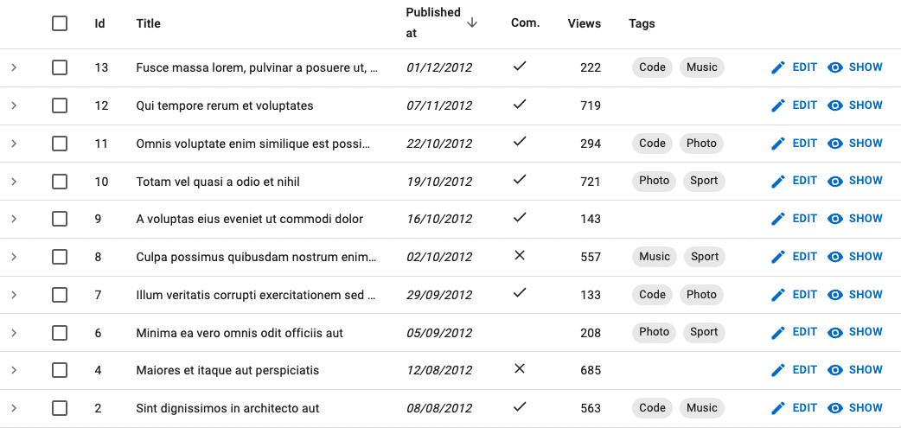

# `<SingleFieldList>`

Use `<SingleFieldList>` when you want to display only one property for each record in a list, for instance, to display the list of tag names for a post.


`<SingleFieldList>` is an **iterator** component: it gets `data` from the `ListContext`, and iterates over it to display each record. It creates a `<RecordContext>` for each record, and delegates the actual rendering to its child - usually a Field component. 

## Usage

Use `<SingleFieldList>` wherever there is a `ListContext`. It is especially useful as child of `<ReferenceManyField>` and `<ReferenceArrayField>` components. `<SingleFieldList>` expects a single `<Field>` as child.

```jsx
<SingleFieldList>
    <ChipField source="name" />
</SingleFieldList>
```

The following example shows how to use `<SingleFieldList>` to display a list of tags for each post in a Datagrid:

```jsx
import { 
    List,
    Datagrid,
    ReferenceArrayField,
    SingleFieldList,
    TextField,
    DateField,
    BooleanField,
    NumberField,
    ChipField
} from 'react-admin';

const PostList = () => (
    <List>
        <Datagrid>
            <TextField source="id" />
            <TextField source="title" />
            <DateField source="published_at" />
            <BooleanField source="commentable" />
            <NumberField source="views" />
            <ReferenceArrayField label="Tags" reference="tags" source="tags">
                <SingleFieldList>
                    <ChipField source="name" />
                </SingleFieldList>
            </ReferenceArrayField>
        </Datagrid>
    </List>
)
```



## Props

`<SingleFieldList>` accepts the following props:

| Prop        | Required | Type                      | Default | Description                                   |
| ----------- | -------- | ------------------------- | ------- | --------------------------------------------- |
| `linkType`  | Optional | `'edit' | 'show' | false` | `edit`  | The target of the link on each item           |
| `sx`        | Optional | `object`                  |         | The sx props of the Material UI Box component |

## `linkType`

The `<SingleFieldList>` items link to the edition page by default. You can set the `linkType` prop to `show` to link to the `<Show>` page instead.

```jsx
// Display all the tags for the current post
<ReferenceArrayField
    label="Tags"
    reference="tags"
    source="tags"
>
    <SingleFieldList linkType="show">
        <ChipField source="name" />
    </SingleFieldList>
</ReferenceArrayField>
```

`linkType` accepts the following values:

* `linkType="edit"`: links to the edit page. This is the default behavior.
* `linkType="show"`: links to the show page.
* `linkType={false}`: does not create any link.

## `sx`: CSS API

The `<SingleFieldList>` component accepts the usual `className` prop. You can also override the styles of the inner components thanks to the `sx` property. This property accepts the following subclasses:

| Rule name                   | Description             |
|-----------------------------|-------------------------|
| `& .RaSingleFieldList-link` | Applied to each link    |

**Tip**: You can override these classes for all `<SingleFieldList>` instances by overriding them in a Material UI theme, using the key "RaSingleFieldList".
