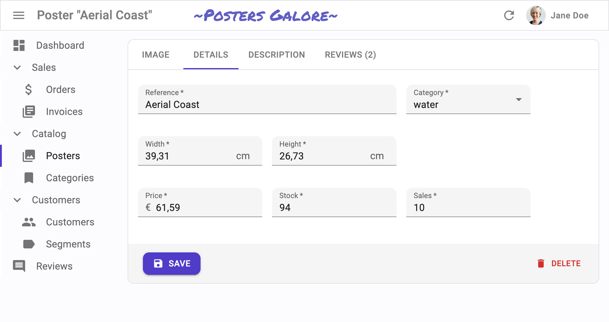
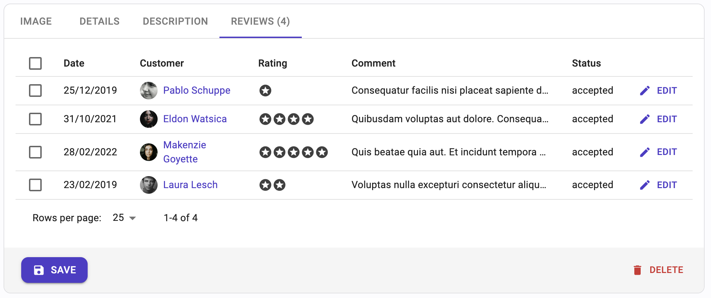

# `<TabbedForm>`

`<TabbedForm>` creates a `<form>` to edit a record, and renders inputs grouped by tab. The tabs are set by using `<FormTab>` components. It is useful for forms with a lot of inputs, to reduce the time taken to change a subset of the fields.


## Usage

`<TabbedForm>` reads the `record` from the `RecordContext`, uses it to initialize the defaultValues of a `<Form>`, renders its children in a MUI `<Stack>`, and renders a toolbar with a `<SaveButton>` that calls the `save` callback prepared by the edit or the create controller when pressed. 

`<TabbedForm>` is often used as child of `<Create>` or `<Edit>`. It accepts `<FormTab>` elements as children. It relies on [react-hook-form](https://react-hook-form.com/) for form handling. It requires no prop by default.


```jsx
import * as React from "react";
import {
    TabbedForm,
    FormTab,
    Edit,
    Datagrid,
    TextField,
    DateField,
    TextInput,
    ReferenceManyField,
    NumberInput,    
    DateInput,
    BooleanInput,
    EditButton
} from 'react-admin';

export const PostEdit = () => (
    <Edit>
        <TabbedForm>
            <FormTab label="summary">
                <TextInput disabled label="Id" source="id" />
                <TextInput source="title" validate={required()} />
                <TextInput multiline source="teaser" validate={required()} />
            </FormTab>
            <FormTab label="body">
                <RichTextInput source="body" validate={required()} label={false} />
            </FormTab>
            <FormTab label="Miscellaneous">
                <TextInput label="Password (if protected post)" source="password" type="password" />
                <DateInput label="Publication date" source="published_at" />
                <NumberInput source="average_note" validate={[ number(), minValue(0) ]} />
                <BooleanInput label="Allow comments?" source="commentable" defaultValue />
                <TextInput disabled label="Nb views" source="views" />
            </FormTab>
            <FormTab label="comments">
                <ReferenceManyField reference="comments" target="post_id" label={false}>
                    <Datagrid>
                        <TextField source="body" />
                        <DateField source="created_at" />
                        <EditButton />
                    </Datagrid>
                </ReferenceManyField>
            </FormTab>
        </TabbedForm>
    </Edit>
);
```


`<TabbedForm>` calls react-hook-form's `useForm` hook, and places the result in a `FormProvider` component. This means you can take advantage of the [`useFormContext`](https://react-hook-form.com/api/useformcontext) and [`useFormState`](https://react-hook-form.com/api/useformstate) hooks to access the form state.

React-admin highlights the tabs containing validation errors to help users locate incorrect input values. 

Here are all the props you can set on the `<TabbedForm>` component:

* [`component`](#component)
* [`defaultValues`](#defaultvalues)
* [`id`](#id)
* [`noValidate`](#novalidate)
* [`onSubmit`](#onsubmit)
* [`sx`](#sx-css-api)
* [`syncWithLocation`](#syncwithlocation)
* [`tabs`](#tabs)
* [`toolbar`](#toolbar)
* [`validate`](#validate)
* [`warnWhenUnsavedChanges`](#warnwhenunsavedchanges)

Additional props are passed to [the `useForm` hook](https://react-hook-form.com/api/useform).

## `component`

`<TabbedForm>` renders a MUI `<CardContent>` by default. You replace it by any component you want as wrapper, just pass it as the `component` prop.

```jsx
const PostCreate = () => (
    <Create>
        <TabbedForm component={MyWrapper}>
            ...
        </TabbedForm>
    </Create>
);
```

## `defaultValues`

The value of the form `defaultValues` prop is an object, or a function returning an object, specifying default values for the created record. For instance:

```jsx
const postDefaultValue = () => ({ id: uuid(), created_at: new Date(), nb_views: 0 });

export const PostCreate = () => (
    <Create>
        <TabbedForm defaultValues={postDefaultValue}>
            ...
        </TabbedForm>
    </Create>
);
```

**Tip**: You can include properties in the form `defaultValues` that are not listed as input components, like the `created_at` property in the previous example.

**Tip**: React-admin also allows to define default values at the input level. See the [Setting default Values](./EditTutorial.md#setting-default-values) section.

## `id`

Normally, a submit button only works when placed inside a `<form>` tag. However, you can place a submit button outside of the form if the submit button `form_id` matches the form `id`.

Set this form `id` via the `id` prop.

```jsx
export const PostCreate = () => (
    <Create>
        <TabbedForm toolbar={false} id="post_create_form">
            ...
        </TabbedForm>
        <SaveButton formId="post_create_form" />
    </Create>
);
```

## `noValidate`

The `<form novalidate>` attribute prevents the browser from validating the form. This is useful if you don't want to use the browser's default validation, or if you want to customize the error messages. To set this attribute on the underlying `<form>` tag, set the `noValidate` prop to `true`.

```jsx
const PostCreate = () => (
    <Create>
        <TabbedForm noValidate>
            ...
        </TabbedForm>
    </Create>
);
```

## `onSubmit`

By default, the `<TabbedForm>` calls the `save` callback passed to it by the edit or create controller, via the `SaveContext`. You can override this behavior by setting a callback as the `onSubmit` prop manually.

```jsx
export const PostCreate = () => {
    const { id } = useParams();
    const [create] = useCreate();
    const postSave = (data) => {
        create('posts', { id, data });
    };
    return (
        <Create>
            <TabbedForm onSubmit={postSave}>
                ...
            </TabbedForm>
        </Create>
    );
};
```

## `sx`: CSS API

Pass an `sx` prop to customize the style of the main component and the underlying elements.

The most common usage is to limit the width of the form, to avoid long inputs on large screens:


```jsx
export const PostCreate = () => (
    <Create>
        <TabbedForm sx={{ maxWidth: 600 }}>
            ...
        </TabbedForm>
    </Create>
);
```


## `syncWithLocation`

When the user clicks on a tab header, react-admin changes the URL to enable the back button.

However, this makes `<TabbedForm>` impossible to use in pages where the state is already synced with the location by another component (e.g. list filters, or another `<TabbedForm>`). To solve this, you can opt out the location synchronization by passing `false` to the `syncWithLocation` prop.


```jsx
export const PostEdit = () => (
    <Edit>
        <TabbedForm syncWithLocation={false}>
            <FormTab label="summary">
                <TextInput disabled label="Id" source="id" />
                <TextInput source="title" validate={required()} />
                <TextInput multiline source="teaser" validate={required()} />
            </FormTab>
            <FormTab label="body">
                <RichTextInput source="body" validate={required()} label={false} />
            </FormTab>
            <FormTab label="Miscellaneous">
                <TextInput label="Password (if protected post)" source="password" type="password" />
                <DateInput label="Publication date" source="published_at" />
                <NumberInput source="average_note" validate={[ number(), minValue(0) ]} />
                <BooleanInput label="Allow comments?" source="commentable" defaultValue />
                <TextInput disabled label="Nb views" source="views" />
            </FormTab>
            <FormTab label="comments">
                <ReferenceManyField reference="comments" target="post_id" label={false}>
                    <Datagrid>
                        <TextField source="body" />
                        <DateField source="created_at" />
                        <EditButton />
                    </Datagrid>
                </ReferenceManyField>
            </FormTab>
        </TabbedForm>
    </Edit>
);
```


**Tip**: When `syncWithLocation` is `false`, the `path` prop of the `<FormTab>` components is ignored.

## `tabs`

By default, `<TabbedForm>` uses `<TabbedFormTabs>`, an internal react-admin component, to renders the tab headers. You can pass a custom component as the `tabs` prop to tweak th UX of these headers. Besides, props from `<TabbedFormTabs>` are passed down to MUI's `<Tabs>` component.

The following example shows how to make use of scrollable `<Tabs>`. Pass `variant="scrollable"` and `scrollButtons="auto"` props to `<TabbedFormTabs>` and use it in the `tabs` prop from `<TabbedForm>`.

```jsx
import * as React from "react";
import {
    Edit,
    TabbedForm,
    TabbedFormTabs,
} from 'react-admin';

export const PostEdit = () => (
    <Edit>
        <TabbedForm tabs={<TabbedFormTabs variant="scrollable" scrollButtons="auto" />}>
            ...
        </TabbedForm>
    </Edit>
);
```

## `toolbar`

By default, `<TabbedForm>` renders a toolbar at the bottom of the form, containing:

- a submit button on Creation pages,
- a submit button and a delete button on Edition pages. 

If you want to tweak the look and feel of that toolbar, add or remove buttons, pass yout own toolbar component to the form using the `toolbar` prop.

```jsx
const PostCreate = () => (
    <Create>
        <TabbedForm toolbar={<MyToolbar />}>
            ...
        </TabbedForm>
    </Create>
);
```

**Tip**: Set the `toolbar` prop to `false` to hide the toolbar.

The most common use case is to display two submit buttons in the `<Create>` view:

- One that creates and redirects to the `<Show>` view of the new resource, and
- One that redirects to a blank `<Create>` view after creation (allowing bulk creation)

For that use case, use the `<SaveButton>` component with a custom `onSuccess` prop:


```jsx
import * as React from "react";
import { Create, TabbedForm, SaveButton, Toolbar, useRedirect } from 'react-admin';

const PostCreateToolbar = props => {
    const redirect = useRedirect();
    const notify = useNotify();
    return (
        <Toolbar {...props} >
            <SaveButton
                label="post.action.save_and_show"
            />
            <SaveButton
                label="post.action.save_and_add"
                mutationOptions={{
                    onSuccess: data => {
                        notify('ra.notification.created', {
                            type: 'info',
                            messageArgs: { smart_count: 1 },
                        });
                        redirect(false);
                    }}
                }
                type="button"
                variant="text"
            />
        </Toolbar>
    );
};

export const PostCreate = () => (
    <Create redirect="show">
        <TabbedForm toolbar={<PostCreateToolbar />}>
            ...
        </TabbedForm>
    </Create>
);
```


Another use case is to remove the `<DeleteButton>` from the toolbar in an edit view. In that case, create a custom toolbar containing only the `<SaveButton>` as a child:

```jsx
import * as React from "react";
import { Edit, TabbedForm, SaveButton, Toolbar } from 'react-admin';

const PostEditToolbar = props => (
    <Toolbar {...props} >
        <SaveButton />
    </Toolbar>
);

export const PostEdit = () => (
    <Edit>
        <TabbedForm toolbar={<PostEditToolbar />}>
            ...
        </TabbedForm>
    </Edit>
);
```

In the default `<Toolbar>`, the `<SaveButton>` is disabled when the form is `pristine`. You can bypass this behavior and always enable it without customizing the `<Toolbar>` thanks to the prop `alwaysEnableSaveButton`:

```jsx
import * as React from 'react';
import { Edit, TabbedForm, Toolbar } from 'react-admin';

export const PostEdit = () => (
    <Edit>
        <TabbedForm toolbar={<Toolbar alwaysEnableSaveButton />}>
            ...
        </TabbedForm>
    </Edit>
);
```

But if you want to customize the `<Toolbar>` (to remove the `<DeleteButton>` for example), you have to manage the _disabled_ behavior of the `<SaveButton>` by yourself:

```jsx
import * as React from "react";
import { Edit, TabbedForm, SaveButton, Toolbar } from 'react-admin';
import { useFormState } from 'react-hook-form';

const PostEditToolbar = props => {
    const { isDirty } = useFormState();

    return (
      <Toolbar {...props} >
          <SaveButton disabled={!isDirty}/>
      </Toolbar>
    );
};

export const PostEdit = () => (
  <Edit>
      <TabbedForm toolbar={<PostEditToolbar/>}>
          ...
      </TabbedForm>
  </Edit>
);
```

## `validate`

The value of the form `validate` prop must be a function taking the record as input, and returning an object with error messages indexed by field. For instance:

```jsx
const validateUserCreation = (values) => {
    const errors = {};
    if (!values.firstName) {
        errors.firstName = 'The firstName is required';
    }
    if (!values.age) {
        // You can return translation keys
        errors.age = 'ra.validation.required';
    } else if (values.age < 18) {
        // Or an object if the translation messages need parameters
        errors.age = {
            message: 'ra.validation.minValue',
            args: { min: 18 }
        };
    }
    return errors
};

export const UserCreate = () => (
    <Create>
        <TabbedForm validate={validateUserCreation}>
            ...
        </TabbedForm>
    </Create>
);
```

**Tip**: The `validate` function can return a promise for asynchronous validation. See [the Server-Side Validation section](./Validation.md#server-side-validation) in the Validation documentation.

**Tip**: React-admin also allows to define validation rules at the input level. See [the Validation chapter](./Validation.md#per-input-validation-built-in-field-validators) for details.

## `warnWhenUnsavedChanges`

React-admin keeps track of the form state, so it can detect when the user leaves an `Edit` or `Create` page with unsaved changes. To avoid data loss, you can use this ability to ask the user to confirm before leaving a page with unsaved changes. 


Warning about unsaved changes is an opt-in feature: you must set the `warnWhenUnsavedChanges` prop in the form component to enable it:

```jsx
export const TagEdit = () => (
    <Edit>
        <TabbedForm warnWhenUnsavedChanges>
            ...
        </TabbedForm>
    </Edit>
);
```

## `<FormTab>`

`<TabbedForm>` expect `<FormTab>` elements as children. `<FormTab>` elements accept four props:

- `label`: the label of the tab
- `path`: the path of the tab in the URL (ignored when `syncWithLocation={false}`)
- `sx`: custom styles to apply to the tab
- `children`: the content of the tab (usually a list of inputs)

`<FormTab>` renders its children in a MUI `<Stack>` component, i.e. one child per row.

The `sx` prop allows to style the content of the tab, e.g. to limit its width:


```jsx
const ProductEdit = () => (
    <Edit title={<ProductTitle />}>
        <TabbedForm>
            <FormTab
                label="resources.products.tabs.image"
                sx={{ maxWidth: '40em' }}
            >
                ...
            </FormTab>
        </TabbedForm>
    </Edit>
);
```


React-admin passes the `label` through the `translate()` function, so you can use translation keys in the `label` prop.

```jsx
const ProductEdit = () => (
    <Edit title={<ProductTitle />}>
        <TabbedForm>
            <FormTab label="resources.products.tabs.image">
                ...
            </FormTab>
            <FormTab label="resources.products.tabs.details">
                ...
            </FormTab>
            <FormTab label="resources.products.tabs.description">
                ...
            </FormTab>
        </TabbedForm>
    </Edit>
);
```

**Tip**: React-admin renders each tab *twice*: once to get the tab header, and once to get the tab content. If you use a custom component instead of a `<FormTab>`, make sure that it accepts an `intent` prop, and renders differently when the value of that prop is 'header' or 'content'.

## Using Fields As FormTab Children

The basic usage of `<TabbedForm>` is to pass [Input components](./Inputs.md) as children of `<FormTab>`. For non-editable fields, you can pass `disabled` inputs, or even [Field components](./Fields.md). But since `<Field>` components have no label by default, you'll have to wrap your inputs in a `<Labeled>` component in that case:

```jsx
import { Edit, TabbedForm, TextInput, Labeled, TextField } from 'react-admin';

const PostEdit = () => (
    <Edit>
        <TabbedForm>
            <FormTab label="main">
                <TextInput source="id" />
                <Labeled label="Title">
                    <TextField source="title" />
                </Labeled>
                <TextInput source="body" />
            </FormTab>
        </TabbedForm>
    </Edit>
);
```

## Complex Input Layout

`<TabbedForm>` can be used to render more than one input per row, and arrange inputs in a more user-friendly way.



By default, `<FormTab>` renders one child per row. But a given child can be a layout element (e.g. `<Grid>`, `<Stack>`, `<Box>`) and contain several input elements. This lets you build form layouts of any complexity:


```jsx
const ProductEdit = () => (
    <Edit title={<ProductTitle />}>
        <TabbedForm>
            <FormTab label="resources.products.tabs.image">
                ...
            </FormTab>
            <FormTab label="resources.products.tabs.details">
                <ProductEditDetails />
            </FormTab>
            <FormTab label="resources.products.tabs.description">
                ...
            </FormTab>
            <FormTab path="reviews">
                ...
            </FormTab>
        </TabbedForm>
    </Edit>
);

const ProductEditDetails = () => (
    <Grid container columnSpacing={2}>
        <Grid item xs={12} sm={8}>
            <TextInput source="reference" fullWidth validate={req} />
        </Grid>
        <Grid item xs={12} sm={4}>
            <ReferenceInput source="category_id" reference="categories">
                <SelectInput source="name" validate={req} fullWidth />
            </ReferenceInput>
        </Grid>
        <Grid item xs={12} sm={4}>
            <NumberInput
                source="width"
                InputProps={{
                    endAdornment: (
                        <InputAdornment position="start">cm</InputAdornment>
                    ),
                }}
                validate={req}
                fullWidth
            />
        </Grid>
        <Grid item xs={12} sm={4}>
            <NumberInput
                source="height"
                InputProps={{
                    endAdornment: (
                        <InputAdornment position="start">cm</InputAdornment>
                    ),
                }}
                validate={req}
                fullWidth
            />
        </Grid>
        <Grid item xs={0} sm={4}></Grid>
        <Grid item xs={12} sm={4}>
            <NumberInput
                source="price"
                InputProps={{
                    startAdornment: (
                        <InputAdornment position="start">€</InputAdornment>
                    ),
                }}
                validate={req}
                fullWidth
            />
        </Grid>
        <Grid item xs={12} sm={4}>
            <NumberInput source="stock" validate={req} fullWidth />
        </Grid>
        <Grid item xs={12} sm={4}>
            <NumberInput source="sales" validate={req} fullWidth />
        </Grid>
    </Grid>
);
```


## Dynamic Tab Label

`<TabbedForm>` often contain not only inputs, but also related data (e.g. the reviews of a product). Users appreviate that the label of such tabs show the actual number of related elements, to avoid clicking on a tab to reveal an empty list.



To achieve that, create a custom commponent that renders a `<FormTab>` with a dynamic `label`:

```jsx
const ReviewsFormTab = props => {
    const record = useRecordContext();
    const { isLoading, total } = useGetManyReference(
        'reviews',
        {
            target: 'product_id',
            id: record.id,
            pagination: { page: 1, perPage: 25 },
            sort: { field: 'id', order: 'DESC' },
        },
        { enabled: !!record }
    );
    const translate = useTranslate();
    let label = translate('resources.products.tabs.reviews');
    if (!isLoading) {
        label += ` (${total})`;
    }
    return <FormTab label={label} {...props} />;
};
```

Then, use this custom component in a `<TabbedForm>`:


```jsx
const ProductEdit = () => (
    <Edit title={<ProductTitle />}>
        <TabbedForm>
            <FormTab label="resources.products.tabs.image">
                ...
            </FormTab>
            <FormTab label="resources.products.tabs.details">
                ...
            </FormTab>
            <FormTab label="resources.products.tabs.description">
                ...
            </FormTab>
            <ReviewsFormTab path="reviews">
                <ReferenceManyField
                    reference="reviews"
                    target="product_id"
                    pagination={<Pagination />}
                >
                    <Datagrid
                        sx={{
                            width: '100%',
                            '& .column-comment': {
                                maxWidth: '20em',
                                overflow: 'hidden',
                                textOverflow: 'ellipsis',
                                whiteSpace: 'nowrap',
                            },
                        }}
                    >
                        <DateField source="date" />
                        <CustomerReferenceField />
                        <StarRatingField />
                        <TextField source="comment" />
                        <TextField source="status" />
                        <EditButton />
                    </Datagrid>
                </ReferenceManyField>
            </ReviewsFormTab>
        </TabbedForm>
    </Edit>
);
```


**Tip**: In this example, both the `<ReviewsFormTab>` and the `<ReferenceManyField>` issue a `dataProvider.getManyReference()` call to fetch the related reviews. Thanks to react-query's query deduplication logic, the dataProvider only receives one request to fetch the reviews.