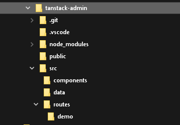
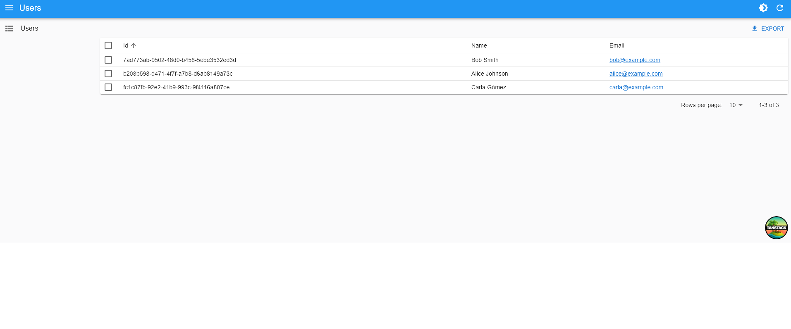

# TanStack Start Integration

[TanStack Start](https://tanstack.com/start) is a full-stack React framework built on top of TanStack Router. React-admin supports [TanStack Router](https://tanstack.com/router/latest) as an alternative to react-router, so you can use react-admin in a TanStack Start application.

## Setting Up TanStack Start

Let's start by creating a new TanStack Start project. Run the following command:

```bash
npm create @tanstack/start@latest
# or
yarn create @tanstack/start
```

This script will ask you for more details about your project. The prompts include:

- What would you like to name your project? (example: `tanstack-admin`)
- Select toolchain
- Select deployment adapter
- What add-ons would you like for your project?
- Would you like an example?
- Initialize git repository
- Install dependencies

For this tutorial, we used the following choices in our local setup: `ESLint` toolchain, `Nitro (agnostic)` deployment adapter, `Query` add-on, and `None` for the example. You can pick different options depending on your needs.

If you want to see the current list of add-ons, run:

```bash
npm create @tanstack/start@latest --list-add-ons
# or
yarn create @tanstack/start --list-add-ons
```

The project structure should look like this:



## Setting Up React-Admin In TanStack Start

Add the `react-admin` and `ra-router-tanstack` packages, as well as a data provider package. In this example, we'll use `ra-data-json-server` to connect to a test API provided by [JSONPlaceholder](https://jsonplaceholder.typicode.com).

```bash
cd tanstack-admin
npm install react-admin ra-router-tanstack ra-data-json-server
# or
yarn add react-admin ra-router-tanstack ra-data-json-server
```

## Adding React-Admin In A Sub Route

TanStack Start uses file-based routing. React-admin generates dynamic routes for each resource (e.g. `/admin/users`, `/admin/users/:id`). To avoid “Not Found” pages, we create explicit routes for the resource paths and render the same admin component in each route.

First, create the admin route at `src/routes/admin.tsx`:

```tsx
// in src/routes/admin.tsx
import { createFileRoute } from '@tanstack/react-router';
import {
    Admin,
    Resource,
    ListGuesser,
    EditGuesser,
} from 'react-admin';
import jsonServerProvider from 'ra-data-json-server';
import { tanStackRouterProvider } from 'ra-router-tanstack';

const dataProvider = jsonServerProvider('https://jsonplaceholder.typicode.com');
export const Route = createFileRoute('/admin')({ component: App });

function App() {
    return (
        <Admin
            dataProvider={dataProvider}
            routerProvider={tanStackRouterProvider}
            basename="/admin"
        >
            <Resource
                name="users"
                list={ListGuesser}
                edit={EditGuesser}
            />
        </Admin>
    );
}

export default App;
```

Then create the routes for the resource and its dynamic paths:

```tsx
// in src/routes/index.tsx
import { createFileRoute, Link } from '@tanstack/react-router';

function Home() {
    return (
        <div>
            <h1>TanStack Start + React-Admin</h1>
            <p>
                Go to the admin at <Link to="/admin">/admin</Link>
            </p>
        </div>
    );
}

export const Route = createFileRoute('/')({ component: Home });
```

```tsx
// in src/routes/admin.users.tsx
import { createFileRoute } from '@tanstack/react-router';
import App from './admin';

export const Route = createFileRoute('/admin/users')({ component: App });
```

```tsx
// in src/routes/admin.users.$id.tsx
import { createFileRoute } from '@tanstack/react-router';
import App from './admin';

export const Route = createFileRoute('/admin/users/$id')({ component: App });
```


You can now start the app in `development` mode:

```bash
npm run dev
# or
yarn dev
```

The admin should render at `/admin` on your dev server.



**Tip**: If you add more resources, create matching file-based routes for each resource list and edit path under `/admin` and point them to the same `App` component.

## Removing The TanStack Header

TanStack Start adds a default header in the root layout. If you want the admin to render without that header, edit `src/routes/__root.tsx` and remove the `<Header />` component from `RootDocument`.

## Adding an API

TanStack Start doesn't force a specific backend. If you need an API for your admin, you can:

- Use an external CRUD backend like Supabase or PostgREST
- Proxy requests through your app's server runtime (if your deployment includes one)

For example, you can create a REST API with Supabase and proxy it through TanStack Start so you don't expose service keys to the browser.

First, create a Supabase REST API and its associated PostgreSQL database directly on the [Supabase website](https://app.supabase.com/) (it's free for tests and low usage). Once the setup is finished, use the Supabase manager to add the following table:

- `users` with fields: `id`, `name`, and `email`

You can populate these tables via the Supabase UI if you want.

Supabase exposes a REST API at `https://YOUR_INSTANCE.supabase.co/rest/v1`.

Next, create a configuration to let the TanStack Start app connect to Supabase. Create a `.env` file:

```sh
# In `.env`
SUPABASE_URL="https://MY_INSTANCE.supabase.co"
SUPABASE_SERVICE_ROLE="MY_SERVICE_ROLE_KEY"
```

**Tip**: This example uses the **service role key** here and not the anonymous role. This allows mutations without dealing with authorization. **You shouldn't do this in production**, but use the [Supabase authorization](https://supabase.com/docs/guides/auth) feature instead.

Time to bootstrap the API Proxy. Create a new TanStack Start route at `src/routes/api.$.ts`:

```ts
// in src/routes/api.$.ts
import { createFileRoute } from '@tanstack/react-router'

export const Route = createFileRoute('/api/$')({
    server: {
        handlers: {
            GET: ({ request }) => proxy(request),
            POST: ({ request }) => proxy(request),
            PUT: ({ request }) => proxy(request),
            DELETE: ({ request }) => proxy(request),
        },
    },
})

const API_PREFIX = '/api'

const proxy = (request: Request) => {
    const apiUrl = getSupabaseUrlFromRequestUrl(request.url)

    return fetch(apiUrl, {
        method: request.method,
        body: request.body,
        headers: {
            prefer: request.headers.get('prefer') ?? '',
            accept: request.headers.get('accept') ?? 'application/json',
            'Accept-Encoding': '',
            apiKey: `${process.env.SUPABASE_SERVICE_ROLE}`,
            Authorization: `Bearer ${process.env.SUPABASE_SERVICE_ROLE}`,
        },
    })
}

const getSupabaseUrlFromRequestUrl = (url: string) => {
    const startOfRequest = url.indexOf(API_PREFIX)
    const query = url.substring(startOfRequest + API_PREFIX.length)
    return `${process.env.SUPABASE_URL}/rest/v1${query}`
}
```

**Tip**: Some of this code is PostgREST-specific. The `prefer` header is required to let PostgREST return one record instead of an array containing one record in response to `getOne` requests. A proxy for another CRUD API will require different parameters.

Update the react-admin data provider to use the Supabase adapter instead of the JSON Server one. As Supabase provides a PostgREST endpoint, we'll use [`ra-data-postgrest`](https://github.com/raphiniert-com/ra-data-postgrest):

```sh
npm install @raphiniert/ra-data-postgrest
# or
yarn add @raphiniert/ra-data-postgrest
```

Finally, update your Admin dataProvider:

```tsx
// in src/routes/admin.tsx
import { Admin, Resource, ListGuesser, fetchUtils } from 'react-admin';
import postgrestRestProvider from '@raphiniert/ra-data-postgrest';
import { tanStackRouterProvider } from 'ra-router-tanstack';

const dataProvider = postgrestRestProvider({
    apiUrl: '/api',
    httpClient: fetchUtils.fetchJson,
    defaultListOp: 'eq',
    schema: () => '',
});

// ... keep the rest of the file the same
```

## Next Steps

For standalone vs embedded setups, see the [TanStack Router Integration](./TanStackRouter.md).
