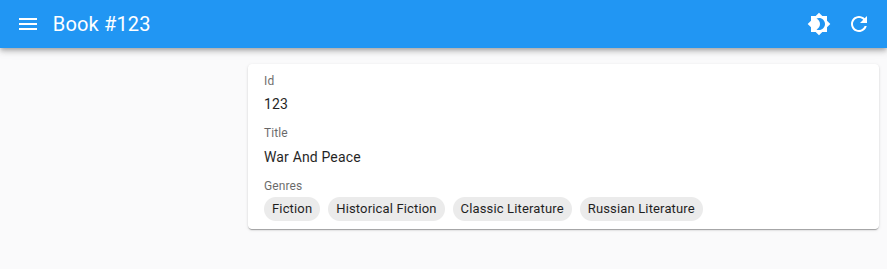

# `<TextArrayField>`

`<TextArrayField>` renders an array of scalar values using Material-UI's Stack and Chips.



`<TextArrayField>` is ideal for displaying lists of simple text values, such as genres or tags, in a visually appealing way.

## Usage

`<TextArrayField>` can be used in a Show view to display an array of values from a record. For example:

```js
const book = {
    id: 1,
    title: 'War and Peace',
    genres: [
        'Fiction',
        'Historical Fiction',
        'Classic Literature',
        'Russian Literature',
    ],
};
```

You can render the `TextArrayField` like this:

```jsx
import { Show, SimpleShowLayout, TextArrayField } from 'react-admin';

const BookShow = () => (
    <Show>
        <SimpleShowLayout>
            <TextField source="title" />
            <TextArrayField source="genres" />
        </SimpleShowLayout>
    </Show>
);
```

## Props

The following props are available for `<TextArrayField>`:

| Prop        | Type         | Required | Description                                                   |
| ----------- | ------------ | -------- | ------------------------------------------------------------- |
| `source`    | `string`     | Yes      | The name of the record field containing the array to display. |
| `color`     | `string`     | -        | The color of the Chip components.                             |
| `emptyText` | `ReactNode`  | -        | Text to display when the array is empty.                      |
| `record`    | `RecordType` | -        | The record containing the data to display.                    |
| `size`      | `string`     | -        | The size of the Chip components.                              |
| `variant`   | `string`     | -        | The variant of the Chip components.                           |

Additional props are passed to the underlying [Material-UI `Stack` component](https://mui.com/material-ui/react-stack/).

## `color`

The color of the Chip components. Accepts any value supported by [MUI's Chip](https://mui.com/material-ui/react-chip/) (`primary`, `secondary`, etc).

```jsx
<TextArrayField source="genres" color="secondary" />
```

## `direction`

The direction of the Stack layout. Accepts `row` or `column`. The default is `row`.

```jsx
<TextArrayField source="genres" direction="column" />
```

## `emptyText`

Text to display when the array is empty.

```jsx
<TextArrayField source="genres" emptyText="No genres available" />
```

## `record`

The record containing the data to display. Usually provided by react-admin automatically.

```jsx
const book = {
    id: 1,
    title: 'War and Peace',
    genres: [
        'Fiction',
        'Historical Fiction',
        'Classic Literature',
        'Russian Literature',
    ],
};

<TextArrayField source="genres" record={book} />
```

## `size`

The size of the Chip components. Accepts any value supported by [MUI's Chip](https://mui.com/material-ui/react-chip/) (`small`, `medium`). The default is `small`.

```jsx
<TextArrayField source="genres" size="medium" />
```

## `source`

The name of the record field containing the array to display.

```jsx
<TextArrayField source="genres" />
```

## `sx`

Custom styles for the Stack, using MUI's `sx` prop.


```jsx
<TextArrayField source="genres" sx={{ gap: 2 }} />
```


## `variant`

The variant of the Chip components. Accepts any value supported by [MUI's Chip](https://mui.com/material-ui/react-chip/) (`filled`, `outlined`). The default is `filled`.

```jsx
<TextArrayField source="genres" variant="outlined" />
```

