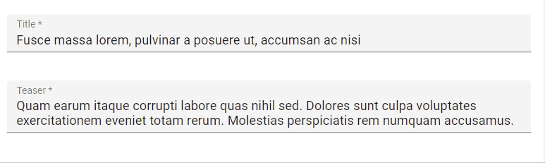
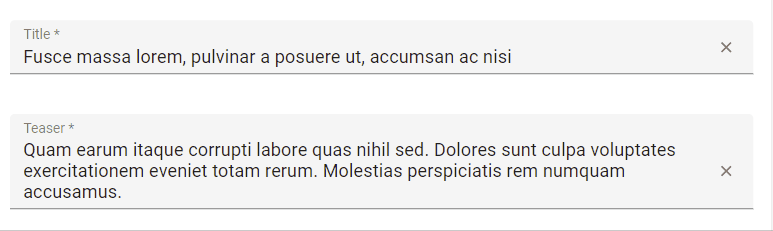

# `<TextInput>`

`<TextInput>` is the most common input. It is used for texts, emails, URL or passwords. In translates into [an MUI `<TextField>`](https://mui.com/material-ui/react-text-field/), and renders as `<input type="text">` in HTML.



## Usage

```jsx
import { Edit, SimpleForm, TextInput, required } from 'react-admin';

export const PostEdit = () => (
    <Edit title={<PostTitle />}>
        <SimpleForm>
            <TextInput source="title" validate={[required()]} fullWidth />
            <TextInput source="teaser" validate={[required()]} defaultValue="Lorem Ipsum" multiline fullWidth />
        </SimpleForm>
    </Edit>
);
```

## Props

| Prop         | Required | Type      | Default | Description                                                          |
| ------------ | -------- | --------- | ------- | -------------------------------------------------------------------- |
| `multiline`  | Optional | `boolean` | `false` | If `true`, the input height expands as the text wraps over several lines |
| `resettable` | Optional | `boolean` | `false` | If `true`, display a button to reset the changes in this input value |
| `type`       | Optional | `string`  | `text`  | Type attribute passed to the `<input>` element                       |

`<TextInput>` also accepts the [common input props](./Inputs.md#common-input-props).

Additional props are passed down to the underlying MUI [`<TextField>`](https://mui.com/material-ui/react-text-field/) component.

## `multiline`

You can make the `<TextInput>` expandable using the `multiline` prop for multiline text values. It renders as an auto expandable textarea.

```jsx
<TextInput multiline source="body" />
```

## `resettable`

You can make the `<TextInput>` component resettable using the `resettable` prop. This will add a reset button which will be displayed only when the field has a value and is focused.

```jsx
import { TextInput } from 'react-admin';

<TextInput source="title" resettable />
```



## `type`

You can choose a specific input type using the `type` attribute, for instance `text` (the default), `email`, `url`, or `password`:

```jsx
<TextInput label="Email Address" source="email" type="email" />
```

**Warning**: Do not use `type="number"`, or you'll receive a string as value (this is a [known React bug](https://github.com/facebook/react/issues/1425)). Instead, use [`<NumberInput>`](./NumberInput.md).
