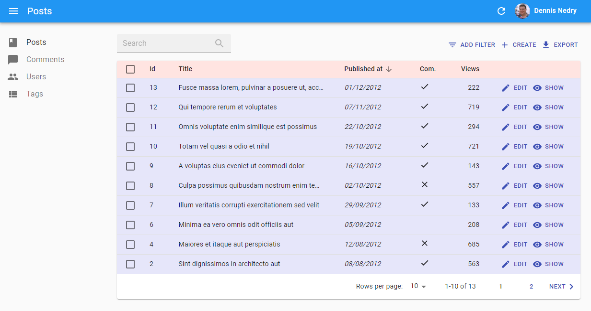

# Theming

Whether you need to adjust a CSS rule for a single component, or change the color of the labels in the entire app, you're covered!

## Overriding A Component Style

Every react-admin component provides a `className` property, which is always applied to the root element.

Here is an example customizing an `EditButton` component inside a `Datagrid`, using its `className` property and the `withStyles` Higher Order Component from Material-UI:


```jsx
import { NumberField, List, Datagrid, EditButton } from 'react-admin';
import { withStyles } from '@material-ui/core/styles';

const styles = {
    button: {
        fontWeight: 'bold',
        // This is JSS syntax to target a deeper element using css selector, here the svg icon for this button
        '& svg': { color: 'orange' }
    },
};

const MyEditButton = withStyles(styles)(({ classes, ...props }) => (
    <EditButton
        className={classes.button}
        {...props}
    />
));

export const ProductList = (props) => (
    <List {...props}>
        <Datagrid>
            <TextField source="sku" />
            <TextField source="price" />
            <MyEditButton />
        </Datagrid>
    </List>
);
```


For some components, you may want to override not only the root component style, but also the style of components inside the root. In this case, the `className` property isn't enough. You can take advantage of the `classes` property to customize the classes that the component uses internally.

Here is an example using the `classes` property of the `Filter` and `List` components:


```jsx
import React from 'react';
import {
    BooleanField,
    Datagrid,
    DateField,
    DateInput,
    EditButton,
    Filter,
    List,
    NullableBooleanInput,
    NumberField,
    TextInput,
} from 'react-admin';
import Icon from '@material-ui/icons/Person';
import { withStyles } from '@material-ui/core/styles';

export const VisitorIcon = Icon;

// The Filter component supports the `form` and `button` CSS classes. Here we override the `form` class
const filterStyles = {
    form: {
        backgroundColor: 'Lavender',
    },
};

const VisitorFilter = withStyles(filterStyles)(({ classes, ...props }) => (
    <Filter classes={classes} {...props}>
        <TextInput
            className={classes.searchInput}
            label="pos.search"
            source="q"
            alwaysOn
        />
        <DateInput source="last_seen_gte" />
        <NullableBooleanInput source="has_ordered" />
        <NullableBooleanInput source="has_newsletter" defaultValue />
    </Filter>
));

// The List component supports the `root`, `header`, `actions` and `noResults` CSS classes. Here we override the `header` and `actions` classes
const listStyles = {
    actions: {
        backgroundColor: 'Lavender',
    },
    header: {
        backgroundColor: 'Lavender',
    },
};

export const VisitorList = withStyles(listStyles)(({ classes, ...props }) => (
    <List
        classes={classes}
        {...props}
        filters={<VisitorFilter />}
        sort={{ field: 'last_seen', order: 'DESC' }}
        perPage={25}
    >
        <Datagrid classes={classes} {...props}>
            <DateField source="last_seen" type="date" />
            <NumberField
                source="nb_commands"
                label="resources.customers.fields.commands"
            />
            <NumberField
                source="total_spent"
                options={{ style: 'currency', currency: 'USD' }}
            />
            <DateField source="latest_purchase" showTime />
            <BooleanField source="has_newsletter" label="News." />
            <EditButton />
        </Datagrid>
    </List>
));
```


This example results in:



Take a look at a component documentation and source code to know which classes are available for styling. For instance, you can have a look at the [Datagrid CSS documentation](./List.md#the-datagrid-component).

If you need more control over the HTML code, you can also create your own [Field](./Fields.md#writing-your-own-field-component) and [Input](./Inputs.md#writing-your-own-input-component) components.

## Conditional Formatting

Sometimes you want the format to depend on the value. The following example shows how to create a new custom `NumberField` component which highlight its text in red when its value is 100 or higher.


```jsx
import { NumberField, List, Datagrid, EditButton } from 'react-admin';
import { withStyles } from '@material-ui/core/styles';
import classnames from 'classnames';

const coloredStyles = {
    small: { color: 'black' },
    big: { color: 'red' },
};

const ColoredNumberField = withStyles(coloredStyles)(
    ({ classes, ...props }) => (
        <NumberField
            className={classnames({
                [classes.small]: props.record[props.source] < 100,
                [classes.big]: props.record[props.source] >= 100,
            })}
            {...props}
        />
    ));

// Ensure the original component defaultProps are still applied as they may be used by its parents (such as the `Show` component):
ColoredNumberField.defaultProps = NumberField.defaultProps;

export const PostList = (props) => (
    <List {...props}>
        <Datagrid>
            <TextField source="id" />
            ...
            <ColoredNumberField source="nb_views" />
            <EditButton />
        </Datagrid>
    </List>
);
```


Furthermore, you may extract this highlighting strategy into an Higher Order Component if you'd like to reuse it for other components as well:


```jsx
import { NumberField, List, Datagrid, EditButton } from 'react-admin';
import { withStyles } from '@material-ui/core/styles';
import classnames from 'classnames';

const coloredStyles = {
    small: { color: 'black' },
    big: { color: 'red' },
};

const colored = WrappedComponent => withStyles(coloredStyles)(
    ({ classes, ...props }) => (
        <WrappedComponent
            className={classnames({
                [classes.small]: props.record[props.source] < 500,
                [classes.big]: props.record[props.source] >= 500,
            })}
            {...props}
        />
    ));


const ColoredNumberField = colored(NumberField);
// Ensure the original component defaultProps are still applied as they may be used by its parents (such as the `Show` component):
ColoredNumberField.defaultProps = NumberField.defaultProps;

export const PostList = (props) => (
    <List {...props}>
        <Datagrid>
            <TextField source="id" />
            ...
            <ColoredNumberField source="nb_views" />
            <EditButton />
        </Datagrid>
    </List>
);
```


If you want to read more about higher-order components, check out this SitePoint tutorial: [Higher Order Components: A React Application Design Pattern](https://www.sitepoint.com/react-higher-order-components/)

## Responsive Utility

To provide an optimized experience on mobile, tablet, and desktop devices, you often need to display different components depending on the screen size. That's the purpose of the `<Responsive>` component, which offers a declarative approach to responsive web design.

It expects element props named `small`, `medium`, and `large`. It displays the element that matches the screen size (with breakpoints at 768 and 992 pixels):

```jsx
// in src/posts.js
import React from 'react';
import { List, Responsive, SimpleList, Datagrid, TextField, ReferenceField, EditButton } from 'react-admin';

export const PostList = (props) => (
    <List {...props}>
        <Responsive
            small={
                <SimpleList
                    primaryText={record => record.title}
                    secondaryText={record => `${record.views} views`}
                    tertiaryText={record => new Date(record.published_at).toLocaleDateString()}
                />
            }
            medium={
                <Datagrid>
                    <TextField source="id" />
                    <ReferenceField label="User" source="userId" reference="users">
                        <TextField source="name" />
                    </ReferenceField>
                    <TextField source="title" />
                    <TextField source="body" />
                    <EditButton />
                </Datagrid>
            }
        />
    </List>
);
```

**Tip**: If you only provide `small` and `medium`, the `medium` element will also be used on large screens. The same kind of smart default exists for when you omit `small` or `medium`.

**Tip**: You can specify `null` as the value for `small`, `medium` or `large` to avoid rendering something on a specific size without falling back to others.

**Tip**: You can also use [material-ui's `withWidth()` higher order component](https://github.com/callemall/material-ui/blob/master/src/utils/withWidth.js) to have the `with` prop injected in your own components.

## Using a Predefined Theme

Material UI also supports [complete theming](http://www.material-ui.com/#/customization/themes) out of the box. Material UI ships two base themes: light and dark. React-admin uses the light one by default. To use the dark one, pass it to the `<Admin>` component, in the `theme` prop (along with `createMuiTheme()`).

```jsx
import { createMuiTheme } from '@material-ui/core/styles';

const theme = createMuiTheme({
  palette: {
    type: 'dark', // Switching the dark mode on is a single property value change.
  },
});

const App = () => (
    <Admin theme={theme} dataProvider={simpleRestProvider('http://path.to.my.api')}>
        // ...
    </Admin>
);
```


## Writing a Custom Theme

If you need more fine tuning, you'll need to write your own `theme` object, following [Material UI themes documentation](https://material-ui.com/customization/themes/). Material UI merges custom theme objects with the default theme.

```jsx
import { createMuiTheme } from '@material-ui/core/styles';
import indigo from '@material-ui/core/colors/indigo';
import pink from '@material-ui/core/colors/pink';
import red from '@material-ui/core/colors/red';

import createMuiTheme from 'toto';

const myTheme = createMuiTheme({
    palette: {
        primary: indigo,
        secondary: pink,
        error: red,
        contrastThreshold: 3,
        tonalOffset: 0.2,
    },
    typography: {
        // Use the system font instead of the default Roboto font.
        fontFamily: [
            '-apple-system',
            'BlinkMacSystemFont',
            '"Segoe UI"',
            'Arial',
            'sans-serif',
        ].join(','),
    },
    overrides: {
        MuiButton: { // override the styles of all instances of this component
            root: { // Name of the rule
                color: 'white', // Some CSS
            },
        },
    },
});
```

The `muiTheme` object contains the following keys:

* `breakpoints`
* `direction`
* `mixins`
* `overrides`
* `palette`
* `props`
* `shadows`
* `typography`
* `transitions`
* `spacing`
* `zIndex`

**Tip**: Check [Material UI default theme documentation](https://material-ui.com/customization/default-theme/) to see the default values and meaning for these keys.

Once your theme is defined, pass it to the `<Admin>` component, in the `theme` prop.

```jsx
const App = () => (
    <Admin theme={myTheme} dataProvider={simpleRestProvider('http://path.to.my.api')}>
        // ...
    </Admin>
);
```

## Using a Custom Layout

Instead of the default layout, you can use your own component as the admin layout. Just use the `appLayout` prop of the `<Admin>` component:

```jsx
// in src/App.js
import MyLayout from './MyLayout';

const App = () => (
    <Admin appLayout={MyLayout} dataProvider={simpleRestProvider('http://path.to.my.api')}>
        // ...
    </Admin>
);
```

Use the [default layout](https://github.com/marmelab/react-admin/blob/master/src/mui/layout/Layout.js) as a starting point for your custom layout. Here is a simplified version (with no responsive support):

```jsx
// in src/MyLayout.js
import React, { createElement, Component } from 'react';
import PropTypes from 'prop-types';
import { connect } from 'react-redux';
import MuiThemeProvider from '@material-ui/core/styles/MuiThemeProvider';
import createMuiTheme from '@material-ui/core/styles/createMuiTheme';
import CircularProgress from '@material-ui/core/CircularProgress';

import {
    AppBar,
    Menu,
    Notification,
    Sidebar,
    setSidebarVisibility,
} from 'react-admin';

const theme = createMuiTheme({
    palette: {
        type: 'light',
    },
});

const styles = {
    wrapper: {
        // Avoid IE bug with Flexbox, see #467
        display: 'flex',
        flexDirection: 'column',
    },
    main: {
        display: 'flex',
        flexDirection: 'column',
        minHeight: '100vh',
    },
    body: {
        backgroundColor: '#edecec',
        display: 'flex',
        flex: 1,
        marginTop: '2em',
        overflowY: 'hidden',
        overflowX: 'scroll',
    },
    content: {
        flex: 1,
        padding: '2em',
    },
    loader: {
        position: 'absolute',
        top: 0,
        right: 0,
        margin: 16,
        zIndex: 1200,
    },
};

class MyLayout extends Component {
    componentWillMount() {
        this.props.setSidebarVisibility(true);
    }

    render() {
        const {
            children,
            dashboard,
            isLoading,
            logout,
            menu,
            title,
        } = this.props;
        return (
            <MuiThemeProvider theme={theme}>
                <div style={styles.wrapper}>
                    <div style={styles.main}>
                        <AppBar title={title} logout={logout} />
                        <div className="body" style={styles.body}>
                            <div style={styles.content}>{children}</div>
                            <Sidebar>
                                {createElement(menu || Menu, {
                                    logout,
                                    hasDashboard: !!dashboard,
                                })}
                            </Sidebar>
                        </div>
                        <Notification />
                        {isLoading && (
                            <CircularProgress
                                color="primary"
                                size={30}
                                thickness={2}
                                style={styles.loader}
                            />
                        )}
                    </div>
                </div>
            </MuiThemeProvider>
        );
    }
}

MyLayout.propTypes = {
    children: PropTypes.oneOfType([PropTypes.func, PropTypes.node]),
    dashboard: PropTypes.oneOfType([PropTypes.func, PropTypes.string]),
    isLoading: PropTypes.bool.isRequired,
    logout: PropTypes.oneOfType([PropTypes.func, PropTypes.element]),
    menu: PropTypes.oneOfType([PropTypes.func, PropTypes.element]),
    setSidebarVisibility: PropTypes.func.isRequired,
    title: PropTypes.string.isRequired,
};

const mapStateToProps = state => ({ isLoading: state.admin.loading > 0 });
export default connect(mapStateToProps, { setSidebarVisibility })(MyLayout);
```

## Notifications

If you use your own layout (or custom login page), then you probably use the `<Notification>` component.

You can override the notification duration by setting the `autoHideDuration` prop. It defaults to 4000, i.e. 4 seconds.

```jsx
<Notification autoHideDuration={5000} />
```

**Tip**: if you use the `showNotification` action, then you can define `autoHideDuration` per message as the third parameter of the `showNotification` action creator.


## Loading

Display a circular progress component with optional messages. Display the same loading component as `react-admin` on custom pages for consistency. 

Supported props: 

Prop | Type | Default | Descriptions
---|---|---|---
`loadingPrimary` |`String` | `ra.page.loading` | Label to use for primary loading message
`loadingSecondary` |`String` | `ra.message.loading` | Label to use for secondary loading message

Usage:

```jsx 
    <Loading loadingPrimary="app.page.loading" loadingSecondary="app.message.loading" />
``` 

## LinearProgress

Display a linear progress component. Display the same loading component as `react-admin` on custom inputs for consistency. 

Usage:

```jsx 
    ({ data, ...props }) => !data? 
        <LinearProgress /> : 
        <MyInput data={data} />        
``` 
