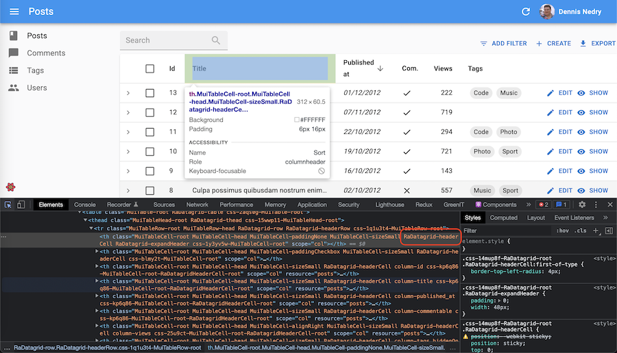
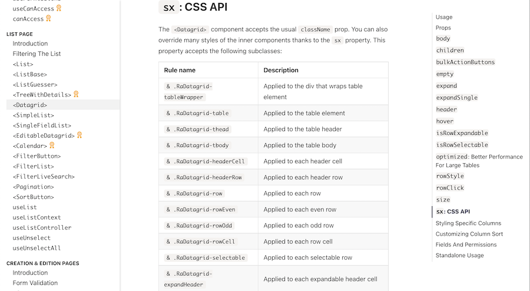

# Theming

Whether you need to adjust a CSS rule for a single component, or change the color of the labels in the entire app, you're covered!

## `sx`: Overriding A Component Style

All react-admin components expose an `sx` property, which allows to customize the component style. It uses the CSS-in-JS solution offered by MUI, [MUI System](https://mui.com/system/basics/#the-sx-prop). This `sx` prop is kind of like [React's `style` prop](https://react.dev/reference/react-dom/components/common#applying-css-styles), but it's more powerful.


```jsx
// It supports all CSS properties, plus some shorthand for common CSS properties,
// e.g. pt for paddingTop
<CardContent sx={{ pt: 2 }} />

// It allows to style pseudo-elements, like :hover or :last-child
<CardContent sx={{ pt: 2, "&:last-child": { pb: 2 } }} />

// It allows responsive values without media queries:
<Box
    sx={{
        width: {
            xs: 100, // theme.breakpoints.up('xs')
            sm: 200, // theme.breakpoints.up('sm')
            md: 300, // theme.breakpoints.up('md')
            lg: 400, // theme.breakpoints.up('lg')
            xl: 500, // theme.breakpoints.up('xl')
        },
    }}
>
    This box has a responsive width.
</Box>

// It allows to style children, e.g. to style the <Avatar> inside a <Card>:
<Card sx={{ '& .MuiAvatar': { width: 48, height: 48 } }} />

// It allows to use theme variables, like the spacing or the palette colors:
<Card sx={{ bgcolor: "grey.200" }} />

// It offers property name autocompletion in IDEs thanks to TypeScript
```


Check [The Material UI documentation on the `sx` prop](https://mui.com/material-ui/customization/how-to-customize/#1-one-off-customization) for more information.

Here is an example: Customizing the `<EditButton>` inside a `<Datagrid>`, using the `sx` prop:


```jsx
import { NumberField, List, Datagrid, TextField, EditButton } from 'react-admin';

export const ProductList = () => (
    <List>
        <Datagrid>
            <TextField source="sku" />
            <TextField source="price" />
            <EditButton sx={{ fontWeight: "bold" }}/>
        </Datagrid>
    </List>
);
```


Here is another example, illustrating the ability to customize a specific part of a component - here, only the header of a `<Datagrid>`:


```jsx
import {
    BooleanField,
    Datagrid,
    DateField,
    EditButton,
    List,
    NumberField,
    TextField,
    ShowButton,
} from 'react-admin';
import Icon from '@mui/icons-material/Person';

export const VisitorIcon = Icon;

export const PostList = () => (
    <List>
        <Datagrid
            sx={{
                backgroundColor: "Lavender",
                "& .RaDatagrid-headerCell": {
                    backgroundColor: "MistyRose",
                },
            }}
        >
            <TextField source="id" />
            <TextField source="title" />
            <DateField source="published_at" sortByOrder="DESC" />
            <BooleanField source="commentable" sortable={false} />
            <NumberField source="views" sortByOrder="DESC" />
            <EditButton />
            <ShowButton />
        </Datagrid>
    </List>
);
```


This example results in:


To guess the name of the subclass to use (like `.RaDatagrid-headerCell` above) for customizing a component, you can use the developer tools of your browser:



The react-admin documentation for individual components also lists the classes available for styling. For instance, here is the [Datagrid CSS documentation](./Datagrid.md#sx-css-api):



## Reusable Components

To reuse the same style overrides in different locations across your application, create a reusable component using [the Material UI `styled()` utility](https://mui.com/system/styled/). It's a function that creates a new component based on a source component and custom styles. The basic syntax is `styled(Component)(styles) => Component` (where `styles` follows the same syntax as the `sx` prop).

For instance, to create a custom `<Datagrid>` component with the header style defined in the previous section:

```jsx
// in src/MyDatagrid.js
import { styled } from '@mui/system';
import { Datagrid } from 'react-admin';

export const MyDatagrid = styled(Datagrid)({
    backgroundColor: "Lavender",
    "& .RaDatagrid-headerCell": {
        backgroundColor: "MistyRose",
    },
});
```

You can then use this component instead of react-admin's `<Datagrid>` component:


```diff
// in src/post/PostList.js
import {
    BooleanField,
-   Datagrid,
    DateField,
    EditButton,
    List,
    NumberField,
    TextField,
    ShowButton,
} from 'react-admin';
import Icon from '@mui/icons-material/Person';

export const VisitorIcon = Icon;

+import { MyDatagrid } from '../MyDatagrid';

export const PostList = () => (
    <List>
-       <Datagrid
-           sx={{
-               backgroundColor: "Lavender",
-               "& .RaDatagrid-headerCell": {
-                   backgroundColor: "MistyRose",
-               },
-           }}
-       >
+       <MyDatagrid>
            <TextField source="id" />
            <TextField source="title" />
            <DateField source="published_at" sortByOrder="DESC" />
            <BooleanField source="commentable" sortable={false} />
            <NumberField source="views" sortByOrder="DESC" />
            <EditButton />
            <ShowButton />
+       </MyDatagrid>
-       </Datagrid>
    </List>
);
```


Again, to guess the name of the subclass to use (like `.RaDatagrid-headerCell` above) for customizing a component, you can use the developer tools of your browser, or check the react-admin documentation for individual components (e.g. the [Datagrid CSS documentation](./Datagrid.md#sx-css-api)).

**Tip**: If you need more control over the HTML code, you can also create your own [Field](./Fields.md#writing-your-own-field-component) and [Input](./Inputs.md#writing-your-own-input-component) components.

## Global Theme Overrides

If you want to override the style of a component across the entire application, you can use a custom theme, leveraging [the Material UI Theming support](https://mui.com/material-ui/customization/theming/).

React-admin already wraps the app with [a Material UI `<ThemeProvider>`](https://mui.com/material-ui/customization/theming/#themeprovider). Pass a custom `theme` to the `<Admin>` component to override the style of the entire application:

```jsx
const theme = { ... };

const App = () => (
    <Admin theme={theme}>
        // ...
    </Admin>
);
```

Leveraging this technique, you can create a custom theme that overrides the style of a component for the entire application.

For instance, to create a custom theme that overrides the style of the `<Datagrid>` component:

```jsx
import { defaultTheme } from 'react-admin';

const theme = {
    ...defaultTheme,
    components: {
        ...defaultTheme.components,
        RaDatagrid: {
            styleOverrides: {
              root: {
                  backgroundColor: "Lavender",
                  "& .RaDatagrid-headerCell": {
                      backgroundColor: "MistyRose",
                  },
              }
           }
        }
    }
};

const App = () => (
    <Admin theme={theme}>
        // ...
    </Admin>
);
```

There are 2 important gotchas here:

- Don't forget to merge your custom style overrides with the ones from react-admin's `defaultTheme`, otherwise the application will have the default Material UI theme (most notably, outlined text inputs)
- Custom style overrides must live under a `root` key. Then, the style override syntax is the same as the one used for the `sx` prop.

Note that you don't need to call `createTheme` yourself. React-admin will do it for you.

Again, to guess the name of the subclass to use (like `.RaDatagrid-headerCell` above) for customizing a component, you can use the developer tools of your browser, or check the react-admin documentation for individual components (e.g. the [Datagrid CSS documentation](./Datagrid.md#sx-css-api)).

You can use this technique to override not only styles, but also defaults for components. That's how react-admin applies the `filled` variant to all `TextField` components. So for instance, to change the variant to `outlined`, create a custom theme as follows:

```jsx
import { defaultTheme } from 'react-admin';

const theme = {
    ...defaultTheme,
    components: {
        ...defaultTheme.components,
        MuiTextField: {
            defaultProps: {
                variant: 'outlined',
            },
        },
        MuiFormControl: {
            defaultProps: {
                variant: 'outlined',
            },
        },
    }
};
```

**Tip**: TypeScript will be picky when overriding the `variant` `defaultProp`. To avoid compilation errors, type the `variant` value as `const`:

```ts
import { defaultTheme } from 'react-admin';

const theme = {
    ...defaultTheme,
    components: {
        ...defaultTheme.components,
        MuiTextField: {
            defaultProps: {
                variant: 'outlined' as const,
            },
        },
        MuiFormControl: {
            defaultProps: {
                variant: 'outlined' as const,
            },
        },
    }
};
```

## Writing a Custom Theme

Material UI theming also allows to change the default palette, typography, colors, etc. This is very useful to change the react-admin style to match the branding of your company.

For instance, here is how to override the default react-admin colors and fonts:

```jsx
import { defaultTheme } from 'react-admin';
import indigo from '@mui/material/colors/indigo';
import pink from '@mui/material/colors/pink';
import red from '@mui/material/colors/red';

const myTheme = {
    ...defaultTheme,
    palette: {
        primary: indigo,
        secondary: pink,
        error: red,
        contrastThreshold: 3,
        tonalOffset: 0.2,
    },
    typography: {
        // Use the system font instead of the default Roboto font.
        fontFamily: ['-apple-system', 'BlinkMacSystemFont', '"Segoe UI"', 'Arial', 'sans-serif'].join(','),
    },
};
```

A `theme` object can contain the following keys:

* `breakpoints`
* `direction`
* `mixins`
* `components`
* `palette`
* `props`
* `shadows`
* `spacing`
* `transitions`
* `typography`
* `zIndex`

**Tip**: Check [Material UI default theme documentation](https://mui.com/material-ui/customization/default-theme/) to see the default values and meaning for these keys.

Once your theme is defined, pass it to the `<Admin>` component, in the `theme` prop.

```jsx
const App = () => (
    <Admin theme={myTheme} dataProvider={...}>
        // ...
    </Admin>
);
```

## Using A Dark Theme

Material UI ships two base themes: light and dark. React-admin uses the light one by default. To use the dark theme, create a custom theme object with a `mode: 'dark'` palette, and pass it as the `<Admin theme>` prop:

```jsx
import { defaultTheme } from 'react-admin';
const theme = {
    ...defaultTheme,
    palette: {
        mode: 'dark', // Switching the dark mode on is a single property value change.
    },
};

const App = () => (
    <Admin theme={theme} dataProvider={...}>
        // ...
    </Admin>
);
```


## Letting Users Choose The Theme

It's a common practice to support both a light theme and a dark theme in an application, and let users choose which one they prefer. 

<video controls autoplay playsinline muted loop>
  <source src="./img/ToggleThemeButton.webm" type="video/webm"/>
  <source src="./img/ToggleThemeButton.mp4" type="video/mp4"/>
  Your browser does not support the video tag.
</video>


React-admin's `<Admin>` component accepts a `darkTheme` prop in addition to the `theme` prop. 

```jsx
import { Admin, defaultTheme } from 'react-admin';

const lightTheme = defaultTheme;
const darkTheme = { ...defaultTheme, palette: { mode: 'dark' } };

const App = () => (
    <Admin
        dataProvider={...}
        theme={lightTheme}
        darkTheme={darkTheme}
    >
        // ...
    </Admin>
);
```

With this setup, the default application theme depends on the user's system settings. If the user has chosen a dark mode in their OS, react-admin will use the dark theme. Otherwise, it will use the light theme.

In addition, users can switch from one theme to the other using [the `<ToggleThemeButton>` component](./ToggleThemeButton.md), which appears in the AppBar as soon as you define a `darkTheme` prop.

## Changing the Theme Programmatically

React-admin provides the `useTheme` hook to read and update the theme programmatically. It uses the same syntax as `useState`. Its used internally by [the `<ToggleThemeButton>` component](./ToggleThemeButton.md).

```jsx
import { defaultTheme, useTheme } from 'react-admin';
import { Button } from '@mui/material';

const ThemeToggler = () => {
    const [theme, setTheme] = useTheme();

    return (
        <Button onClick={() => setTheme(theme === 'dark' ? 'light' : 'dark')}>
            {theme === 'dark' ? 'Switch to light theme' : 'Switch to dark theme'}
        </Button>
    );
}
```

## Conditional Formatting

Sometimes you want the format to depend on the value. Use `useRecordContext` to grab the record in a component, and the `sx` prop to apply the format.

The following example shows how to create a new `<ColoredNumberField>` component, which renders with red text when its value is less than 0.


```jsx
import { useRecordContext, NumberField, List, Datagrid, TextField, EditButton } from 'react-admin';

const ColoredNumberField = (props) => {
    const record = useRecordContext();
    return (
        <NumberField
            sx={{ color: record[prop.source] < 0 ? 'red' : 'black' }}
            {...props}
        />
    );
};

// Ensure the original component defaultProps are still applied as they may be used by its parents (such as the `Show` component):
ColoredNumberField.defaultProps = NumberField.defaultProps;

export const PostList = () => (
    <List>
        <Datagrid>
            <TextField source="id" />
            ...
            <ColoredNumberField source="nb_views" />
            <EditButton />
        </Datagrid>
    </List>
);
```


**Tip**: if you don't want to create a custom component to apply conditional formatting, you can also use [the `<WithRecord>` component](./WithRecord.md).

## `useMediaQuery` Hook

To provide an optimized experience on mobile, tablet, and desktop devices, you often need to display different components depending on the screen size. Material UI provides a hook dedicated to help such responsive layouts: [useMediaQuery](https://mui.com/material-ui/react-use-media-query/#usemediaquery-query-options-matches).

It expects a function receiving the Material UI theme as a parameter, and returning a media query. Use the theme breakpoints to check for common screen sizes. The hook returns a boolean indicating if the current screen matches the media query or not.

```jsx
const isXSmall = useMediaQuery(theme => theme.breakpoints.down('xs'));
const isSmall = useMediaQuery(theme => theme.breakpoints.down('sm'));
const isDesktop = useMediaQuery(theme => theme.breakpoints.up('md'));
```

You can also pass a custom media query as a screen.

```jsx
const isSmall = useMediaQuery('(min-width:600px)');
```

**Tip**: To perform the server-side hydration, the hook needs to render twice. A first time with `false`, the value of the server, and a second time with the resolved value. This double pass rendering cycle comes with a drawback. It's slower. To avoid it, you can set the `noSsr` option to `true` if you are doing client-side only rendering.

```jsx
const isSmall = useMediaQuery('(min-width:600px)', { noSsr: true });
```

Here is an example for a responsive list of posts, displaying a `SimpleList` on mobile, and a `Datagrid` otherwise:

```jsx
// in src/posts.js
import * as React from 'react';
import { useMediaQuery } from '@mui/material';
import { List, SimpleList, Datagrid, TextField, ReferenceField, EditButton } from 'react-admin';

export const PostList = () => {
    const isSmall = useMediaQuery(
        theme => theme.breakpoints.down('sm'),
        { noSsr: true }
    );
    return (
        <List>
            {isSmall ? (
                <SimpleList
                    primaryText={record => record.title}
                    secondaryText={record => `${record.views} views`}
                    tertiaryText={record => new Date(record.published_at).toLocaleDateString()}
                />
            ) : (
                <Datagrid>
                    <TextField source="id" />
                    <ReferenceField label="User" source="userId" reference="users">
                        <TextField source="name" />
                    </ReferenceField>
                    <TextField source="title" />
                    <TextField source="body" />
                    <EditButton />
                </Datagrid>
            )}
        </List>
    );
};
```

**Tip**: Previous versions of react-admin shipped a `<Responsive>` component to do media queries. This component is now deprecated. Use `useMediaQuery` instead.

## Using a Custom Layout

Instead of the default layout, you can use your own component as the admin layout. Just use the `layout` prop of the `<Admin>` component:

```jsx
// in src/App.js
import MyLayout from './MyLayout';

const App = () => (
    <Admin layout={MyLayout} dataProvider={...}>
        // ...
    </Admin>
);
```

Your custom layout can extend the default `<Layout>` component if you only want to override the sidebar, the appBar, the menu or the error page. For instance:

```jsx
// in src/MyLayout.js
import { Layout } from 'react-admin';
import MyAppBar from './MyAppBar';
import MySidebar from './MySidebar';
import MyMenu from './MyMenu';

const MyLayout = props => <Layout
    {...props}
    appBar={MyAppBar}
    sidebar={MySidebar}
    menu={MyMenu}
/>;

export default MyLayout;
```

### UserMenu Customization

You can replace the default user menu by your own by setting the `userMenu` prop of the `<AppBar>` component. For instance, to add custom menu items, you can render the default [`<UserMenu>`](./Buttons.md#usermenu) and add children to it. Don't forget to include the `<Logout>` component if you want to keep the logout menu item. Besides, in order to properly close the menu once an item is added, call the `onClose` method retrieved from the UserContext through the `useUserMenu` hook. This is handled for you if you use `<MenuItemLink>`:


```jsx
import * as React from 'react';
import { AppBar, Logout, UserMenu, useUserMenu } from 'react-admin';
import { Link } from 'react-router-dom';
import MenuItem from '@mui/material/MenuItem';
import ListItemIcon from '@mui/material/ListItemIcon';
import ListItemText from '@mui/material/ListItemText';
import SettingsIcon from '@mui/icons-material/Settings';
import LanguageIcon from '@mui/icons-material/Language';

// It's important to pass the ref to allow Material UI to manage the keyboard navigation
const ConfigurationMenu = React.forwardRef((props, ref) => {
    return (
        <MenuItem
            ref={ref}
            component={Link}
            // It's important to pass the props to allow Material UI to manage the keyboard navigation
            {...props}
            to="/configuration"
        >
            <ListItemIcon>
                <SettingsIcon fontSize="small" />
            </ListItemIcon>
            <ListItemText>
               Configuration
            </ListItemText>
        </MenuItem>
    );
});

// It's important to pass the ref to allow Material UI to manage the keyboard navigation
const SwitchLanguage = React.forwardRef((props, ref) => {
    const [locale, setLocale] = useLocaleState();
    // We are not using MenuItemLink so we retrieve the onClose function from the UserContext
    const { onClose } = useUserMenu();

    return (
        <MenuItem
            ref={ref}
            // It's important to pass the props to allow Material UI to manage the keyboard navigation
            {...props}
            sx={{ color: 'text.secondary' }}
            onClick={event => {
                setLocale(locale === 'en' ? 'fr' : 'en');
                onClose(); // Close the menu
            }}
        >
            <ListItemIcon>
                <LanguageIcon fontSize="small" />
            </ListItemIcon>
            <ListItemText>
                Switch Language
            </ListItemText>
        </MenuItem>
    );
});

const MyUserMenu = () => (
    <UserMenu>
        <ConfigurationMenu />
        <SwitchLanguage />
        <Logout />
    </UserMenu>
);

const MyAppBar = () => <AppBar userMenu={<MyUserMenu />} />;

const MyLayout = props => <Layout {...props} appBar={MyAppBar} />;
```


You can also remove the `<UserMenu>` from the `<AppBar>` by passing `false` to the `userMenu` prop:

```jsx
import * as React from 'react';
import { AppBar } from 'react-admin';

const MyAppBar = () => <AppBar userMenu={false} />;

const MyLayout = props => <Layout {...props} appBar={MyAppBar} />;
```

You can also customize the default icon by setting the `icon` prop to the `<UserMenu />` component.


``` jsx
import { AppBar, UserMenu } from 'react-admin';
import Avatar from '@mui/material/Avatar';

const MyCustomIcon = () => (
    <Avatar
        sx={{
            height: 30,
            width: 30,
        }}
        src="https://marmelab.com/images/avatars/adrien.jpg"
    />
);

const MyUserMenu = props => (<UserMenu {...props} icon={<MyCustomIcon />} />);

const MyAppBar = () => <AppBar userMenu={<MyUserMenu />} />;
```


### Sidebar Customization

You can specify the `Sidebar` width by setting the `width` and `closedWidth` properties on your custom Material UI theme:

```jsx
import { defaultTheme } from 'react-admin';

const theme = {
    ...defaultTheme,
    sidebar: {
        width: 300, // The default value is 240
        closedWidth: 70, // The default value is 55
    },
};

const App = () => (
    <Admin theme={theme} dataProvider={...}>
        // ...
    </Admin>
);
```

For more advanced sidebar theming, pass your own `Sidebar` component to a custom `Layout`:


```jsx
import { Sidebar, Layout } from 'react-admin';

const MySidebar = (props) => (
    <Sidebar
        sx={{
            "& .RaSidebar-drawerPaper": {
                backgroundColor: "red",
            },
        }}
        {...props}
    />
);

const MyLayout = props => <Layout {...props} sidebar={MySidebar} />
```


### Layout From Scratch

For more custom layouts, write a component from scratch. It must contain a `{children}` placeholder, where react-admin will render the resources. Use the [default layout](https://github.com/marmelab/react-admin/blob/master/packages/ra-ui-materialui/src/layout/Layout.tsx) as a starting point. Here is a simplified version (with no responsive support):


```jsx
// in src/MyLayout.js
import * as React from 'react';
import { useEffect } from 'react';
import PropTypes from 'prop-types';
import { styled } from '@mui/material';
import { AppBar, Menu, Sidebar } from 'react-admin';

const Root = styled("div")(({ theme }) => ({
    display: "flex",
    flexDirection: "column",
    zIndex: 1,
    minHeight: "100vh",
    backgroundColor: theme.palette.background.default,
    position: "relative",
}));

const AppFrame = styled("div")(({ theme }) => ({
    display: "flex",
    flexDirection: "column",
    overflowX: "auto",
}));

const ContentWithSidebar = styled("main")(({ theme }) => ({
    display: "flex",
    flexGrow: 1,
}));

const Content = styled("div")(({ theme }) => ({
    display: "flex",
    flexDirection: "column",
    flexGrow: 2,
    padding: theme.spacing(3),
    marginTop: "4em",
    paddingLeft: 5,
}));

const MyLayout = ({ children, dashboard }) => (
    <Root>
        <AppFrame>
            <AppBar />
            <ContentWithSidebar>
                <Sidebar>
                    <Menu hasDashboard={!!dashboard} />
                </Sidebar>
                <Content>
                    {children}
                </Content>
            </ContentWithSidebar>
        </AppFrame>
    </Root>
);

MyLayout.propTypes = {
    children: PropTypes.oneOfType([PropTypes.func, PropTypes.node]),
    dashboard: PropTypes.oneOfType([
        PropTypes.func,
        PropTypes.string,
    ]),
};

export default MyLayout;
```


## Customizing the AppBar Content

By default, the react-admin `<AppBar>` component displays the page title. You can override this default by passing children to `<AppBar>` - they will replace the default title. And if you still want to include the page title, make sure you include an element with id `react-admin-title` in the top bar (this uses [React Portals](https://react.dev/reference/react-dom/createPortal)).

Here is an example customization for `<AppBar>` to include a company logo in the center of the page header:


```jsx
// in src/MyAppBar.js
import * as React from 'react';
import { AppBar, TitlePortal } from 'react-admin';
import Box from '@mui/material/Box';

import Logo from './Logo';

const MyAppBar = () => (
    <AppBar>
        <TitlePortal />
        <Box flex={1} /> 
        <Logo />
        <Box flex={1} /> 
    </AppBar>
);

export default MyAppBar;
```


To use this custom `MyAppBar` component, pass it as prop to a custom `Layout`, as shown below:

```jsx
// in src/MyLayout.js
import * as React from 'react';
import { Layout } from 'react-admin';
import MyAppBar from './MyAppBar';

const MyLayout = (props) => <Layout {...props} appBar={MyAppBar} />;

export default MyLayout;
```

Then, use this layout in the `<Admin>` with the `layout` prop:

```jsx
// in src/App.js
import MyLayout from './MyLayout';

const App = () => (
    <Admin layout={MyLayout} dataProvider={...}>
        // ...
    </Admin>
);
```


**Tip**: You can change the color of the `<AppBar>` by setting the `color` prop to `default`, `inherit`, `primary`, `secondary` or `transparent`. The default value is `secondary`.

## Replacing The AppBar

For more drastic changes of the top component, you will probably want to create an `<AppBar>` from scratch instead of just passing children to react-admin's `<AppBar>`. Here is an example top bar rebuilt from scratch:

```jsx
// in src/MyAppBar.js
import * as React from 'react';
import AppBar from '@mui/material/AppBar';
import Toolbar from '@mui/material/Toolbar';
import Typography from '@mui/material/Typography';

const MyAppBar = () => (
    <AppBar>
        <Toolbar>
            <Typography variant="h6" id="react-admin-title" />
        </Toolbar>
    </AppBar>
);

export default MyAppBar;
```

Take note that this uses *Material UI's `<AppBar>`* instead of *react-admin's `<AppBar>`*. To use this custom `AppBar` component, pass it as prop to a custom `Layout`, as explained in the previous section.

To make it easier to customize, we export some components and hooks used by the `<AppBar>`:

- `<LoadingIndicator>`: A `CircularProgress` bound to the dataProvider activity.
- `<SidebarToggleButton>`: An `IconButton` used to toggle the `<Sidebar>`.
- `useSidebarState`: A hook that returns the sidebar open state and a function to toggle it. Used internally by `<SidebarToggleButton>`.

## Using a Custom Menu

By default, React-admin uses the list of `<Resource>` components passed as children of `<Admin>` to build a menu to each resource with a `list` component. If you want to reorder, add or remove menu items, for instance to link to non-resources pages, you have to provide a custom `<Menu>` component to your `Layout`.

To do that, create a custom menu component using the `<Menu`, `<Menu.DashboardItem>`, and `<Menu.Item>` components:

```jsx
// in src/MyMenu.js
import * as React from 'react';
import { Menu } from 'react-admin';
import BookIcon from '@mui/icons-material/Book';
import ChatBubbleIcon from '@mui/icons-material/ChatBubble';
import PeopleIcon from '@mui/icons-material/People';
import LabelIcon from '@mui/icons-material/Label';

export const MyMenu = (props) => (
    <Menu {...props}>
        <Menu.DashboardItem />
        <Menu.Item to="/posts" primaryText="Posts" leftIcon={<BookIcon />}/>
        <Menu.Item to="/comments" primaryText="Comments" leftIcon={<ChatBubbleIcon />}/>
        <Menu.Item to="/users" primaryText="Users" leftIcon={<PeopleIcon />}/>
        <Menu.Item to="/custom-route" primaryText="Miscellaneous" leftIcon={<LabelIcon />}/>
    </Menu>
);
```

To use this custom menu component, pass it to a custom Layout, as explained above:

```jsx
// in src/Layout.js
import { Layout } from 'react-admin';
import { MyMenu } from './MyMenu';

export const Layout = (props) => <Layout {...props} menu={MyMenu} />;
```

Then, use this layout in the `<Admin>` `layout` prop:

```jsx
// in src/App.js
import { Layout }  from './Layout';

const App = () => (
    <Admin layout={Layout} dataProvider={...}>
        // ...
    </Admin>
);
```

**Tip**: You can generate the menu items for each resource automatically by reading the Resource configuration context. You can also add a menu entry to a pre-filtered list. For more information, check [the `<Menu>`component documenation](./Menu.md).

**Tip**: If you need a multi-level menu, or a Mega Menu opening panels with custom content, check out [the `ra-navigation` module](https://marmelab.com/ra-enterprise/modules/ra-navigation) (part of the [Enterprise Edition](https://marmelab.com/ra-enterprise))

<video controls autoplay playsinline muted loop>
  <source src="https://marmelab.com/ra-enterprise/modules/assets/ra-multilevelmenu-item.webm" type="video/webm" />
  <source src="https://marmelab.com/ra-enterprise/modules/assets/ra-multilevelmenu-item.mp4" type="video/mp4" />
  Your browser does not support the video tag.
</video>

<video controls autoplay playsinline muted loop>
  <source src="https://marmelab.com/ra-enterprise/modules/assets/ra-multilevelmenu-categories.webm" type="video/webm" />
  <source src="https://marmelab.com/ra-enterprise/modules/assets/ra-multilevelmenu-categories.mp4" type="video/mp4" />
  Your browser does not support the video tag.
</video>

## Using a Custom Login Page

By default, the login page displays a gradient background. If you want to change the background, you can use the default Login page component and pass an image URL as the `backgroundImage` prop.

```jsx
import { Admin, Login } from 'react-admin';

const MyLoginPage = () => (
    <Login
        // A random image that changes everyday
        backgroundImage="https://source.unsplash.com/random/1600x900/daily"
    />
);

const App = () => (
    <Admin loginPage={MyLoginPage}>
        // ...
    </Admin>
);
```

## Using a Custom Logout Button

It is possible to use a completely [custom logout button](./Authentication.md#customizing-the-logout-component) or you can simply override some properties of the default button. If you want to change the icon, you can use the default `<Logout>` component and pass a different icon as the `icon` prop.

```jsx
import { Admin, AppBar, Layout, Logout, UserMenu } from 'react-admin';
import ExitToAppIcon from '@mui/icons-material/ExitToApp';

const MyLogoutButton = props => <Logout {...props} icon={<ExitToAppIcon/>} />;

const MyUserMenu = () => <UserMenu><MyLogoutButton /></UserMenu>;

const MyAppBar = () => <AppBar userMenu={<MyUserMenu />} />;

const MyLayout = (props) => <Layout {...props} appBar={MyAppBar} />;

const App = () => (
    <Admin layout={MyLayout}>
        // ...
    </Admin>
);
```

## Notifications

You can override the notification component, for instance to change the notification duration. A common use case is to change the `autoHideDuration`, and force the notification to remain on screen longer than the default 4 seconds. For instance, to create a custom Notification component with a 5 seconds default:

```jsx
// in src/MyNotification.js
import { Notification } from 'react-admin';

const MyNotification = () => <Notification autoHideDuration={5000} />;

export default MyNotification;
```

To use this custom notification component, pass it to the `<Admin>` component as the `notification` prop:

```jsx
// in src/App.js
import MyNotification from './MyNotification';
import dataProvider from './dataProvider';

const App = () => (
    <Admin notification={MyNotification} dataProvider={dataProvider}>
        // ...
    </Admin>
);
```

## Customizing The Error Page

Whenever a client-side error happens in react-admin, the user sees a default error message. If you want to customize this page, or log the error to a third-party service, create your own `<Error>` component. The following snippet is a simplified version of the react-admin Error component, that you can use as a base for your own:

```jsx
// in src/MyError.js
import * as React from 'react';
import Button from '@mui/material/Button';
import ErrorIcon from '@mui/icons-material/Report';
import History from '@mui/icons-material/History';
import { Title, useTranslate } from 'react-admin';
import { useLocation } from 'react-router-dom';

const MyError = ({
    error,
    resetErrorBoundary,
    ...rest
}) => {
    const { pathname } = useLocation();
    const originalPathname = useRef(pathname);

    // Effect that resets the error state whenever the location changes
    useEffect(() => {
        if (pathname !== originalPathname.current) {
            resetErrorBoundary();
        }
    }, [pathname, resetErrorBoundary]);

    const translate = useTranslate();
    return (
        <div>
            <Title title="Error" />
            <h1><ErrorIcon /> Something Went Wrong </h1>
            <div>A client error occurred and your request couldn't be completed.</div>
            {process.env.NODE_ENV !== 'production' && (
                <details>
                    <h2>{translate(error.toString())}</h2>
                    {error.componentStack}
                </details>
            )}
            <div>
                <Button
                    variant="contained"
                    startIcon={<History />}
                    onClick={() => window.history.go(-1)}
                >
                    Back
                </Button>
            </div>
        </div>
    );
};

export default MyError;
```

To use this custom error component, pass it to a custom Layout, as explained above:

```jsx
// in src/MyLayout.js
import { Layout } from 'react-admin';
import MyError from './MyError';

const MyLayout = (props) => <Layout {...props} error={MyError} />;

export default MyLayout;
```

Then, use this layout in the `<Admin>` `layout` prop:

```jsx
// in src/App.js
import MyLayout from './MyLayout';

const App = () => (
    <Admin layout={MyLayout} dataProvider={...}>
        // ...
    </Admin>
);
```

**Tip:** [React's Error Boundaries](https://react.dev/reference/react/Component#catching-rendering-errors-with-an-error-boundary) are used internally to display the Error Page whenever an error occurs. Error Boundaries only catch errors during rendering, in lifecycle methods, and in constructors of the components tree. This implies in particular that errors during event callbacks (such as 'onClick') are not concerned. Also note that the Error Boundary component is only set around the main container of React Admin. In particular, you won't see it for errors thrown by the [sidebar Menu](./Menu.md), nor the [AppBar](#customizing-the-appbar-content). This ensures the user is always able to navigate away from the Error Page.

## Loading

Display a circular progress component with optional messages. Display the same loading component as `react-admin` on custom pages for consistency.

Supported props:

| Prop               | Required | Type      | Default              | Descriptions                               |
| ------------------ | -------- | --------- | -------------------- | ------------------------------------------ |
| `loadingPrimary`   | Optional | `string`  | `ra.page.loading`    | Label to use for primary loading message   |
| `loadingSecondary` | Optional | `string`  | `ra.message.loading` | Label to use for secondary loading message |

Usage:

```jsx
<Loading loadingPrimary="app.page.loading" loadingSecondary="app.message.loading" />
```

## LinearProgress

Display a linear progress component. Display the same loading component as `react-admin` on custom inputs for consistency.

Usage:

```jsx
({ data, ...props }) => !data ?
        <LinearProgress /> :
        <MyInput data={data} />;
```
