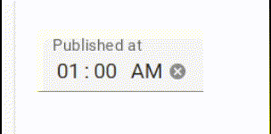
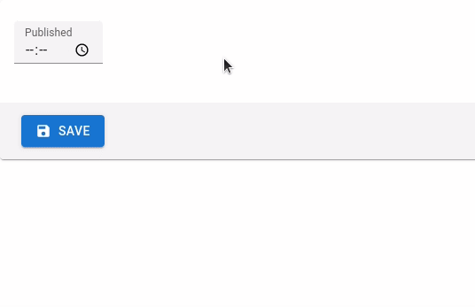

# `<TimeInput>`

An input for editing time. `<TimeInput>` renders a standard browser [Time Picker](https://developer.mozilla.org/en-US/docs/Web/HTML/Element/input/time), so the appearance depends on the browser.

| Firefox | Edge |
| ------- | ---- |
|  |  |

This component works with Date objects to handle the timezone using the browser locale.
You can still pass string values as long as those can be converted to a JavaScript Date object.

```jsx
import { TimeInput } from 'react-admin';

<TimeInput source="published_at" />
```

`<TimeInput>` also accepts the [common input props](./Inputs.md#common-input-props).

**Tip**: For a MUI styled `<TimeInput>` component, check out [vascofg/react-admin-date-inputs](https://github.com/vascofg/react-admin-date-inputs).
