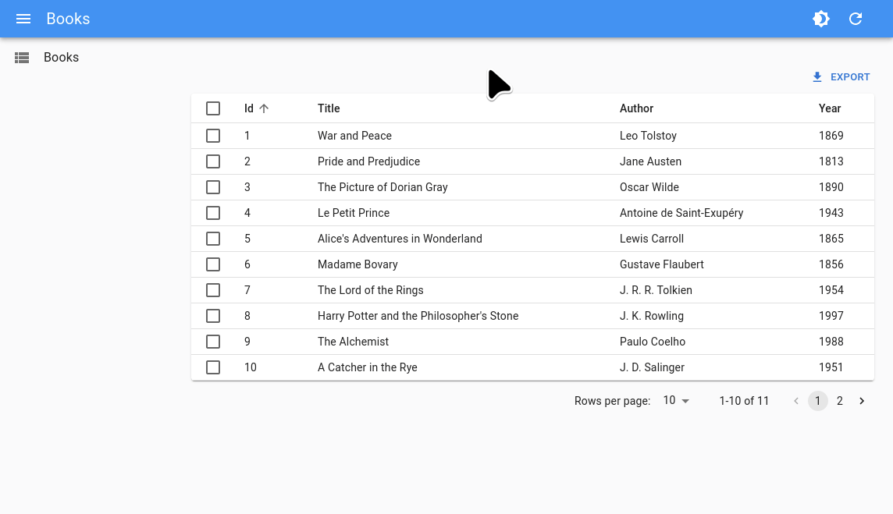

# `<ToggleThemeButton>`

The `<ToggleThemeButton>` component lets users switch from light to dark mode, and persists that choice by leveraging the [store](./Store.md).



## Usage

You can add the `<ToggleThemeButton>` to a custom App Bar:

```tsx
import React from 'react';
import {
    Admin,
    Resource,
    ToggleThemeButton,
    List,
    SimpleList,
    Layout,
    AppBar,
} from 'react-admin';
import { createTheme, Box, Typography } from '@mui/material';

const darkTheme = createTheme({
    palette: { mode: 'dark' },
});

const MyAppBar = (props) => (
    <AppBar {...props}>
        <Box flex="1">
            <Typography variant="h6" id="react-admin-title"></Typography>
        </Box>
        <ToggleThemeButton
            lightTheme={defaultTheme}
            darkTheme={darkTheme}
        />
    </AppBar>
);

const MyLayout = (props) => (
    <Layout {...props} appBar={MyAppBar} />
);

const App = () => (
    <Admin
        dataProvider={dataProvider}
        layout={MyLayout}
    >
        <Resource name="posts" list={PostList} />
    </Admin>
);
```

## API

* [`ToggleThemeButton`]

[`ToggleThemeButton`]: https://github.com/marmelab/react-admin/blob/master/packages/ra-ui-materialui/src/button/ToggleThemeButton.tsx

