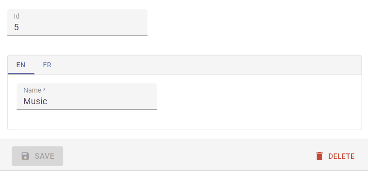

# `<TranslatableInputs>`

You may have inputs which are translated in multiple languages and want users to edit translations for each language separately. To display them, you can use the `<TranslatableInputs>` component.



It expects the translatable values to have the following structure:

```json
{
    name: {
        en: 'The english value',
        fr: 'The french value',
        tlh: 'The klingon value',
    },
    description: {
        en: 'The english value',
        fr: 'The french value',
        tlh: 'The klingon value',
    }
}
```

This is how to use it:

```jsx
<TranslatableInputs locales={['en', 'fr']}>
    <TextInput source="name" />
    <RichTextInput source="description" />
</TranslatableInputs>
```

React-admin uses the user locale as the default locale in this field. You can override this setting using the `defaultLocale` prop.

```jsx
<TranslatableInputs locales={['en', 'fr']} defaultLocale="fr">
    <TextInput source="name" />
    <RichTextInput source="description" />
</TranslatableInputs>
```

By default, `<TranslatableInputs>` will allow users to select the displayed locale using Material-ui tabs with the locale code as their labels.

You may override the tabs labels using translation keys following this format: `ra.locales.[locale_code]`. For instance, `ra.locales.en` or `ra.locales.fr`.

You may override the language selector using the `selector` prop, which accepts a React element:

```jsx
const Selector = () => {
    const {
        locales,
        selectLocale,
        selectedLocale,
    } = useTranslatableContext();

    const handleChange = event => {
        selectLocale(event.target.value);
    };

    return (
        <select
            aria-label="Select the locale"
            onChange={handleChange}
            value={selectedLocale}
        >
            {locales.map(locale => (
                <option
                    key={locale}
                    value={locale}
                    // This allows to correctly link the containers for each locale to their labels
                    id={`translatable-header-${locale}`}
                >
                    {locale}
                </option>
            ))}
        </select>
    );
};

<TranslatableInputs
    record={record}
    resource="products"
    locales={['en', 'fr']}
    selector={<Selector />}
>
    <TextInput source="name" />
    <RichTextInput source="description" />
</TranslatableInputs>
```

If you have multiple `TranslatableInputs` on the same page, you should specify a `groupKey` so that react-admin can create unique identifiers for accessibility.

```jsx
<TranslatableInputs locales={['en', 'fr']} groupKey="essential-fields">
    <TextInput source="name" />
    <RichTextInput source="description" />
</TranslatableInputs>
```

You can add validators to any of the inputs inside a `TranslatableInputs`. If an input has some validation error, the label of its parent tab will be highlighted as invalid:

```jsx
<TranslatableInputs locales={['en', 'fr']}>
    <TextInput source="name" validate={[required()]} />
    <RichTextInput source="description" validate={[maxLength(100)]} />
</TranslatableInputs>
```
